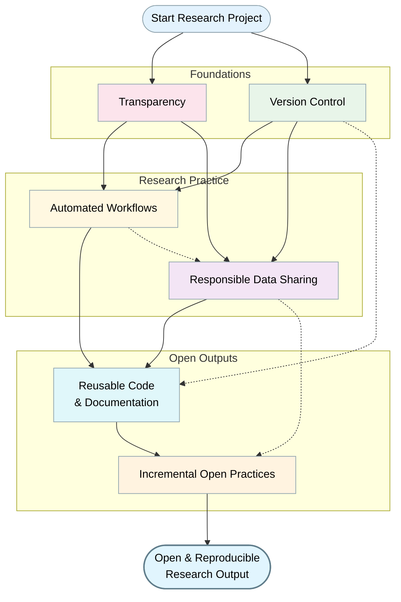
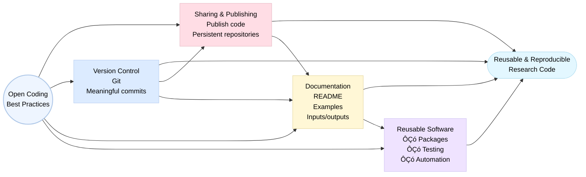
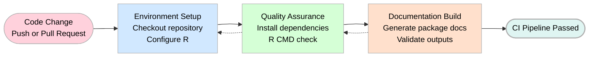

> The following resources informed the development of this guide:
>
> - [Center for Open Science Tools](https://www.cos.io/tools)  
> - [rOpenSci](https://ropensci.org/)  
> - [OSF Connecting Your Research Tools](https://help.osf.io/article/584-connecting-your-reaserch-tools-on-the-open-science-framework-osf)  
> - [ZBW Tools for Open Science](https://openeconomics.zbw.eu/en/knowledgebase/tools-for-open-science/)  

## Introduction
At its core, Open Science seeks to **reduce opacity** in the research process by promoting openness across the full scholarly lifecycle from data collection and analysis to dissemination and reuse. The adoption of open workflows, open tools, open-source software, and open coding practices plays a central role in achieving these aims.

Using **open workflows** enables researchers to make explicit the sequence of decisions, dependencies, and transformations that lead from raw data to published results. Open tools and open-source software further support transparency by allowing methods to be inspected, evaluated, and improved by others, rather than remaining hidden within proprietary or opaque systems. Together, these practices help address longstanding challenges related to reproducibility, trust, and cumulative knowledge building.

*Source: Kramer*B, Bosman J* Innovations in scholarly communic*tion -*global survey on research tool usa*e. F*00*Res. 2016 Apr 18;5:*92. doi: *0.12688/f*000research.8414.1**

Importantly, open coding in Open Science is not simply about publishing scripts or making code publicly available. Rather, it is about embedding **transparency, documentation, and reproducibility** into everyday research practice. Code that is undocumented, unstructured, or detached from its analytical context offers limited value, even when shared openly.

## Best Practices for Open Science Across the Research Lifecycle

1. **Commit to Transparency Beyond Pre-registration**  
   Transparency must extend across data collection, analysis, code development, and dissemination, reducing information asymmetry between authors, reviewers, and stakeholders.

2. **Share Data Responsibly, Even Under Legal or Contractual Constraints**  
   Researchers under NDAs or data-sharing agreements can still contribute through **synthetic data**, which preserves statistical properties while protecting confidentiality.  
   **Best practice:**  
   - Consult institutional data stewards or legal advisers before release.  
   - Prefer synthetic data over complete non-disclosure wherever contracts allow.

3. **Make Code Public, Reusable, and Documented**  
   Sharing code increases research impact, supports replication, and enables real-world uptake. Documentation is as important as code itself.  
   **Best practice:**  
   - Package analysis code where possible.  
   - Include clear documentation, examples, and usage instructions.

4. **Use Version Control from the Start**  
   Version control is essential for traceability, collaboration, and accountability. Begin at project inception.

5. **Automate Research Workflows**  
   Automation reduces cognitive load, prevents errors, and ensures full reproducibility.

6. **Adopt Incremental, Sustainable Open Practices**  
   Take small, cumulative steps, adopting tools gradually rather than aiming for full mastery immediately.

## Open Coding for Researchers: Principles, Practices, and Tools
Open coding refers to sharing analysis code in a transparent, documented, version-controlled, and reusable manner, enabling others to inspect, reproduce, and extend research findings.

### Best Practices for Open Coding

1. **Share Code as a First-Class Research Output**  
   Treat code as a scholarly output equivalent to data or publications.  
   **Good practice:**  
   - Publish code alongside articles or preprints.  
   - Use persistent repositories rather than personal storage.

2. **Use Version Control from Project Inception**  
   Ad-hoc solutions do not count as proper version control.  
   **Good practice:**  
   - Initialise a Git repository at the start.  
   - Commit changes frequently with meaningful messages.

3. **Host Code in Public Repositories**  
   Platforms such as GitHub provide public interfaces for sharing, collaboration, and issue tracking.  
   **Good practice:**  
   - Use issues and pull requests instead of emails.  
   - Include README files and wikis.

4. **Document Code Thoroughly**  
   Documentation is critical for usability.  
   **Good practice:**  
   - Explain what the code does, how to run it, and required inputs.  
   - Document functions, parameters, outputs, and examples.

5. **Package Reusable Code Where Possible**  
   Transform scripts into packages to improve reuse and clarity.  
   **Good practice:**  
   - Use `devtools` to create a package structure.  
   - Use `roxygen2` to generate in-line documentation.  
   - Build and check the package for functionality.

6. **Automate Code Execution and Dependencies**  
   Automation ensures correct regeneration of results.  
   **Good practice:**  
   - Define dependencies between raw data, processed data, scripts, and outputs.  
   - Avoid manual re-running of scripts in undefined orders.

## Practical Examples

### Example 1: Sharing Analysis Code via GitHub
- Researcher publishes an R package on GitHub including:  
  - Source code  
  - Documentation generated with `roxygen2`  
  - Issue tracker for questions and bugs  

### Example 2: Automated Analysis Using Make
- Workflow: `raw data processed data  analysis results`  
- Dependencies encoded in a `Makefile`  
- Single command `make` reproduces the full analysis  
- Only necessary steps re-run automatically

## A Practical Guide to Open Science Workflows and Tools

| Stage | Actions |
|-------|--------|
| **Data Preparation and Sharing** | Assess legal/ethical constraints, generate synthetic datasets, deposit data in public repositories or version-controlled platforms |
| **Analysis and Code Development** | Write reproducible scripts, avoid hard-coded paths, structure projects (`data/`, `src/`, `outputs/`) |
| **Version Control and Collaboration** | Initialise Git, host publicly on GitHub, manage issues/pull requests |
| **Automation and Reproducibility** | Define dependencies, automate workflow execution, enable dry runs |
| **Dissemination and Long-Term Impact** | Share code, data, and documentation, encourage reuse and feedback, treat documentation as scholarly output |

## Software and Tools

| Tool / Software | Description | URL |
|-----------------|------------|-----|
| R | Programming language for statistics and data analysis | [r-project.org](https://www.r-project.org) |
| Synthetic data packages (R) | Generate privacy-preserving datasets | [CRAN](https://cran.r-project.org) |
| devtools (R package) | Develop, document, and check R packages | [devtools](https://devtools.r-lib.org) |
| roxygen2 (R package) | In-line documentation for R code | [roxygen2](https://roxygen2.r-lib.org) |
| Git | Distributed version control system | [git-scm.com](https://git-scm.com) |
| GitHub | Host Git repositories, collaboration, and issues | [github.com](https://github.com) |
| Make | Automation tool defining workflows via dependencies | [gnu.org/software/make](https://www.gnu.org/software/make) |
| RStudio | IDE for R, supports Git integration | [posit.co](https://posit.co/products/open-source/rstudio) |
| Docker | Containerisation for reproducible environments | [docker.com](https://www.docker.com) |

## Open Science GitHub Workflow

## Further Readings and Resources

- [OpenSciency Introduction to Open Science Tools](https://opensciency.github.io/sprint-content/open-tools-resources/lesson1-intro-open-science-tools.html)  
- [OpenSciency Tools Across the Research Lifecycle](https://opensciency.github.io/sprint-content/open-tools-resources/lesson2-tools-across-research-lifecycle.html)  
- [OpenSciency Tools for Reproducibility](https://opensciency.github.io/sprint-content/open-tools-resources/lesson3-tools-for-reproducibility.html)  
- [The Scholarly Kitchen Mapping Open Science Tools](https://scholarlykitchen.sspnet.org/2018/08/30/mapping-open-science-tools/)  
- [RI4C2 Guidebook Open Workflows (PDF)](https://zenodo.org/records/11609530/files/RI4C2_WP7_Guidebook_OpenWokflows.pdf?download=1)  
