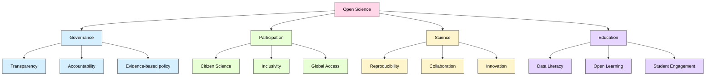

# Understanding (Research) Open Data 
 
> The following resources informed the development of this guide:
>
> - [International Open Data Charter](https://opendatacharter.net/)  
> - [The Open Definition](https://okfn.org/en/library/what-is-open/)  
> - [Open Data Handbook What is Open Data?](https://opendatahandbook.org/guide/en/what-is-open-data/)  
> - [Open Data Handbook Why Open Data?](https://opendatahandbook.org/guide/en/why-open-data/)  
> - [Open Science MOOC Open Research Data](https://opensciencemooc.eu/modules/open-research-data/)  
> - [OpenSciency Benefits of Open Data](https://opensciency.github.io/sprint-content/open-data/Lesson2-Benefits.html)  
> - [OpenSciency Data Management Planning](https://opensciency.github.io/sprint-content/open-data/Lesson5-Planning.html) 

## Open Data for Open Science

According to the [International Open Data Charter](https://opendatacharter.net/):

> Open Data is digital data that is made available with the technical and legal characteristics necessary so that it can be freely used, reused and redistributed by anyone, at any time and anywhere."

Open Research data is defined by as [Open Aire](https://www.openaire.eu/research-data-protected-what-is-research-data) as

> "Research data are the evidence that underpins the answer to the research question, and can be used to validate findings regardless of its form (e.g. print, digital, or physical). These might be quantitative information or qualitative statements collected by researchers in the course of their work by experimentation, observation, modelling, interview or other methods, or information derived from existing evidence. Data may be raw or primary (e.g. direct from measurement or collection) or derived from primary data for subsequent analysis or interpretation (e.g. cleaned up or as an extract from a larger data set), or derived from existing sources where the rights may be held by others. Data may be defined as relational or functional components of research, thus signalling that their identification and value lies in whether and how researchers use them as evidence for claims. They may include, for example, statistics, collections of digital images, sound recordings, transcripts of interviews, survey data and fieldwork observations with appropriate annotations, an interpretation, an artwork, archives, found objects, published texts or a manuscript".

In the context of [**open science**](https://github.com/Digital-Future-Institute/CoARA/blob/main/1.-Introduction-to-Open-Science.md), open data plays a fundamental role in making research more transparent, reproducible, and collaborative. Open data are the building blocks of open knowledge, enabling scientific outputs to be validated, reused, and extended across disciplines and communities.

The [Open Definition](https://okfn.org/en/library/what-is-open/) provides detailed requirements for openness. In open science, data becomes particularly valuable when it is **useful, usable, and actively reused** in research, policy, education, and innovation.

## Core Principles of Open Data in Open Science

- 1. Availability and Access:  Data must be available as a whole, at no more than a reasonable reproduction cost, and preferably downloadable via the internet. It should be provided in formats that are convenient, modifiable, and suitable for analysis and reuse in scientific workflows.

- 2. Reuse and Redistribution: Data must be licensed in a way that permits reuse, redistribution, and combination with other datasets. This is essential in research, where integrating multiple datasets enables new discoveries and interdisciplinary work.

- 3. Universal Participation: Everyone should be able to access and use the data without discrimination. Restrictions such as non-commercial use only or limits to specific sectors (e.g. education only) are incompatible with open science, as they hinder collaboration, innovation, and knowledge transfer.

## Open Data Principles Supporting Open Science

The [Open Data Charter](https://opendatacharter.net/) outlines six principles that align strongly with open science practices:

**1. Open by Default**: Research data should be openly available by default, with exceptions justified (e.g. privacy, ethics, or security). This supports transparency and reproducibility in science.

**2. Timely and Comprehensive**: Data should be shared as early as possible and in its most complete form to maximise its scientific value and enable timely reuse.

**3. Accessible and Usable**: Data must be machine-readable, well-documented, and shared under open licences (e.g. Creative Commons) to ensure it can be effectively reused in research and education.

**4. Comparable and Interoperable**: Standard formats and metadata enable datasets to be combined across studies, supporting large-scale and interdisciplinary scientific analysis.

**5. For Improved Governance & Participation**: Open data enables public scrutiny of research and policy decisions, fostering trust in science and increasing citizen participation in knowledge creation (e.g. citizen science).

**6. For Inclusive Development and Innovation**: Open scientific data supports innovation beyond academia, including industry, public services, and communities, contributing to global challenges such as climate change and public health.

## Benefits of Open Data for Open Science

Open data underpins open science by enabling access, reuse, and collaboration across research, policy, and education. When data is openly shared, it enhances transparency, fosters innovation, and broadens participation in knowledge creation. The benefits span multiple domains, from governance and civic engagement to scientific advancement and education.

| Domain        | Benefits |
|--------------|---------|
| **Governance** | - Enhances transparency and accountability in publicly funded research   - Supports evidence-based policymaking through access to reliable data   - Enables scrutiny of research processes and outcomes |
| **Participation** | - Encourages citizen science and public engagement   - Democratises access to knowledge beyond academic institutions   - Reduces barriers for researchers in low-resource settings |
| **Science** | - Improves reproducibility and validation of research findings   - Facilitates collaboration and interdisciplinary research   - Reduces duplication of effort and accelerates discovery   - Enables large-scale data analysis and meta-research |
| **Education** | - Provides real-world datasets for teaching and learning   - Enhances data literacy and research skills   - Supports open educational practices and resource development   - Enables students to engage with authentic scientific data |

Also, Open Data

- **Accelerates innovation** by enabling reuse across sectors  
- **Improves research efficiency** by reducing duplication  
- **Enhances visibility and impact** of research outputs  
- **Supports collaboration** across institutions and countries  
- **Encourages transparency and integrity** in research workflows  

### Importance of Planning for Open Data

Open data in science requires intentional planning through **Data Management Plans (DMPs)**:

- Define how data will be **collected, documented, and stored**  
- Ensure compliance with **ethical and legal requirements**  
- Plan for **long-term preservation and access**  
- Specify **licensing and sharing strategies**  
- Support FAIR principles (**Findable, Accessible, Interoperable, Reusable**)  

Planning ensures that data is not only open, but **meaningful and reusable**.

