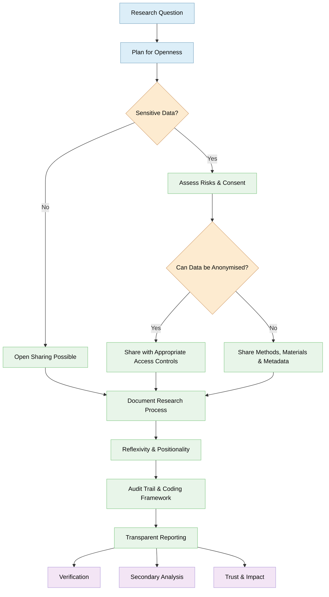

> The following resources informed the development of this guide
>
> - [UK Data Service: Qualitative Data Learning Hub](https://ukdataservice.ac.uk/learning-hub/qualitative-data/)  
> - [FORRT (Framework for Open and Reproducible Research Training): Qualitative Open Science Practices](https://forrt.org/educators-corner/006-qualitative-os-practices/)  
> - [LSE Impact Blog: Qualitative Research Can and Should Be More Open and Reproducible](https://blogs.lse.ac.uk/impactofsocialsciences/2026/05/13/qualitative-research-can-and-should-be-more-open-and-reproducible/)  
> - [UCL Qualitative Health Research Network: Open Science and Qualitative Research: Current Issues and Ways Forward](https://www.ucl.ac.uk/qualitative-health-research-network/open-science-and-qualitative-research-current-issues-and-ways-forward)
>

## Introduction
Open research has become a core expectation across disciplines. While **open data practices** originated largely within quantitative research, qualitative researchers are also finding ways to increase **transparency, openness, and reproducibility** without compromising ethics, participant safety, or methodological integrity. Qualitative research presents distinct challenges because data are often contextual, relational, sensitive, and difficult to anonymise. Nevertheless, openness and reproducibility are possible when understood as a **spectrum of practices** rather than a requirement to publish all raw data. See [forrt](https://forrt.org/educators-corner/006-qualitative-os-practices/);  [UCL](https://www.ucl.ac.uk/qualitative-health-research-network/open-science-and-qualitative-research-current-issues-and-ways-forward).

This guide introduces the principles of qualitative open data, practical approaches to sharing data and materials, and strategies for improving reproducibility and transparency.

### What Is Qualitative Open Data?

Qualitative data includes:

- Interview transcripts
- Focus group recordings and transcripts
- Field notes
- Ethnographic observations
- Diaries and journals
- Open-ended survey responses
- Audio-visual materials
- Images and artefacts

**Qualitative open data** refers to making some, or all, of these research outputs available for verification, reuse, teaching, secondary analysis, or public benefit while respecting ethical, legal, and confidentiality requirements. See [UK Data Service](https://ukdataservice.ac.uk/learning-hub/qualitative-data/); [UCL](https://www.ucl.ac.uk/qualitative-health-research-network/open-science-and-qualitative-research-current-issues-and-ways-forward)

Importantly, qualitative open data does not necessarily mean publishing identifiable raw transcripts online. Instead, openness can include:

- Sharing research instruments
- Publishing codebooks
- Providing methodological documentation
- Making anonymised datasets available
- Depositing data in controlled-access repositories
- Creating transparent audit trails
- Publishing preprints and open-access articles

Openness exists along a continuum rather than being an **all-or-nothing decision**. See [Forrt](https://forrt.org/educators-corner/006-qualitative-os-practices/) and [Blogs LSE](https://blogs.lse.ac.uk/impactofsocialsciences/2026/05/13/qualitative-research-can-and-should-be-more-open-and-reproducible/)

### Why Open Qualitative Data?

Benefits for Researchers: 

Open qualitative research can:

- Increase trust and credibility
- Demonstrate methodological rigour
- Improve transparency of interpretation
- Enable secondary analysis
- Support teaching and training
- Increase citation and impact
- Preserve valuable datasets for future generations

The [UK Data Service](https://ukdataservice.ac.uk/learning-hub/qualitative-data/) highlights the growing value of qualitative data reuse and the emergence of infrastructures that support responsible sharing and secondary analysis. 

Benefits for Society: Open qualitative data can:

- Maximise public value from funded research
- Enable new research questions
- Reduce participant burden by avoiding unnecessary data collection
- Support evidence-informed policymaking
- Increase public confidence in research findings 

## Reproducibility in Qualitative Research

### A Different Meaning of Reproducibility

Qualitative research often cannot be replicated in the same way as quantitative studies because:

- Interviews occur in unique contexts
- Social situations change over time
- Researchers influence data generation
- Interpretation is inherently contextual

Consequently, qualitative reproducibility should be understood as:

- **Transparency**: Can others understand exactly how the study was conducted?
- **Auditability**: Can others examine the evidence supporting interpretations?
- **Traceability**: Can readers follow the path from data collection to conclusions?
- **Reflexivity**: Can readers understand how researchers' perspectives influenced analysis?

| Core Principle | What It Involves | Example / Key Considerations |
|----------------|------------------|------------------------------|
| **Transparency** | Document all stages of the research process, including: - Research questions - Sampling decisions - Recruitment procedures - Interview guides - Data collection processes - Coding procedures - Analytical decisions  **Goal:** Make the research process visible and understandable rather than mysterious. | **Instead of:** "Data were analysed thematically."  **Write:** "Transcripts were coded inductively in NVivo. An initial coding framework was developed from five interviews, revised after discussion among the research team, and applied iteratively across all transcripts." |
| **Reflexivity** | Explicitly acknowledge: - Researcher positionality - Assumptions - Relationships with participants - Potential biases | **Example:** "The lead interviewer had previously worked in the organisation being studied, which facilitated trust but may also have influenced participant responses." |
| **Documentation** | Maintain a comprehensive audit trail, including: - Research protocols - Ethical approvals - Coding frameworks - Analytic memos - Decision logs - Versions of codebooks  Well-documented analytical processes make interpretations more understandable, transparent, and reusable. | Keep systematic records throughout the project to demonstrate how analytical decisions were made and how findings evolved over time. |
| **Ethical Responsibility** | Balance openness with participant protection by considering: - Transparency - Participant safety - Privacy - Contextual integrity | **Key principle:** Protecting participants always takes precedence over making qualitative data fully open. |

### Best Practices for Sharing Qualitative Data

Data sharing should be incorporated at the project design stage and should include information about:

- Future sharing
- Storage arrangements
- Repository use
- Access controls

Within:

- Ethics applications
- Participant information sheets
- Consent forms

### Three Levels of Open Qualitative Practice

Drawing on recommendations from [Branney et al.(2023)](https://compass.onlinelibrary.wiley.com/doi/10.1111/spc3.12728) we can distinct 3 main levels for Open Qualitative Practice:

| Section | What It Involves | Examples / Key Considerations |
|---------|------------------|-------------------------------|
| **Level 1: Open Research Outputs** | Share research outputs that maximise accessibility, including: - Open-access publications - Preprints - Conference materials | Often the simplest starting point for adopting open qualitative research practices. |
| **Level 2: Open Methods** | Share documentation that explains how the research was conducted, including: - Research protocols - Interview schedules - Analysis plans - Codebooks | Readers gain insight into the research process even when the underlying qualitative data cannot be shared. |
| **Level 3: Open Evidence** | Where ethically appropriate, share supporting evidence, including: - Anonymised transcripts - Excerpts supporting findings - Archived datasets - Repository records | Provides the strongest support for transparency, verification, and responsible reuse while respecting ethical constraints. |
| **Example 1: Interview Study** | **Shared publicly:** - Interview guide - Recruitment materials - Coding framework - Reflexive statement  **Shared under controlled access:** - Anonymised transcripts  **Not shared:** - Audio recordings | Demonstrates a balance between transparency and participant confidentiality. |
| **Example 2: Ethnographic Study** | **Shared publicly:** - Fieldwork protocol - Analytic memos - Methodological reflections  **Shared selectively:** - Redacted field notes  **Not shared:** - Sensitive community information | Illustrates how contextual and community sensitivities may limit data sharing while maintaining methodological openness. |
| **Example 3: Health Research** | **Shared publicly:** - Topic guides - Research protocol - Codebook  **Shared through a secure repository:** - Anonymised interview transcripts  **Access:** - Available only after approval and a data-use agreement | Demonstrates the use of controlled access to balance openness with participant privacy and ethical responsibilities. |

### Common Misconceptions

> *Qualitative data cannot be open*
-False. Many forms of qualitative data can be shared responsibly using anonymisation and controlled access. See [UK Data Service](https://ukdataservice.ac.uk/learning-hub/qualitative-data/) and [UCL](https://www.ucl.ac.uk/qualitative-health-research-network/open-science-and-qualitative-research-current-issues-and-ways-forward)

>*Reproducibility means repeating the exact study*
- False. In qualitative research, reproducibility often means transparency, documentation, and evidence traceability rather than exact replication. See [Blogs LSE](https://blogs.lse.ac.uk/impactofsocialsciences/2026/05/13/qualitative-research-can-and-should-be-more-open-and-reproducible/) and [UCL](https://www.ucl.ac.uk/qualitative-health-research-network/open-science-and-qualitative-research-current-issues-and-ways-forward)

> *Open science is only for quantitative research*
- False. Open science principles can be adapted to qualitative approaches through transparency, reflexivity, open materials, open access publishing, and data stewardship. [FORRT](https://forrt.org/educators-corner/006-qualitative-os-practices/) and [Blogs LSE](https://blogs.lse.ac.uk/impactofsocialsciences/2026/05/13/qualitative-research-can-and-should-be-more-open-and-reproducible/) 

## Further Reading

- Branney, P. E., Brooks, J., Kilby, L., Newman, K., Norris, E., Pownall, M., Talbot, C. V., Treharne, G. J., & Whitaker, C. M. (2023). Three steps to open science for qualitative research in psychology. Social and Personality Psychology Compass. https://doi.org/10.1111/spc3.12728
- Campbell, R., Javorka, M., Engleton, J., Fishwick, K., Gregory, K., & Goodman-Williams, R. (2023). Open-science guidance for qualitative research: An empirically validated approach for de-identifying sensitive narrative data. Advances in Methods and Practices in Psychological Science, 6(4). https://doi.org/10.1177/25152459231205832
- Kapiszewski, D., & Karcher, S. (2021). Transparency in practice in qualitative research. PS: Political Science & Politics, 54(2), 285ÔÇô291. https://doi.org/10.1017/S1049096520000955
- Transparency and Openness in Qualitative Research: A Synthesis of Emerging Practices https://journals.sagepub.com/doi/10.1177/25152459231205832

