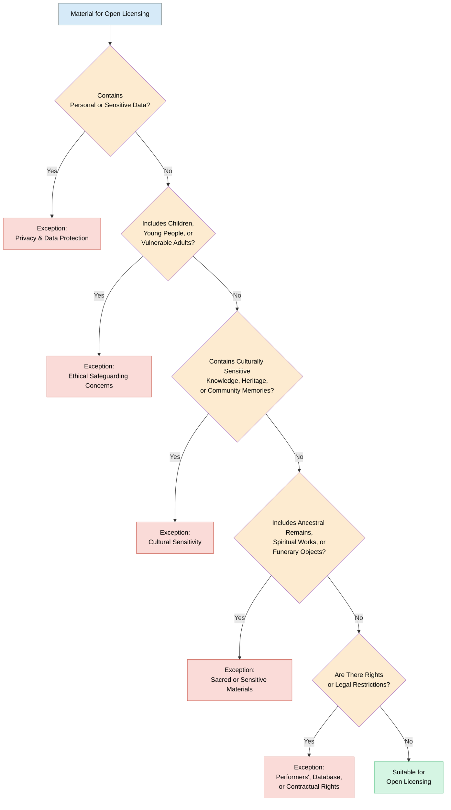

> The following resources informed the development of this guide:
>
> - [Heritage Fund Working with Open Licences (PDF)](https://www.heritagefund.org.uk/sites/default/files/media/attachments/Digital%20guide%20Working%20with%20open%20licences.pdf)  
> - [The National Lottery Heritage Fund Creating Digital Resources: GDPR, Copyright and Open Licences](https://www.heritagefund.org.uk/funding/good-practice-guidance/creating-digital-resources-gdpr-copyright-and-using-open-licences)  
> - [GLAM-E Lab Open Licensing: A Digital Heritage Leadership Briefing](https://www.glamelab.org/products/open-licensing-a-digital-heritage-leadership-briefing/)  
> - [OpenAccess.nl Copyright and Open Licences](https://www.openaccess.nl/en/publishing/copyright-and-open-licenses)  
> - [The National Lottery Heritage Fund - Working with open licences](https://www.heritagefund.org.uk/good-practice-guidance/working-open-licences)

## Introduction

Licensing is a core part of Open Science because it clarifies what others are allowed to do with research outputs through explicit conditions. Open licensing supports **accessibility, transparency, and reproducibility**, helping remove barriers created by traditional publishing models such as paywalls. This enables wider access to knowledge and encourages collaboration and innovation. Because research is cumulative, and builds in blocks, open licences allow researchers to **reuse, adapt, and build on existing work**, improving efficiency and creativity while reducing duplication. This promotes knowledge sharing rather than keeping research isolated in separate silos.

Open practices also extend benefits beyond academia by enabling educators, policymakers, and the public to access and use research. This can improve teaching, support evidence-based policy decisions, and help citizens engage more meaningfully with information. Openly accessible research tends to receive more attention and citations, increasing its academic impact. It also supports **reproducibility**, allowing others to verify and extend findings, which strengthens transparency, credibility, and trust among researchers, funders, policymakers, and the wider public.

*Source: [TDR Annual Report 2022](https://tdrannualreport2022.org/championing-open-science/)*

### Introduction to Open Licences 

Open licenses are legal tools that allow creators to **share their work more freely while retaining certain rights**. Under traditional copyright law, all rights are automatically reserved to the creator as soon as a work is created  meaning others cannot copy, modify, or distribute it without explicit permission. Open licenses modify this default setting by granting advance permission for certain uses. 

These licenses work within **[copyright law](https://en.wikipedia.org/wiki/Copyright)**, not outside it. Instead of waiving copyright, the creator uses their ownership to **define** the conditions under which others may use the work. For example, open licences can specify whether users must give credit to the original author (attribution), whether they can make commercial use, or whether they can adapt and share derivatives under the same terms. 

Open licences strike a balance between protecting creators rights and enabling wider access, collaboration, and reuse ' fostering innovation and knowledge sharing while respecting legal frameworks. 

## Exceptions to Open Licences

While open licences support broad access, reuse, and sharing of materials, there are circumstances where applying an open licence may not be appropriate. Such exceptions typically arise when materials contain sensitive information or when open publication could cause harm, infringe rights, or conflict with ethical responsibilities.

In these cases, organisations should follow the principles of [ethical and responsible data stewardship](https://theodi.org/insights/reports/defining-responsible-data-stewardship/#:~:text=We%20understand%20responsible%20data%20stewardship,it%20can%20redress%20structural%20inequalities.), ensuring that data and content are managed in accordance with legal and ethical standards. This includes respecting privacy, maintaining security, being transparent about decision-making, considering potential societal impacts, and promoting trust, accountability, and integrity in data practices.

The [National Lottery Heritage Fund](https://www.heritagefund.org.uk/good-practice-guidance/working-open-licences) highlights several categories of material that may be unsuitable for open licensing for ethical reasons, including:

- Images of, or contributions by, children, young people, and vulnerable adults.
- Artefacts, knowledge, memories, or cultural practices that hold particular significance for originating communities.
- Ancestral remains, spiritual works, or funerary objects.
- Research outputs, datasets, recordings, or other media related to any of the above categories.

In addition, some materials may be unsuitable for open sharing due to legal, contractual, or privacy considerations, including but not limited to:

### Performers' Rights
- Rights may apply to films, audio recordings, or other media that capture an individual's speech, performance, or movement.
- These rights generally belong to the performer and may restrict reuse without permission.

### Database Rights
- Databases may be protected by copyright and database rights.
- Such rights typically belong to the creator, producer, or organisation responsible for compiling the database.

### Contractual Restrictions
- Agreements between creators, producers, employers, funders, distributors, or other stakeholders may limit how materials can be shared or reused.
- Donors, contributors, or rights holders may also impose specific conditions through contractual agreements.

### Privacy and Personal Data
- Materials containing personal or sensitive information must be managed in compliance with applicable data protection and privacy legislation.
- Personal data should not be openly shared where doing so could compromise privacy, confidentiality, or individual rights.

