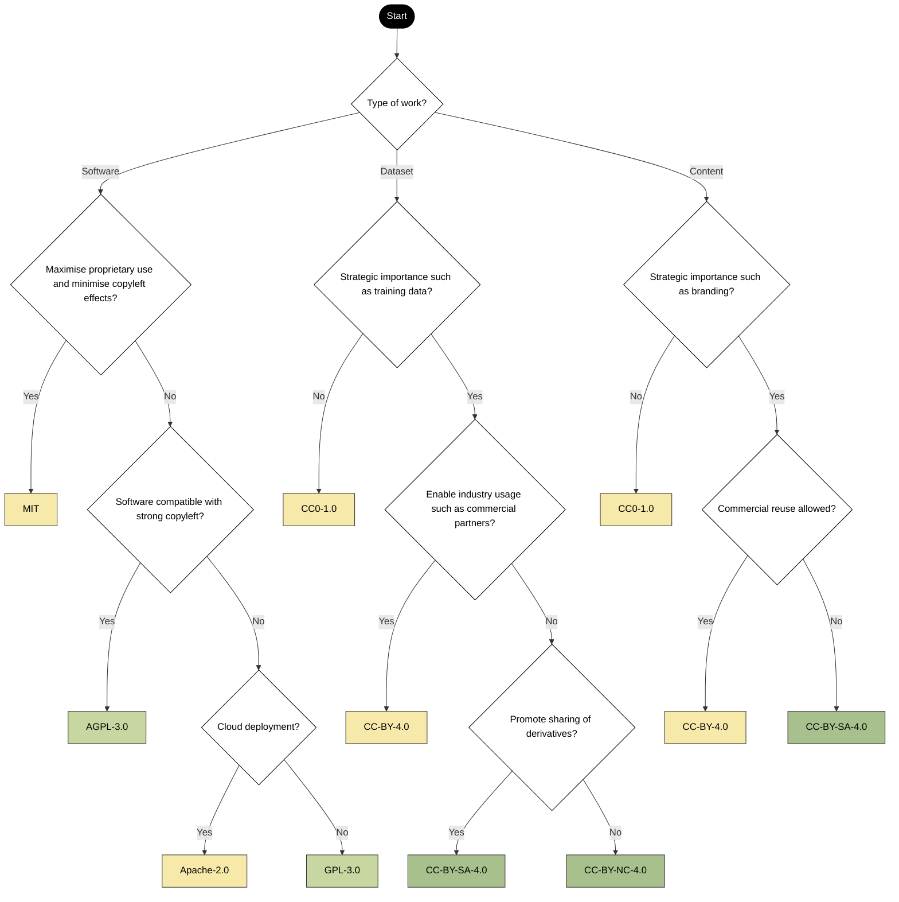

> The following resources informed the development of this guide:
>
> - [Open Source Initiative Licenses](https://opensource.org/licenses)  
> - [Choose a License](https://choosealicense.com/licenses/)  
> - [Open Access Network Licences](https://open-access.network/en/information/legal-issues/licences)  

## Introduction

Open licences are a core component of open science, enabling researchers, educators, and institutions to share, reuse, and build upon knowledge in a transparent and collaborative way. These licences clarify how data, software, and other research outputs can be accessed, used, modified, and redistributed.

Licences such as GPL, ODbL, ODC, MIT, and BSD support different aspects of openness from ensuring that derivative works remain open (copyleft licences) to allowing highly flexible reuse with minimal restrictions (permissive licences). By applying appropriate open licences, researchers can:

- **Enhance reproducibility and transparency**  
- **Facilitate collaboration and innovation**  
- **Maximise the impact of research outputs**  
- **Ensure proper attribution and ethical reuse**  

These licences helps researchers select the most suitable approach for sharing their work while aligning with open science principles and institutional or funder requirements. In addition to Creative Commons, other internationally recognised open licences for software and data licences, that are used across the culture and heritage sector include: 

| Licence | Description | More information |
|--------|------------|------------------|
| GNU General Public License (GPL) | Promotes software freedom by granting users the right to view, modify, and distribute source code. | https://www.gnu.org/licenses/gpl-3.0.en.html |
| Open Database License (ODbL) | Allows individuals and organisations to share and distribute databases freely, provided attribution is given and adaptations are shared under the same licence. | https://opendatacommons.org/licenses/odbl/ |
| Open Data Commons (ODC) | Provides licences for open data, typically requiring attribution and specifying conditions for use. Includes ODC-By and PDDL. | https://opendatacommons.org/licenses/by/1-0/ |
| MIT License | Allows almost unrestricted use of software code, with minimal restrictions. | https://opensource.org/license/mit |
| BSD Licenses | A family of permissive free software licences with minimal restrictions on use and distribution. | https://en.wikipedia.org/wiki/BSD_licenses |

The OpenSource Initiative also lists several other licensing schemes that are related to specific institutions and organisations. Open source licenses are licenses that comply with the Open Source Definition in brief, they allow software to be freely used, modified, and shared. To be approved by the Open Source Initiative (also known as the OSI) a license must go through the Open Source Initiative [license review process](https://opensource.org/licenses/review-process/).

## Open Licences Flowchart

### UK licensing schemes 

The[ UK Government Licensing Framework](https://cdn.nationalarchives.gov.uk/documents/information-management/uk-government-licensing-framework.pdf) (UKGLF) is a structured system to regulate the licensing and use of public sector information. It provides guidance to help government organisations manage the release of their data and content openly, promoting accessibility and consistency in the management of public sector assets. Sections 163 and 165 of the [Copyright, Designs and Patents Act 1988](https://www.legislation.gov.uk/ukpga/1988/48/contents) delineate Crown copyright and Parliamentary copyright respectively and describes two open licences:» 

- The [Open Government Licence](https://www.nationalarchives.gov.uk/doc/open-government-licence/version/2/) (OGL) is mandated as the default licence for Crown bodies, with other public sector entities encouraged to follow suit under, for example such councils» 

- The [Open Parliament Licence](https://www.parliament.uk/site-information/copyright-parliament/open-parliament-licence/) (OPL) mandates that works produced by government officers or under the direction of Parliament are released under OPL. 

Both the OGL and OPL licences are compatible with the CC BY 4.0 licence, as well as with other open licensing schemes to facilitate the legal sharing and reuse of data, providing a framework for licensing datasets while addressing issues of attribution, share-alike requirements, and commercial use.

## Table of most common licensing schemes 

| **Type of Asset**                     | **License / Framework**                  | **Key Permissions & Conditions**                          | **Example Use / Organisation**     |
|--------------------------------------|-------------------------------------------|------------------------------------------------------------|------------------------------------|
| **Creative, Research & Educational Works** | Creative Commons (CC BY)                 | Free use, sharing, and adaptation with attribution         | UNESCO OER materials               |
|                                      | CC BY-SA                                  | Must share derivatives under same license                  | Wikipedia content                  |
|                                      | CC BY-NC                                  | Non-commercial use only, with attribution                  | Many open-access journals          |
|                                      | CC0                                       | Public domain; no rights reserved                          | Europeana metadata                 |
| **Data & Databases**                 | ODC Open Database License (ODbL)           | Attribution + share-alike for derived data                 | OpenStreetMap                      |
|                                      | ODC Attribution License (ODC-By)           | Attribution required; derivatives unrestricted             | UK data.gov.uk datasets            |
|                                      | ODC Public Domain Dedication (PDDL)        | Public domain; no restrictions                             | Scientific data repositories       |
| **Government Data**                  | Open Government License (OGL, UK)          | Use, adapt, and share with attribution                     | UK public data portal              |
|                                      | Licence Ouverte (France)                  | Open reuse with attribution                                | French open data portal            |
|                                      | Canada Open Government License             | Similar to OGL; attribution required                       | Canadas' open data portal          |
| **Software & Code**                  | MIT License                                | Free use, modification, redistribution with attribution    | Python libraries                   |
|                                      | GNU GPL                                   | Copyleft: derivatives must remain open                     | Linux kernel                       |
|                                      | Apache 2.0                                | Allows commercial use; requires notice preservation        | TensorFlow                         |
|                                      | BSD License                               | Simple, permissive; attribution required                   | FreeBSD OS                         |

