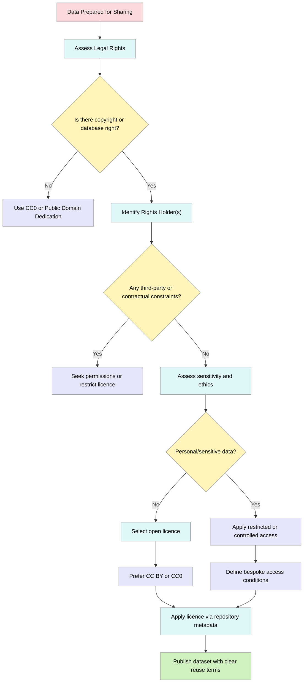
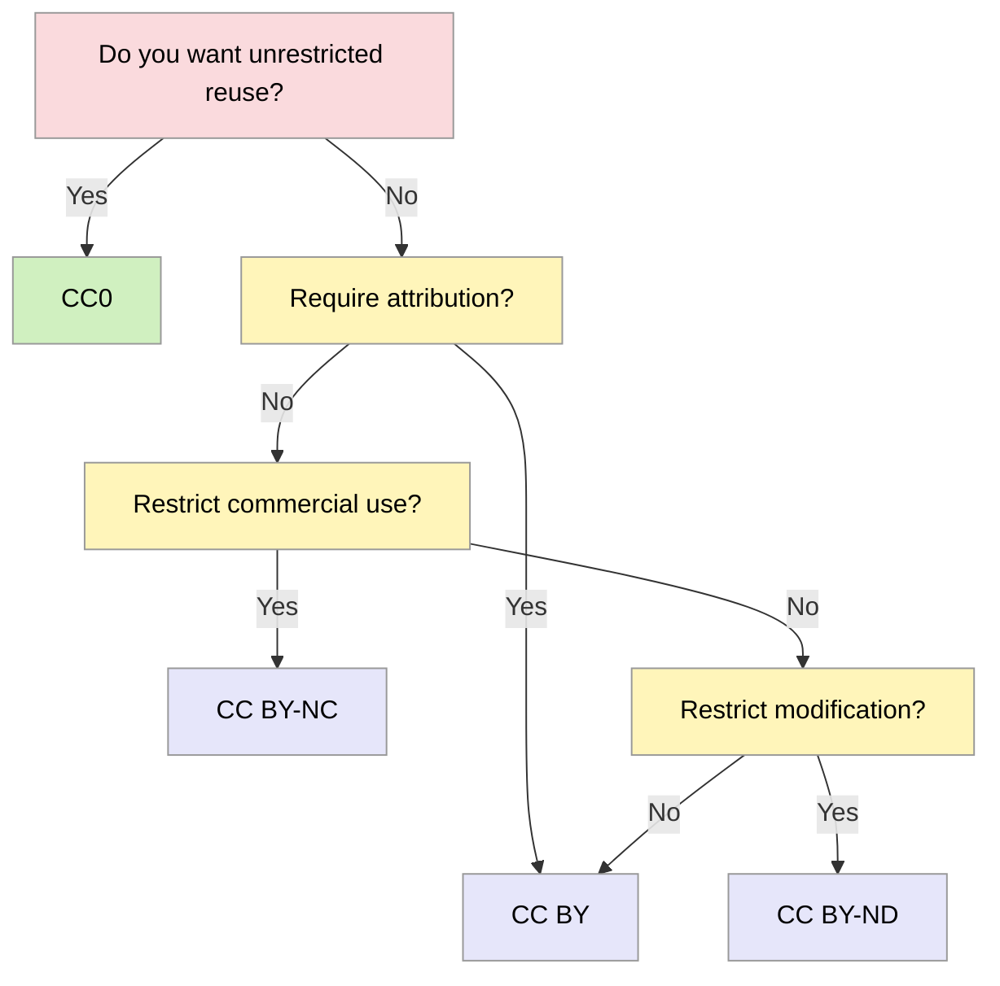

> The following resources informed the development of this guide:
>  - [Digital Curation Centre (DCC), How to License Research Data](https://www.dcc.ac.uk/guidance/how-guides/license-research-data)
> - [OpenAIRE, How do I license my research data?](https://www.openaire.eu/how-do-i-license-my-research-data)
> - [UK Data Service, Licensing (Research Data Management Learning Hub)](https://ukdataservice.ac.uk/learning-hub/research-data-management/rights-in-data/licensing/)
> - [University of York Library, Licensing your research data](https://subjectguides.york.ac.uk/rdm/licensing)

## Overview
**Licensing research data** is a critical component of responsible research data management (RDM). It establishes the legal framework governing the reuse, redistribution, and transformation of datasets, thereby enabling reproducibility, transparency, and scholarly impact.
In the absence of an explicit licence, reuse of data is legally ambiguous due to default intellectual property (IP) protections, which vary across jurisdictions and legal regimes. See [[dcc.ac.uk - license-research-data]](https://www.dcc.ac.uk/guidance/how-guides/license-research-data).

This guide provides a structured approach to **understanding, selecting, and applying licences** in a research context, with particular relevance to UK and European frameworks.

### The Rationale for Licensing Research Data
Research data licensing operates at the intersection of:

- Open science policy (funder mandates, FAIR principles)
- Legal frameworks (copyright, database rights)
- Ethical responsibilities (participant consent, confidentiality)

Increasingly, funders and publishers require data sharing, as open data enables:

- Verification of results and reproducibility
- Secondary analysis and data-driven discovery
- Increased citation and research impact 

However, data sharing without licensing introduces uncertainty regarding permissible reuse, potentially discouraging both reuse and citation.

Key insight: *Licensing is not merely administrative; it is an enabling infrastructure for knowledge production*.

## Legal Foundations of Data Licensing

### What Rights Apply to Research Data?

Not all research data are protected in the same way. 

Consider:

Type of Content | Likely Protection
-- | --
Structured databases | Database rights (UK/EU)
Creative outputs (e.g. annotated datasets) | Copyright
Raw measurements | Often no copyright

Licensing decisions must therefore begin with the question:

> *Is there a legal right that can be licensed?*

Where no rights apply, tools such as CC0 may be used to clearly signal reuse permissions. See [[openaire.eu - how-do-i-license-my-research-data]](https://www.openaire.eu/how-do-i-license-my-research-data)

### Layers of Obligation

Licensing must also account for:

- Contractual obligations (collaborations, funders)
- Ethical approvals (participant consent)
- Data protection law (e.g. GDPR)

Importantly, licences **do not override data protection law**; personal data must be handled separately from IP licensing considerations. See [[openaire.eu]](https://www.openaire.eu/how-do-i-license-my-research-data)

### Typology of Data Licences

#### Open Licences

Open licences facilitate reuse with minimal restrictions:

Licence | Permissions | Restrictions
-- | -- | --
CC0 | Full reuse | None
CC BY | Reuse + adaptation | Attribution
CC BY-SA | Reuse + adaptation | Share alike

- CC BY is widely aligned with open access principles
- CC0 is often preferred for datasets to maximise interoperability

#### Restrictive or Conditional Licences

Used when openness must be moderated:

Licence | Limitation
-- | --
CC BY-NC | No commercial use
CC BY-ND | No derivatives
Bespoke licences | Tailored restrictions

Such licences may be necessary where:

- Data are sensitive
- Ethical constraints apply
- Commercial value is involved

However, excessive restriction may reduce reuse and conflict with open science principles.

### Strategic Decision-Making in Licensing 
Licensing is a balance between openness and control.

#### Key Decision Variables

### 1. Legal status

- Who owns the data?  
- Are third-party rights embedded?  

### 2. Sensitivity and risk

- Does the dataset include personal or identifiable data?  
- Are there risks of disclosure or re-identification?  

### 3. Policy environment

- Are there funder mandates (e.g. open data requirements)?  
- What institutional guidance or policies apply?  

### 4. Reusability goals

- Maximise reuse **CC0**  
- Ensure attribution and academic credit **CC BY**  

### 5. Interoperability

- Is the licence compatible with other datasets?  
- Can the data integrate with existing infrastructures and standards?  

### Best practices

### Applying Licences Effectively

Licences must be visible, persistent, and machine-readable.
Best practice includes:

- Embedding licence metadata in repository records
- Including licence text in dataset documentation
- Referencing licence on landing pages
- Using standardised identifiers (e.g. Creative Commons URIs)

Repositories often facilitate licence selection and integration. See [[openaire.eu]](https://www.openaire.eu/how-do-i-license-my-research-data)

