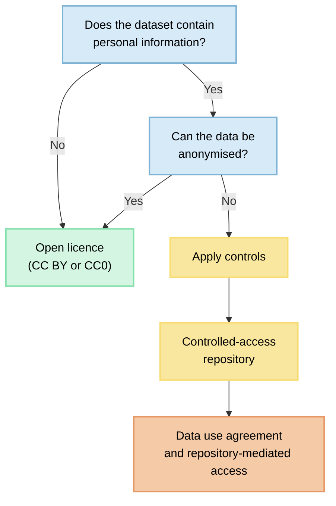

> The following resources informed the development of this guide
>
> - [Social Science Data Editors. Licensing Guidance](https://social-science-data-editors.github.io/guidance/Guidance/Licensing_guidance.html)
> - [CESSDA Data Management Expert Guide. *Data in the Social Sciences*.](https://dmeg.cessda.eu/Data-Management-Expert-Guide/1.-Plan/Data-in-the-social-sciences)
> - [University of Michigan Library. *Research Data Licensing*.](https://guides.lib.umich.edu/c.php?g=480970&p=3288172)
> - [UK Data Service. *European Qualitative Data Archives*.](https://ukdataservice.ac.uk/help/other-data-providers/other-data-providers-qualitative-data/european-archives/)
>

## Introduction

Licensing is a fundamental component of research data management. It establishes the legal terms under which others may access, use, adapt, redistribute, and cite research data. In the social sciences, **licensing decisions are often more complex than in other disciplines because datasets frequently involve human participants, personal data, sensitive information, and ethical obligations that extend beyond copyright considerations**. Researchers must therefore balance openness, transparency, participant protection, legal compliance, and research reproducibility. See [SSDE](https://social-science-data-editors.github.io/guidance/Guidance/Licensing_guidance.html) and [CESSDA](https://dmeg.cessda.eu/Data-Management-Expert-Guide/1.-Plan/Data-in-the-social-sciences)

Data sharing can also promote research transparency and reduce misconduct, increase researcher visibility and research partnerships, and maximise the payoff of public investments in research and education ([Fry et al., 2009](https://pmc.ncbi.nlm.nih.gov/articles/PMC6830543/#R20); [Piwowar & Vision, 2013](https://pmc.ncbi.nlm.nih.gov/articles/PMC6830543/#R53); [Perrino et al., 2013](https://pmc.ncbi.nlm.nih.gov/articles/PMC6830543/#R52)). Sharing qualitative data poses especially difficult epistemological and ethical challenges ([Walters, 2009](https://pmc.ncbi.nlm.nih.gov/articles/PMC6830543/#R66)). Regarding ethical challenges, qualitative researchers often view data as being **co-created by the researcher and the research participant**, which would suggest that releasing the data for secondary use is not a decision that can be made by the researcher alone ([Moore, 2007](https://pmc.ncbi.nlm.nih.gov/articles/PMC6830543/#R41)). Other scholars have cited practical ethical challenges surrounding informed consent, confidentiality, and anonymity when sharing qualitative data for secondary use ([Neale, 2013](https://pmc.ncbi.nlm.nih.gov/articles/PMC6830543/#R49); [Bishop, 2009](https://pmc.ncbi.nlm.nih.gov/articles/PMC6830543/#R5); [Ruggiano & Perry, 2017](https://pmc.ncbi.nlm.nih.gov/articles/PMC6830543/#R57)).

This guide provides practical advice on licensing social science data, with particular attention to qualitative and mixed-methods research, and identifies repositories suitable for long-term preservation and sharing.

### Why Licensing Matters

A data licence:

- Defines how data may be used and reused. 
- Supports research transparency and reproducibility.
- Clarifies rights for future researchers.
- Facilitates FAIR data practices, particularly reusability.
- Helps repositories manage access and preservation. 
- Increases the visibility and impact of research outputs. 

Without a clear licence, users may not know whether they can legally access, analyse, share, or build upon research data.

### Understanding Social Science Data

Social science research generates a wide variety of data, often involving information collected from human participants. These datasets can be quantitative, qualitative, or mixed-methods and may contain personal or sensitive information requiring additional protections. See [CESSDA](https://dmeg.cessda.eu/Data-Management-Expert-Guide/1.-Plan/Data-in-the-social-sciences)

## Types of Social Science Data

| Data Type | Examples | Licensing Considerations |
|------------|----------|--------------------------|
| Quantitative | Surveys, census data, experiments, administrative records | Often suitable for open licensing following anonymisation |
| Qualitative | Interviews, focus groups, ethnographic notes, oral histories | May require restrictions or controlled access |
| Mixed-methods | Survey responses linked to interviews or observations | Different components may require different licences |

Source: [CESSDA Data Management Expert Guide](https://dmeg.cessda.eu/Data-Management-Expert-Guide/1.-Plan/Data-in-the-social-sciences)

## Legal and Ethical Considerations

### Personal Data

Under the GDPR, personal data include any information relating to an identified or identifiable living person. Examples include:

- Names
- Addresses
- Telephone numbers
- Email addresses
- Identification numbers
- Location information
- IP addresses
- Demographic information that may enable identification 

### Special Category (Sensitive) Data

Certain categories of data require enhanced protection under GDPR:

- Racial or ethnic origin
- Political opinions
- Religious or philosophical beliefs
- Trade union membership
- Genetic data
- Biometric data
- Health information
- Information concerning sex life or sexual orientation

#### Important Principle

A licence cannot override:

- Data protection legislation
- Confidentiality agreements
- Informed consent conditions
- Institutional ethics requirements
- Contractual restrictions

Researchers must determine whether data can be:

1. Shared openly.
2. Shared under restricted conditions.
3. Shared through controlled access.
4. Preserved but not shared.

## Common Licences for Social Science Data

| Licence | Characteristics | Typical Uses |
|-----------|----------------|--------------|
| CC0 1.0 | Public domain dedication; no attribution required | Maximum openness and reuse |
| CC BY 4.0 | Attribution required | Most research datasets |
| Repository Access Agreement | Custom conditions | Sensitive datasets |
| Data Use Agreement | Access regulated through contract | Restricted or confidential data |

The [Social Science Data Editors' guidance](https://social-science-data-editors.github.io/guidance/Guidance/Licensing_guidance.html) recommends CC BY 4.0 and CC0 as common choices for openly shared research data. 

## CC0 vs CC BY

| Question | CC0 | CC BY |
|------------|-----|------|
| Attribution required? | No | Yes |
| Maximises openness? | Yes | Mostly |
| Supports academic credit? | Indirectly | Explicitly |
| Widely used in repositories? | Yes | Yes |

### Licensing Quantitative Data

Quantitative datasets are often easier to anonymise and therefore more suitable for open licensing.

Examples include:

- Survey datasets
- Administrative records
- Census extracts
- Experimental datasets
- Statistical databases

Recommended practices according to [CESSDA](https://dmeg.cessda.eu/Data-Management-Expert-Guide/1.-Plan/Data-in-the-social-sciences):

- Remove direct identifiers. 
- Assess indirect identification risks. 
- Document anonymisation procedures. 
- Use CC BY 4.0 when attribution is required. 
- Consider CC0 where unrestricted reuse is desirable. 

### Licensing Qualitative Data

Qualitative data present distinctive challenges because contextual information often carries significant analytical value while simultaneously increasing disclosure risks.

Examples include:

- Interview transcripts
- Focus group recordings
- Field notes
- Diaries
- Oral histories
- Conversation analysis data

Research on qualitative data sharing demonstrates that these materials can often be reused successfully when appropriate ethical safeguards and access controls are implemented. However, complete anonymisation may be difficult or impossible without compromising research value. This is particularly true when social relationships, locations, life histories, or distinctive narratives are central to interpretation. 
## Best Practices for Qualitative Data

### During Project Design

- Include data sharing provisions in consent forms.
- Explain intended archiving and reuse.
- Discuss possible future users of the data.
- Consider repository requirements early.

### Prior to Deposit

- Remove direct identifiers.
- Assess indirect identification risks.
- Review contextual details.
- Create documentation explaining anonymisation decisions.

### Licensing Decisions

| Situation | Recommended Strategy |
|------------|----------------------|
| Fully anonymised transcripts | CC BY or repository licence |
| Sensitive but reusable data | Controlled access repository |
| Data with residual disclosure risk | Data use agreement |
| Audio and video recordings | Restricted or mediated access |

The qualitative data sharing literature highlights that participant trust, contextual integrity, and researcher obligations should guide licensing decisions alongside legal requirements. Researchers should view licensing as one component of a broader governance framework that includes anonymisation, consent, metadata, and access management.

## Licensing Data, Code, and Documentation Separately

Research outputs often contain multiple components:

- Data
- Statistical code
- Software
- Documentation
- Images
- Publications

The [Social Science Data Editors' guidance](https://social-science-data-editors.github.io/guidance/Guidance/Licensing_guidance.html) recommends licensing these components separately when needed. 

### Example Dual-Licensing Model

| Repository Component | Recommended Licence |
|----------------------|--------------------|
| Data | CC BY 4.0 |
| Metadata | CC0 |
| Statistical code | BSD 3-Clause |
| Software | MIT or BSD |
| Documentation | CC BY 4.0 |

Creative Commons licences are generally not recommended for software code; established open-source software licences are preferred.

The [UK Data Service European qualitative archives page](https://ukdataservice.ac.uk/help/other-data-providers/other-data-providers-qualitative-data/european-archives/) lists national repositories and archives for qualitative social science data. The table below provides the country, repository/archive name, and the full URL where available.

| Country | Repository / Archive Name | Full URL |
|---------|---------------------------|----------|
| Austria | Austrian Social Science Data Archive (AUSSDA) | https://aussda.at/ |
| Belgium | Social Sciences and Digital Humanities Archive (SODHA) | https://www.sodha.be/ |
| Croatia | Croatian Social Science Data Archive (CROSSDA) | https://crossda.hr/ |
| Czech Republic | Czech Sociological Data Archive (CSDA) | https://archiv.soc.cas.cz/ |
| Denmark | Danish Data Archive (DNA) | https://www.sa.dk/en/ |
| Estonia | Estonian Social Science Data Archive (ESTA) | https://www.psych.ut.ee/esta |
| Finland | Finnish Social Science Data Archive (FSD) | https://www.fsd.tuni.fi/en/ |
| France | French infrastructure for Social Science and Humanities Data (PROGEDO) | https://www.progedo.fr/ |
| Germany | GESIS Leibniz Institute for the Social Sciences | https://www.gesis.org/en |
| Greece | Greek Infrastructure for the Social Sciences (So.Da.Net) | https://sodanet.gr/ |
| Hungary | TÁRKI Data Archive | https://adatbank.tarki.hu/ |
| Iceland | Icelandic Social Science Data Service (DATICE) | https://datice.is/ |
| Ireland | Irish Social Science Data Archive (ISSDA) | https://www.ucd.ie/issda/ |
| Ireland | Irish Qualitative Data Archive (IQDA) | https://www.maynoothuniversity.ie/iqda |
| Italy | Data Archive for Social Sciences (ADPSS) | https://adpss.unimi.it/ |
| Lithuania | Lithuanian Data Archive for Social Sciences and Humanities (LiDA) | https://lida.lt/ |
| Luxembourg | Luxembourg Institute of Socio-Economic Research (LISER) | https://www.liser.lu/ |
| Netherlands | Data Archiving and Networked Services (DANS) | https://dans.knaw.nl/ |
| North Macedonia | Social Science Data Archive of North Macedonia (MK DASS) | https://mkdass.org/ |
| Norway | Norwegian Centre for Research Data (NSD) | https://www.nsd.no/en/ |
| Portugal | Portuguese Archive of Social Information (APIS) | https://www.apis.ics.ulisboa.pt/ |
| Romania | Romanian Social Data Archive (RODA) | https://roda.ro/ |
| Serbia | Data Centre Serbia for Social Sciences | https://datacentar.rs/ |
| Slovakia | Slovak Archive of Social Data (SASD) | https://sasd.sav.sk/ |
| Slovenia | Social Science Data Archives (ADP) | https://www.adp.fdv.uni-lj.si/ |
| Spain | Centro de Investigaciones Sociol├│gicas (CIS) | https://www.cis.es/ |
| Sweden | Swedish National Data Service (SND) | https://snd.se/en |
| Switzerland | Swiss Centre of Expertise in the Social Sciences (FORS) | https://forscenter.ch/ |
| United Kingdom | UK Data Archive / UK Data Service | https://ukdataservice.ac.uk/ |

# Further Reading

- Bishop, L. (2009). *Ethical sharing and reuse of qualitative data*. *Australian Journal of Social Issues, 44*(3), 255-272. https://doi.org/10.1002/j.1839-4655.2009.tb00145.x

- Corti, L., Van den Eynden, V., Bishop, L., & Woollard, M. (2014). *Managing and sharing research data: A guide to good practice*. SAGE Publications. https://doi.org/10.4135/9781526482419

- Van den Eynden, V., Corti, L., Woollard, M., Bishop, L., & Horton, L. (2011). *Managing and sharing data: Best practice for researchers*. UK Data Archive, University of Essex. https://data-archive.ac.uk/media/2894/managingsharing.pdf

