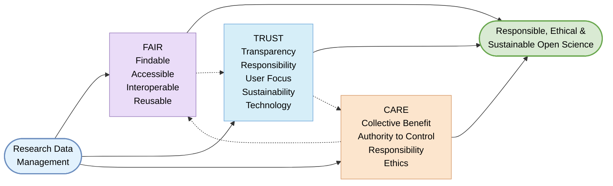

> The following resources informed the development of this guide: 
>
> - [A Guide to the FAIR Principles: Best Practices for Data Handling](https://www.openscience.eu/article/infrastructure/guide-fair-principles)  
> - [FAIR and CARE Principles (NCEAS)](https://learning.nceas.ucsb.edu/2023-06-delta/session_16.html)  
> - [CARE Principles for Indigenous Data Governance](https://www.gida-global.org/care)  
> - [The FAIR Guiding Principles for Scientific Data Management and Stewardship (Nature)](https://www.nature.com/articles/sdata201618)  
> - [The Turing Way FAIR Principles](https://book.the-turing-way.org/reproducible-research/rdm/rdm-fair/)  

## Integrating FAIR, TRUST, and CARE in Research Data Management

Contemporary approaches to research data management are increasingly shaped by three complementary frameworks: **FAIR**, **TRUST**, and **CARE**. Taken together, these principles advance the aims of **Open Science** by integrating technical robustness, institutional reliability, and ethical responsibility.  

- **FAIR** ensures that data are machine-findable and reusable.  
- **TRUST** establishes the conditions under which repositories can steward data securely and sustainably.  
- **CARE** foregrounds the rights, interests, and wellbeing of communities, particularly Indigenous peoples.  

These frameworks bridge technical efficiency with social accountability, enabling responsible data reuse while safeguarding data sovereignty and promoting equity in research.  

## Integrating FAIR, TRUST, and CARE

## FAIR: Enabling Technical Reusability

The **FAIR Data Principles** focus on enhancing the discoverability and reuse of research outputs for both humans and machines, supporting transparency and reproducibility. FAIR requires that data be:  

- **Findable**: assigned persistent identifiers (e.g., DOIs) and described with rich, searchable metadata.  
- **Accessible**: retrievable through standardised, open, and interoperable communication protocols.  
- **Interoperable**: structured using shared languages, ontologies, and formats to enable integration across systems.  
- **Reusable**: accompanied by clear documentation, provenance information, and explicit usage licences.  

FAIR thus addresses the technical and semantic dimensions of data sharing, ensuring that datasets remain intelligible and reusable over time.  

## TRUST: Securing Reliable Stewardship

While FAIR concerns the characteristics of data objects, the **TRUST Principles** focus on the reliability and governance of the repositories in which data are preserved. TRUST emphasises:  

- **Transparency** in service provision and policy.  
- **Responsibility** towards stakeholders and long-term stewardship.  
- **User Focus**, aligning services with community needs.  
- **Sustainability** of organisational and financial models.  
- **Technology** that supports secure, robust infrastructure.  

TRUST therefore provides the institutional and infrastructural foundations necessary to ensure that FAIR data remain accessible and authentic over the long term.  

## CARE: Embedding Ethics and Sovereignty

The **CARE Principles** complement FAIR by centring the social purpose and ethical dimensions of data governance, with particular emphasis on Indigenous data sovereignty. CARE requires that data practices uphold:  

- **Collective Benefit**, ensuring that data systems generate value for communities.  
- **Authority to Control**, recognising the rights of Indigenous peoples to govern their data.  
- **Responsibility**, requiring those handling data to support community wellbeing.  
- **Ethics**, prioritising harm minimisation and equitable benefit.  

CARE thus shifts attention from technical openness alone to questions of power, justice, and accountability in data governance.  

## Synergy in Open Science

The integration of **FAIR**, **TRUST**, and **CARE** enables a holistic approach to data management:  

- **FAIR**  advances technical interoperability and reuse.  
- **TRUST**  ensures secure and sustainable stewardship.  
- **CARE**  embeds ethical integrity and respect for community rights.  

Implemented together, these principles ensure that data are not merely open, but **responsibly governed, socially just, and institutionally reliable**, providing a coherent normative foundation for contemporary research data management within Open Science.

### Further readings and resources
- [FAIR Guiding Principles (Pistoia Alliance)](https://fairtoolkit.pistoiaalliance.org/fair-guiding-principles/)  
- [GO FAIR FAIR Principles](https://www.go-fair.org/fair-principles/)  
- [OpenAIRE How to Make Your Data FAIR](https://www.openaire.eu/how-to-make-your-data-fair)  
- [Durham University FAIR Data Principles](https://libguides.durham.ac.uk/open_research/fair)  

