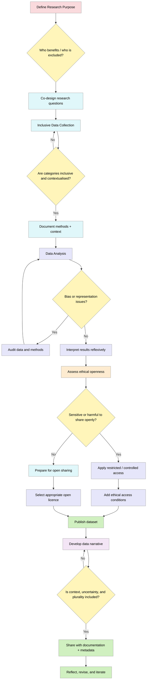

> The following resources informed the development of this guide:
>
> - [D'Ignazio, C., & Klein, L. F. (2020). Data feminism. Cambridge, MA: MIT Press](https://data-feminism.mitpress.mit.edu/)
> - [What is Data Feminism?](https://github.com/javieraatenas-pixel/data_literacy_AI/wiki/4-What-is-Data-Feminism%3F)
> - [ZFDG Data Feminism (Special Issue / Resources)](https://zfdg.de/wp_2026)  
> - [LSE  Data Feminism: What Does Feminist Data Science Look Like?](https://www.lse.ac.uk/lse-player/data-feminism-what-does-feminist-data-science-look-like)  
> - [HU Berlin Gender Blog  Data Feminism: Why Data Are Never Neutral and Why We Should Care](https://genderblog.hu-berlin.de/data-feminism-why-data-are-never-neutral-and-why-we-should-care/)  
> - [Feminist AI  Data Feminism](https://feministai.pubpub.org/pub/data-feminism/release/1)  

## What is Data Feminism?
Open Science aspires to **transparency, accessibility, and reuse**, however, these aspirations are not inherently equitable. Data feminism provides a critical framework through which researchers can interrogate the power structures that underpin data practices and, in doing so, foster more just and inclusive forms of knowledge production. Rather than treating openness as an unquestioned good, it emphasises **reflexivity, ethical care, and attention** to those who are frequently marginalised or rendered invisible within data systems.

**From a data feminist perspective, data are never neutral artefacts.** They are produced through situated decisions shaped by epistemic traditions, institutional norms, and social hierarchies. Consequently, research must begin with an explicit consideration of power: **whose knowledge counts, and whose is excluded?** This framing positions data work not merely as a technical exercise, but as a relational and political practice embedded within broader societal contexts.

**DF allows researchers to:**

- Explicitly articulate whose perspectives are represented and whose are absent.
- Reflect on how institutional, disciplinary, or methodological choices shape the dataset.
- Treat data as situated knowledge, not objective truth.

## The Value of Data Feminism in Open Science
Data feminism strengthens open science by ensuring that its commitment to openness does not come at the expense of justice, care, or responsibility. While open science promotes sharing and reuse, data feminism insists that such practices must be **ethically grounded and socially accountable.** It challenges the notion of "open at all costs" by foregrounding the potential risks of data exposure, particularly for individuals or communities represented in datasets.

This approach is especially important when preparing data for dissemination. Decisions about **licensing, access, and reuse** must take into account not only technical interoperability (as emphasised by FAIR principles), but also **collective rights, authority, and ethical responsibility** (as articulated in CARE principles). In this sense, restrictions on access such as controlled repositories or community governance should be understood not as barriers to openness, but as **mechanisms for ensuring equitable and responsible data sharing.**

Moreover, data feminism enhances the integrity of open science by expanding the meaning of **transparency.** Transparency is not limited to reproducibility; it includes making visible the labour, assumptions, uncertainties, and limitations that shape datasets. This broader conception of openness supports more responsible interpretation and reuse.

### Data Feminism approaches in Open Science

**Data feminism** offers a critical and inclusive perspective on how data is produced, analysed, and shared within open science. It challenges the assumption that data is neutral and instead highlights how power, inequality, and social structures shape data practices. In the context of **open science**, data feminism advocates for more **equitable, ethical, and socially responsible approaches** to openness.

At its core, data feminism asks not only *how* data is shared, but **who benefits, who is represented, and who is excluded**. This perspective is especially relevant for open science, which aims to democratise knowledge but can unintentionally reproduce existing inequalities if these issues are not addressed.

### Key Ideas in Data Feminism for Open Science

- **Data is not neutral**  
  Data reflects the values, assumptions, and biases of the people and systems that produce it. Open data initiatives must therefore critically examine whose knowledge is being prioritised.

- **Power and inequality matter**  
  Data feminism highlights structural inequalities in access to data, resources, and participation in research. Open science efforts should actively work to reduce these gaps.

- **Context matters**  
  Data should be understood within its social, cultural, and historical context. Open data without context risks misinterpretation or misuse.

- **Inclusivity and representation**  
  Marginalised communities are often underrepresented or misrepresented in datasets. Data feminism calls for participatory approaches that include diverse voices in data creation and governance.

- **Ethics and care**  
  Open science must balance openness with responsibility, particularly when dealing with sensitive or personal data. Ethical considerations, including consent and harm mitigation, are central.

- **Challenging dominant knowledge systems**  
  Data feminism promotes pluralistic and interdisciplinary approaches to knowledge, recognising different ways of knowing beyond traditional scientific frameworks.

### Data Feminism in Practice within Open Science

Applying data feminism to open science involves:

- Designing **inclusive data collection practices**  
- Supporting **community-led and participatory research**  
- Ensuring **ethical data sharing and governance**  
- Providing **contextual metadata and documentation**  
- Promoting **equitable access to tools, skills, and infrastructure**  
- Reflecting critically on **biases in algorithms, datasets, and research design**  

**It also promotes:**

- Balancing openness with ethical responsibility; not defaulting to unrestricted sharing.
- Assessing potential harm before publishing data, especially where sensitive information is involved.
- Aligning FAIR principles with CARE principles to ensure socially responsible openness.
- Recognising and documenting all forms of labour contributing to the dataset.

## Practical Applications Across the Research Lifecycle
Applying data feminism in practice requires embedding its principles throughout the entire data lifecycle: from collection, through analysis, to dissemination and narrative construction.

**At the stage of data collection**, inclusive design is essential. Researchers should move beyond reductive categories and binary classifications by enabling self-identification and incorporating qualitative alongside quantitative data. Engaging communities as partners, rather than merely as subjects, helps redistribute epistemic authority and enriches the dataset with contextual depth.

**During data analysis**, critical reflection becomes paramount. Analytical choices such as classification schemes, modelling techniques, and interpretative frameworks can reproduce bias if left unexamined. Researchers should therefore conduct systematic audits to identify structural absences and skewed representations. This stage also requires making labour visible, acknowledging those involved in data preparation, curation, and interpretation.

**In the phases of data sharing and narrative construction**, data feminism emphasises the importance of context. Data do not speak for themselves; they require careful interpretation and communication. Researchers should provide rich metadata, methodological transparency, and accessible explanations that support responsible reuse. Pluralism should be encouraged by acknowledging uncertainty, contestation, and the socio-political conditions in which the data were produced.

Finally, data feminism **rejects a linear understanding of the data lifecycle.** Instead, it promotes ongoing reflection, iteration, and accountability, recognising that datasets and their interpretations evolve over time.

- Data collection: design inclusive, context-sensitive instruments; involve stakeholders.
- Data analysis: audit for bias; document assumptions, uncertainties, and limitations.
- Data sharing: apply appropriate licences and access controls based on ethical considerations.
- Data narratives: provide context-rich documentation; avoid decontextualised interpretation.
- Ongoing practice: revisit and revise datasets as new insights and ethical considerations emerge.

## Data Feminism Across the Data Lifecycle
This workflow integrates data feminism principles into collection  analysis  sharing  narrative stages.

### Further readings and resources
- [ZFDG  Data Feminism (Special Issue / Resources)](https://zfdg.de/wp_2026)  
- [LSE  Data Feminism: What Does Feminist Data Science Look Like?](https://www.lse.ac.uk/lse-player/data-feminism-what-does-feminist-data-science-look-like)  
- [HU Berlin Gender Blog  Data Feminism: Why Data Are Never Neutral and Why We Should Care](https://genderblog.hu-berlin.de/data-feminism-why-data-are-never-neutral-and-why-we-should-care/)  
- [Feminist AI  Data Feminism](https://feministai.pubpub.org/pub/data-feminism/release/1)  

