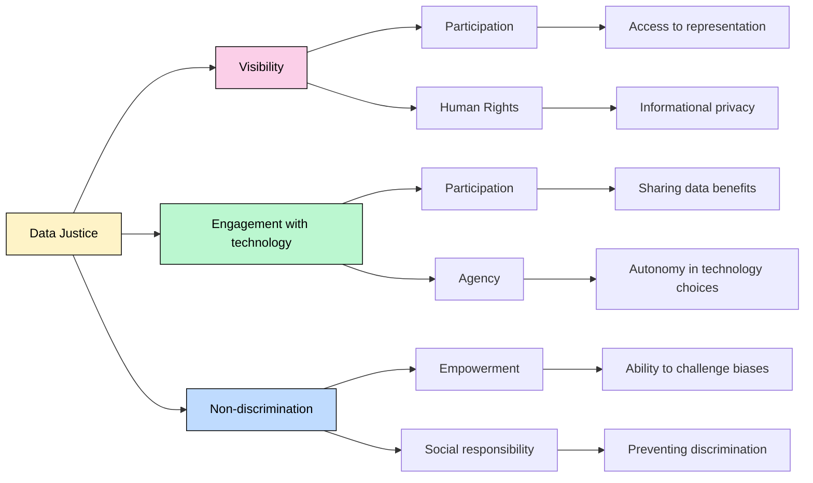

> The following resources informed the development of this guide:
> - [What is Data Justice? (Critical Data and AI Literacy Wiki)](https://github.com/javieraatenas-pixel/Critical-Data-and-AI-Literacy/wiki/4.2-What-is-Data-Justice%3F)  
> - [Open Data Meets Data Justice (Policy Review)](https://policyreview.info/articles/analysis/open-data-meets-data-justice)  
> - [CODATA Data Science Journal Data Justice and Open Science](https://datascience.codata.org/articles/10.5334/dsj-2026-015)  
> - [Data Justice in Practice (SAGE Journals)](https://journals.sagepub.com/doi/10.1177/15701255251367168)  
> - [Transparency Project Open Justice and Data Policy](https://transparencyproject.org.uk/whats-the-future-for-open-justice-and-justice-system-data-policy/)  
> - [Dencik, L., Hintz, A., Redden, J., & Trere, E. (2019). *Exploring data justice: Conceptions, applications and directions*. Information, Communication & Society, 22(7)](https://www.tandfonline.com/doi/full/10.1080/1369118X.2019.1606268)  
> - [Taylor, L. (2017). *What is data justice? The case for connecting digital rights and freedoms globally*. Big Data & Society, 4(2)](https://journals.sagepub.com/doi/10.1177/2053951717736335)  
> - [Dencik, L., Hintz, A., & Cable, J. (2016). *Towards data justice? The ambiguity of anti-surveillance resistance in political activism*. Big Data & Society, 3(2).](https://doi.org/10.1177/2053951716679678)  

## What is Data Justice?

**Data justice** is a framework for understanding how data-related practices affect **people's rights, opportunities, and life chances**. It extends beyond concerns about privacy or data protection to examine how data systems shape social, political, and economic inequalities. Data justice asks whether the benefits and burdens of data-driven technologies are distributed fairly across society.

**[Data justice](https://datajusticelab.org/)** relates to the ethical and social concerns surrounding the **collection, storage, analysis, and dissemination of data**. This concept focuses on ensuring that data is used **fairly, equitably, and in the interest of the public good**.  One of the central themes in Data Justice is the idea that **[data is not neutral](https://www.theguardian.com/technology/2020/mar/21/catherine-dignazio-data-is-never-a-raw-truthful-input-and-it-is-never-neutral)** and that it can be used to reinforce existing power structures and inequalities. Scholars argue that **[data can be biased, incomplete, or manipulated](https://link.springer.com/article/10.1007/s43681-022-00138-8)** to serve the interests of those who control it, such as corporations, governments, or institutions. This can lead to **[discrimination, exclusion, and other forms of social harm.](https://datajusticelab.org/data-harm-record/)**
 
For data practioners, data justice emphasises the importance of **[ensuring that data is collected and used in a transparent and accountable way](https://ico.org.uk/for-organisations/uk-gdpr-guidance-and-resources/data-protection-principles/a-guide-to-the-data-protection-principles/the-principles/lawfulness-fairness-and-transparency/#:~:text=You%20must%20use%20personal%20data,will%20use%20their%20personal%20data)**. Individuals and communities should have access to information about how data is collected, who has access to it, and how it is used. This can help to prevent abuses of power and ensure that **[data is used in the public interest](https://ico.org.uk/for-organisations/uk-gdpr-guidance-and-resources/lawful-basis/special-category-data/what-are-the-substantial-public-interest-conditions/)**.
 
A core element of data justice **[is the need to protect individual privacy and data rights](https://ico.org.uk/for-organisations/advice-for-small-organisations/the-benefits-of-data-protection-laws/#:~:text=You%20might%20even%20have%20sensitive,hands%2C%20people%20could%20be%20harmed.)**. The concept of **[personal agency](https://standards.ieee.org/wp-content/uploads/import/documents/other/ead1e_personal_data.pdf)** implies that individuals should have control over their personal data and be able to decide how it is used. This can involve issues such as informed consent, data ownership, and the right to be forgotten. It can also involve protecting sensitive data, such as health or financial information, from unauthorised access or use.

According to Taylor (2017), data justice **connects digital rights with broader questions of social justice**, recognising that access to data, participation in data systems, and protection from data-related harms are unevenly distributed. Data justice therefore focuses on both individual rights and collective well-being.

Adapted from: Taylor, L. (2017). What is data justice? The case for connecting digital rights and freedoms globally. *Big Data & Society, 4*(2), 2053951717736335. https://doi.org/10.1177/2053951717736335
``

## Core Principles of Data Justice

### 1. Fairness and Equity

Data systems should not reinforce or amplify existing social inequalities. However, many datasets reflect historical patterns of discrimination, meaning that AI systems often inherit societal biases.

Examples include:

* Recruitment systems may favour groups historically overrepresented in employment.
* Predictive policing tools may disproportionately target communities already subject to higher levels of surveillance.
* Credit-scoring algorithms may disadvantage people from historically marginalised socioeconomic backgrounds.

### 2. Power and Participation

A central concern of data justice is who has the power to collect, analyse, and benefit from data. Decisions about data governance are often made by governments, corporations, and technology companies, while the communities most affected by these decisions have limited influence.

Data justice advocates for:

* Democratic participation in data governance.
* Community consultation and co-design.
* Greater accountability from organisations using data-driven technologies.

### 3. Transparency and Accountability

Many AI systems operate as "black boxes", making it difficult to understand how decisions are made. Data justice promotes transparency regarding:

* What data is collected.
* How data is analysed.
* Who benefits from data use.
* How decisions can be challenged or appealed.

### 4. Rights and Agency

Individuals should have meaningful control over their personal information. This includes:

* Informed consent.
* Data ownership and stewardship.
* The right to access, correct, or delete personal data.
* Protection against harmful surveillance practices.

## Data Justice and AI

AI systems are increasingly involved in decisions about:

* Employment.
* Healthcare.
* Education.
* Criminal justice.
* Financial services.

Because AI systems learn from historical data, they often reproduce historical inequalities. Data justice therefore requires not only technical solutions but also social and political interventions that address the root causes of discrimination.

## Key References on Data Justice

- Dencik, L., Hintz, A., Redden, J., & Trer├®, E. (2019). *Exploring data justice: Conceptions, applications and directions*. Information, Communication & Society, 22(7). https://www.tandfonline.com/doi/full/10.1080/1369118X.2019.1606268

- Taylor, L. (2017). *What is data justice? The case for connecting digital rights and freedoms globally*. Big Data & Society, 4(2). https://journals.sagepub.com/doi/10.1177/2053951717736335

- Dencik, L., Hintz, A., & Cable, J. (2016). *Towards data justice? The ambiguity of anti-surveillance resistance in political activism*. Big Data & Society, 3(2). https://doi.org/10.1177/2053951716679678  

