# DMPs: Data Management and Sharing Metadata and Standards
 
>The following resources informed the development of this guide:
>
> - [UK Data Service Data Management Basics: Introduction to Data Management and Sharing](https://ukdataservice.ac.uk/app/uploads/dmbintrotodatamanagementandsharing2023-04-27.pdf)  
> - [British Ecological Society A Guide to Data Management](https://www.britishecologicalsociety.org/wp-content/uploads/2019/06/BES-Guide-Data-Management-2019.pdf)  
> - [University of Reading Humanities Data Management Guide](https://research.reading.ac.uk/digitalhumanities/resources/guides/data-management/)  
> - [DARIAH Campus Pathfinder to Data Management Best Practices in the Humanities](https://campus.dariah.eu/resources/pathfinders/dariah-pathfinder-to-data-management-best-practices-in-the-humanities)  

## Introduction

Effective research data management is fundamental to **robust, transparent, and reproducible research**. Research data are valuable scholarly outputs that require careful **planning, organisation, documentation, preservation, and sharing** throughout the research lifecycle. Good data management practices not only support research integrity and efficiency but also enhance the long-term value, visibility, and impact of research outputs. Increasingly, funders, publishers, and the wider research community expect researchers to manage and share data in ways that support openness, reproducibility, and reuse.

For ECRs, adopting sound data management practices from the outset can facilitate collaboration, reduce the risk of data loss, improve research quality, and simplify the process of sharing data when research findings are disseminated. Effective data sharing is not an activity undertaken at the end of a project; rather, it is enabled by the decisions made throughout the research process.

### Best Practice Recommendations for ECRs

- [**Develop a DMP**](https://github.com/Digital-Future-Institute/CoARA/blob/main/4.-Introduction-to-Data-Management-Plans-(DMPs).md) at the start of every research project and review it regularly as the project evolves.
- **Consider data management** as an integral component of the research process rather than an administrative requirement.
- **Record methods, workflows, and decisions** contemporaneously throughout the project.
- **Use consistent file naming conventions**, clear folder structures, and version control procedures.
- **Capture metadata** and contextual information at the point of data creation whenever possible.
- [**Apply the FAIR principles]**(https://github.com/Digital-Future-Institute/CoARA/blob/main/3.3-FAIR-Principles-in-Practice.md) from the earliest stages of project planning.
- **Ensure that ethical, legal, intellectual property, and confidentiality** considerations are addressed before data are shared.

## Managing Research Data

Research data management encompasses the processes involved in planning, organising, documenting, storing, protecting, and preserving research data throughout the life of a project.

- **Develop a DMP**: It provides a structured framework for managing research data throughout a project. It should outline the types of data that will be generated, the standards and formats that will be used, storage and backup arrangements, responsibilities within the research team, and plans for preservation and sharing. Developing a DMP at the beginning of a project promotes consistency, accountability, and good research practice.

- **Organise Data Systematically**: Well-organised data are easier to locate, understand, analyse, and share. Researchers should establish clear and consistent approaches to file naming, folder structures, and version management. Good organisational practices reduce duplication, minimise the risk of error, and facilitate collaboration among project partners.

- **Document Data and Research Processes** Comprehensive documentation is essential if data are to remain understandable and reusable over time. Researchers should record:

> * 1.  How and when data were collected or generated;
> * 2.  The methodologies, instruments, or software used;
> * 3.  Definitions of variables and coding schemes;
> * 4.  Data processing and analytical procedures;
> * 5.  Quality assurance and validation measures.

Metadata and supporting documentation should be created alongside the data rather than retrospectively. Capturing contextual information at the point of data creation significantly improves the quality and reusability of research data.

- **Store and Protect Data Securely**: Research data should be stored in secure and appropriate locations throughout the project. Researchers should implement regular backup procedures and ensure that access controls are proportionate to the sensitivity of the data. Effective storage and security arrangements protect against accidental loss, corruption, or unauthorised access while ensuring that authorised collaborators can access the data when required.

- **Plan for Long-Term Preservation**: Researchers should consider from the outset which datasets have enduring value and require long-term preservation. Preservation planning includes selecting appropriate file formats, maintaining adequate documentation, and identifying suitable repositories for archiving. Planning for preservation early in the research process supports future access and reuse.

- [**Sharing Research Data**](https://github.com/Digital-Future-Institute/CoARA/blob/main/1.6-Publishing-Open-Data.md): The sharing of research data promotes transparency, reproducibility, and the advancement of knowledge. Well-managed data can be reused in future studies, combined with other datasets, or reanalysed to address new research questions. 

## Apply the FAIR Principles

Research data should be managed and shared according to the [**FAIR principles**](https://github.com/Digital-Future-Institute/CoARA/blob/main/3.1.-Understanding-the-FAIR-Principles.md), as applying these principles throughout a project increases the likelihood that data will remain valuable and usable over the long term.

- **Share Complete and Well-Documented Datasets**: Where appropriate, datasets should be shared in a form that enables meaningful interpretation and reuse. This includes providing sufficient metadata, documentation, methodological information, and contextual materials alongside the data. Data sharing should support transparency and enable others to understand how the data were generated and analysed.

- **Deposit Data in Trusted Repositories**: Trusted repositories support the long-term preservation, discoverability, and accessibility of research data. Repositories typically provide persistent identifiers, implement recognised metadata standards, and offer mechanisms for citation and stewardship. Depositing data in appropriate repositories can significantly increase the visibility and impact of research outputs.

- **Address Ethical, Legal, and Commercial Considerations**: Not all data can be shared openly thus researchers must consider:

- Personal and sensitive data;
- Participant consent agreements;
- Confidentiality obligations;
- Intellectual property rights;
- Regulatory and legal requirements.

In some cases, controlled access arrangements may be necessary to balance openness with ethical and legal responsibilities. Responsible data sharing should maximise access while protecting participants, communities, and legitimate interests.

- **Ensure Data are Citable and Connected to Research Outputs**: Shared datasets should be linked to associated publications, software, reports, and other outputs wherever possible. Persistent identifiers and data availability statements improve discoverability, facilitate citation, and support the traceability and reproducibility of research findings.

- **Embed Data Sharing within Open Research Practice**: Data sharing should be viewed as one component of a broader commitment to open research. Sharing publications, software, methods, and other research outputs contributes to greater transparency, collaboration, and reproducibility across the research community. When integrated into project planning from the outset, open research practices can enhance both the quality and the societal value of research.

```mermaid
flowchart LR

    A([Research Project])

    B["Data Preparation
     Planning
     Creation
     Documentation"]

    C["Secure Management
     Storage
     Protection"]

    D{"Ready to Share?"}

    E["FAIRification
     FAIR Principles
     Metadata Review"]

    F{"Restrictions?"}

    G["Open Sharing
     Trusted Repository"]

    H["Controlled Access
     Managed Sharing"]

    I["Preservation & Linking
     Persistent Identifier
     Publications
     Long-term Reuse"]

    J([Transparent & Reproducible Research])

    %% Main flow
    A --> B
    B --> C
    C --> D

    D -->|No| B
    D -->|Yes| E

    E --> F

    F -->|No| G
    F -->|Yes| H

    G --> I
    H --> I

    I --> J

    %% Styling
    classDef pink fill:#FDE2E4,color:#000,stroke:#666;
    classDef blue fill:#DDEBF7,color:#000,stroke:#666;
    classDef yellow fill:#FFF4CC,color:#000,stroke:#666;
    classDef purple fill:#E9D5FF,color:#000,stroke:#666;
    classDef green fill:#D8F3DC,color:#000,stroke:#666;

    class A pink
    class B,C blue
    class D,F yellow
    class E,G,H purple
    class I,J green
```

## File Formats

Selecting appropriate file formats for your research data is a crucial aspect of data management. The formats you choose will affect how easily your data can be **accessed, shared, preserved, and reused** both now and in the future.

This section of your DMP should specify the formats you intend to use for each dataset and explain why these formats are appropriate.

### What to Include

- **The file formats you will use for each dataset:** : Clearly list the formats for all types of data you will generate or collect (e.g., text, numerical data, images, audio, video, code, instrument outputs).

- **Rationale for choosing these formats:**: Explain why you selected these formats, focusing on openness, compatibility, long-term accessibility, and disciplinary norms.

## File Formats for Research Data

| Data Type | Recommended File Format(s) | Rationale |
|------------|---------------------------|------------|
| **Survey Data** | `.csv` (Comma Separated Values) | Widely supported, open, non-proprietary format that supports long-term accessibility and interoperability. |
| **Interview Transcripts** | `.txt` (Plain Text), `.pdf` (PDF/A) | Plain text provides flexibility and future-proofing; PDF/A supports long-term archiving and sharing. |
| **Images** | `.tif` (TIFF) | High-quality, lossless format suitable for long-term preservation and archival storage. |
| **Audio Recordings** | `.wav` | Uncompressed, widely supported format that preserves original audio quality. |
| **Code and Scripts** | `.py` (Python), `.R`, with documentation in `.txt` or `.md` (Markdown) | Preserves reproducibility, transparency, and ease of reuse, while supporting documentation and version control. |
| **Numeric Data** | `.csv` (primary archival format), `.xlsx` (working format) | CSV supports sharing, preservation, and interoperability; XLSX may be used internally for analysis and data management. |
| **Video Data** | `.mp4` | Widely supported format suitable for sharing, access, and long-term usability. |

## Best Practices for Open Science

- Use **open, non-proprietary formats** whenever possible.  
  Examples: `.csv`, `.txt`, `.pdf (PDF/A)`, `.tif`, `.wav`.

- Avoid formats that require specific proprietary software.  
  If proprietary formats (e.g., `.xlsx`, `.sav`) must be used, provide an open-format version as well.

- Follow **disciplinary standards** where applicable (e.g., FITS in astronomy, CIF in chemistry).
- Plan for **long-term preservation** by selecting stable, well-documented, and widely adopted formats.

## What is Metadata?

Metadata is commonly described as *data about data* In research, metadata provides structured information that describes, explains, locates, or makes it easier to retrieve, use, or manage a dataset.

Good metadata ensures research data can be understood, discovered, and reused by others.

*Source: DataCite. "Spotlight on Open Funding Metadata: DataCite Open Hours Recap". Available at: https://datacite.org/blog/spotlight-on-open-funding-metadata-datacite-open-hours-recap/*

## Why Use Metadata Standards?

Metadata standards ensure:

- Consistency  
- Interoperability  
- Discoverability  
- Reusability  

Many academic disciplines have developed their own metadata standards to address specific research needs.

## What to Include in Your DMP

- The **metadata standard(s)** you will use.
- A description of your metadata approach if no formal standard exists.

## Metadata Standards

A comprehensive directory of metadata standards by discipline is available from the **Digital Curation Centre (DCC)** and the RDA Metadata Standards Catalog.

| Category | Standard | Description | Website |
|----------|----------|-------------|----------|
| General Standards | **Dublin Core** | A widely used, general-purpose metadata standard for describing digital resources. Common fields include Title, Creator, Subject, Description, Publisher, Contributor, Date, Type, Format, Identifier, and Rights. | https://www.dublincore.org/ |
| General Standards | **DataCite Metadata Schema** | A metadata standard designed for research datasets and other research outputs, commonly used when assigning Digital Object Identifiers (DOIs). | https://schema.datacite.org/ |
| Discipline-Specific Standards | **Data Documentation Initiative (DDI)** | A metadata standard primarily used in the social, behavioural, and economic sciences to document datasets and research data lifecycles. | https://www.dcc.ac.uk/resources/metadata-standards/ddi-data-documentation-initiative |
| Discipline-Specific Standards | **Ecological Metadata Language (EML)** | A metadata specification developed for documenting ecological and environmental datasets. | https://eml.ecoinformatics.org/ |
| Discipline-Specific Standards | **Darwin Core** | A standard for sharing biodiversity and species occurrence data, widely used in natural history and ecological research. | https://dwc.tdwg.org/ |
| Discipline-Specific Standards | **Text Encoding Initiative (TEI)** | A standard for the representation and encoding of digital texts, commonly used in the humanities and digital scholarship. | https://tei-c.org/ |
| Discipline-Specific Standards | **Content Standard for Digital Geospatial Metadata (CSDGM)** | A metadata standard for documenting geospatial datasets and geographic information resources. | https://www.fgdc.gov/metadata/csdgm-standard |
| Discipline-Specific Standards | **NetCDF Climate and Forecast (CF) Metadata Conventions** | A metadata convention used for climate, atmospheric, oceanographic, and environmental data stored in NetCDF formats. | https://cfconventions.org/cf-conventions/cf-conventions.html |
| Discipline-Specific Standards | **CERIF (Common European Research Information Format)** | A standard for managing and exchanging information about research activities, outputs, projects, and organisations. | https://eurocris.org/services/main-features-cerif |
# Access and Sharing

Your DMP should outline:

- Who will have access to the data and at what stages.
- How and when data will be shared.
- Any restrictions or embargo periods.

### Examples

> Data will be shared publicly via the institutional repository following publication of the main findings, with a six-month embargo.

> Interview transcripts containing sensitive personal information will be accessible only to the core research team and stored in encrypted folders on secure university servers.

# Anonymisation and Aggregation

Before sharing data involving human participants, it is often necessary to anonymise or aggregate the data to protect privacy and comply with legal and ethical standards.

- **Anonymisation:** Removing or modifying personal identifiers.
- **Aggregation:** Presenting data at group level to reduce identification risk.

([See: Standards for data anonymisation](https://github.com/Digital-Future-Institute/CoARA/blob/main/5.2-Standards-for-data-anonymisation.md))

## Best Practices for Anonymisation

### 1. Remove Direct Identifiers

- Names  
- Addresses  
- Email addresses  
- National Insurance numbers  
- Student/employee IDs  

Example: Replace Jane Smith with Participant 01.

### 2. Generalise or Mask Indirect Identifiers

Instead of:  
> 42-year-old nurse from Ipswich

Use:  
> Healthcare professional, aged 40-45, East of England.

### 3. Use ISO Standards for Coding Categories

- **Country codes:** ISO 3166-1 alpha-2 (e.g., GB, FR)  
- **Language codes:** ISO 639-1 (e.g., en, es)  
- **Occupation codes:** ISCO-08  

Example structured data:

- Age group: 25-30  
- Gender: Male  
- Occupation: ISCO-08 code 2512  
- Location: GB  

### 4. Avoid Free-Text Fields for Sensitive Data

Review and redact identifiable content before sharing.

### 5. Document the Anonymisation Process

Describe anonymisation steps in metadata or supporting documentation.

## Technical Mechanisms for Sharing

- **Repositories:** Institutional repositories, Zenodo, Figshare, UK Data Service.
- **Data Portals:** Discipline-specific portals (e.g., OpenICPSR).
- **Access Controls:** Password protection, embargoes, data use agreements.
