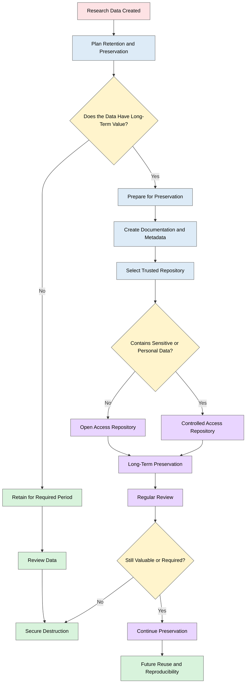

# Research Data Retention and Preservation
 
> The following resources informed the development of this guide:
>
> - [University of Exeter Preservation of Research Data](https://www.exeter.ac.uk/research/researchdatamanagement/after/preservation/)  
> - [UKRI  Retention Framework for Research Data and Records (MRC)](https://www.ukri.org/wp-content/uploads/2023/03/MRC-100323-RegulatorySupportCentre-RetentionFrameworkResearchDataRecords.pdf)  
> - [UCL Library Services  Research Data Management: Archiving](https://library-guides.ucl.ac.uk/research-data-management/archiving)  
> - [UK Data Service  Store Your Data: Storage](https://ukdataservice.ac.uk/learning-hub/research-data-management/store-your-data/storage/)  
> - [University of Liverpool  Preserving Your Research Data](https://www.liverpool.ac.uk/library/research-data-management/essentials/preserving-your-research-data/)  
> - [University of Manchester  RDM Archive and Preservation Service](https://www.rlp.manchester.ac.uk/2023/06/29/rdm-archive-and-preservation-service/)  

## Research Data Retention and Preservation

**Research data retention and preservation** are essential components of good research practice. **Retention** refers to how long research data and associated records are kept, while  **preservation** focuses on ensuring that data remain accessible, usable, understandable, and secure over time. Effective retention and preservation support research integrity, transparency, reproducibility, future reuse, and compliance with legal, ethical, regulatory, and funder requirements. See [UKRI](https://www.ukri.org/wp-content/uploads/2023/03/MRC-100323-RegulatorySupportCentre-RetentionFrameworkResearchDataRecords.pdf) and [RDNo](https://plan.research-data.no/pages/5_sharing_preservation)

## Benefits of Proper Data Management
- Research data is a valuable output, equivalent to journal articles and books.
- Poorly managed data can be lost or degrade over time.
- Compliance with university and funder requirements is easier.
- Enhances **reproducibility, validation, and research integrity**.
- Sharing data increases its **reuse and overall impact**.

Research data may need to be retained for several reasons:

- To support the verification and reproducibility of research findings.
- To provide an audit trail demonstrating how research was conducted.
- To enable future data sharing and reuse.
- To comply with funder, publisher, legal, and regulatory requirements.
- To preserve research outputs with historical, scientific, cultural, or policy significance. 
## Planning for Retention

Retention requirements should be considered at the start of a project and documented within a DMP or Records Retention Schedule. Researchers should identify:

- What data and documentation will be retained.
- How long they will be retained.
- Who is responsible for managing retained data.
- Where retained data will be stored.
- Which data have long-term value and should be preserved.

## What to Include in a Data Management Plan (DMP)

1. **Archiving Location**: Specify where your data will be archived (institutional, national/subject-specific, or generalist repositories).

2. **Preservation Duration**: Minimum period data will be preserved, based on funder, institutional, or disciplinary guidelines.

3. **Backup & Security Measures**: Describe steps to **protect data from loss, corruption, or unauthorized access** during and after the project.

**Examples**
- All anonymised survey data will be deposited in the [UK Data Service](https://www.ukdataservice.ac.uk/) repository, preserved for 10 years per ESRC requirements.
- Regular backups to secure university servers, daily snapshots, weekly off-site backups.
- Sensitive interview data will be encrypted and access restricted to authorised personnel.

Retention decisions should be made on a case-by-case basis and should take account of:

- Funder requirements;
- Publisher expectations;
- Legal and regulatory obligations;
- Ethical considerations;
- The scientific, social, or historical value of the data;
- Potential future reuse and reproducibility needs. [U. Bristol](https://www.bristol.ac.uk/media-library/sites/library/documents/research-support/research-data/guidance/sensitive/Retention%20of%20research%20records%20and%20data.pdf) [UKRI](https://www.ukri.org/wp-content/uploads/2023/03/MRC-100323-RegulatorySupportCentre-RetentionFrameworkResearchDataRecords.pdf)

## Recommended Retention Periods

Retention periods vary according to the nature of the research and any applicable regulations.

Typical examples include:

| Research Type | Suggested Minimum Retention Period |
|---------------|-----------------------------------|
| Most research data and associated metadata | At least 10 years after project completion |
| Clinical, population health, or longitudinal studies | At least 20 years after study completion |
| Research with significant public, policy, environmental, clinical, heritage, or historical value | 20 years or longer |
| Research generating intellectual property or patents | May require indefinite retention |
| Historically significant research outputs | Permanent preservation may be appropriate |

Retention periods should always be checked against applicable funder, institutional, sponsor, and regulatory requirements. 

## Data Preservation and Long-Term Access

Data selected for long-term preservation should be deposited in a trustworthy repository whenever possible. Researchers should ensure that preserved data remain:

- Discoverable through metadata and persistent identifiers;
- Accessible under appropriate access conditions;
- Stored in sustainable file formats;
- Accompanied by sufficient documentation for reuse;
- Protected from accidental loss or corruption. 

Repositories often provide preservation services, including long-term storage, backup, metadata management, and persistent identifiers such as DOIs. Trustworthy repositories may hold certifications demonstrating their commitment to long-term stewardship. [Plan research data](https://plan.research-data.no/pages/5_sharing_preservation)

### Choosing a Repository
- **Institutional repositories:** Managed by your university (e.g., University of Suffolk Research Data Repository).  
- **National or subject-specific repositories:** Recommended or required by funders (e.g., [UK Data Service](https://www.ukdataservice.ac.uk/), [Archaeology Data Service](https://archaeologydataservice.ac.uk/), [European Nucleotide Archive](https://www.ebi.ac.uk/ena)).  
- **Generalist repositories:** For data not fitting disciplinary repositories (e.g., [Zenodo](https://zenodo.org/), [Figshare](https://figshare.com/)).

## Preserving Sensitive and Personal Data

Not all data can be shared openly. Research involving personal, confidential, commercially sensitive, or restricted data may require additional protections.

Researchers should:

- Assess data sensitivity early in the project.
- Determine whether anonymisation or pseudonymisation is appropriate.
- Use controlled-access repositories where necessary.
- Clearly document access conditions and restrictions.
- Ensure participant consent supports any planned preservation or reuse. 

The principle should be to make data **"as open as possible and as closed as necessary"**, balancing openness with ethical and legal obligations. 

## Preservation Period
- Often set by funders: 5 to 10 years after project completion/publication.
- Consider indefinite preservation for **high-value or historically significant datasets**.

### Storage Limitation and Data Protection

Under UK data protection legislation, personal data should not be retained for longer than necessary for its original purpose. Researchers must be able to justify retention periods and should establish documented retention schedules wherever possible. [ICO](https://ico.org.uk/for-organisations/uk-gdpr-guidance-and-resources/data-protection-principles/a-guide-to-the-data-protection-principles/storage-limitation/)

Good practice includes:

- Maintaining formal retention policies.
- Regularly reviewing retained data.
- Securely deleting or anonymising data that are no longer required.
- Documenting decisions regarding retention, transfer, preservation, or destruction. [ICO](https://ico.org.uk/for-organisations/uk-gdpr-guidance-and-resources/data-protection-principles/a-guide-to-the-data-protection-principles/storage-limitation/)[UKRI](https://www.ukri.org/wp-content/uploads/2023/03/MRC-100323-RegulatorySupportCentre-RetentionFrameworkResearchDataRecords.pdf)

Research data may be retained for extended periods where they are preserved for scientific, historical, statistical, or public-interest archiving purposes, provided appropriate safeguards are in place. [ICO](https://ico.org.uk/for-organisations/uk-gdpr-guidance-and-resources/data-protection-principles/a-guide-to-the-data-protection-principles/storage-limitation/)

## Reviewing and Disposing of Data

Retention and preservation should not be viewed as a one-time activity. Researchers and institutions should periodically review preserved data to determine whether they remain valuable and usable.

Reviews should consider:

- Continued scientific value.
- Legal and ethical requirements.
- Ongoing costs of storage.
- Data quality and usability.
- Potential future reuse. 

Where data are no longer required, secure destruction procedures should be followed. A record should be maintained documenting:

- What was destroyed;
- When it was destroyed;
- Why it was destroyed;
- Who authorised the destruction. 

## Backup Procedures

### During the Project
- Store data in **at least two separate locations** (local + secure cloud).  
- Use **automated backup systems** where possible.  
- **Test backups regularly** to ensure integrity.

### After Archiving
- Ensure repositories provide **robust backup and disaster recovery**.  
- Retain a **local copy** of critical data, if permitted.

## Security Measures
- **Encryption:** Both in transit and at rest.  
- **Access Controls:** Passwords, authentication, role-based permissions.  
- **Physical Security:** Locked cabinets or secure rooms for storage media.  
- **Audit Trails:** Keep logs of access and modifications.

## Long-Term Storage & Preservation
Digital materials can degrade or become inaccessible over decades. Follow these guidelines:

- **Documentation:** Include sufficient metadata for future understanding.  
- **Backups:** Keep multiple copies on different storage media.  
- **Migration:** Move data to new media/software over time.  
- **Access Control:** Prevent unauthorized edits to final data.  
- **Universal Formats:** Use widely compatible file formats.

**Minimum retention**
- 5 years post-publication.  
- Funders like UKRI: commonly 10 years.

## Who Can Help?
Data preservation requires expertise and resources. Options include:

- **Data Centres/Archives:** Handle storage and sharing for approved users.  
  Examples:  
  - [Archaeology Data Service](https://archaeologydataservice.ac.uk/)  
  - [Dryad Digital](https://datadryad.org/Repository)  
  - [Visual Art Data Service (VADS)](http://www.vads.ac.uk/services/depositing/index.html)  
- Some funders require deposition in designated data centres (e.g., ESRC).

## Further Reading

- **Data Sharing and Long-Term Preservation (Research Data Norway DMP Guidance)**  
  https://plan.research-data.no/pages/5_sharing_preservation

- **Retention Framework for Research Data and Records (UK Research and Innovation)**  
  https://www.ukri.org/wp-content/uploads/2023/03/MRC-100323-RegulatorySupportCentre-RetentionFrameworkResearchDataRecords.pdf

- **Sharing Research Data (University of Reading Research Data Management Guide)**  
  https://libguides.reading.ac.uk/researchdata/sharing-data

- **Data Preservation and Repositories (University of Reading Research Data Management Guide)**  
  https://libguides.reading.ac.uk/ld.php?content_id=35939110

- **Guidance on the Retention of Research Records and Data (University of Bristol Research Data Service)**  
  https://www.bristol.ac.uk/media-library/sites/library/documents/research-support/research-data/guidance/sensitive/Retention%20of%20research%20records%20and%20data.pdf

- **Principle (e): Storage Limitation  UK GDPR Guidance (Information Commissioner's Office)**  
  https://ico.org.uk/for-organisations/uk-gdpr-guidance-and-resources/data-protection-principles/a-guide-to-the-data-protection-principles/storage-limitation/

