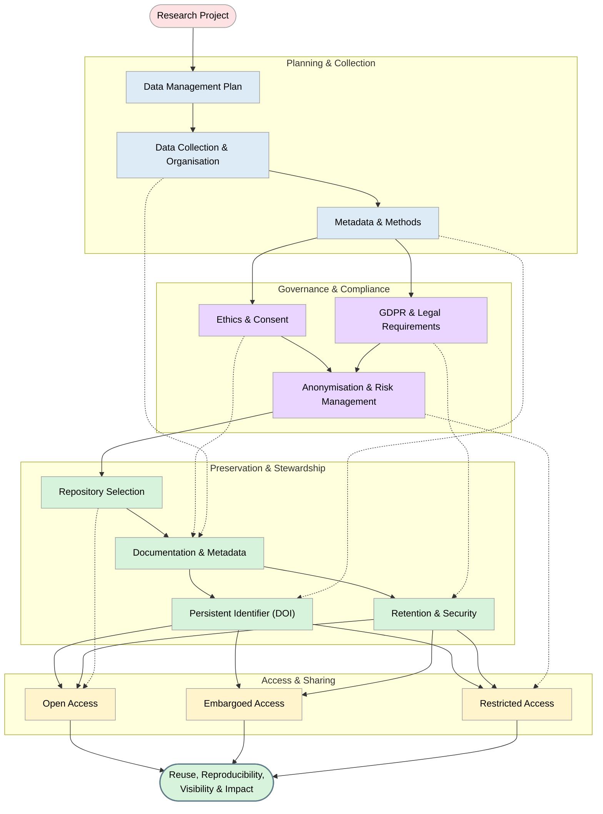

> The following resources informed the development of this guide:
>
> - [UCL Research Data Archiving and Sharing](https://library-guides.ucl.ac.uk/research-data-management/archiving)  
> - [University of Bath Choosing an Archive for Research Data](https://library.bath.ac.uk/research-data/archiving-and-sharing/choosing-an-archive)  
> - [UK ICO What is Research-Related Processing?](https://ico.org.uk/for-organisations/uk-gdpr-guidance-and-resources/the-research-provisions/what-is-research-related-processing/)  
> - [DataCore What is Data Archiving?](https://www.datacore.com/glossary/what-is-data-archiving/)  

*For Researchers and Research Teams*  

## Why Archiving Matters  

Open Science is an approach to research that seeks to make knowledge creation more **transparent, accessible, reusable and trustworthy**. It encourages researchers to share not only publications, but also data, methods, software and documentation wherever possible.  

Archiving and preserving data are fundamental to Open Science because research data:  

- Are valuable research outputs **in their own right**, not merely by-products of publications  
- Enable others to **verify, reproduce or build** upon your work  
- Contribute to **societal, cultural and economic benefits** beyond the original project  

When data are not archived properly, they may become unusable due to lost context, obsolete formats, degraded storage media, or staff turnover.  

In practical terms, responsible archiving:  

- Protects your work over time  
- Supports collaboration and reuse  
- Demonstrates research integrity  
- Helps meet funder, institutional and legal expectations  

**DORA & CoARA context:**  

Responsible data archiving is increasingly recognised as evidence of high-quality research practice. It supports assessment approaches that value **good stewardship, openness and long-term impact**, rather than focusing solely on journal outputs.  

This diagram outlines best practices for managing, archiving, and sharing research data across the full lifecycle, from project planning to enabling reuse and impact.

## Planning for Archiving from the Very Beginning  

Many problems with data archiving arise because decisions are left until the end of a project. Open Science practice encourages researchers to think about the entire lifecycle of data **from the outset**.  

### Step 1: Address Archiving in your DMP  

A **Data Management Plan** explains how data will be handled during and after a project. Even where a DMP is not formally required, creating one helps structure good practice.  

In your DMP, clearly explain:  

- **What data you will create or collect**: Describe data types (e.g. surveys, interviews, images, code) and formats. This helps determine appropriate preservation approaches.  

- **Which data will be preserved and why**: Not all data need to be kept forever. Justify preservation based on scientific, historical or public value.  

- **Which data can be shared openly and which cannot**: Explain any ethical, legal or commercial restrictions.  

- **Where data will be archived**: Identify an appropriate repository or archive early.  

- **How long data will be retained**: Align retention periods with funder, institutional and disciplinary expectations.  

- **How personal or sensitive data will be protected**: Describe anonymisation, pseudonymisation, access controls and security measures.  

**Illustrative example:**  

> Qualitative interview transcripts will be anonymised and deposited in a trusted data service with controlled access. Original audio files will be securely archived with restricted access for ten years for verification purposes. 

### Step 2: Understand GDPR and Research Data  

If your research involves information about identifiable individuals, it is likely to involve personal data.  

Under GDPR, research is permitted where processing is:  

- Necessary for scientific or historical research, statistical purposes, or archiving in the public interest  
- Accompanied by appropriate safeguards  

For researchers, this means:  

- Collect only the data you genuinely need  
- Remove direct identifiers where possible  
- Be transparent with participants about long-term storage and potential reuse  
- Seek ethics approval where required  
- Document decisions clearly  

GDPR does not prevent responsible data archiving, but it does require care, justification and good management.  
See more here [ICO What are the research provisions?](https://ico.org.uk/for-organisations/uk-gdpr-guidance-and-resources/the-research-provisions/what-are-the-research-provisions/)

## Choosing Where to Archive Your Data  

The choice of archive or repository has a direct impact on whether your data remain usable in the future.  

### Step 3: Select an Appropriate Repository  

Common repository options include:  

- **Institutional repositories**  
  These are managed by universities and often provide trusted, long-term storage aligned with institutional policies.  

- **Disciplinary or national repositories**  
  These specialise in particular types of data and usually offer stronger community standards, metadata and reuse support.  

- **Generalist repositories**  
  Suitable when no discipline-specific option exists, particularly for smaller or mixed datasets.  

Before depositing, check:  

- The stated preservation commitment  
- Availability of persistent identifiers (e.g. DOIs)  
- Metadata requirements  
- Access control options  
- Licensing choices  

## Preparing Data So Others Can Understand It  

Data without context are often meaningless. Preservation is not only about storage, but about long-term intelligibility.  

### Step 4: Documentation and Metadata  

To support reuse, ensure that future users can understand:  

- How the data were created or collected  
- What each file contains  
- How variables or columns should be interpreted  
- Any limitations, biases or known issues  

Good practice includes:  

- Clear file naming and folder structures  
- Open or widely supported file formats  
- README files explaining the dataset  
- Data dictionaries or codebooks  

## Retention, Backup and Security  

### Step 5: Decide How Long Data Should Be Kept  

Retention periods should balance:  

- Research value  
- Ethical obligations  
- Legal and funder requirements  
- Practical storage considerations  

Many funders require 5 to 10 years minimum retention, but data of enduring value may warrant longer preservation.  

### Step 6: Protect Data Against Loss or Misuse  

During a project:  

- Store data in secure, institutionally approved locations  
- Keep multiple backups  
- Limit access to authorised team members  

After archiving:  

- Ensure repositories manage backups and security  
- Apply access restrictions where needed  

## Sharing, Credit and Responsible Reuse  

### Step 7: Share Data Responsibly  

Where possible, Open Science encourages data to be:  

- Shared openly with clear licences see [2. Open Licensing in Open Science](https://github.com/Digital-Future-Institute/CoARA/blob/main/2.-Open-Licensing-in-Open-Science.md)
- Accompanied by citations in publications  
- Made discoverable through repositories  

This ensures others can reuse your data appropriately, while you receive recognition for your work.  

