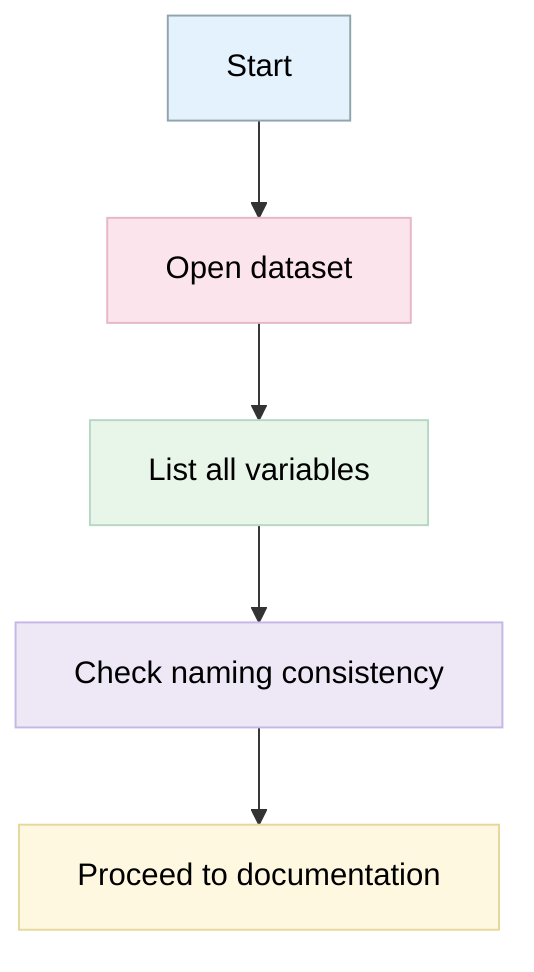
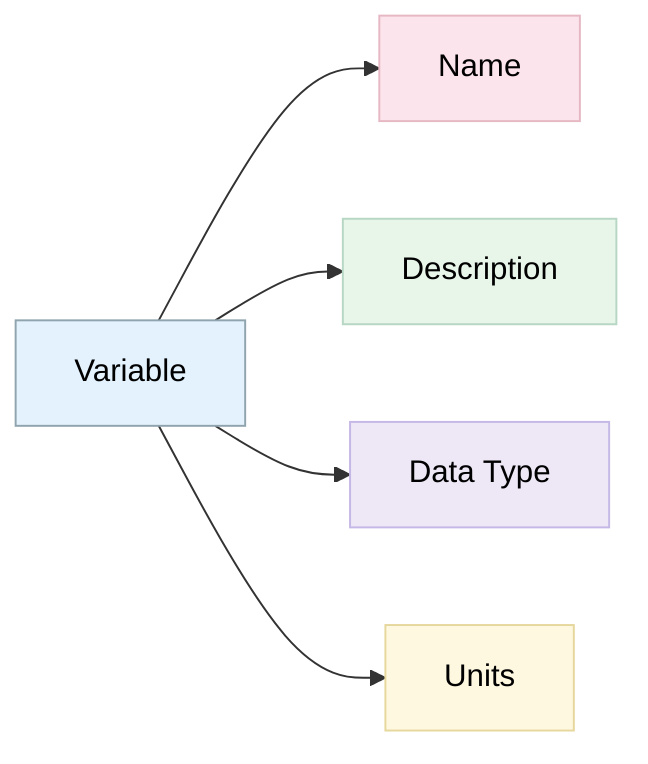
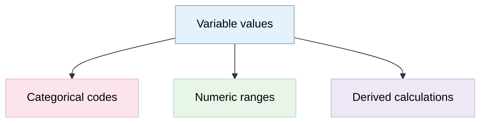
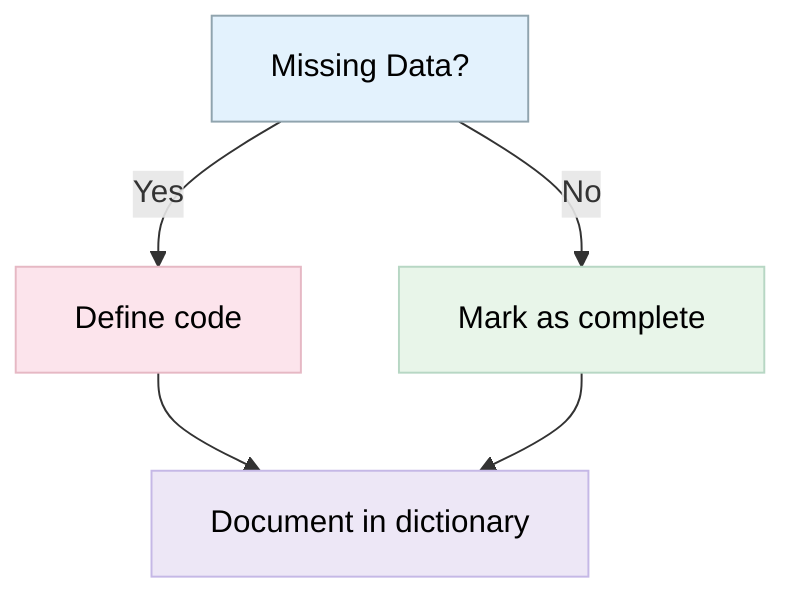
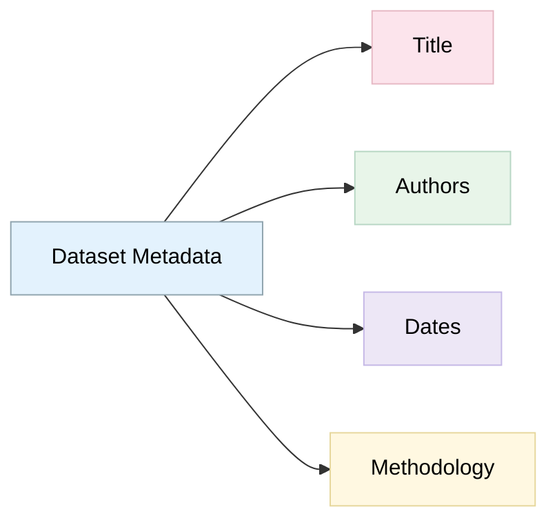
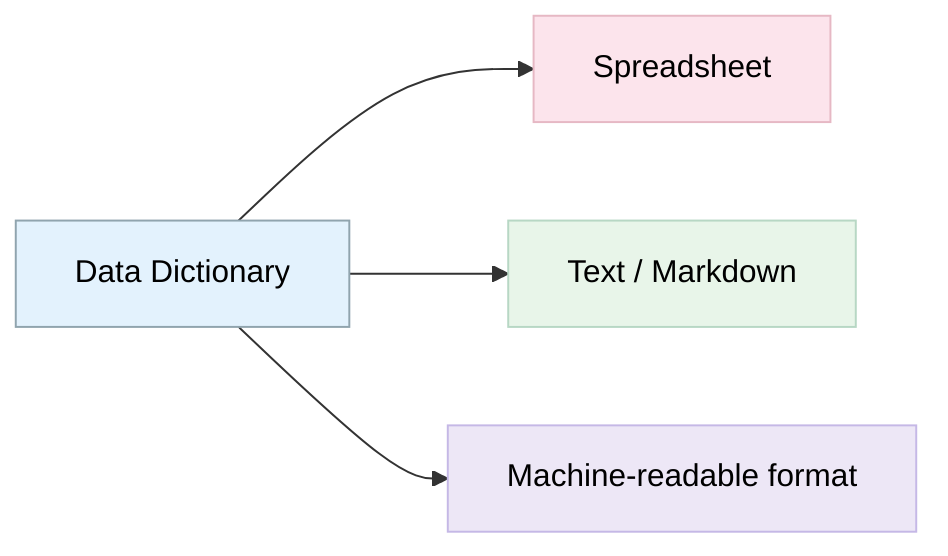
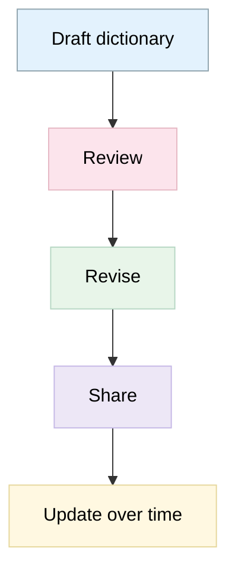

# Creating Data Dictionaries for Researchers
 
> The following resources informed the development of this guide:
>
> - [University of Iowa Libraries Documenting Your Data](https://www.lib.uiowa.edu/data/manage/documenting/)  
> - [OSF Help How to Make a Data Dictionary](https://help.osf.io/article/217-how-to-make-a-data-dictionary)  
> - [FAIR Cookbook Creating a Data Dictionary](https://faircookbook.elixir-europe.org/content/recipes/interoperability/creating-data-dictionary.html)  

# What is a Data Dictionary?

A **data dictionary** is a structured document that describes your dataset in detail'explaining **variables, formats, values, and coding decisions** so others (and future you) can understand and reuse the data. It is a structured document that describes the contents, meaning, and format of data within a dataset. It serves as a reference guide that enables researchers and others to understand, interpret, validate, and reuse data accurately. Data dictionaries are a key component of research documentation and support transparency, reproducibility, and long-term preservation of research outputs. See [OSF](https://help.osf.io/article/217-how-to-make-a-data-dictionary) and [Harvard](https://datamanagement.hms.harvard.edu/collect-analyze/documentation-metadata/data-dictionary)

For ECRs, creating a data dictionary alongside data collection **helps avoid confusion, improves collaboration, reduces errors, and facilitates future sharing and reuse of research data**. A well-designed data dictionary can also simplify the process of depositing data in repositories and meeting FAIR data requirements. See [OSF](https://help.osf.io/article/217-how-to-make-a-data-dictionary)

## Why Create a Data Dictionary?

- Improves **transparency** and **reproducibility**
- Helps others interpret **variables** correctly
- Supports [**FAIR** data principles](https://github.com/Digital-Future-Institute/CoARA/blob/main/3.1.-Understanding-the-FAIR-Principles.md)
- Prevents **data misinterpretation** or loss of meaning

### Best Practice Recommendations for ECRs

- Create a data dictionary at the beginning of a project rather than retrospectively. 
- Update the data dictionary throughout the project lifecycle as variables evolve. 
- Use clear, consistent naming conventions across datasets. 
- Document all variables, including those that may appear self-explanatory. 
- Record permissible values, coding schemes, and units of measurement. 
- Include sufficient information to allow someone unfamiliar with the project to understand the data. 
- Use existing disciplinary standards where appropriate. 

## Core Components of a Data Dictionary

Element | Description
-- | --
Variable Name | Exact name as used in the dataset
Description | Clear explanation of the variable
Data Type | Numeric, text, date, categorical, etc.
Allowed Values | Possible values or coding scheme
Units | Measurement units (if applicable)
Missing Values | How missing data is represented
Notes | Additional context or transformations

# What Should a Data Dictionary Include?

While requirements vary by discipline and project, most data dictionaries should contain the following information.

- Variable Name: Record the exact variable name used within the dataset.

**Example:**

| Variable Name |
|--------------|
| age_years |

-  Human-Readable Variable Name: Provide a more understandable version of the variable name.

**Example:**

| Variable Name | Readable Name |
|--------------|--------------|
| age_years | Participant Age |

- Variable Definition: Provide a clear definition of what the variable measures.

**Example:**

| Variable | Definition |
|-----------|------------|
| age_years | Age of the participant in completed years at the time of data collection |

- Measurement Units: Specify the unit of measurement where relevant.

**Examples:**

| Variable | Unit |
|-----------|------|
| height | cm |
| weight | kg |
| income | GBP |

- Permitted Values and Coding: Document all valid values and coding schemes.

**Example:**

| Variable | Allowed Values |
|-----------|---------------|
| gender | 1 = Female, 2 = Male, 3 = Non-binary, 4 = Prefer not to say |

-  Missing Data Codes: Explain any codes used for missing or unavailable information.

**Example:**

| Value | Meaning |
|---------|---------|
| -99 | Missing |
| -88 | Not applicable |
| -77 | Participant declined to answer |

## Additional Notes and Descriptions

Where necessary, provide additional contextual information.

Examples include:

- Sampling methods;
- Survey skip logic;
- Data transformations;
- Derived variables;
- Assumptions used during data processing. 

### Example Data Dictionary Template

| Variable Name | Readable Name | Definition | Unit | Allowed Values | Notes |
|---------------|---------------|------------|------|---------------|--------|
| participant_id | Participant ID | Unique participant identifier | N/A | Numeric | Anonymised identifier |
| age_years | Age | Participant age at survey completion | Years | 18-99 | Self-reported |
| height_cm | Height | Participant height | cm | 100-250 | Measured |
| wellbeing_score | Wellbeing Score | Composite wellbeing measure | Score | 0-100 | Derived variable |

## Step-by-Step Process

### 1. Review Your Dataset

- Identify all variables (columns, fields)
- Ensure naming consistency
- Check for abbreviations or unclear labels

### 2. Define Each Variable
For each variable:

- Write a clear description
- Specify data type
- Note units and formats

### 3. Document Values and Codes

- Explain categorical values (e.g., 1 = Yes, 0 = No)
- Define ranges for numeric data
- Describe encoded or derived variables

### 4. Record Missing Data Conventions

Explain how missing values are represented
(e.g., NA, -999, blank cells)

### 5. Add Contextual Metadata
Include:

- Dataset title and description
- Creator(s)
- Date created/updated
- Methodology notes

### 6. Choose a Format

[Common formats](https://github.com/Digital-Future-Institute/CoARA/blob/main/1.6-Publishing-Open-Data.md):

- Spreadsheet (Excel, CSV)
- Markdown or text file
- JSON or XML (for interoperability)

### 7. Validate and Update

- Review for clarity and completeness
- Share with collaborators for feedback
- Update when dataset changes

## Best Practices

- Use clear, non-technical language
- Avoid unexplained abbreviations
- Keep structure consistent across variables
- Align with standards or ontologies where possible
- Store data dictionary with the dataset

Variable | Description | Type | Values | Units
-- | -- | -- | -- | --
age | Participant age | Integer | 0-120 | Years
gender | Self-identified gender | Categorical | 1=Male, 2=Female, 3=Other | N/A
height_cm | Height | Numeric | 50-250

### Maintaining a Data Dictionary

A data dictionary should be treated as a living document.

Researchers should:

- Review and update it whenever variables change.
- Add newly created variables.
- Document modifications to coding systems.
- Record changes to variable definitions.
- Maintain version control where appropriate. 

For longitudinal or evolving projects, researchers may also create crosswalk documents that record how variables change across dataset versions. 

### Using Data Dictionaries for Data Sharing

Data dictionaries are particularly valuable when depositing datasets in repositories or sharing data with collaborators. They enable secondary users to:

- Interpret datasets correctly;
- Understand variable meanings;
- Assess data quality;
- Reproduce analyses;
- Reuse data in future studies.

A dataset without a data dictionary may have limited value because users cannot easily determine what variables represent or how they should be interpreted.

## Further Reading and Resources

- [How to Make a Data Dictionary (Open Science Framework)](https://help.osf.io/article/217-how-to-make-a-data-dictionary)
- [Data Dictionary (Harvard Biomedical Data Management)](https://datamanagement.hms.harvard.edu/collect-analyze/documentation-metadata/data-dictionary)
- [Codebooks and Data Dictionaries (University of Pennsylvania Libraries)](https://guides.library.upenn.edu/datamgmt/codebook-data-dictionary)
- [Data Dictionaries and Codebooks: A Practical Guide for Psychological Science](https://journals.sagepub.com/doi/10.1177/2515245920928007)
- [How to Create a Data Dictionary (Video Tutorial)](https://youtu.be/KOQSfbvvwV4?si=U2pV8OwxXIjY05pP)

