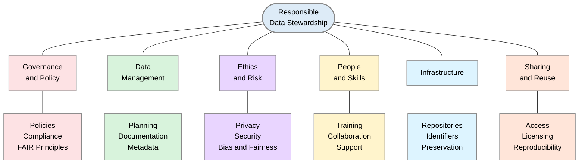
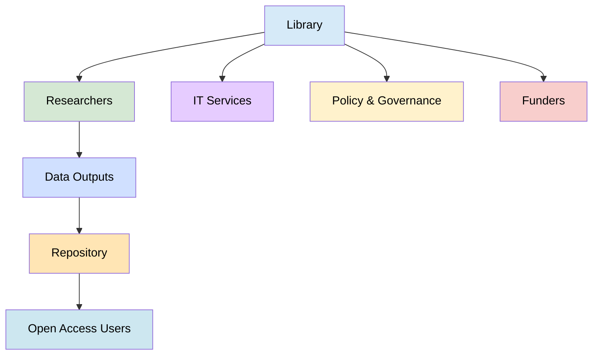

> The following resources informed the development of this guide:
>
> - [Orr├╣ (2018), *Data stewardship in libraries for sustainable and open science*](https://art.torvergata.it/bitstream/2108/246132/5/Data%20stewardship%20in%20library%20for%20sustainable%20and%20open%20science.pdf)  
> - [Association of Research Libraries (ARL), *From compliance to sustainable capacity: strategic insights on research data stewardship*](https://www.arl.org/blog/from-compliance-to-sustainable-capacity-strategic-insights-on-research-data-stewardship/)  
> - [Ada Lovelace Institute, *Participatory and inclusive data stewardship*](https://www.adalovelaceinstitute.org/report/participatory-inclusive-data-stewardship/)  
>

*A Guide for Librarians and Stakeholders*

## Introduction

Data stewardship describes the practices, responsibilities, and governance structures that ensure data is handled in ways that support **long-term usability, ethical integrity, and public benefit.** **Ethical and responsible data stewardship** refers to the **management, protection, sharing, and preservation of data in ways that promote trust, accountability, transparency, and public benefit**. It requires researchers to consider not only how data are collected and used, but also the potential impacts of data practices on individuals, communities, organisations, and society.

For librarians and other stakeholders, responsible data stewardship aligns with professional values of trust, openness, and equity, while **supporting navigation of complex data ethics, legal frameworks, and institutional policies**. This guide introduces the concept of **responsible data stewardship**, outlines key principles, and presents practical approaches for implementation in library and institutional contexts.

Research data must be **managed throughout their lifecycle**, from planning and collection to preservation, sharing, reuse, and eventual disposal. Responsible stewardship helps ensure data remain high-quality, secure, lawful, fair, and reusable while respecting privacy, confidentiality, and ethical obligations. For ECRs, understanding data stewardship is an essential part of conducting rigorous and trustworthy research and contributes to the wider goals of open and responsible research. 

This workflow outlines key operational domains that support ethical, sustainable, and effective data stewardship in libraries and research-support environments. It integrates governance, infrastructure, ethics, and community engagement into a continuous institutional practice.

## What is Data Stewardship?

Data stewardship is the coordinated management of data throughout its lifecycle to ensure that data remain trustworthy, accessible, secure, ethically managed, and reusable. Effective stewardship supports the FAIR principles by ensuring that data are:

- **Findable**
- **Accessible**
- **Interoperable**
- **Reusable**

Data stewardship is not a single activity but an ongoing process that includes planning, documentation, governance, preservation, access management, and long-term maintenance. 

### Key distinctions

- **Data governance vs. data stewardship**
  - Governance defines policies and standards
  - Stewardship implements and operationalises them in daily practice

- **Operational role**
  - Data stewards manage data across its lifecycle (creation  storage  use  archival/disposal)

- **Collaborative function**
  - Coordination across departments to ensure consistency, quality, and compliance

### Core Principles of Ethical Data Stewardship

| Principle | What it Means in Practice |
|------------|--------------------------|
| **Respect Rights and Privacy** | ÔÇó Obtain appropriate consent where required. ÔÇó Clearly explain how data will be used. ÔÇó Protect personal and sensitive information. ÔÇó Comply with relevant data protection legislation. ÔÇó Consider participant expectations throughout the research lifecycle. |
| **Promote Transparency** | ÔÇó Be clear about what data are collected. ÔÇó Explain why data are collected. ÔÇó Document how data are processed and analysed. ÔÇó Clarify who has access to the data. ÔÇó Describe how data will be shared, preserved, or destroyed. |
| **Ensure Data Quality and Integrity** | ÔÇó Use reliable methods of data collection. ÔÇó Maintain accurate and complete records. ÔÇó Document data processing and analytical decisions. ÔÇó Monitor for errors and inconsistencies. ÔÇó Preserve audit trails and provenance information where appropriate. |
| **Protect Data Securely** | ÔÇó Use secure storage systems. ÔÇó Apply appropriate access controls. ÔÇó Implement encryption where necessary. ÔÇó Maintain regular backups. ÔÇó Review security arrangements periodically to address emerging risks. |
| **Consider Fairness and Inclusion** | ÔÇó Promote representation and inclusion within datasets. ÔÇó Identify and address potential biases in data collection and use. ÔÇó Consider the effects of data practices on underrepresented groups. ÔÇó Ensure data use contributes positively to society and the public good. |

## Data Stewardship: Roles, Responsibilities, and Importance

A practical description illustrates this shift:

> *The Data Steward is the first point of contact for advice and support on all data/code related matters including storage, security, sharing options and publication requirements*. [[Librarian resources T&F]](https://librarianresources.taylorandfrancis.com/insights/library-management/data-steward/)

### Libraries as Open Science Hubs
Libraries also function as connective infrastructures, supporting collaboration:

> *Open science involves ÔÇ£creating an infrastructure that fosters connections between research outputs.* [[Center for Open Science]](https://www.cos.io/blog/libraries-and-open-science-overlaps-and-gaps-with-the-research-community)

Thus, librarians occupy a hybrid role combining technical expertise, policy awareness, and community engagement.

### Core Competencies for Librarian Data Stewards

Drawing on EOSC-aligned frameworks and practice, competencies fall into four domains:

| Competency Area | Description | Librarian Application |
|----------------|-------------|----------------------|
| Technical | Metadata, repositories, formats | Managing institutional repositories |
| Research | Understanding disciplinary practices | Advising on domain-specific data standards |
| Policy & Legal | GDPR, funder mandates, licensing | Supporting compliance and ethical use |
| Interpersonal | Communication, advocacy | Training and researcher engagement |

EOSC recommendations emphasise:

> *the need for technical and soft skills and roles as agents of change* in organisations [[EOSC]](https://zenodo.org/records/10728419/files/IDCC_poster_final.pdf)

```mermaid
flowchart LR
A[Research Design] --> B[Data Collection]
B --> C[Data Processing]
C --> D[Documentation & Metadata]
D --> E[Storage & Security]
E --> F[Sharing & Publication]
F --> G[Preservation & Reuse]

%% Pastel styling with black text
style A fill:#D6EAF8,color:#000000
style B fill:#D5E8D4,color:#000000
style C fill:#E6CCFF,color:#000000
style D fill:#FFF2CC,color:#000000
style E fill:#D0E0FF,color:#000000
style F fill:#FFE5B4,color:#000000
style G fill:#CDE7F0,color:#000000
```

There are different types and roles of Data Stewards

| Type | Focus |
|------|-------|
| **Domain Data Steward** | Focuses on a specific data domain (e.g., research, finance, health) |
| **Functional Data Steward** | Oversees data within a specific function (e.g., marketing, HR) |
| **Process Data Steward** | Manages data across workflows and processes |
| **Technical Data Steward** | Works with IT systems and infrastructure |
| **Lead Data Steward** | Provides leadership and oversight across stewardship activities |

### Stewarding Data Across the Research Lifecycle

| Research Lifecycle Stage | Good Stewardship Practices |
|-------------------------|----------------------------|
| **Planning** | ÔÇó Develop a Data Management Plan (DMP). ÔÇó Identify ethical, legal, and regulatory requirements. ÔÇó Define roles and responsibilities for data management. ÔÇó Determine data access and sharing arrangements. ÔÇó Plan preservation, retention, and disposal strategies. |
| **Collection** | ÔÇó Collect only the data necessary to address the research objectives. ÔÇó Ensure participants are appropriately informed about data collection and use. ÔÇó Follow approved ethical procedures and research protocols. ÔÇó Capture sufficient metadata and supporting documentation from the outset. |
| **Use and Analysis** | ÔÇó Maintain data quality and integrity throughout the project. ÔÇó Document analytical decisions and data processing activities. ÔÇó Preserve provenance information and version histories. ÔÇó Consider potential biases, limitations, and uncertainties in the data. ÔÇó Ensure appropriate security measures during analysis. |
| **Sharing and Reuse** | ÔÇó Apply FAIR principles where appropriate. ÔÇó Deposit data in trusted repositories. ÔÇó Clearly document licences, ownership, and conditions for reuse. ÔÇó Apply appropriate restrictions to sensitive or confidential data. ÔÇó Provide sufficient metadata and documentation to support reuse. |
| **Preservation and Disposal** | ÔÇó Preserve data that have long-term research, societal, or historical value. ÔÇó Retain data in accordance with institutional, legal, and funder requirements. ÔÇó Securely dispose of data that are no longer required. ÔÇó Document preservation, retention, and destruction decisions. |

Data stewardship refers to the responsible **management, oversight, and care** of data assets throughout their lifecycle. It ensures that data are **accurate, secure, ethically used, and effectively governed** to support research, policy, and organisational decision-making.

### Data Stewardship Roles and Responsibilities

Data stewardship can be understood as:

> *the management and oversight of an organisationÔÇÖs data assets to ensure they are properly collected, stored, maintained, and used.* [[Opus Project]](https://opusproject.eu/openscience-news/what-is-data-stewardship-and-why-is-it-important/)

Effective stewardship is a shared responsibility. Researchers may work alongside:

- Data stewards;
- Research data managers;
- Librarians;
- Information governance specialists;
- Ethics committees;
- IT and infrastructure teams.

| Area | Key Focus | Main Actions / Practices |
|------|-----------|--------------------------|
| **Data Quality** | Ensure data are accurate, consistent, and reliable | ÔÇó Conduct audits, validation, and cleaning ÔÇó Ensure accuracy, consistency, and reliability |
| **Data Access & Security** | Protect data and manage appropriate access | ÔÇó Manage permissions and user roles ÔÇó Safeguard sensitive and confidential data |
| **Metadata & Documentation** | Enable understanding, discovery, and reuse of data | ÔÇó Create clear, standardised documentation ÔÇó Enable discoverability and reuse |
| **Compliance & Ethics** | Ensure responsible and lawful data use | ÔÇó Ensure adherence to frameworks such as GDPR and institutional policies ÔÇó Promote ethical and responsible data use |
| **Collaboration & Communication** | Support shared understanding and coordination | ÔÇó Work across departments and stakeholder groups ÔÇó Ensure shared understanding of data practices |

Within research contexts, it encompasses the **full lifecycle of data**, ensuring its quality, reproducibility, and long-term usability, aligning closely with FAIR principles (Findable, Accessible, Interoperable, Reusable). [[Santos-Hermosa & Atenas, 2022]](https://www.frontiersin.org/journals/big-data/articles/10.3389/fdata.2024.1428568/full), [[Go Fair]](https://www.go-fair.org/fair-principles/)

For librarians, this role is not peripheral but **central to institutional open science strategies**. Libraries increasingly act as infrastructure providers, trainers, and intermediaries between researchers, policy frameworks, and technical systems.

## Why Data Stewardship Matters in Open Science

The significance of data stewardship lies in its ability to **operationalise** open science principles:

- Enhancing reproducibility and transparency
- Ensuring compliance with funders and regulations
- Maximising data reuse and impact
- Supporting ethical and secure data practices
- Ensures data integrity for research, policy, healthcare, and innovation  
- Protects privacy and security reducing risk of breaches and misuse  
- Supports legal and regulatory compliance 
- Enables evidence-based decision-making 
- Promotes ethical and responsible use of data  

## Responsible Data Stewardship

Responsible data stewardship is:

> An iterative, systemic process of ensuring that data is collected, managed, used, and shared for public benefit while mitigating harm and addressing structural inequalities.

### Key characteristics

- **Iterative** ÔÇô Adapts to evolving technologies and contexts
- **Systemic** ÔÇô Recognises interconnected impacts of data decisions
- **Public benefit-oriented** ÔÇô Prioritises collective good
- **Harm-reducing** ÔÇô Identifies and mitigates risks
- **Equity-driven** ÔÇô Addresses structural inequalities and promotes inclusion

## Principles of Responsible Data Stewardship

- **Transparency** ÔÇô Clear documentation of decisions and processes  
- **Accountability** ÔÇô Defined roles and oversight structures  
- **FAIRness** ÔÇô Data should be Findable, Accessible, Interoperable, and Reusable  
- **Privacy & Security** ÔÇô Strong protection of individuals and sensitive data  
- **Inclusivity & Equity** ÔÇô Address bias and ensure fair representation  
- **Public Benefit** ÔÇô Ensure societal value from data use  
- **Sustainability** ÔÇô Long-term preservation and accessibility  

## Good Practices for Librarians and Stakeholders

| Area | Key Focus | Main Actions / Practices |
|------|-----------|--------------------------|
| **1. Governance and Policy** | Establish institutional frameworks for responsible data stewardship | ÔÇó Develop institutional data policies ÔÇó Align with FAIR, CARE, UNESCO AI ethics, and legal frameworks |
| **2. Data Management Planning** | Ensure structured planning across the research lifecycle | ÔÇó Require Data Management Plans (DMPs) ÔÇó Provide templates integrating legal, ethical, and technical considerations |
| **3. Metadata and Documentation** | Improve discoverability, transparency, and reuse of data | ÔÇó Promote use of metadata standards ÔÇó Support persistent identifiers (e.g., DOIs, ORCID) |
| **4. Education and Capacity Building** | Strengthen skills and awareness in data stewardship | ÔÇó Deliver training on data ethics and stewardship ÔÇó Build communities of practice across librarians, researchers, and IT teams |
| **5. Community Engagement** | Ensure inclusive and participatory data governance | ÔÇó Involve stakeholders in governance processes ÔÇó Support participatory and co-designed data practices |
| **6. Ethical Review and Risk Assessment** | Embed ethics throughout the research workflow | ÔÇó Ask: Who benefits? Who may be harmed? What risks exist? ÔÇó Integrate ethical review into research workflows |
| **7. Practical Tools and Infrastructure** | Provide technical systems that support responsible data management | ÔÇó Use open-source tools for anonymisation and data quality checks ÔÇó Implement cataloguing and repository systems ÔÇó Adopt persistent identifiers for traceability |

## Further Reading

- **Office for Statistics Regulation ÔÇô Short Guide to Code of Practice Standard Four: Manage Data Responsibly**: https://osr.statisticsauthority.gov.uk/guidance/short-guide-to-code-of-practice-standard-four-manage-data-responsibly/
- **Data Stewardship Wizard ÔÇô User Guide**: https://guide.ds-wizard.org/en/4.5/
- **University of Exeter Library ÔÇô Ethical and Legal Considerations in Research Data Management**: https://libguides.exeter.ac.uk/c.php?g=725887&p=5281282
- **The Alan Turing Institute ÔÇô Introduction to Responsible Data Stewardship**: https://aiethics.turing.ac.uk/modules/data-stewardship/
- **AI Governance Library ÔÇô Responsible Data Stewardship in Practice**: https://www.aigl.blog/responsible-data-stewardship-in-practice/
- **The Alan Turing Institute ÔÇô Responsible Data Stewardship in Practice Workbook (PDF)**: https://www.turing.ac.uk/sites/default/files/2024-06/aieg-ati-5-datastewardshipv1.2.pdf
- **Pistoia Alliance FAIR Toolkit ÔÇô Data Stewardship**: https://fairtoolkit.pistoiaalliance.org/methods/data-stewardship/
- **OECD Toolkit for Access to Research Data from Public Funding ÔÇô Responsibility, Ownership and Stewardship**: https://www.oecd.org/en/toolkits/access-to-research-data-from-public-funding-toolkit/responsibility-ownership-and-stewardship.html
