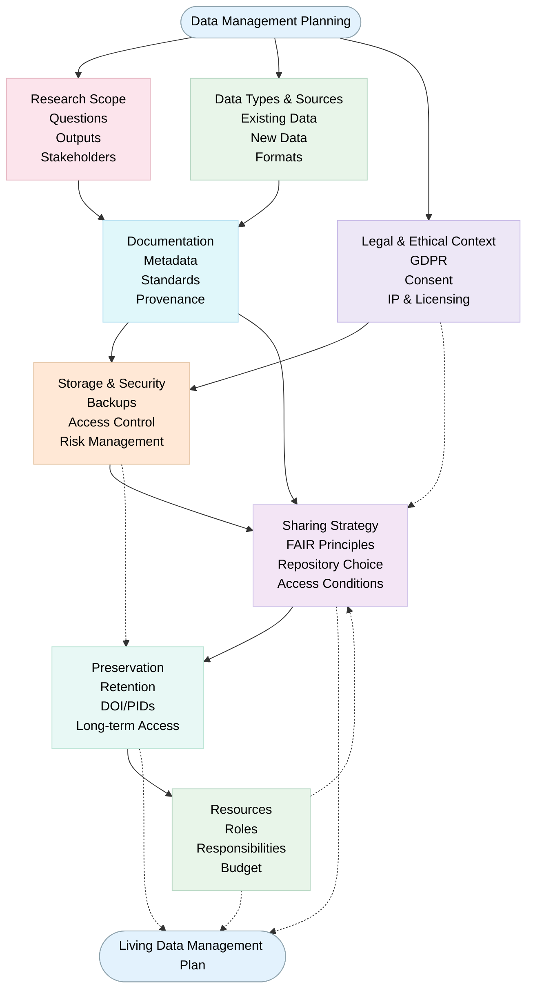
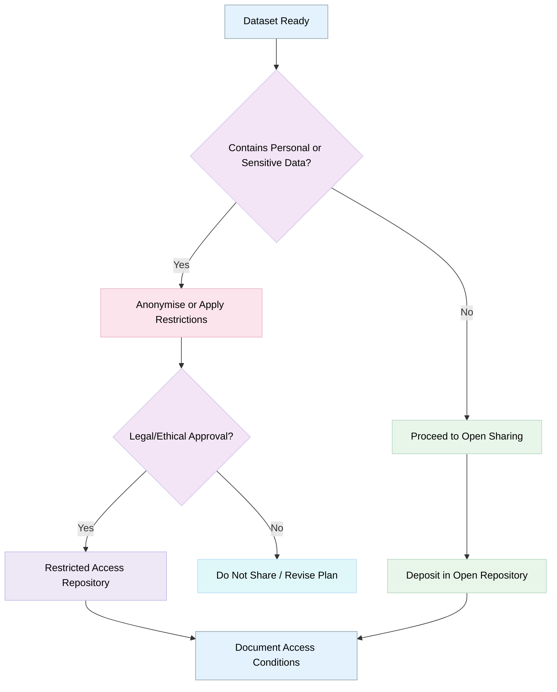

# Developing a Data Management and Sharing Plan (DMSP)
 
> The following resources informed the development of this guide:
>
> - [Digital Curation Centre (DCC): How to Develop a Data Management Plan](https://www.dcc.ac.uk/guidance/how-guides/develop-data-plan)  
> - [National Institutes of Health (NIH): Writing a Data Management and Sharing Plan](https://grants.nih.gov/policy-and-compliance/policy-topics/sharing-policies/dms/writing-dms-plan)  
> - [University of York: Research Data Management Planning](https://subjectguides.york.ac.uk/rdm/planning)  
> - [Harvard Medical School: Data Management and Sharing Plan Design](https://datamanagement.hms.harvard.edu/plan-design/data-management-and-sharing-plan)  

## Introduction 
A Data Management and Sharing Plan (DMSP) is a structured document that describes how research data will be **created, organised, documented, stored, shared, preserved**, and, where appropriate, **disposed of** throughout a research project. Increasingly, funding bodies, publishers, and research institutions expect researchers to demonstrate how they will manage data responsibly and maximise its value beyond the life of a project.

A DMSP is much more than a funding requirement. It provides an opportunity to **think strategically about data from the outset of a project**, helping to **prevent data loss, improve research efficiency, support collaboration, and facilitate future sharing and reuse**. By planning early, researchers can establish good practices that contribute to transparency, reproducibility, and the long-term sustainability of research outputs

## Purpose of a DMSP
A **DMSP** outlines how data will be **collected, organised, stored, preserved, and shared** across the research lifecycle. 

It ensures:

- Compliance with funder and institutional policies
- Transparency and reproducibility
- Ethical and legal data use
- Long-term accessibility and reuse

## Planning and Managing Research Data

Effective data management begins with careful planning. A DMSP should provide a clear overview of the data that will be produced and the processes that will be used to manage them throughout the project.

### Describing the Data

Researchers should clearly identify the nature and scope of the data to be generated or collected. This may include quantitative datasets, qualitative interviews, images, audiovisual materials, software outputs, laboratory records, survey data, or existing datasets that will be reused. The plan should describe:

- The types of data that will be created or collected;
- The formats in which the data will be stored;
- The anticipated volume of data;
- Any existing datasets that will be incorporated into the project.

### Documentation and Metadata

Research data have little value if they cannot be understood by others or even by the original researcher at a later date. A DMSP should therefore explain how data will be documented and described throughout the project. This may include:

- File naming conventions;
- Folder structures;
- Version control procedures;
- Metadata standards;
- Data dictionaries and codebooks;
- Documentation explaining methodologies and workflows.

### Storage and Security

Researchers should identify where data will be stored during the project and how they will be protected. Considerations include:

- Secure storage locations;
- Backup arrangements;
- Access permissions;
- Protection of sensitive or confidential data;
- Measures to prevent accidental loss, corruption, or unauthorised access.

The level of security should be proportionate to the nature and sensitivity of the data being managed.

### Roles and Responsibilities

A DMSP should clearly identify who is responsible for managing research data. Although the primary responsibility often lies with the principal investigator or lead researcher, effective data management is often a shared responsibility involving supervisors, collaborators, technical staff, and research support teams. Clearly defining responsibilities helps ensure consistency and accountability throughout the project.

## Core Components of a Data Management and Sharing Plan (DMSP)

A **Data Management and Sharing Plan** (DMSP) provides a structured account of how research data will be handled throughout the project lifecycle, ensuring **compliance, transparency, and long-term usability**.

| Section | Purpose | Key Elements |
|----------|--------|--------------|
| **Data Description** | Define the nature and scope of data to be generated or reused | Types, formats, and estimated volume of data (e.g., CSV, JSON, images, audiovisual) Sources of data (primary or secondary; experimental, observational, or simulated) Relevant standards, protocols, or methodologies guiding data production |
| **Documentation and Metadata** | Ensure data are interpretable, traceable, and reusable | Metadata standards applied (e.g., Dublin Core, Data Documentation Initiative, domain-specific schemas) Supporting documentation for reproducibility (e.g., codebooks, README files, workflows, scripts) |
| **Storage and Security** | Ensure safe, reliable, and secure data management during the project | Storage solutions (institutional servers, secure cloud storage) Backup procedures (frequency, redundancy, version control) Access controls and cybersecurity measures to protect integrity and confidentiality |
| **Legal, Ethical, and Access Considerations** | Ensure compliance with legal and ethical requirements | Adherence to GDPR and relevant data protection regulations Processes for informed consent and anonymisation/pseudonymisation Intellectual property rights, licensing, and ownership considerations |
| **Data Sharing and Access** | Define how and when data will be made available | Identified repositories (institutional, disciplinary, or general-purpose) Timing of data release (e.g., upon publication, after embargo) Access conditions (open, restricted, controlled access) |
| **Preservation and Sustainability** | Ensure long-term usability and accessibility of data | Archiving strategies using trusted digital repositories Use of sustainable, non-proprietary file formats where possible Defined retention periods aligned with institutional or funder policies |
| **Responsibilities and Resources** | Clarify roles, costs, and support structures for data management | Roles and responsibilities (e.g., data steward, PI) Costs (storage, curation, repository fees) Institutional or external support services |

## Sharing, Preservation, and Reuse

One of the principal aims of a Data Management Plan is to ensure that valuable research data can be preserved and, where appropriate, shared for future use.

### Planning for Data Sharing

Researchers should consider from the start how their data might be shared at the end of the project. Effective data sharing promotes transparency, enables verification of findings, and supports new research opportunities. A DMSP should address:

- Which data will be shared;
- When the data will become available;
- Where the data will be deposited;
- Any restrictions on access;
- Conditions for future reuse.

Not all research data can be made openly available, but researchers should aim to make data as accessible as possible while respecting ethical and legal obligations.

### Ethical and Legal Considerations

Research data management must be undertaken within relevant ethical and legal frameworks. Researchers should consider:

- Participant consent;
- Privacy and confidentiality;
- Data protection requirements;
- Intellectual property rights;
- Commercial sensitivities;
- Collaborative agreements.

Addressing these issues at the planning stage helps prevent difficulties later in the project and supports responsible data sharing.

### Long-Term Preservation

Some datasets retain value long after a project has ended. Researchers should therefore identify which data merit long-term preservation and how preservation will be achieved. Preservation planning may include:

- Selecting appropriate file formats;
- Creating comprehensive documentation;
- Choosing trusted repositories or archives;
- Establishing retention periods;
- Assigning responsibility for ongoing stewardship.

Well-preserved data remain accessible, understandable, and reusable over time.

### Supporting Reuse

The potential impact of research is increased when data can be reused by others. Reusable datasets are typically well-documented, accompanied by rich metadata, stored in sustainable formats, and made available through trusted repositories. Researchers can enhance reuse by:

- Applying recognised metadata standards;
- [Using open and non-proprietary formats where possible](https://github.com/Digital-Future-Institute/CoARA/blob/main/1.6-Publishing-Open-Data.md);
- [Providing clear licences and conditions of use](https://github.com/Digital-Future-Institute/CoARA/blob/main/2.-Open-Licensing-in-Open-Science.md);
- Depositing data alongside supporting documentation;
- Using persistent identifiers to improve discoverability and citation.

## Planning Your Data Management

There are a series of key steps involved in planning the management of research data throughout a project lifecycle. It highlights how early decisions' regarding data types, ethics, storage, documentation and [sharing, and preservation](https://github.com/Digital-Future-Institute/CoARA/blob/main/4.2-Research-Data-Retention-and-Preservation.md), contribute to ensuring that data are well-organised, secure, compliant, and reusable. 

## Decision Flow for Data Sharing

This decision flow supports researchers in determining appropriate data sharing pathways by balancing openness with legal, ethical, and practical constraints. It guides the assessment of whether data can be shared openly, requires restriction, or must be withheld, ensuring alignment with regulatory requirements, consent agreements, and responsible research practices. By formalising these decisions, researchers can promote transparency while safeguarding sensitive information.

## Recommendations for Developing a DMSP

| Category | Recommendations |
|----------|----------------|
| **Good Practice** | Define data types, formats, and volumes at an early stage. Apply recognised metadata standards to enhance interoperability. Ensure secure storage with routine backups throughout the project. Explicitly address legal and ethical requirements, including data protection. Identify suitable repositories for data deposition and access. Allocate sufficient budget and resources for research data management activities. Review and refine the plan regularly as the project evolves. |
| **Writing and Structure** | Use clear, concise language aligned with funder expectations. Provide specific, actionable details rather than generic statements. Maintain consistency across all sections of the plan. Align the plan with FAIR principles (Findable, Accessible, Interoperable, and Reusable). |
| **Risks to Avoid** | Underestimating storage needs and associated costs. Neglecting metadata and documentation. Overlooking legal or ethical obligations. Committing to open access without appropriate safeguards. |

## Further Reading

- [**U.S. Department of Energy Writing a Data Management and Sharing Plan**](https://www.energy.gov/datamanagement/writing-data-management-and-sharing-plan)
- [**William & Mary Libraries Writing a Data Management Plan**](https://guides.libraries.wm.edu/dmp/write)
- [**Johns Hopkins University Libraries Data Management and Sharing Planning**](https://guides.library.jhu.edu/data-mgmt-sharing/planning)
- [**Cornell University Research Data Management Service Group Writing a Data Management (and Sharing) Plan**](https://data.research.cornell.edu/data-management/planning/data-management-plan/)
- [**University of North Carolina at Chapel Hill Libraries NIH Data Management and Sharing Plans**](https://guides.lib.unc.edu/nih-data-sharing)

