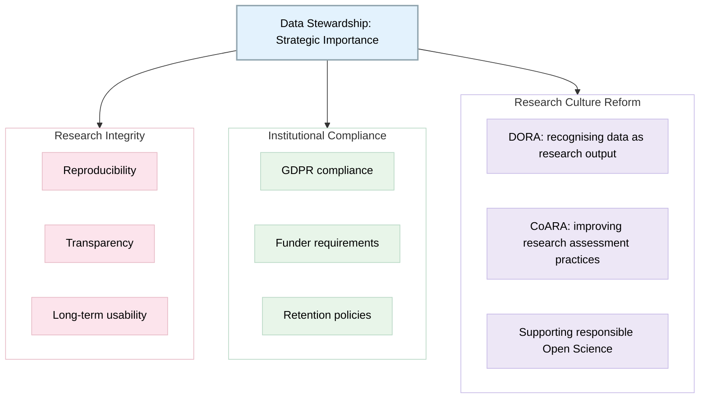

> The following resources informed the development of this guide:
>
> - [UCL Research Data Management ÔÇô Archiving & Preservation](https://www.ucl.ac.uk/library/open-science-research-support/research-data-management/best-practices/how-guides/archiving)
> - [University of Cambridge ÔÇô Preservation and Archiving](https://www.data.cam.ac.uk/organising-storing/preservation-and-archiving)
> - [ICFA ÔÇô Recommendations for Best Practices for Data Preservation and Open Science in HEP](https://arxiv.org/abs/2508.18892)
>
  
*A guide for Data Stewards and Librarians*

## Role of Data Stewards in Archiving and Preservation

A **data steward** is a specialist who supports the responsible management of data throughout the research lifecycle. Data stewards work with researchers, institutions, IT services, repositories, and governance teams to ensure that **research data are managed in accordance with legal, ethical, technical, and disciplinary requirements**. They play an important role in embedding good data management practices and promoting FAIR data principles. 

**Source:** EOSC CZ ÔÇô Data Stewards Community: https://www.eosc.cz/en/communities/data-stewards

Data stewards and librarians support researchers in ensuring that research data are:

- **Findable, accessible, interpretable**, and **reusable** over time  
- Securely stored and responsibly managed  
- Legally and ethically compliant  
- Preserved in trusted repositories for long-term value  

You are not enforcing complianceÔÇöyou are **enabling good research practice by translating policy into action**.

The role of a data steward may include:

- Advising on Data Management Plans (DMPs);
- Supporting compliance with legal, ethical, and regulatory requirements;
- Promoting FAIR (Findable, Accessible, Interoperable, and Reusable) data practices;
- Assisting with metadata creation and documentation;
- Supporting repository selection and data publication;
- Advising on data preservation and archiving;
- Delivering training and guidance on research data management;
- Helping researchers identify appropriate standards and best practices. 

### What this looks like in practice

| Scenario | Role of data steward |
|----------|---------------------|
| Researcher unsure where to deposit data | Recommend appropriate repository |
| Researcher concerned about GDPR | Explain lawful basis + safeguards |
| End-of-project data overload | Support appraisal and selection |
| Lack of storage strategy | Advise on backup and storage |

### The Role of Research Librarians

Research librarians have long played a central role in supporting research practices and increasingly contribute to research data management activities. Their expertise in information organisation, metadata, preservation, scholarly communication, and digital curation makes them valuable partners in supporting open and reproducible research.

Research librarians commonly assist researchers with:

- Locating appropriate repositories for sharing data;
- Applying metadata standards;
- Understanding copyright, licensing, and data sharing requirements;
- Developing Data Management Plans;
- Depositing research outputs in institutional repositories;
- Supporting persistent identifier systems such as DOIs and ORCID iDs;
- Delivering training in research data management, open research, and digital scholarship. 

[See A day in the life of a UCL Research Data Steward](https://elixiruknode.org/blog/2025/a-day-in-the-life-of-a-ucl-research-data-steward/); [Building the Data Steward Profession at UCL
](https://journals.ed.ac.uk/eor/article/view/9658)and [Recommendations for Data Stewardship Skills, Training and Curricula](https://zenodo.org/records/10573892)

Data stewards and librarians enable responsible research data preservation by:

- Translating policy into practice  
- Supporting researchers across the lifecycle  
- Ensuring legal and ethical compliance  
- Making data reusable and discoverable long-term  

## Supporting the Research Lifecycle

### A. Early Stage (Planning / Funding)

**Your role:**
- Support Data Management Plans (DMPs)
- Identify repository options
- Clarify retention periods and funder requirements
- Help estimate costs for storage and archiving

**Example interaction:**

> Researcher: ÔÇ£We donÔÇÖt know where to store our data yet.ÔÇØ

**Response:**
> ÔÇ£At this stage, itÔÇÖs useful to identify a suitable repository for your Data Management Plan. Depending on your discipline and funder, we can explore institutional, disciplinary, or generalist repositories together.ÔÇØ

### B. Active Research Stage

**Your role:**
- Advise on file organisation and naming conventions
- Promote secure storage and backup practices
- Support metadata creation and documentation
- Encourage version control where relevant

**Example interaction:**

> Researcher: ÔÇ£WeÔÇÖre just saving everything on laptops.ÔÇØ

**Response:**
> ÔÇ£ThatÔÇÖs fine for working files, but you should also have backups in place. Ideally, data should be stored in at least two locations, such as secure university storage and a cloud or server system.ÔÇØ

### C. End of Project (Archiving Stage)

**Your role:**
- Support data appraisal (what to keep or discard)
- Assist with repository deposit
- Ensure metadata and documentation are complete
- Define access conditions (open/restricted)

**Example interaction:**

> Researcher: ÔÇ£We donÔÇÖt have time to prepare data for archiving.ÔÇØ

**Response:**
> ÔÇ£We can prioritise the essential componentsÔÇötypically anonymised datasets, documentation, and key outputs. I can help you identify the minimum required set for deposit.ÔÇØ

## GDPR and Legal Compliance

### Key principle
GDPR does NOT prevent archiving. It enables it under research conditions.

Permitted purposes include:
- Scientific or historical research  
- Statistical purposes  
- Archiving in the public interest  

### Common misconception

ÔÇ£We must delete data after the project.ÔÇØ  
ÔÇ£Data can be retained long-term if properly justified and safeguarded.ÔÇØ

### Required safeguards

- Anonymisation or pseudonymisation  
- Access controls (restricted or mediated access)  
- Encryption (storage and transfer)  
- Ethics approval alignment  
- Retention justification and documentation  

### Example interaction

> Researcher: ÔÇ£We canÔÇÖt archive interviews because they contain personal data.ÔÇØ

**Response:**
> ÔÇ£You can still archive them using safeguards. For example, anonymised transcripts can be deposited in a controlled-access repository where access is managed rather than fully open.ÔÇØ

## Repository Selection Guidance

### Repository types

| Type | When to use | Example |
|------|-------------|---------|
| Institutional | Default option | University repository |
| Disciplinary / National | Field-specific requirement | UK Data Service |
| Generalist | No specialist option | Zenodo, Figshare |

### Example interaction

> Researcher: ÔÇ£Where should we deposit our data?ÔÇØ

**Response:**
> ÔÇ£It depends on your discipline and funder requirements. For example, social science data may go to UK Data Service, while other datasets may be better suited to institutional or generalist repositories.ÔÇØ

## Preservation and Good Practice

### Key preservation actions

- Use open, non-proprietary formats (CSV, TXT, PDF/A)
- Create documentation (README files, codebooks, metadata)
- Apply consistent file naming conventions
- Use version control where appropriate
- Maintain multiple backups (3-2-1 principle)
- Plan for long-term accessibility and software obsolescence

### Example interaction

> Researcher: ÔÇ£We donÔÇÖt have documentation for our dataset.ÔÇØ

**Response:**
> ÔÇ£For archiving, weÔÇÖll need basic documentation so the data can be understood later. A simple README file explaining the structure, variables, and methodology is usually sufficient.ÔÇØ

## Retention and Archival Value

Not all data must be preserved indefinitely. Decisions should be:

- Purpose-driven  
- Justified  
- Documented  

### Typical retention period
- Minimum: 5ÔÇô10 years (varies by funder/institution)  
- Some datasets may require longer or indefinite preservation  

### Example interaction

> Researcher: ÔÇ£Do we need to keep everything forever?ÔÇØ

**Response:**
> ÔÇ£No. Only data with long-term scientific, legal, or societal value need to be preserved. I can help you decide what should be retained for archiving.ÔÇØ

## Infrastructure and Preservation Systems

Data stewards help researchers understand:

- Repository preservation guarantees  
- Backup and disaster recovery systems  
- Persistent identifiers (e.g., DOIs)  
- Access control models (open, restricted, mediated)  
- Differences between storage vs preservation  

### Example interaction

> Researcher: ÔÇ£If we upload data to a repository, is it safe forever?ÔÇØ

**Response:**
> ÔÇ£Repositories are designed for long-term preservation, including backups and migration planning. However, the data still needs to be properly prepared and documented to remain usable over time.ÔÇØ

## Common Researcher Questions 

### Q1: Is data sharing mandatory?
> ÔÇ£It depends on your funder and institution, but data should generally be shared where possible or made available under controlled access if sensitive.ÔÇØ

### Q2: What if our data is sensitive?
> ÔÇ£Sensitive data can still be archived using anonymisation, restricted access, or mediated access repositories.ÔÇØ

### Q3: We donÔÇÖt have time to prepare data.
> ÔÇ£We can prioritise the essential datasets and documentation needed for deposit to make the process manageable.ÔÇØ

### Q4: Why is metadata necessary?
> ÔÇ£Metadata ensures your data can be understood and reused in the future. Without it, datasets may become unusable even if preserved.ÔÇØ

### Q5: Can we just use a shared drive?
> ÔÇ£Shared drives are suitable for active work, but they do not provide long-term preservation or discovery functions. Repositories are needed for that.ÔÇØ

## Legal and Policy Foundations

Research data stewardship and preservation are underpinned by a range of legal, regulatory, and policy frameworks that support the responsible management, retention, and reuse of research data. These frameworks recognise the value of research data as a scholarly output while balancing the need for openness with the protection of individuals, organisations, and communities.

In the EU and UK, research data may be retained for scientific research, historical research, statistical purposes, or archiving in the public interest, provided that appropriate safeguards are in place. Effective data stewardship supports both compliance obligations and wider goals relating to research integrity, transparency, reproducibility, and open research.

| Area | Key Considerations |
|--------|------------------|
| **UK GDPR Research Provisions** | Supports the retention and use of personal data for scientific research, historical research, statistical purposes, and archiving in the public interest, subject to appropriate safeguards. |
| **Archiving and Preservation** | Long-term retention is appropriate where data have continuing scientific, societal, cultural, historical, or policy value and are actively managed throughout their lifecycle. |
| **Research Integrity** | Good data stewardship supports transparency, reproducibility, accountability, and the long-term usability of research outputs. |
| **Institutional Compliance** | Supports compliance with legal requirements, funder mandates, retention schedules, and institutional policies relating to research data management. |
| **Open Research and FAIR Data** | Encourages data to be Findable, Accessible, Interoperable, and Reusable while ensuring that ethical, legal, and security requirements are met. |
| **Research Assessment Reform** | Aligns with initiatives that recognise research data as a valuable research output and promote more responsible approaches to research assessment. |
| **Responsible Open Science** | Supports the sharing and reuse of research outputs in ways that maximise public benefit while safeguarding confidentiality, privacy, and intellectual property where required. |

### Strategic Importance

Effective data stewardship contributes to:

- **Research integrity** by supporting transparency, reproducibility, and trust in research findings.
- **Institutional compliance** through alignment with legal, ethical, and funder requirements.
- **Long-term preservation** of valuable research outputs.
- **Responsible Open Science** by balancing openness with appropriate protections.
- **Research culture reform**, including recognition of data as a significant scholarly output and the promotion of more responsible approaches to research assessment.

## Further Reading

- **Actian ÔÇô The Role of Data Stewards in Data Governance**: https://www.actian.com/blog/data-management/the-role-of-data-stewards-in-data-governance/
- **EOSC CZ ÔÇô Data Stewards Community**: https://www.eosc.cz/en/communities/data-stewards
- **OvalEdge ÔÇô Data Stewardship Guide: Roles, Responsibilities and Best Practices**: https://www.ovaledge.com/blog/data-stewardship-guide/
- **Princeton University ÔÇô Data Steward Roles and Responsibilities for Princeton**: https://cedar.princeton.edu/sites/g/files/toruqf1076/files/media/data_steward_roles_and_responsibilities_for_princeton.pdf
- **Journal of Biomedical Informatics ÔÇô Data Stewardship Roles and Competencies in Research Data Management**: https://www.sciencedirect.com/science/article/pii/S1532046423000588
- **University College London (UCL) Advanced Research Computing ÔÇô Research Data Stewardship**: https://www.ucl.ac.uk/advanced-research-computing/vacancies/research-technology-professionals/research-data-stewardship
