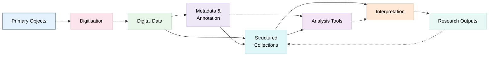
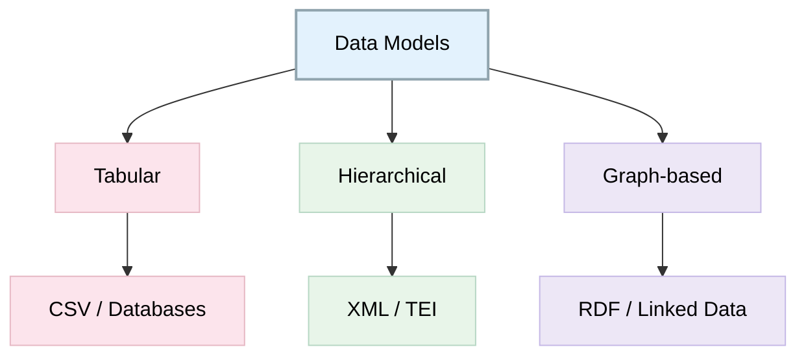
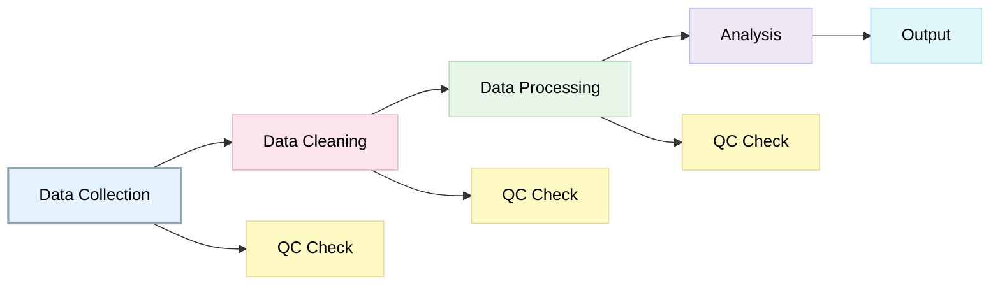

# Data Management for Digital Humanities
 
> The following resources informed the development of this guide:
>
> - [University of Reading, *Digital Humanities: Data Management Guide ' What are data?*](https://research.reading.ac.uk/digitalhumanities/resources/guides/data-management/#what-are-data)
> - [University of Texas Libraries, *Digital Humanities Research Guide: Data Management*](https://guides.lib.utexas.edu/digitalhumanities/data-management)
> - [*Digital Studies / Le champ num├®rique*, article ID 9956](https://www.digitalstudies.org/article/id/9956/)
> - [DH-Tech, *Awesome Digital Humanities ' Data Collection*](https://dh-tech.github.io/awesome-digital-humanities/#data-collection) 
> - [University of California Berkeley Library, *Digital Humanities: Data Management Guide*](https://guides.lib.berkeley.edu/dh/data)
> 

## Introduction

In Digital Humanities, data are **digital representations of cultural, historical, or scholarly objects** rather than the objects themselves.

Digital Humanities research **generates, transforms, analyses, and preserves** a diverse range of digital materials, including texts, images, audiovisual collections, databases, maps, annotations, code, and **digitised cultural heritage resources**. As a result, data management is an important element of Digital Humanities practice, supporting not only the organisation and preservation of research materials but also their interpretation, reuse, and long-term accessibility.

Unlike some disciplines where data are primarily numerical or experimental, DH data are often **heterogeneous, evolving, and deeply contextual**. Researchers may work with born-digital materials, digitised historical sources, curated datasets, computational methods, or combinations of these approaches. Consequently, effective data management requires careful consideration of documentation, provenance, preservation, and scholarly interpretation throughout the research lifecycle.


Key Concepts: 
- **Data** = information created or collected to answer research questions
- **DH data** = digital surrogates (texts, images, metadata, code)

Includes:
- Primary sources (e.g., manuscripts → digital scans)
- Secondary literature (e.g., articles → encoded text)
- Metadata and computational processes

## Rethinking Humanities Research as Data

A fundamental aspect of Digital Humanities research is recognising that research materials can be understood as data. Manuscripts, archival records, oral histories, maps, photographs, digital editions, metadata records, and cultural collections can all function as research data when they are collected, organised, analysed, or transformed within a research project.

Viewing humanities materials as data encourages researchers to think systematically about documentation, organisation, preservation, and reuse from the beginning of a project. It also highlights the importance of capturing contextual information that explains how materials were created, processed, interpreted, and analysed.

**Important Principle: Transparency**

Your **data choices** influence interpretation.

- Selection of attributes = interpretive act
- Metadata design shapes analysis
- Documentation ensures reproducibility

### DH Data Ecosystem



## Documentation and Context

Context is particularly important in Digital Humanities research. A dataset may be difficult or impossible to interpret without understanding:

- The source materials used;
- Selection and digitisation processes;
- Data transformations and cleaning activities;
- Annotation methods;
- Interpretative decisions;
- Software, tools, and workflows employed.

Researchers should therefore create documentation alongside their data, including metadata, project notes, codebooks, data dictionaries, and methodological descriptions.

## Community and Collaboration

Digital Humanities projects are often collaborative and interdisciplinary, involving researchers, archivists, librarians, technologists, heritage professionals, and community partners. Good data management supports these collaborations by establishing shared approaches to documentation, file organisation, naming conventions, version control, and data stewardship.

Researchers should consider how collaborative practices will be supported throughout the project and how knowledge will be retained beyond the involvement of individual team members.

## Managing Data Throughout the Research Lifecycle

Digital Humanities data should be actively managed throughout the project lifecycle rather than only at the point of publication or deposit. This includes:

- Organising files consistently;
- Maintaining version control;
- Recording decisions and workflows;
- Applying metadata standards;
- Managing rights and permissions;
- Planning for future preservation and reuse.

## Data Curation in Digital Humanities

Data curation refers to the ongoing management and improvement of data to ensure that they remain understandable, discoverable, and reusable over time. In the Digital Humanities context, curation may involve:

- Creating metadata;
- Maintaining documentation;
- Managing file formats;
- Recording provenance information;
- Preserving relationships between digital objects;
- Supporting future interpretation and reuse.

Data curation extends beyond technical preservation and includes maintaining the scholarly context that gives digital resources meaning.

## Sustainability and Reuse

Many Digital Humanities projects create resources with value beyond the original research objectives. Researchers should therefore consider how datasets, digital editions, collections, code, annotations, and other outputs might be reused by future researchers, students, cultural organisations, or the wider public.

To maximise reuse, researchers should:

- Use sustainable and widely supported formats;
- Create rich metadata;
- Document workflows and methodologies;
- Deposit outputs in appropriate repositories where possible;
- Clarify rights and licensing conditions.

DH data is often **complex, heterogeneous and interpretive**

Type | Description | Challenges
-- | -- | --
Scholarly editions | Critical edited texts | Versioning, authority
Text corpora | Large collections of texts | Cleaning, consistency
Text with markup | XML/TEI encoded texts | Standardisation
Thematic collections | Curated datasets | Scope definition
Annotated data | Data + interpretation | Bias transparency
Finding aids | Archival guides | Structure & accessibility


## Key Curation Principles
1. Interpretive Layering

Provide context to make data meaningful:

- Historical context
- Cultural framing
- Research interpretation

2. Data Provenance
Document:

- Collection process
- Sampling
- Cleaning and transformation

3. Scholarly Voice & Responsibility
Capture:

- Authorship
- Editorial decisions
- Debates and uncertainties

### Data Types by Structure

Type | Description | Example
-- | -- | --
Unstructured | No explicit structure | Plain text transcription
Structured | Tabular, fixed schema | CSV, databases
Semi-structured | Flexible but organized | XML, JSON, RDF

### Data Models in DH



Examples:

- XML / TEI → hierarchical textual encoding
- RDF → linked cultural heritage data
- Graph models → social networks, relationships

### Open vs Proprietary Formats

Feature | Open (CSV, XML) | Proprietary (XLS, DOCX)
-- | -- | --
Accessibility | High | Limited
Longevity | Stable | Risk of obsolescence
Transparency | High | Lower
Interoperability | Strong | Restricted

## Data Organisation: Folder Structure Example

```
project/
Ôöé
Ôö£ÔöÇÔöÇ data/
Ôöé   Ôö£ÔöÇÔöÇ raw/
Ôöé   Ôö£ÔöÇÔöÇ processed/
Ôöé   ÔööÔöÇÔöÇ metadata/
Ôöé
Ôö£ÔöÇÔöÇ analysis/
Ôö£ÔöÇÔöÇ outputs/
ÔööÔöÇÔöÇ documentation/
```

### Version control

Practice | Description
-- | --
Versioning | Track changes over time
Permissions | Restrict editing rights
Milestones | Save stable releases




## Digital Preservation Planning

Digital materials can become inaccessible due to technological change, software obsolescence, file degradation, or loss of contextual information. Researchers should therefore consider preservation requirements at the start of a project rather than viewing preservation as an activity that takes place at the end.

A personal preservation plan can help researchers identify:

- Which materials should be preserved;
- Where materials should be stored;
- Appropriate file formats;
- Backup procedures;
- Preservation responsibilities;
- Long-term access requirements.

### Preserving Scholarly Context

A distinctive feature of Digital Humanities research is that interpretation often forms part of the dataset itself. Researchers should therefore preserve not only the digital objects but also the contextual information necessary to understand them.

This may include:

- Research notes;
- Project documentation;
- Annotation schemas;
- Data models;
- Visualisation methodologies;
- Software environments;
- Collaborative workflows.

Preserving this contextual information helps future users understand how the resource was created and how it should be interpreted.


## Further Reading

- [Data Management for the Humanities – Conceptualising Humanities Research as Data](https://www.datamanagementforthehumanities.com/your-research-is-data/conceptualizing-humanities-research-as-data)
- [Data Management for the Humanities – Creating a Personal Preservation Plan](https://www.datamanagementforthehumanities.com/store-your-data-with-preservation-in-mind/creating-a-personal-preservation-plan)
- [University of Exeter – Digital Humanities: Data](https://libguides.exeter.ac.uk/digitalhumanities/data)
- [University of Exeter – Digital Humanities: Community](https://libguides.exeter.ac.uk/digitalhumanities/community)
- [eCampusOntario – What is Data Curation for Digital Humanists?](https://ecampusontario.pressbooks.pub/dataprimer/chapter/what-is-data-curation-for-digital-humanists/)
- [Institute of Historical Research – Digital Humanities Research at the Heart of the Project](https://historyandrumour.blogs.sas.ac.uk/digital-humanities-research-at-the-heart-of-the-project/)
- [Culture 2.0 – Data Management in Humanities](https://culture2point0.eu/oer/data-management-in-humanities/)
- [Maryland Institute for Technology in the Humanities (MITH) – Digital Humanities Data Curation Guide](https://archive.mith.umd.edu/dhcuration-guide/guide.dhcuration.org/glossary/intro/index.html)


