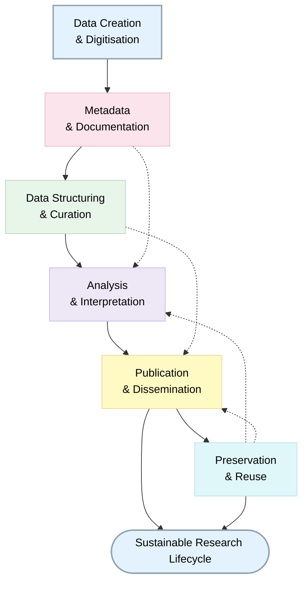
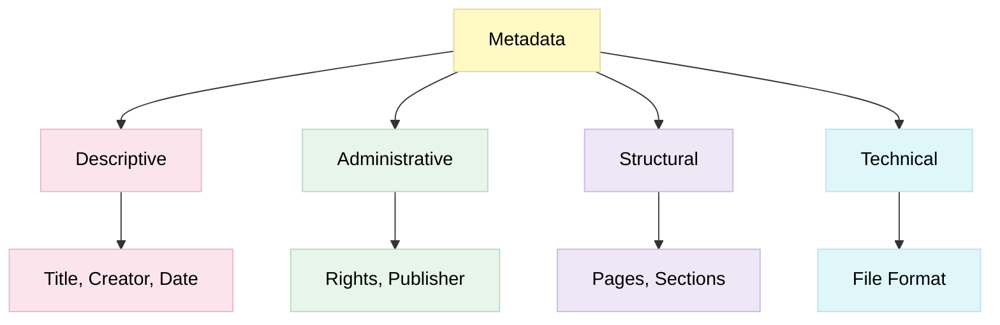
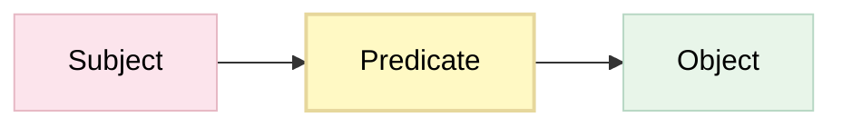

> The following resources informed the development of this guide:
> 
> - [HERMES Metadata Lesson](https://github.com/HERMES-DKZ/metadata_lesson/blob/v2025.05.06/episodes/introduction_standards.md?plain=1)  
> - [Yale University Library ÔÇô Digital Humanities Metadata Guide](https://guides.library.yale.edu/dh/metadata)
> - [Fitchburg State University ÔÇô Metadata in Digital Humanities](https://fitchburgstate.libguides.com/c.php?g=1324355&p=9748052)
> - [Beals, M. H. and Emily Bell, with contributions by Ryan Cordell *et al.* *The Atlas of Digitised Newspapers and Metadata: Reports from Oceanic Exchanges*. Loughborough, 2020](https://doi.org/10.6084/m9.figshare.11560059)
>

## Metadata in the Digital Humanities
This guide introduces the role, structure, and application of metadata in Digital Humanities (DH) research. It draws upon established practices from library science, archival studies, and digital scholarship to provide a conceptual and practical framework for managing metadata in cultural datasets.

**Source:** Digital Scriptorium ÔÇô Data Model - https://digital-scriptorium.org/help/data-model/

## Why Metadata Matters

Metadata is often described as ÔÇ£data about dataÔÇØ, but in Digital Humanities it is more appropriately understood as the infrastructure that enables **discovery, interpretation, and reuse.**

To illustrate, consider a collection of field recordings documenting regional dialects. 

Without metadata describing:

 - the **geographical location** of each recording
 - the **date and conditions** of capture
 - speaker **demographics**
 - **linguistic** features
 - **licensing and reuse** conditions

the recordings become **significantly less valuable** for research. 

Metadata transforms isolated digital objects into scholarly resources.

**Key Insight**

> Metadata is not supplementary; it is foundational to meaning-making and scholarly interpretation.

## Metadata in the DH Research Lifecycle

Metadata operates throughout the lifecycle of a digital humanities project, shaping how data is structured, analysed, and shared.

At each stage, metadata supports **accessibility, transparency, and interoperability.**

### Types of Metadata

Metadata serves different purposes depending on its function within a dataset. 

A common categorisation includes:

Type | Description | Example
-- | -- | --
Descriptive | Supports discovery and identification | Title, creator, subject
Administrative | Supports management and rights | Licensing, ownership
Structural | Describes relationships within data | Page order in a manuscript
Technical | Documents file properties | File format, size, encoding

Example Structure

This layered structure reflects the multi-dimensional nature of humanities data, where meaning depends on context as much as content.

## Metadata Standards, Schemas, and Models

The terms **standard, schema,** and **model** are often used interchangeably, yet they refer to distinct aspects of metadata design. While definitions vary across disciplines, the following distinctions are useful in practice.

### Metadata Standards

A metadata standard defines the rules for how metadata should be recorded and structured.

It may specify:

- names of elements (e.g. creator, title)
- attributes (e.g. data type, format)
- organisational groupings (e.g. administrative vs descriptive metadata)

Standards ensure consistency and interoperability, particularly across institutions.

Example

Group | Elements
-- | --
Administrative | Publisher, Rights
Descriptive | Creator, Title, Date
Structural | Pages
Technical | File format

### Metadata Schemas

A metadata schema provides a structured framework for applying metadata within a particular context.

**Schemas:**

- organise metadata elements
- define relationships between them
- adapt standards to specific research needs

Example (Interpretive Context)
If describing a photograph of a building:

- creator could refer to the photographer
- or to the architect

A schema resolves this ambiguity by:

- adding roles (e.g. creator: photographer, creator: architect)
- structuring separate entities (image vs building)

Thus, schemas provide contextual clarity and semantic precision.

### Conceptual Models
A **conceptual model** represents data at a more abstract level, focusing on relationships between entities.

These models are commonly used in:

- Semantic Web technologies
- Linked Open Data (LOD)
- Knowledge graphs

### The Triple Model

Conceptual models often use triples, consisting of:

This structure supports:

- flexible linking across datasets
- integration with external resources (e.g. Wikidata)
- rich, interconnected knowledge systems

## Common Metadata Standards in Digital Humanities

Several metadata standards are widely used within Digital Humanities research to support the description, discovery, management, preservation, and reuse of digital resources. The choice of standard will depend on the type of material being managed, such as texts, archives, manuscripts, cultural heritage collections, images, or social science datasets.

| Standard | Purpose | Typical Use in Digital Humanities | Link |
|-----------|---------|----------------------------------|------|
| **Dublin Core** | General-purpose descriptive metadata standard. | Describing digital collections, repositories, research outputs, and cultural heritage materials. | https://www.dublincore.org/ |
| **MODS (Metadata Object Description Schema)** | Rich bibliographic metadata standard developed by the Library of Congress. | Digital libraries, manuscripts, books, archival collections, and scholarly editions. | https://www.loc.gov/standards/mods/ |
| **TEI (Text Encoding Initiative)** | Standard for encoding and describing digital texts. | Digital editions, literary texts, manuscripts, linguistic corpora, and humanities scholarship. | https://tei-c.org/ |
| **EAD (Encoded Archival Description)** | XML standard for describing archival collections and finding aids. | Archives, special collections, manuscript repositories, and cultural heritage collections. | https://www.loc.gov/ead/ |
| **VRA Core** | Metadata standard for describing works of visual culture and their images. | Art history, museum collections, architecture, visual resources, and cultural heritage projects. | https://www.loc.gov/standards/vracore/ |
| **DDI (Data Documentation Initiative)** | International standard for documenting research data across the research lifecycle. | Social sciences, oral history projects, surveys, interviews, and mixed-methods humanities research. | https://ddialliance.org/ |
| **MIDAS Heritage** | UK cultural heritage recording standard. | Archaeology, historic buildings, monuments, heritage inventories, and conservation projects. | https://www.heritage-standards.org.uk/midas-heritage/ |
| **CARARE Metadata Schema** | Heritage-focused application profile based on MIDAS Heritage. | Aggregation and sharing of archaeological and cultural heritage resources. | https://pro.carare.eu/en/introduction-to-carare-2/ |
| **OAI-ORE (Open Archives Initiative Object Reuse and Exchange)** | Framework for describing and exchanging aggregations of digital resources. | Digital collections, repositories, and linked cultural heritage resources. | https://www.openarchives.org/ore/ |
| **QuDEx (Qualitative Data Exchange Format)** | Standard for exchanging qualitative research data. | Oral history, ethnography, interviews, and qualitative humanities datasets. | https://qudex.org/ |
| **SDMX (Statistical Data and Metadata Exchange)** | Standard for the exchange of statistical data and metadata. | Digital humanities projects involving quantitative historical, demographic, or economic data. | https://sdmx.org/ |

### Selecting an Appropriate Standard

Researchers should select metadata standards that align with the nature of their materials, disciplinary community, and intended users. In many Digital Humanities projects, multiple standards may be used together. For example:

- **TEI** for encoding a manuscript or historical text;
- **Dublin Core** or **MODS** for repository metadata;
- **EAD** for describing related archival collections;
- **VRA Core** for associated visual materials.

Using established standards improves interoperability, enhances discoverability, supports long-term preservation, and facilitates the reuse of Digital Humanities resources by other researchers and institutions.

