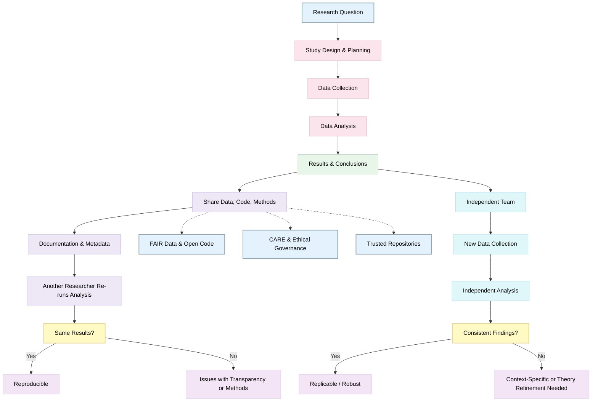

# Reproducibility and Replicability in Open-Science
 
> The following resources informed the development of this guide:
> - [Royal Society – *Open science interventions to improve reproducibility*](https://royalsocietypublishing.org/rsos/article/12/4/242057/235595/Open-science-interventions-to-improve)
> - [Nature – *Scientific article on reproducibility and research reliability*](https://www.nature.com/articles/s41586-026-10203-5)
> - [University of Exeter, Institute for Data Science and Artificial Intelligence – *Reproducibility and Open Science*](https://www.exeter.ac.uk/research/institutes/idsai/research/reproducibilityandopenscience/)
> - [PLOS Blogs – *Reproducibility in Scientific Research*](https://theplosblog.plos.org/2022/07/reproducibility/)
> - [University of Cambridge – *Open Research: Data and Reproducibility*](https://www.openresearch.cam.ac.uk/data/reproducibility)
> - [Open Science Training Handbook – *Reproducible Research and Data Analysis*](https://open-science-training-handbook.gitbook.io/book/02opensciencebasics/04reproducibleresearchanddataanalysis)
> - [National Center for Biotechnology Information (NCBI) – *Research Reproducibility and Transparency*](https://www.ncbi.nlm.nih.gov/books/NBK547546/)
> - [University of Surrey Library – *Open Research: Reproducibility*](https://www.surrey.ac.uk/library/open-research/reproducibility)
> - [Understanding Replications and Reproductions](https://forrt.org/replication-handbook/understanding.html) 

## Purpose of this guide

This practical guide is designed for researchers, educators, and research support professionals who want to **embed reproducibility and replicability into day-to-day research practice**, in line with **open science**, **FAIR, CARE and TRUST principles**, and responsible **data anonymisation**. 

It is discipline-agnostic and focuses on **actionable steps**, **worked examples**, and alignment with **responsible research assessment frameworks**.

The guide draws on established open science and reproducibility guidance from the Royal Society, Nature, PLOS, Cambridge, Surrey, Exeter, the National Academies (NCBI), and the Open Science Training Handbook, and is explicitly aligned with **DORA** and **CoARA**.

*Source: UK Council of Open Research and Repositories (UKCORR). *Open access is not enough: reproducible science, research and scholarship* (02 December 2020). https://www.ukcorr.org/2020/12/02/open-access-is-not-enough-reproducible-science-research-and-scholarship/*

## Core concepts: reproducibility vs replicability in Open Science

- Reproducibility focuses on transparency within the original study: data, code, methods, and documentation that allow others to verify the results.
- Replicability focuses on robustness across studies: independent teams collecting new data to test the same research question.
- Open science practices (open data, open code, FAIR/CARE, trusted repositories) enable both.

| Concept | Definition | Example | Key Idea |
|----------|------------|---------------|-----------|
| **Reproducibility** | Obtaining the same results using the same data, code, and computational steps under identical conditions. | A quantitative study publishes: (1) cleaned dataset in a repository, (2) statistical scripts used for all analyses, (3) a README detailing software versions and assumptions. Another researcher reruns the scripts and obtains the same coefficients and figures. | Focuses on **transparency and verifiability** of the original analysis. |
| **Replicability** | Obtaining consistent results across independent studies that collect new data but address the same research question. | A lab experiment is repeated by a different research group using a new sample but the same design and analytical approach. Similar effects are observed within expected uncertainty. | Focuses on **robustness and generalisability** across studies. |

Both are essential to high-quality, trustworthy science.

## Why reproducibility and replicability matter in open science

Improving reproducibility and replicability:

- Increases **research integrity and trust**
- Enables **reuse, validation, and synthesis** of research outputs
- Reduces research waste and duplication
- Strengthens evidence used in policy and practice
- Supports **responsible research assessment** by rewarding quality and openness rather than venue-based prestige

Open science provides the culture, infrastructure, and incentives required to make these practices routine.

## Practical actions across the research lifecycle (with examples)

| Stage | Practice | What to Do | Example |
|-------|----------|-------------|---------|
| **1. Design and Planning** | Preregister study plans (where appropriate) | Document hypotheses, methods, and analysis plans before data collection; clearly distinguish exploratory analyses | A psychology researcher preregisters primary outcomes and analysis criteria. Exploratory analyses are labelled transparently in the final paper, showing which findings were pre-planned vs post hoc. |
| **2. Design and Planning** | Design for reproducibility | Use scripted workflows (e.g. R, Python, Stata do-files); avoid undocumented manual spreadsheet transformations | A public health researcher replaces manual Excel cleaning with a reproducible Python script. Later fixes are tracked through version control, improving transparency and reliability. |
| **3. Design and Planning** | Power and transparency considerations | Justify sample sizes; record inclusion and exclusion criteria | A mixed-methods study explains why the quantitative sample is small but theoretically justified, avoiding over-generalisation. |
| **4. Data Collection and Management** | Structured data management practices | Separate raw, processed, and analysis-ready data; apply consistent naming conventions | A team stores raw interview transcripts securely, shares coded extracts with versioning, and documents the qualitative workflow while protecting participant confidentiality. |
| **5. Data Collection and Management** | High-quality documentation | Produce data dictionaries, codebooks, and README files | A dataset includes variable "x3"; the codebook clarifies it is a reverse-scored wellbeing scale, preventing misinterpretation. |

## FAIR, CARE and TRUST principles in practice

| Framework | Focus | How It Supports Reproducibility | Example |
|----------|------|----------------------------------|----------|
| **FAIR Principles (Findable, Accessible, Interoperable, Reusable)** | Technical accessibility and reuse of data | FAIR principles support technical reproducibility by ensuring data can be located, accessed, and reused with minimal barriers over time | A dataset deposited with a DOI, open licence, and standard metadata can be discovered and reused years later, enabling future researchers to reproduce and verify earlier analyses. |
| **CARE Principles (Collective Benefit, Authority to Control, Responsibility, Ethics)** | People, communities, and data governance | CARE ensures that reproducibility is ethically grounded and socially responsible, balancing transparency with rights and power of communities | Research with an Indigenous community makes metadata public but restricts data reuse to approved purposes, respecting community governance while maintaining methodological transparency. |
| **TRUST Principles (Transparency, Responsibility, User Focus, Sustainability, Technology)** | Reliability and long-term stewardship of repositories | TRUST ensures that reproducible research outputs remain accessible, secure, and preserved over time through robust repository infrastructure | A researcher deposits data in a certified institutional or disciplinary repository with long-term preservation policies instead of a personal website, ensuring durability and continued access. |

### Types of reproduction  

Before conducting a replication, reproduction should be assessed by attempting to recreate the original results. This helps identify errors, inconsistencies, or limited robustness. When possible, numerical reproductions and robustness checks should be performed; otherwise, analyses must be reconstructed from the report, or statistical inconsistencies screened using automated tools. Replication efforts should generally begin with close replications before moving to broader, theory-oriented extensions. See [Planning and Conducting Reproductions and Replications - Handbook for Reproduction and Replication Studies](https://forrt.org/replication-handbook/).

| Type | Description | Goals |
|--------|-------------|---------|
| **Computational Reproduction** | Reanalysis of the same data using the original code and workflow. | Verify the correctness of the original report. |
| **Recoding Reproduction** | Reanalysis of the same data using newly written but equivalent code. | Confirm the accuracy of findings independently of the original implementation. |
| **Robustness Reproduction** | Reanalysis of the same data using alternative coding choices, analytical decisions, or software. | Assess the robustness of findings and their sensitivity to methodological choices. |
| **Multiverse Analysis** | Analysis of data using a wide range of defensible analytical approaches. | Evaluate robustness, identify analytical contingencies, and explore potential sources of effect variability. |
| **Internal Replication** | Replication of one's own study as closely as possible. | Demonstrate the reliability and generalizability of findings and reduce the likelihood of false positives. |
| **Close (Direct/Exact) Replication** | Conduct a new study based on previous work using procedures as close as possible to the original. | Test whether the original finding was genuine and assess generalizability across contexts and populations. |
| **Close Replication with Extension** | Direct replication that introduces an additional variable, measure, or procedure. | Confirm the original finding while exploring its broader applicability or boundary conditions. |
| **Conceptual (Constructive) Replication** | Test the same hypothesis using theoretically relevant modifications, such as alternative operationalizations or measures. | Evaluate the validity of underlying theories and the generalizability of findings across contexts. |

### Why anonymisation matters

Open and reproducible research must not compromise:

- Participant privacy
- Confidentiality obligations
- Legal and ethical frameworks (e.g. GDPR)

Anonymisation should protect participants **while preserving analytical value**.

See guide on [Data Anonymisation and De-identification in Research](https://github.com/javieraatenas-pixel/testOSC/wiki/5.1--Data-Anonymisation-and-De%E2%80%90identification-in-Research)

### Practical anonymisation strategies (with examples)

**1. Assess disclosure risk**: Example: A dataset may appear anonymised but becomes identifiable when small geographic areas and rare roles are combined.

**2. Apply proportionate techniques**: Example: Age is shared in bands rather than exact values, maintaining analytical utility while reducing risk.

**3. Preserve reproducibility without full openness**: Example: When qualitative data cannot be shared openly, researchers provide:

- Detailed methodological documentation
- Analysis code
- Synthetic or illustrative data

This enables scrutiny of methods even when raw data remain restricted.

## Reproducibility-enabling outputs and contributions

Outputs that support reproducibility and should be valued:

- Datasets with rich metadata
- Reusable analytical code
- Protocols and preregistrations
- Replication studies
- Null and negative findings

These should be recognised as **first-class research contributions**.

## Alignment with DORA and CoARA

DORA calls for assessment based on the **intrinsic quality and openness of research**, not journal-based metrics. Reproducibility-aligned practices that support DORA:

- Sharing data, code, and methods
- Publishing replication and validation studies
- Valuing transparency, rigour, and reuse

**Practical implication**

Researchers are assessed on *how* research was conducted and *how useful it is to others*, not where it was published.

CoARA promotes rewarding **responsible research practices and diverse outputs**. Reproducibility supports CoARA by:

- Recognising datasets, software, protocols, and infrastructure
- Valuing collaboration and community benefit
- Encouraging qualitative judgement over proxy metrics

**Practical implication**

A well-documented dataset enabling multiple replications may be recognised as highly impactful without a high-impact-factor articles

## Common barriers and practical responses

| Barrier | Responsible response |
|--------|----------------------|
| Time pressure | Build reproducibility into workflows from the start |
| Fear of scrutiny | Treat openness as quality assurance |
| Sensitive data | Use controlled access rather than default closure |
| Misaligned incentives | Use DORA- and CoARA-aligned narratives in CVs and reviews |

## Practical checklist

Before sharing or publication, ask:

- Can another researcher understand and rerun my analysis?
- Are assumptions and limitations explicit?
- Have FAIR and CARE both been applied appropriately?
- Do outputs support reuse beyond citation counts?
- Can contributions be fairly assessed under DORA and CoARA?

