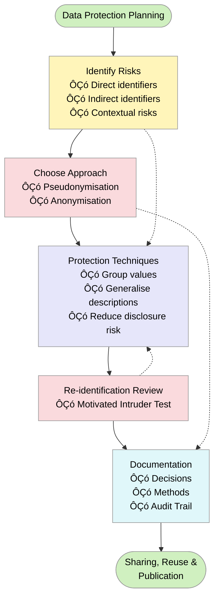
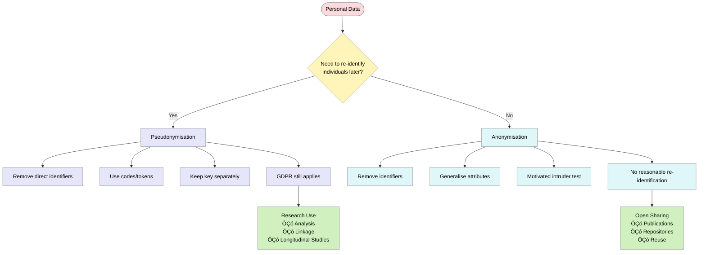

_A guide for Early Career Researchers (ECRs)_

> The following resources informed the development of this guide:
>
> - [University College London (UCL) ÔÇô *Practical Data Protection Guidance: Anonymisation and Pseudonymisation*](https://www.ucl.ac.uk/data-protection/guidance-staff-students-and-researchers/practical-data-protection-guidance-notices/anonymisation-and)
> - [Data Protection Commission (Ireland) ÔÇô *Anonymisation and Pseudonymisation Guidance*](https://www.dataprotection.ie/en/dpc-guidance/anonymisation-pseudonymisation)
> - [UK Information CommissionerÔÇÖs Office (ICO) ÔÇô *Introduction to Anonymisation*](https://ico.org.uk/for-organisations/uk-gdpr-guidance-and-resources/data-sharing/anonymisation/introduction-to-anonymisation/)
>

## Introduction

This guide supports **Early Career Researchers (ECRs)** across roles and disciplines, including Doctoral Researchers, Postdoctoral Researchers, Research Fellows, Research Assistants, teaching-and-research staff, and fixed-term or contract researchers.

ECRs often have day-to-day responsibility for collecting, cleaning, analysing, storing, and sharing research dataÔÇöeven when senior colleagues act as principal investigators. This guide translates legal and regulatory requirements into **practical research decisions** you can make confidently across the research lifecycle.

## Why This Matters for Early Career Researchers

For ECRs, anonymisation and de-identification are not just compliance requirements. They directly affect your ability to:

- Share data openly to support **open science and reproducibility**
- Publish findings without risking identification
- Reuse data across projects and collaborations
- Meet funder, journal, and institutional expectations
- Protect participants and maintain trust

In practice, anonymisation decisions are often made during data cleaning, analysis, or archivingÔÇösometimes close to publication deadlines or contract end dates. Planning anonymisation early reduces risk and lastÔÇæminute pressure.

## Core Concepts You Must Understand

| Concept | Definition | Key Characteristics | Examples / Notes |
|--------|------------|---------------------|------------------|
| **Personal Data** | Any information relating to an identified or identifiable living individual. | - Includes direct and indirect identifiers    - Identifiability depends on context    - Combinations of variables may identify individuals | Names, email addresses, IDs, demographic data, employment details, location or timestamps |
| **Anonymous Information** | Data where individuals are not identifiable, even when combined with other reasonably available information. | - Falls outside UK GDPR    - Can usually be shared as open data    - Minimal risk to individuals | Enables publication, reuse, and citation, especially relevant for ECRs |
| **Anonymisation (Irreversible)** | Process of transforming personal data so identification is no longer reasonably possible. | - Irreversible    - No recovery of identifiers    - Very low re-identification risk    - Can typically be treated as open data | Qualitative example: remove names, generalise roles, remove institutions, paraphrase quotes |
| **Pseudonymisation / De-identification (Reversible)** | Replacing identifying information with codes or tokens while keeping a separate key. | - Reversible if key exists    - Reduces risk but remains personal data    - GDPR still applies | Used for longitudinal studies, dataset linking, secure collaboration |

## Anonymisation vs Pseudonymisation in Everyday Research

ECRs commonly move through three data states:

1. Raw identifiable data (collection)  
2. Pseudonymised data (analysis)  
3. Anonymised outputs (publication and sharing)  

A frequent risk occurs when stageÔÇæ2 data is mistakenly treated as stageÔÇæ3 data.

### Summary Comparison

| Aspect | Anonymisation | Pseudonymisation |
|------|---------------|------------------|
| Re-identification | Extremely unlikely | Possible with key |
| GDPR applies | No | Yes |
| Typical use | Open data, publications | Analysis, linkage |
| Reversible | No | Yes |

**Rule of thumb:**

- Use pseudonymisation during analysis  
- Aim for anonymisation before sharing or publishing  

## Step-by-Step Anonymisation Workflow

### Step 1: Map Your Data in Context

Beyond listing variables, consider:

- Which variables could identify someone *together*?  
- Is the sample small, elite, or specialised?  
- Would someone outside the project recognise a participant?  

**Example:**

> A postdoctoral researcher realises that job role + department + years of experience uniquely identifies individuals in a small faculty survey.

### Step 2: Match Protection to the Research Task

- **Active analysis or validation:** Pseudonymisation is often appropriate  
- **Publication, repositories, teaching datasets:** Anonymisation is usually required  

Deciding this early prevents re-doing analyses later.

### Step 3: Apply Techniques Proportionately

Aim for **risk-aware minimisation**, not maximal deletion.

**Quantitative example:**

> Replace exact ages (41, 42, 43) with bands (40ÔÇô44)

**Qualitative example:**

> Replace ÔÇ£head of neurosurgery at X HospitalÔÇØ with ÔÇ£senior clinical leadÔÇØ

### Step 4: Use the Motivated Intruder Test

Ask:

> Could a reasonably skilled person, using public or widely available information, re-identify someone?

If yes, strengthen anonymisation. This is especially relevant for ECRs working with niche or high-profile populations.

### Step 5: Document Your Decisions

Good documentation supports:

- Ethics amendments  
- Journal data availability statements  
- Funder audits  
- Project handovers and staff turnover  

Think of documentation as protecting both participants **and your future self**.

### Step 6: Prepare Data for Sharing and Reuse

ECRs often anonymise data at key career transition points:

- Paper submission  
- Doctoral completion  
- Contract end  
- Project handover  

Good anonymisation ensures datasets remain usable beyond your involvement.

## Discipline-Specific Examples

| Context | Key Practices | Purpose / Outcome |
|--------|-------------|------------------|
| **Qualitative Social Research** | - Generalise or remove place names   - Paraphrase distinctive quotations   - Avoid unnecessary biographical detail | Enables teaching datasets and supports methodological transparency |
| **Education and Training Research** | - Aggregate small cohorts   - Suppress low-frequency categories   - Replace course titles with subject areas | Enables open datasets without exposing individual learners |
| **Environmental and Field Research** | - Coarsen geographic precision   - Blur timestamps   - Protect sensitive or vulnerable locations | Enables reuse while meeting ethical and environmental obligations |

## Responsible Data Practice and Anonymisation for Early Career Researchers

Even when you are not the formal data controller, you remain responsible for how research data are handled in practice. Many data breaches arise from routine activities such as managing spreadsheets, naming files, drafting manuscripts, or preparing supplementary materials. A clear understanding of anonymisation is therefore essential for both legal compliance and professional integrity.

Common pitfalls include treating pseudonymised data as anonymous, leaving identifiers in qualitative excerpts, embedding personal information in file names, or retaining unnecessary levels of precision. These issues can be mitigated by reviewing data carefully and applying anonymisation in context.

Researchers should adopt a proactive approach by considering whether combinations of variables could identify individuals, aligning anonymisation with data sharing plans, and ensuring documentation is clear for future users. Anonymisation should be understood as part of research design rather than an afterthought.

Effective anonymisation enables responsible data sharing, supports open science, and enhances opportunities for reuse and citation. Support is available through institutional ethics committees, data protection teams, and research data management services.

Good anonymisation practice protects participants, strengthens research integrity, and contributes to sustainable research careers.

