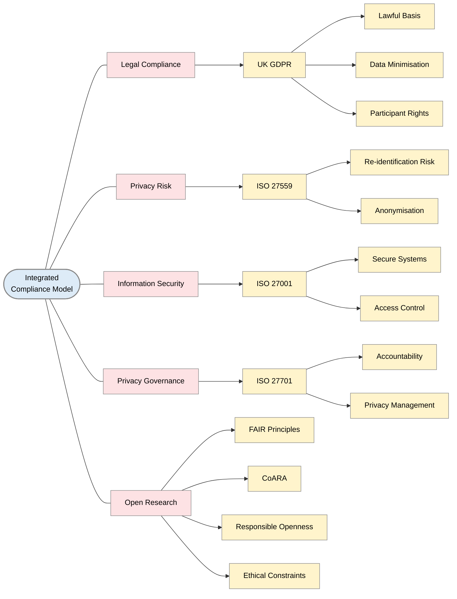

> The following resources informed the development of this guide:
> - [UK GDPR (UK General Data Protection Regulation)](https://www.legislation.gov.uk/eur/2016/679/contents)
> - [ISO/IEC 27559 ÔÇô Privacy Enhancing Data De-identification Framework](https://www.iso.org/obp/ui/en/#iso:std:iso-iec:27559:ed-1:v1:en)
> - [ISO/IEC 27001 ÔÇô Information Security Management](https://www.iso.org/isoiec-27001-information-security.html)
> - [ISO/IEC 27701 ÔÇô Privacy Information Management](https://www.iso.org/standard/27701)
> - [FAIR Principles (GO FAIR Initiative)](https://www.go-fair.org/fair-principles/)
> - [CoARA (Coalition for Advancing Research Assessment)](https://coara.eu/)
>

*A Practical Guide for Researchers*   

## Introduction

Researchers are expected to balance three overlapping responsibilities:

1. **Legal compliance (UK GDPR / Data Protection Act 2018)**
2. **Information security and privacy governance (ISO standards)**
3. **Open Science expectations (FAIR principles and CoARA)**

This is especially challenging when working with **sensitive or potentially identifiable data**, where openness must be balanced against privacy risks.

This guide translates these frameworks into a **practical, research-ready approach** for researchers.

### 1. Key frameworks in context

| Framework / Standard | Focus | Key Elements |
|---------------------|--------|--------------|
| **UK GDPR (Legal Framework)** | Governs lawful, fair, and transparent processing of personal data | Personal data includes direct and indirect identifiers Pseudonymised data remains personal data Truly anonymised data falls outside GDPR scope |
| **ISO/IEC 27559** | Risk-based anonymisation and re-identification assessment | Singling out risk (isolating individuals) Linkage risk (combining datasets) Inference risk (deducing sensitive information) Supports justification of anonymisation decisions |
| **ISO/IEC 27001** | Information security management | Access control Encryption Secure storage Audit logging Incident response |
| **ISO/IEC 27701** | Privacy information management and governance | Defines roles of data controllers and processors Supports data subject rights handling Enables privacy lifecycle management |
| **FAIR + CoARA (Open Science)** | Responsible and governed data sharing | Data should be Findable, Accessible, Interoperable, Reusable Openness should be proportionate and ethically governed Reproducibility encouraged where possible Ethical constraints must be recognised |

This diagram outlines best practices for anonymising Data according UK GDPR Compliance, and Open Science following ISO 27559, 27001, 27701 + FAIR + CoARA principles

### 2. Core principle: anonymisation is risk-based

Across UK GDPR and ISO 27559:

> Anonymisation is not a binary state, but a **context-dependent reduction of re-identification risk**.

Risk depends on:
- available external datasets
- data uniqueness
- technological capability (e.g. AI linkage)
- time (risk evolves)

### 3. Data classification (UK GDPR foundation)

Types of data

| Type | GDPR applies? | Description |
|------|--------------|-------------|
| Personal data | Yes | Identifiable individuals |
| Pseudonymised data | Yes | Reversible coding applied |
| Anonymised data | No | No reasonable identification risk |

Important: Pseudonymisation Ôëá anonymisation

#### 4. ISO 27559 anonymisation workflow (practical steps)

| Step | Focus | Key Actions |
|------|------|-------------|
| **Step 1: Define research context** | Understand how data will be used and by whom | Identify users of the data   Define purpose of use   Assess likelihood of re-identification attempts   Consider availability of external datasets |
| **Step 2: Identify sensitive variables** | Classify types of data and identifiers | Direct identifiers (e.g. names, IDs)   Indirect identifiers (e.g. postcode, age, job)   Quasi-identifiers (combinations of variables)   Sensitive attributes (e.g. health, income, behaviour) |
| **Step 3: Assess re-identification risk** | Evaluate risks based on ISO 27559 principles | Singling out (identifying individuals)   Linkability (matching datasets)   Inference (deducing sensitive attributes) |
| **Step 4: Apply anonymisation techniques** | Reduce risk using appropriate methods | Generalisation (e.g. age  band)   Suppression (remove high-risk fields)   Aggregation (group-level data)   Perturbation (add noise)   Masking (partial redaction) |
| **Step 5: Validate anonymisation** | Test effectiveness of anonymisation | Attempt internal re-identification   Test dataset uniqueness   Evaluate linkage risk   Iterate if risk remains high |
| **Step 6: Define acceptable residual risk** | Justify remaining risk | Recognise risk does not need to be zero   Justify acceptability of residual risk   Align with research purpose and ethics |
| **Step 7: Document decisions** | Ensure transparency and accountability | Record methods used   Document risk assessments   Describe transformations applied   Justify anonymisation decisions |
| **Step 8: Monitor over time** | Address evolving risks | Review impact of new datasets   Consider AI developments   Monitor external data breaches |

### 5. ISO 27001: research data security

Key requirements:

- role-based access control
- encryption (at rest and in transit)
- audit logs
- secure infrastructure
- incident response plans

### 6. ISO 27701: privacy governance

Key requirements:

- define data controller vs processor
- manage data subject rights
- document full data lifecycle
- ensure accountability structures

### 7. Open Science and responsible data sharing

The key principle

> ÔÇ£As open as possible, as closed as necessary.ÔÇØ

Open Science does NOT require unrestricted access.

## Data sharing levels

| Level | Description |
|------|------------|
| Open | Fully anonymised data |
| Controlled access | Sensitive but shareable under conditions |
| Restricted | Identifiable or high-risk data |
| Closed | Cannot be shared ethically or legally |

## FAIR principles in practice

| FAIR principle | Meaning for sensitive data |
|---------------|----------------------------|
| Findable | Metadata can still be public |
| Accessible | May be controlled, not open |
| Interoperable | Standard formats still apply |
| Reusable | Depends on governance, not openness |

## CoARA alignment

CoARA supports:

- responsible sharing rather than mandatory openness
- recognition of secure and controlled data practices
- transparency in methodological reporting
- ethical constraints in research outputs

## Guidance for Early Career Researchers (ECRs)

### 1 Common misconceptions

- **Misconception 1**: removing names is enough
> Wrong ÔÇö re-identification often occurs through combinations of variables.

- **Misconception 2**: pseudonymised = anonymised
> Wrong ÔÇö pseudonymised data is still personal data under GDPR.

- **Misconception 3**: open data is always required
> Wrong ÔÇö data must be responsibly shared, not blindly open.

### 2 What ethics committees actually expect

They expect:

- clear reasoning about identifiability risk
- documented anonymisation process (ISO 27559 aligned)
- security controls (ISO 27001)
- privacy governance clarity (ISO 27701)
- lawful basis under UK GDPR
- justified level of data sharing (FAIR + CoARA alignment)

### 3 Practical ECR workflow

- **1.** Classify early: Identify whether data is personal, pseudonymised, or anonymised.

- **2**. Assume partial identifiability: Treat datasets as potentially identifiable until proven otherwise.

- **3**. Design for multiple outputs: -open aggregated dataset - controlled access dataset - code repository (open)

- **4**. Document continuously: Record decisions, assumptions, and transformations.

### 4 Responsible openness mindset

> The goal is not maximum openness, but **maximum transparency compatible with privacy and ethics obligations**.

## Integrated compliance model

A complete research compliance approach combines:

| Framework / Standard | Focus | Key Elements |
|---------------------|--------|--------------|
| **UK GDPR** | Legal framework for personal data protection | Lawful basis   Data minimisation   Participant rights |
| **ISO 27559** | Anonymisation and privacy risk management | Re-identification risk assessment   Anonymisation justification |
| **ISO 27001** | Information security management | Secure systems   Access control |
| **ISO 27701** | Privacy information management | Privacy governance   Accountability |
| **FAIR + CoARA** | Open and responsible research practices | Responsible and proportionate openness   Reproducibility where possible   Recognition of ethical constraints |

