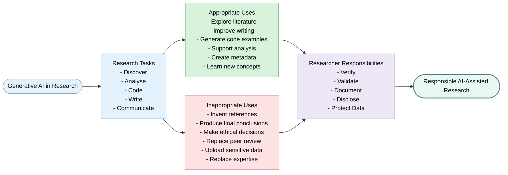
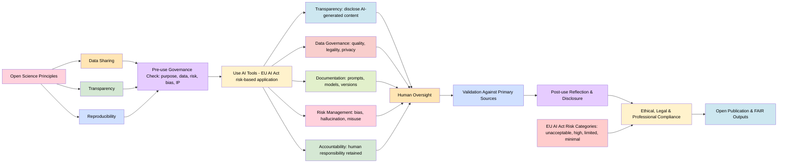

> The following resources informed the development of this guide:
> - [Guidelines on the Responsible Use of Generative AI in Research (ERA Forum News)](https://research-and-innovation.ec.europa.eu/news/all-research-and-innovation-news/guidelines-responsible-use-generative-ai-research-developed-european-research-area-forum-2024-03-20_en)
> - [The Role of Artificial Intelligence in Scientific Research (JRC143482 Report)](https://publications.jrc.ec.europa.eu/repository/handle/JRC143482)
> - [AI and Data – JRC Scientific Portfolio](https://joint-research-centre.ec.europa.eu/scientific-portfolios/ai-and-data_en)
> - [UKRI Artificial Intelligence Research and Innovation Strategic Framework](https://www.ukri.org/publications/ukri-artificial-intelligence-research-and-innovation-strategic-framework/ukri-ai-research-and-innovation-strategic-framework/)
> - [ERA Living Guidelines on the Responsible Use of Generative AI in Research (PDF)](https://research-and-innovation.ec.europa.eu/document/download/2b6cf7e5-36ac-41cb-aab5-0d32050143dc_en?filename=ec_rtd_ai-guidelines.pdf)
> - [Evaluating AI Impact on Open Research Infrastructure (COS Blog)](https://www.cos.io/blog/evaluating-ai-impact-on-open-research-)
>

## Setting the scene: Why this matters now

**Artificial Intelligence**'particularly **generative AI**'has become embedded across the research lifecycle, from literature review to dissemination. While accelerates discovery, enhances collaboration, and improves reproducibility, yet introduces risks such as bias, hallucinations, and erosion of critical thinking. [[Purificato et al. 2025]](https://ideas.repec.org/p/ipt/iptwpa/jrc143482.html) 

At international level, organisations such as the **European Commission, UNESCO, and national research funders** have emphasised that researchers remain fully accountable for all aspects of their work, regardless of whether AI tools have been used. These frameworks consistently stress the importance of human oversight, transparency, ethical decision-making, privacy protection, fairness, accountability, and compliance with legal and regulatory requirements. They also recognise the need to balance innovation with safeguards that address risks such as bias, misinformation, intellectual property concerns, confidentiality breaches, and the potential erosion of critical scholarly judgement. 

In response, European and UK frameworks emphasise that **AI must augment'not replace'human scientific judgement, with researchers retaining full responsibility for outputs.** [[Dig Watch]](https://dig.watch/updates/european-research-framework-adapts-generative-ai)
At the same time, Open Science is reshaping how knowledge is created and shared: making research more transparent, accessible, inclusive, and reusable. [[UNESCO]](https://www.unesco.org/en/open-science/about)

Increasingly, research funders and institutions expect researchers to disclose significant uses of AI, maintain appropriate documentation, critically evaluate AI-generated outputs, and ensure that the use of AI does not compromise the reliability, reproducibility, or trustworthiness of research. International guidance further emphasises that AI systems should support human expertise rather than replace it, and that the principles of research integrity apply equally to AI-assisted and non-AI-assisted research.

The responsible use of AI in research therefore requires a combination of **ethical awareness, good governance, transparency, and professional judgement**. Researchers should approach AI tools as powerful aids to research practice while recognising that responsibility for methodological decisions, interpretation of findings, and scholarly outputs remains with the researcher at all times.

### Core Principles

| Principle | What it Means in Practice |
|------------|--------------------------|
| **Human Accountability** | Researchers remain responsible for all decisions, outputs, interpretations, and publications. |
| **Transparency** | AI use should be disclosed where it has materially contributed to the research process. |
| **Research Integrity** | AI outputs should be critically evaluated and never accepted without verification. |
| **Privacy and Confidentiality** | Sensitive, personal, confidential, or proprietary information should not be uploaded to unapproved AI systems. |
| **Fairness and Inclusion** | Researchers should consider whether AI outputs introduce bias or disproportionately affect particular groups. |
| **Reproducibility** | AI-assisted research should be documented sufficiently to enable understanding and verification. |
| **Responsible Innovation** | Researchers should consider societal, environmental, and ethical impacts of AI use. |

## Generative AI in Research: Opportunities, Risks, and Responsible Use

Generative AI is increasingly embedded within research workflows, offering opportunities to enhance productivity, creativity, accessibility, and knowledge discovery. Researchers are using AI tools to support literature discovery, writing, coding, data analysis, project management, communication, and learning activities. However, the appropriateness of AI use depends on the nature of the task, the level of human oversight involved, and the potential implications for research integrity, transparency, confidentiality, reproducibility, and accountability.

The guiding principle is that **researchers remain fully responsible for all outputs, decisions, interpretations, and conclusions generated with AI assistance**. AI should support, rather than replace, scholarly expertise and critical judgement.

| Research Activity | Appropriate Uses | Inappropriate Uses |
|------------------|------------------|-------------------|
| **Literature Discovery and Review** | Generating search terms, identifying themes, summarising articles for initial screening, supporting evidence mapping. | Conducting literature reviews without reading source materials or relying on AI-generated references that have not been independently verified. |
| **Academic Writing and Communication** | Improving grammar, readability, structure, accessibility, and drafting outlines for further development by the researcher. | Submitting AI-generated text without substantial review or presenting AI-generated content as original scholarly argumentation. |
| **Coding and Computational Research** | Generating example code, explaining programming concepts, debugging scripts, and supporting workflow development. | Deploying AI-generated code without testing, validation, documentation, or security review. |
| **Data Analysis and Interpretation** | Supporting exploratory analyses, suggesting methods, generating example scripts, and assisting with visualisation. | Allowing AI systems to determine analytical conclusions or interpret findings without researcher verification. |
| **Research Design and Planning** | Brainstorming research questions, generating methodological options, supporting project planning and organisation. | Delegating methodological, ethical, or governance decisions entirely to AI systems. |
| **Learning and Professional Development** | Explaining unfamiliar concepts, methods, statistical approaches, software tools, and disciplinary terminology. | Treating AI outputs as authoritative sources without consulting scholarly literature or expert guidance. |
| **Translation and Accessibility** | Supporting translation, plain-language summaries, accessibility adaptations, and public engagement materials. | Publishing specialist translations or public communications without expert review and verification. |
| **Research Data Management** | Assisting with metadata creation, documentation, data dictionaries, file structures, and management planning. | Uploading confidential, personal, commercially sensitive, or restricted information to public AI tools without appropriate safeguards. |
| **Peer Review and Evaluation** | Supporting administrative tasks where explicitly permitted by publishers, institutions, or funders. | Uploading unpublished manuscripts, grant applications, peer review materials, or confidential research documents into public AI systems. |

### Opportunities

Generative AI may offer significant benefits for researchers when used responsibly:

- Accelerating the discovery and synthesis of large volumes of literature.
- Supporting coding, data processing, and computational workflows.
- Enhancing accessibility through translation, summarisation, and plain-language communication.
- Reducing time spent on repetitive administrative tasks.
- Supporting interdisciplinary thinking by connecting concepts across domains.
- Assisting researchers in learning new methods, tools, and analytical approaches.
- Improving documentation and research communication.

### Key Risks

Alongside these opportunities, researchers should be aware of several important risks:

| Risk Area | Description |
|------------|-------------|
| **Fabrications** | AI systems can generate convincing but inaccurate information, including fabricated references, quotations, data, and explanations. |
| **Bias and Fairness** | Outputs may reflect biases present in training data, potentially reinforcing stereotypes or producing skewed interpretations. |
| **Loss of Transparency** | AI-generated outputs may be difficult to reproduce or explain due to changing models, hidden training data, or undocumented prompts. |
| **Privacy and Confidentiality** | Uploading sensitive or personal information to public AI systems may create legal, ethical, and contractual risks. |
| **Intellectual Property Concerns** | Questions may arise regarding ownership, licensing, attribution, and copyright of AI-assisted content. |
| **Over-Reliance on Automation** | Excessive dependence on AI can weaken critical thinking, scholarly judgement, and methodological rigour. |
| **Research Integrity Risks** | Undisclosed AI use, fabricated outputs, or uncritical acceptance of AI-generated material may undermine trust in research findings. |

Key Principle

> *Researchers should use AI to **augment expertise, creativity, and productivity**, not to replace disciplinary knowledge, critical analysis, ethical decision-making, or accountability.*

### Principles for Responsible Use of Generative AI

> **AI is a tool ' never an author, and never a substitute for scientific judgement**.

### Responsible AI across the research lifecycle

### Responsible Use of Generative AI

International guidance from the European Research Area (ERA), UNESCO, UK research organisations, and universities consistently emphasises that the responsible use of Generative AI should be guided by principles of integrity, transparency, accountability, and respect for people, data, and the research process.

Researchers should approach AI as a tool that can support research activities while recognising that responsibility for research decisions, outputs, interpretations, and communications always remains with the researcher.

### Core Principles for Responsible AI Use

| Principle | What it Means in Practice |
|------------|--------------------------|
| **Reliability** | Critically evaluate, verify, and validate AI-generated outputs before using them in research, analysis, or publications. |
| **Transparency** | Clearly document and disclose significant uses of AI where required by institutional, publisher, or funder policies. |
| **Respect** | Protect privacy, confidentiality, intellectual property, academic freedom, and the rights of research participants and collaborators. |
| **Accountability** | Maintain human oversight and accept full responsibility for all research decisions, outputs, and conclusions. |

> **AI is a research support tool, not an expert, author, reviewer, or decision-maker.**

> GenAI should enhance scholarly work, not replace critical thinking, disciplinary expertise, ethical judgement, or researcher accountability.

### Guidance for Researchers

The responsible use of Generative AI requires researchers to balance innovation with rigour, ensuring that efficiency gains do not compromise research quality, integrity, or trustworthiness.
| Researchers Should | Researchers Should Not |
|-------------------|------------------------|
| Verify all AI-generated content against reliable scholarly sources before use. | Accept AI-generated outputs without verification. |
| Critically evaluate outputs for accuracy, completeness, bias, and relevance. | Rely on AI-generated references without checking original sources. |
| Maintain human oversight throughout the research lifecycle. | Allow AI systems to make methodological, ethical, or scholarly decisions. |
| Document significant uses of AI in research workflows. | Present AI-generated content as original intellectual work without appropriate acknowledgement where required. |
| Follow institutional, funder, publisher, and disciplinary guidance on AI use. | Use AI to fabricate data, results, images, references, or research evidence. |
| Protect confidential, personal, commercially sensitive, and restricted data. | Upload confidential, personal, or sensitive information into unapproved AI platforms. |
| Consider the implications of AI use for reproducibility and transparency. | Delegate critical interpretation or decision-making to AI systems. |
| Develop an understanding of AI capabilities, limitations, uncertainties, and risks. | Assume that AI outputs are accurate, unbiased, or complete. |
| Use AI to support literature discovery, writing, coding, analysis, and communication while retaining responsibility for all outputs. | Use AI as a substitute for scholarly expertise or professional judgement. |
| Ensure that AI-assisted research remains aligned with recognised principles of research integrity and responsible research conduct. | Allow AI use to compromise transparency, integrity, accountability, or ethical standards. |

#### A Practical Rule of Thumb

When considering the use of Generative AI in research, researchers should ask:

1. Is the use ethical and permitted by policy?
2. Could sensitive or confidential information be exposed?
3. Can the output be independently verified?
4. Would I be comfortable disclosing this use of AI to collaborators, reviewers, or funders?
5. Am I still exercising my own scholarly judgement?

If the answer to any of these questions is uncertain, additional review or consultation may be required before proceeding.

### Governance Checklist for Researchers

| Stage | Questions for Researchers |
|---------|-------------------------|
| **Before Using AI** | - What is the purpose of using AI in this task? - What data will be processed, and is it appropriate to use AI for this purpose? - Are there potential risks relating to bias, privacy, confidentiality, intellectual property, or research integrity? |
| **During Use** | - Is human verification applied to all AI-generated outputs? - Are prompts, tools, model versions, and outputs being documented appropriately? - Are the limitations, uncertainties, and potential biases of the system being considered and acknowledged? |
| **After Use** | - Has the use of AI been disclosed where required by institutional, publisher, or funder policies? - Are methods, outputs, and workflows sufficiently documented to support transparency and reproducibility? - Are data, outputs, and associated materials being shared in an ethical, legal, and compliant manner? | 

### Guidance for Institutions

Institutions have an important role in creating an environment that enables researchers to use AI responsibly, securely, and ethically. Thus, institutions should

| Area | Recommended Actions |
|--------|-------------------|
| **Governance** | Develop clear policies, procedures, and expectations for AI use in research. |
| **Training** | Provide guidance, training, and professional development opportunities relating to AI literacy and responsible use. |
| **Research Integrity** | Integrate AI guidance into research integrity frameworks and responsible conduct of research policies. |
| **Data Protection** | Establish rules governing the use of personal, confidential, and sensitive information in AI systems. |
| **Infrastructure** | Provide access to approved and secure AI tools where appropriate. |
| **Transparency** | Support practices for documenting and disclosing AI use in research. |
| **Risk Management** | Monitor emerging risks relating to privacy, bias, misinformation, intellectual property, and security. |
| **Review and Oversight** | Regularly review institutional guidance as AI technologies and regulatory frameworks evolve. |

### Areas Requiring Particular Attention

Institutions should pay particular attention to:

- Hidden prompts and opaque model behaviour.
- Data leakage through third-party systems.
- Hallucinated outputs and fabricated references.
- Bias and discrimination in AI-generated content.
- Intellectual property and copyright uncertainties.
- Security and privacy implications of cloud-based AI services.
- Reproducibility challenges associated with changing AI models.
- The potential impact of AI on research culture, assessment, and scholarly practice.

### From the UKRI strategic framework

The UK Research and Innovation (UKRI) approach emphasises system-level investment and capacity building to support responsible AI adoption:

- Investing in responsible and trustworthy AI development and deployment  
- Strengthening skills, data infrastructure, and interdisciplinary collaboration  
- Supporting translation of research into societal and economic benefit  

## Dos and Don'ts of Generative AI in Research

| Do (Recommended Practice) | Don't (Avoid These Practices) |
|--------------------------|------------------------------|
| Use AI for drafting, coding, and summarising'with review | Treat AI outputs as authoritative without validation |
| Keep records of prompts, tools, and versions used | Input confidential or personal data into public tools |
| Cross-check against primary sources | List AI as an author |
| Use open repositories for outputs (where appropriate) | Conceal AI use in publications |
| Engage with ethical review processes | Allow AI to shape conclusions uncritically |

### The EU AI Act: What Researchers Need to Know

The EU AI Act is the first comprehensive legal framework for artificial intelligence, built around a risk-based approach that regulates AI systems according to their potential impact on individuals and society.

#### Risk categories

The Act classifies AI systems into four main risk levels, each with different regulatory implications:

| Risk level | Implication |
|------------|-------------|
| Unacceptable risk | Prohibited (e.g., manipulative AI systems) |
| High risk | Strict requirements (e.g., AI used in health, education, or employment contexts) |
| Limited risk | Transparency obligations (e.g., disclosure when interacting with AI) |
| Minimal risk | Few or no regulatory obligations |

### Key requirements relevant to research

For researchers and research institutions, several obligations are particularly relevant when developing or using AI systems:

- Transparency on AI-generated content and outputs  
- Strong data governance and data quality standards  
- Documentation of models, datasets, and development processes  
- Implementation of oversight and risk management systems  
- Clear accountability across the AI value chain  

Although scientific research is not directly restricted under the EU AI Act, it is still expected to comply with broader ethical, legal, and professional standards in line with responsible research and innovation principles.  

## Further Reading

- **University of Exeter – AI for Researchers**: https://www.exeter.ac.uk/about/strategies/enabling-ai/ai-for-researchers/
- **University of York – Generative AI in Research Policy**: https://www.york.ac.uk/staff/research/governance/research-policies/generative-ai/
- **European Commission – Living Guidelines on the Responsible Use of Generative AI in Research**: https://research-and-innovation.ec.europa.eu/document/download/2b6cf7e5-36ac-41cb-aab5-0d32050143dc_en?filename=ec_rtd_ai-guidelines.pdf
- **Joint Research Management Office (JRMO) – Guidance on Responsible Use of AI in Research**: https://www.jrmo.org.uk/performing-research/guidance-on-responsible-use-of-ai-in-research/
- **UK Research Integrity Office (UKRIO) – Embracing AI with Integrity**: https://ukrio.org/wp-content/uploads/Embracing-AI-with-integrity.pdf
- **Queen's University Belfast – Guidance on Responsible Use of AI in Research**: https://blogs.qub.ac.uk/digitallearning/ai/ai-in-research/qub-guidance-on-responsible-use-of-ai-in-research/
- **European Research Area (ERA) – Living Guidelines for the Responsible Use of Generative AI in Research**: https://european-research-area.ec.europa.eu/news/living-guidelines-responsible-use-generative-ai-research-published
- **UNESCO – Recommendation on the Ethics of Artificial Intelligence**: https://www.unesco.org/en/artificial-intelligence/recommendation-ethics
- **Swiss National Science Foundation (SNSF) – Towards a Responsible Use of AI in Research**: https://www.snf.ch/en/LE2hc62fQoNDMoFb/topic/towards-a-responsible-use-of-ai-in-research
- **University of Glasgow – AI for Researchers**: https://www.gla.ac.uk/research/strategy/ourpolicies/ai-for-researchers/

