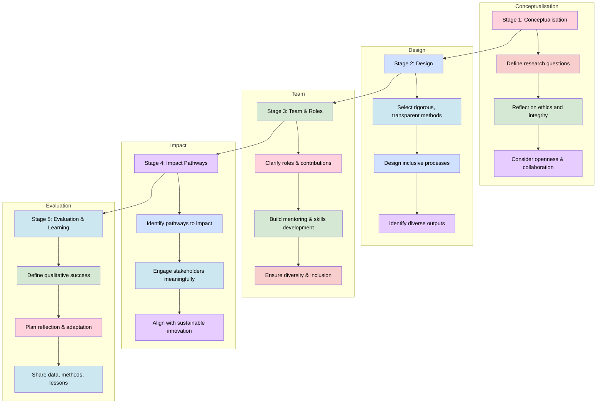

> The following resources informed the development of this guide: 
>
> - [Coalition for Advancing Research Assessment (CoARA) ÔÇô The Agreement on Reforming Research Assessment](https://www.coara.org/agreement/the-agreement-full-text/)
> - [Coalition for Advancing Research Assessment (CoARA) ÔÇô About the Coalition](https://www.coara.org/)
> - [Declaration on Research Assessment (DORA)](https://sfdora.org/)
> - [European Commission ÔÇô Towards a Reform of Research Assessment Systems](https://research-and-innovation.ec.europa.eu/research-area/open-science/reforming-research-assessment_en)
>

*A Guide for Early Career Researchers and Principal Investigators*

## Introduction: Reframing What Counts as Excellent Research

The **Coalition for Advancing Research Assessment (COARA)** was established to address growing concerns that traditional approaches to research assessment place too much emphasis on publication counts, journal prestige, citation-based indicators, and institutional rankings. These approaches can overlook the diversity of contributions that researchers make to knowledge creation, research culture, innovation, education, engagement, and open science. Central to the agreement is the principle that **research assessment should be based primarily on qualitative evaluation,** supported by peer review and the responsible use of quantitative indicators rather than a reliance on metrics alone. 

For researchers, this represents an important shift in expectations. Increasingly, institutions and funders are recognising contributions such as research data, software, open educational resources, public engagement activities, interdisciplinary collaboration, team science, research leadership, mentoring, citizen science, and efforts to improve research culture. Research quality is therefore understood more broadly than publication metrics alone. 

Aligning research projects with COARA principles from the outset can help researchers demonstrate a wider range of scholarly contributions, strengthen research integrity, support open research practices, and increase the long-term value and impact of their work. This approach encourages researchers to consider not only what they produce, but also how research is conducted, shared, managed, and reused for the benefit of society. 

The Agreement on **Reforming Research Assessment (RRA)**, developed under the Coalition for Advancing Research Assessment [COARA](https://www.coara.org), marks a significant cultural shift in how research quality, impact, and contribution are understood and evaluated. It challenges metric-driven approaches and replaces them with a **values-based framework** centred on:

- Quality
- Integrity
- Openness
- Diversity
- Societal relevance

For **Early Career Researchers (ECRs)**, this reform offers a more just and developmental approach to assessmentÔÇörecognising potential, learning, collaboration, and responsible research practices. For **Principal Investigators (PIs)**, COARA provides an opportunity to design projects that are not only competitive but also socially legitimate, ethically grounded, and sustainable.

This guide aims to support researchers in **articulating why their research matters, how it will be conducted responsibly, and who it will benefit**, adaptable across disciplines and institutional contexts.

### Why COARA Matters for Research Projects
Traditionally, research assessment has focused on outputs such as journal articles, citation counts, and publication prestige. COARA encourages a broader perspective, recognising that excellent research encompasses a wide range of activities and outcomes that contribute to scientific progress and societal benefit. [[coara.org]](https://www.coara.org/), [[casrai.org]](https://casrai.org/news/responsible-research-assessment-dora-coara-commitments/)

Researchers can align their projects with COARA by:

- Designing projects that prioritise research quality, integrity, and transparency.
- Sharing data, software, methods, and other research outputs where appropriate.
- Engaging in collaborative and interdisciplinary research.
- Documenting contributions to research culture, leadership, mentoring, and community engagement.
- Demonstrating the societal, policy, environmental, cultural, or economic value of research.
- Adopting responsible research assessment practices within research teams and institutions.
- Supporting open and reproducible research approaches. 

In practice, COARA encourages researchers to think beyond publications and to consider the full range of contributions that create value within the research ecosystem. 

## Understanding COARA: A Shift in Assessment Culture
COARA reframes research assessment as an exercise in **expert judgement**, informedÔÇöbut not drivenÔÇöby quantitative indicators. Excellence is evaluated based on:

- Methodological rigour and ethical conduct
- Diversity of outputs, practices, and roles
- Plurality of impacts: scientific, societal, economic, cultural, environmental
- Open science, collaboration, and inclusivity

## CoARA Guiding Principles

The CoARA guiding principles describe how the Coalition on Advancing Research Assessment (CoARA) is structured and how it operates as a global reform community for research assessment.

- **Openness** refers to the global and voluntary nature of membership, where eligible organisations sign the Agreement on Reforming Research Assessment and commit to shared principles within an agreed timeframe. Participation is open, organisations may leave, and outputs are publicly disseminated to encourage transparency and open dialogue.

- **Responsibility** is reflected in the governance structure of CoARA, which is composed of member organisations. Decision-making is carried out through bodies such as the General Assembly, supported by a Steering Board and Secretariat, which collectively oversee organisation, work plans, and budgets.

- **Collaboration and mutual support** emphasises CoARA as a space for shared learning. Member organisations support one another in implementing reforms, while also engaging with external initiatives and broader policy ecosystems to strengthen alignment and impact.

- **Inspiration** highlights the role of shared practices and knowledge exchange in encouraging reform, both within the Coalition and across the wider research community.

- **Commitment and autonomy** ensures that while CoARA supports implementation of shared commitments, individual member organisations retain autonomy in how they enact reforms.

- **Voluntary and community-driven participation** underlines that engagement is based on willingness to contribute. Working Groups and activities such as workshops, webinars, and conferences are created by members and function as communities of practice.

- **Dialogue** promotes open communication across research communities, including early career researchers, to ensure broad engagement in reform discussions.

- **Inclusiveness** ensures global participation and representation across disciplines, career stages, genders, and regions, recognising different levels of progress in research assessment reform.

- **Trust** is central to reporting progress, which is largely based on self-assessment shared publicly. This trust-based approach supports transparency, collaboration, and shared experimentation.

- **Funding** is primarily based on voluntary in-kind contributions from member organisations, supplemented by external funding and member contributions.

- **Non-profit orientation** ensures that CoARA does not promote commercial products or services, instead focusing on developing open, reusable outputs for the research community.

*For a full and detailed description of each principle, see:*  
https://www.coara.org/agreement/guiding-principles/

> **Implication for Researchers:** Proposals must present a **coherent, credible account of contribution and value**, not just promise outputs.

## Guidance for Early Career Researchers and Principal Investigators

COARA encourages researchers and institutions to move beyond narrow measures of success based on publication counts, journal prestige, and citation metrics. Instead, assessment should recognise the diverse contributions that support high-quality, ethical, open, collaborative, and impactful research. This approach is particularly important when supporting career development and fostering inclusive research cultures.

### For Early Career Researchers (ECRs)

Research assessment should recognise that career development is not linear and that researchers contribute in different ways at different stages of their careers.

ECRs can align their projects with COARA principles by:

- Demonstrating intellectual contribution, creativity, and growing independence rather than focusing solely on publication volume.
- Showcasing open research practices, including data sharing, software development, pre-registration, citizen science, and public engagement activities.
- Highlighting collaborative contributions within research teams, recognising that impactful research is often collective rather than individual.
- Evidencing responsible research practices, including research integrity, ethical awareness, transparency, and reproducibility.
- Contextualising career pathways, including career breaks, interdisciplinary transitions, international mobility, professional practice experience, or non-linear career trajectories.
- Reflecting on skills development, leadership potential, mentoring activities, and contributions to positive research culture.
- Documenting contributions to datasets, software, infrastructure, training resources, methodological innovation, and community-building activities.

### For Principal Investigators (PIs)

Principal Investigators play an important role in embedding responsible assessment principles within research projects and teams.

PIs should:

- Design project goals and evaluation criteria that recognise a broad range of scholarly contributions.
- Create opportunities for ECRs to develop independence, leadership, and visibility within projects.
- Allocate appropriate resources for open research, research data management, public engagement, co-creation activities, and research culture initiatives.
- Recognise contributions such as mentoring, supervision, software development, data stewardship, community engagement, and methodological innovation.
- Value collaboration and team science alongside individual achievements.
- Encourage diverse career pathways and support researchers at different career stages.
- Model transparency, inclusivity, responsible leadership, and good research practice.
- Ensure that recognition and reward processes fairly reflect the contributions of all project members.

## Research Quality as a Narrative of Practice

Within a COARA-informed approach, research quality is assessed not only by what is produced, but by how research is designed, conducted, communicated, and shared.

Rather than relying on publication venue as a proxy for excellence, researchers should demonstrate the quality of their research through evidence of rigorous processes, scholarly contribution, and responsible practice.

### Characteristics of High-Quality Research

High-quality projects typically demonstrate:

- Clearly articulated and significant research questions.
- Originality and potential contribution to knowledge, practice, policy, or society.
- Appropriate, rigorous, and transparent methodologies.
- Consideration of limitations, assumptions, uncertainties, and potential biases.
- Robust ethical and governance frameworks.
- Effective management of research data and research outputs.
- Commitment to reproducibility, transparency, and openness where appropriate.
- Meaningful collaboration and stakeholder engagement.
- Reflexivity regarding methods, interpretations, and potential impacts.

Researchers should therefore present quality as an evidence-based narrative of good research practice rather than a list of outputs or metrics.

## Impact as a Credible Pathway Rather Than a Promise

COARA promotes a broader and more realistic understanding of research impact.

Research impact should not be framed solely as guaranteed outcomes or immediate benefits. Instead, impact should be presented as a credible pathway through which research may contribute to change, understanding, capacity building, innovation, or societal benefit.

### Demonstrating Potential Impact

Strong projects often:

- Identify relevant beneficiaries, users, communities, organisations, or stakeholders.
- Explain how stakeholders will be involved throughout the research process.
- Include mechanisms for engagement, co-creation, knowledge exchange, or dissemination.
- Demonstrate awareness of different forms of impact, including cultural, educational, environmental, social, economic, policy, and technological impacts.
- Recognise that research impacts may emerge over different timescales.
- Acknowledge uncertainty and complexity in pathways to impact.
- Consider both intended and unintended consequences of research activities.

The focus should be on demonstrating thoughtful, realistic, and evidence-informed pathways to impact rather than overstated claims.

## Diversity, Collaboration, and Research Roles

COARA recognises that excellent research depends on a wide range of expertise, contributions, and professional roles.

Research projects should therefore recognise and value contributions that may traditionally be overlooked in assessment processes.

### Recognising Diverse Contributions

Projects should acknowledge contributions such as:

- Research data management and stewardship.
- Software development and research computing.
- Methodological leadership and innovation.
- Public and community engagement.
- Open research and knowledge exchange activities.
- Project management and coordination.
- Technical and laboratory expertise.
- Training, mentoring, and supervision.
- Research infrastructure development.
- Equality, diversity, inclusion, and responsible research initiatives.

### Supporting Collaborative Research

Researchers should:

- Encourage interdisciplinary, intersectoral, and international collaboration.
- Recognise that different team members contribute in different ways and at different stages of a project.
- Avoid equating excellence solely with individual achievement.
- Create inclusive environments where diverse expertise is valued and supported.
- Recognise that collaborative approaches often produce more robust, innovative, and impactful research outcomes.

### Additional Considerations for Principal Investigators

PIs should actively create project environments that support:

- Developmental opportunities for Early Career Researchers.
- Leadership pathways for emerging researchers.
- Equitable recognition of contributions across the team.
- Inclusive participation in decision-making.
- Skills development, training, and mentoring.
- Sustainable and positive research cultures.

This approach helps ensure that research assessment reflects not only research outputs, but also the people, practices, and collaborative processes that make high-quality research possible.

## Responsible Use of Indicators and Metrics
- Metrics are **contextual, not proxies for quality**  
- Avoid journal prestige (e.g., JIF) or h-index as evidence of excellence  
- Use indicators only when they illuminate activity (e.g., dataset reuse, software adoption)  
- Narrative explanations remain **primary**, indicators are **supporting**  

## A COARA-Aligned Roadmap for Researchers

### Stage 1: Conceptualisation
- Define research questions based on **scholarly significance and societal relevance**  
- Reflect on **ethical implications and integrity**  
- Consider **openness and collaboration**  

### Stage 2: Design
- Select methods prioritising **rigour, transparency, and appropriateness**  
- Design **inclusive research processes**  
- Identify **diverse outputs** beyond publications  

### Stage 3: Team and Roles
- Clarify contributions using **role-based descriptions**  
- Build **mentoring, supervision, and skills development**  
- Ensure attention to **diversity, equity, and inclusion**  

### Stage 4: Impact Pathways
- Identify **realistic and proportionate routes to impact**  
- Engage stakeholders meaningfully  
- Align innovation with **long-term social, economic, and environmental sustainability**  

### Stage 5: Evaluation and Learning
- Define success **qualitatively**, not solely by deliverables  
- Build in **reflection, learning, and adaptation**  
- Plan for **sharing data, methods, and lessons learned**  

## Further Reading

- **Coalition for Advancing Research Assessment (CoARA) ÔÇô The Agreement on Reforming Research Assessment**: https://www.coara.org/agreement/the-agreement-full-text/
- **Coalition for Advancing Research Assessment (CoARA) ÔÇô About the Coalition**: https://www.coara.org/
- **Declaration on Research Assessment (DORA)**: https://sfdora.org/
- **Coalition for Advancing Research Assessment (CoARA) ÔÇô Action Plans and Implementation Resources**: https://www.coara.org/resources/
- **CASRAI ÔÇô Responsible Research Assessment: Navigating DORA and CoARA Commitments**: https://casrai.org/news/responsible-research-assessment-dora-coara-commitments/
- **University of Edinburgh ÔÇô CoARA Action Plan and Responsible Research Assessment**: https://zenodo.org/records/15386763
- **European Commission ÔÇô Towards a Reform of Research Assessment Systems**: https://research-and-innovation.ec.europa.eu/research-area/open-science/reforming-research-assessment_en
