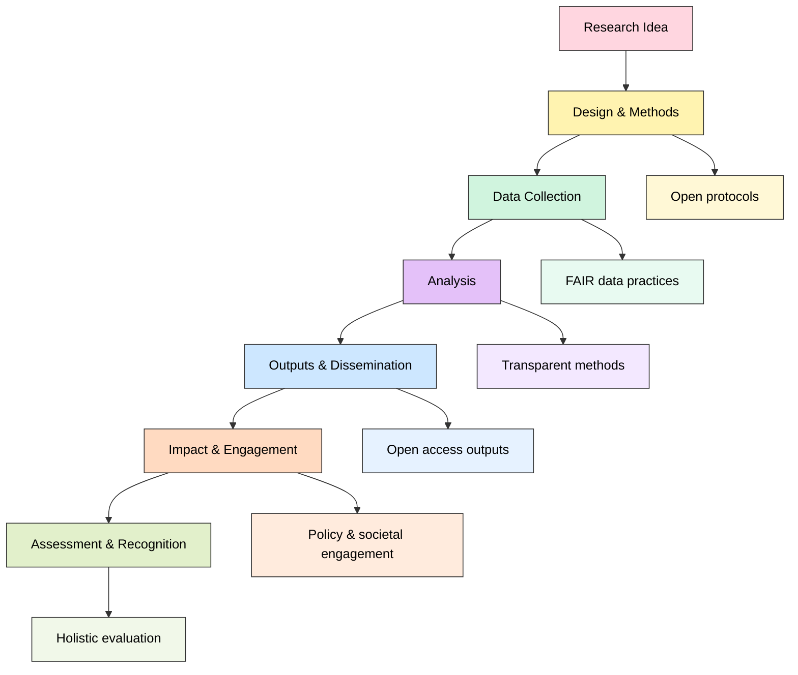
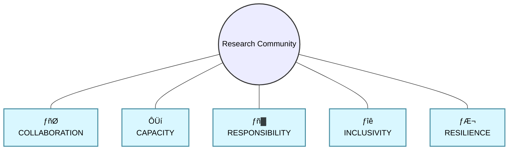

> The following resources informed the development of this guide: 
>
> - [Declaration on Research Assessment (DORA)](https://sfdora.org/)
> - [Coalition for Advancing Research Assessment (CoARA)](https://www.coara.org/)
> - [CoARA Agreement on Reforming Research Assessment](https://www.coara.org/agreement/the-agreement-full-text/)
> - [Science Europe ÔÇô Connecting Open Science and Research Assessment Reform](https://www.scienceeurope.org/our-resources/position-statement-os-ra/)
> - [European Commission ÔÇô Towards a Reform of the Research Assessment System](https://www.ouvrirlascience.fr/wp-content/uploads/2021/12/UE-DGRI_Towards-a-reform-of-the-research-assessment-system.pdf)
>

## Introduction

> *A Practical Guide for Researchers (in all Career Stages)*

Research assessment has traditionally placed considerable emphasis on publishing in **journals regarded as prestigious**, often measured through indicators such as the **Journal Impact Factor (JIF)**. Researchers have also frequently been assessed using **citation-based metrics** such as the **h-index**, which attempts to measure both the **productivity** and **citation impact** of a researcher's publications. While these measures are widely used, they focus primarily on journal articles and citations as indicators of research quality and influence.

Reliance on **publication and citation metrics alone** only provides a partial view of research excellence. Such approaches may undervalue a wide range of **scholarly contributions**, including **books and monographs**, **research data**, **software**, **policy engagement**, **public scholarship**, **knowledge exchange activities**, and **creative outputs** such as **exhibitions**, **performances**, **films**, or **artwork**.

**Citation-based indicators** can also disadvantage certain groups of researchers. For example, **ECRs** have typically had fewer opportunities to publish and accumulate citations than more established colleagues. Similarly, **publication and citation practices** vary significantly across disciplines. In many **humanities and social science fields**, **books**, **chapters**, and **long-form scholarship** are often more highly valued than journal articles, while citation rates may be substantially lower than in the **natural sciences**. As a result, metrics such as the **h-index** may not provide fair or meaningful comparisons across **career stages**, **disciplines**, or **research contexts**. Rather than relying primarily on publication metrics, a **RRA approach** seeks to assess research on the basis of its **quality**, **rigour**, **openness**, **integrity**, and **broader contribution to knowledge and society**.

## What is Responsible Research Assessment

RRA promotes fair, transparent, and holistic evaluation of research that **values quality, integrity, openness, and diverse contributions** rather than narrow metrics like Journal Impact Factor or h-index.  Traditional systems overemphasise publication metrics, disadvantaging early-career researchers and undervaluing outputs such as policy work, datasets, software, and creative contributions. 

### Core Principles

RRA is based on the principle of selecting research assessment approaches that prioritise quality over quantity.  It recognises that research does not necessarily have to be limited to certain types of output, and that research impact should not be evaluated simply by the number of times a piece of work has been cited.  RRA recognises a broad range of scholarly contributions that contribute to a positive research environment.  These could include knowledge creation, collaboration, mentoring, contributing to policy development, the sharing of datasets, software creation and many other practices valued in open science.
 
In opening up the research landscape in this way, it is possible to move beyond narrow forms of measurement and value the breadth of scholarly activity.  Creating a responsible research environment is about choosing approaches that focus on the quality of scholarly work, rather than the number of outputs and in doing so recognises the importance of all the factors which go into creating a positive scholarly environment

- Quality over quantity
- Recognition of diverse outputs
- Transparency and openness
- Equity and inclusivity
- Integrity and ethical conduct

RRA aligns with global initiatives such as:

- DORA (Declaration on Research Assessment)
- CoARA (Coalition for Advancing Research Assessment)
- Science Europe Open Science & Assessment Reform agenda

### Why Research Assessment Reform Matters

Research Assessment Reform (RAR) and Open Science are increasingly recognised as essential components of a healthy and sustainable research ecosystem. Together, they influence how research is designed, conducted, recognised, rewarded, and shared. Rather than focusing narrowly on publication metrics, these approaches encourage a broader understanding of research quality that values openness, collaboration, integrity, inclusion, and societal contribution.

For individual researchers, research teams, and institutions, RAR matters because it:

- Shapes the behaviours and incentives that influence how research is conducted.
- Influences recruitment, promotion, funding, and career development decisions.
- Determines which research activities and outputs are recognised and rewarded.
- Encourages practices that improve transparency, reproducibility, and trust in research.
- Broadens definitions of excellence to include collaboration, data sharing, software development, engagement, leadership, mentoring, and research culture contributions.
- Strengthens the potential for research to generate positive societal, cultural, environmental, and economic impacts.
- Supports more inclusive and diverse research environments by recognising a wider range of roles, career paths, and contributions.

Ultimately, research assessment systems influence not only what researchers do, but also how they value their own contributions and those of others.

## Developing Researchers

Developing future researchers is fundamental to building a strong, sustainable, and resilient research culture. Research leaders, supervisors, and institutions play a crucial role in creating environments in which researchers can thrive, develop new skills, and contribute meaningfully throughout their careers. A healthy research culture is one that balances ambition with wellbeing. It encourages excellence while recognising that high-quality research requires time, reflection, collaboration, and ongoing learning. Rather than rewarding constant productivity, sustainable research environments support researchers to work effectively, ethically, and creatively over the long term.

### Good Practice for Research Leaders

Research leaders can support researcher development by:

| Area | Practical Actions |
|--------|------------------|
| **Mentoring and Support** | Provide mentoring, coaching, and constructive feedback to support career development. |
| **Workload Management** | Protect time for research, writing, training, and professional development. |
| **Career Development** | Support diverse career pathways and recognise varied forms of achievement. |
| **Research Integrity** | Model ethical, transparent, and responsible research practices. |
| **Collaboration** | Encourage teamwork, interdisciplinary working, and knowledge sharing. |
| **Recognition** | Value mentoring, engagement, data stewardship, software development, and service contributions alongside publications. |
| **Wellbeing** | Promote realistic expectations, healthy boundaries, and sustainable working practices. |

### Supporting Early Career Researchers

Early Career Researchers benefit from environments that:

- Encourage independence while providing appropriate support.
- Value learning and development as well as outputs.
- Provide opportunities for leadership and collaboration.
- Recognise diverse contributions beyond publications.
- Support the development of open research skills and practices.
- Create psychologically safe environments where researchers can experiment, learn, and innovate.

## Developing a Sustainable Research Culture

A sustainable research culture is one that enables high-quality research while supporting the long-term wellbeing of people, communities, institutions, and the environment.

Such cultures promote:

- Research integrity and ethical conduct.
- Transparency, openness, and reproducibility.
- Inclusivity, fairness, and accessibility.
- Collaboration and collegiality.
- Continuous learning and professional development.
- Efficient and responsible use of resources.
- Environmental sustainability.

Building a sustainable research culture requires consideration of both individual behaviours and organisational systems. Sustainable research is not simply about producing excellent outputs; it is also about creating the conditions that allow excellent research to flourish over time.

### Characteristics of a Sustainable Research Culture

| Dimension | Characteristics |
|-----------|----------------|
| **Social Sustainability** | Inclusive, supportive, equitable, and collaborative research communities. |
| **Research Sustainability** | Transparent, reproducible, ethical, and high-quality research practices. |
| **Career Sustainability** | Realistic workloads, mentoring, development opportunities, and wellbeing support. |
| **Institutional Sustainability** | Long-term investment in people, infrastructure, and research capability. |
| **Environmental Sustainability** | Consideration of resource use, energy consumption, travel, and carbon impacts. |

## Building Sustainable Research Infrastructure

Research culture is strongly influenced by the systems, policies, and infrastructure that support research activity. Sustainable infrastructure enables researchers to adopt good practices and removes barriers to openness, collaboration, and responsible research.

A sustainable research infrastructure should include:

| Infrastructure Area | Examples |
|---------------------|----------|
| **Research Governance** | Clear policies, ethical frameworks, and responsible assessment practices. |
| **Open Research Support** | Systems for sharing data, publications, software, and other research outputs. |
| **Research Data Management** | Secure storage, repositories, metadata support, and preservation services. |
| **Training and Development** | Programmes supporting research integrity, open science, leadership, and digital skills. |
| **Recognition and Reward** | Assessment systems that recognise a broad range of contributions and outputs. |
| **Sustainability Considerations** | Guidance on reducing environmental impacts and supporting responsible resource use. |

Strong infrastructure helps ensure that responsible research practices are embedded within everyday research activities rather than relying solely on individual effort.

## Researcher Responsibilities Across the Research Lifecycle

Sustainable research cultures depend on researchers having both the capability and the agency to make informed decisions throughout the research lifecycle.

Researchers should aim to:

| Responsibility | Examples in Practice |
|---------------|---------------------|
| **Maintain Integrity** | Apply rigorous methods, document decisions, and report findings honestly and transparently. |
| **Promote Openness** | Share outputs, data, methods, and software where appropriate and feasible. |
| **Consider Impacts** | Reflect on social, environmental, ethical, and policy implications of research activities. |
| **Use Resources Responsibly** | Avoid unnecessary duplication and make use of existing data, methods, and infrastructure where appropriate. |
| **Reduce Environmental Impact** | Minimise waste, reduce unnecessary travel, use resources efficiently, and consider greener research practices. |
| **Support Others** | Contribute to mentoring, peer support, collaboration, and positive research culture. |
| **Champion Sustainability** | Raise awareness of sustainable research practices and help embed them within research communities. |

### A Practical Perspective

At every stage of a project, researchers can ask:

- Does this activity improve research quality and integrity?
- Can this process be made more transparent or reproducible?
- Is collaboration being encouraged rather than duplicated effort?
- Does the project support the development of researchers and research culture?
- Have the social, ethical, and environmental implications been considered?
- Are people, resources, and infrastructure being used sustainably?

## Research community

A sustainable research community operates as a research ecosystem that can adapt, contribute positively and endure in all aspects.  It is focused on making the research process itself sustainable through a thriving community of researchers, institutions and stakeholders.  As such, it conducts research in ways that strengthen social equity and participation, minimise environmental impact, and maintain inclusive practices and shared ownership of knowledge. The underpinning pillars supporting this are:

- **Collaboration** supports interdisciplinary and transdisciplinary work, enables the co-creation of knowledge, and helps to build trust among researchers, communities, policymakers, industry partners, and other stakeholders. Collaboration encourages the open exchange of ideas, expertise, and data, reducing duplication of effort and increasing the relevance and impact of research.

  *Example: A climate adaptation project brings together environmental scientists, local authorities, community organisations, and residents to co-design solutions for flood management, ensuring both scientific evidence and local knowledge inform decision-making.*

- **Capacity building** requires ongoing development of skills in research methods, sustainability practices, leadership, and project management. This is supported through mentoring, peer learning, professional development opportunities, and structured support for early career researchers. An important aspect of capacity building is creating an environment in which more staff feel able and encouraged to engage in research activities, helping to strengthen institutional research culture.

  *Example: A university establishes a mentoring scheme that pairs experienced researchers with early career colleagues, alongside workshops on grant writing, open research, research data management, and leadership skills.*

- **Responsibility** is a key consideration in research practice, ensuring that research activities seek to maximise benefits while minimising potential harms. Responsible research is underpinned by strong ethical principles, transparency, integrity, and accountability throughout the research lifecycle, helping to ensure that research outcomes are trustworthy and socially beneficial.

  *Example: A health research team conducts an ethics review, develops clear consent procedures, protects participant confidentiality, and establishes processes for reporting and managing any unintended consequences arising during the project.*

- **Inclusivity** is fundamental to ensuring that research is equitable, relevant, and responsive to the needs of different communities. This involves including underrepresented groups, recognising diverse forms of knowledge, supporting shared decision-making, and creating research environments that actively address barriers to participation and accessibility.

  *Example: A public health project works with community representatives from underserved populations to co-design survey instruments, ensuring that research questions, methods, and communication approaches reflect the needs and experiences of those communities.*

- **Resilience** refers to the capacity of individuals, teams, and organisations to adapt and thrive in the face of change, uncertainty, or disruption. Building resilience involves flexible working practices, adaptive leadership, effective risk management, supportive research cultures, and attention to researcher wellbeing. This includes recognising the risks of burnout and promoting sustainable workloads.

  *Example: A research centre develops contingency plans for staff turnover and funding changes, while encouraging flexible working arrangements, wellbeing support, and realistic project timelines to help researchers maintain productivity during periods of uncertainty.*

### How does CoARA align with REF requirements?
 
CoARA recognises that current assessment systems rely heavily on publication metrics and, in turn, fail to acknowledge the full range of contributions researchers make. Its agenda is to advocate for a more holistic, fair, and meaningful approach. This has influenced how institutions approach responsible assessment, by adopting broader and more responsible research, especially the increased focus on the creation of fair and sustainable research environments.

### For more information please see

- **Saenen, B., & Morris, J. (2026).** *Position Statement ÔÇ£Connecting Open Science and Research Assessment Reform: A shared mission and common actionsÔÇØ*. Science Europe.  https://doi.org/10.5281/zenodo.19886163  

- **Global Research Council (GRC).**  *Responsible Research Assessment Working Group ÔÇô Self-Assessment Tool*.  
  https://globalresearchcouncil.org/about/responsible-research-assessment-working-group/self-assessment-tool/  

- **Allen, L., Barbour, V., Borrell-Damián, L., Cobey, K., Firth, C., Lawrence, R., Lima, G., McGuirk, S., Morris, J., Trinh, A.-K., Uwineza, J., & Dube, N. (2026).**  *A Practical Guide to Implementing Responsible Research Assessment at Research Funding Organizations*.  
  Declaration on Research Assessment (DORA). https://doi.org/10.5281/zenodo.18402272  

