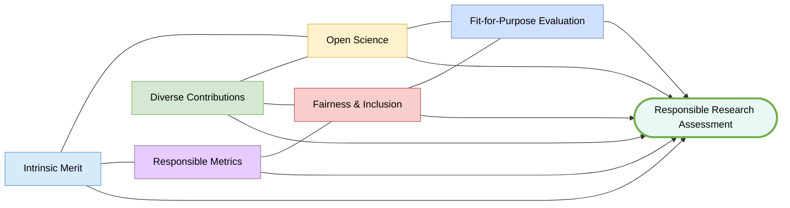
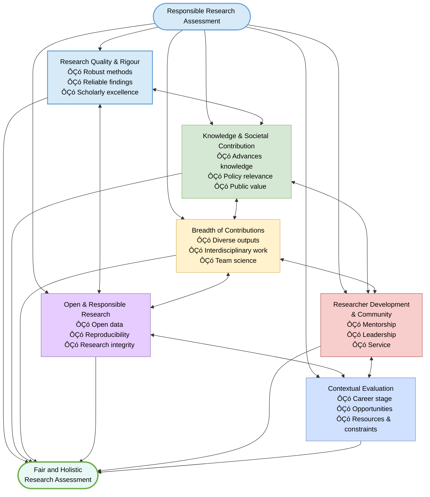
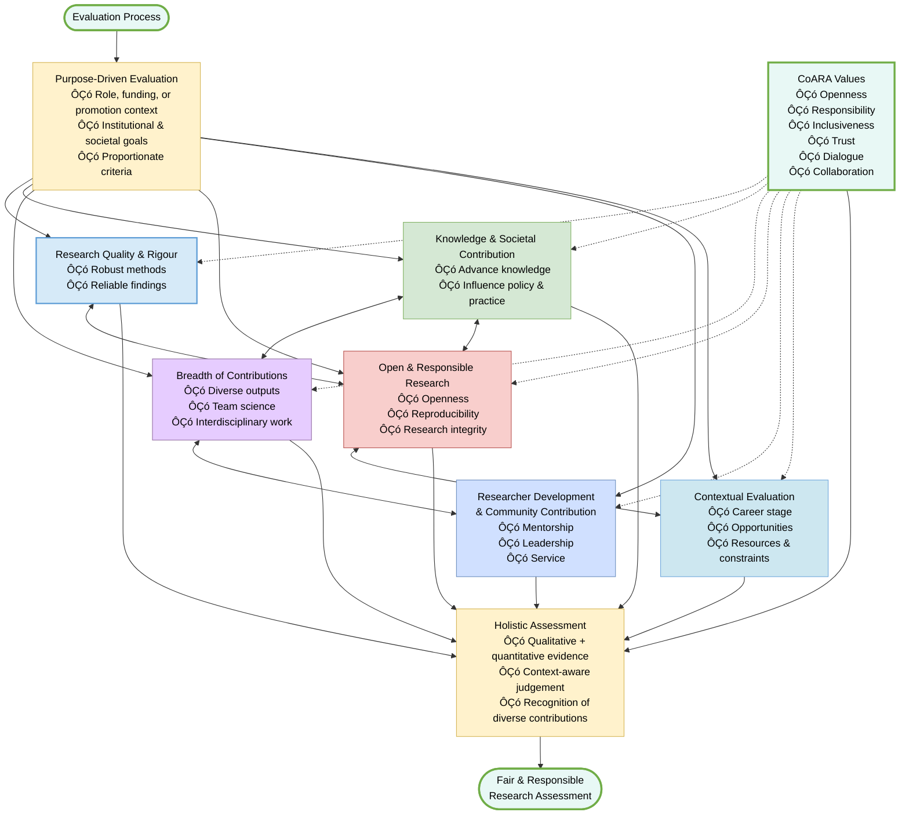

> The following resources informed the development of this guide:
>
> - [CoARA Working Group on Improving Research Proposals – Endorsed Output](https://www.coara.org/news/project-news/wg-improvingresearchproposals-endorsed-output/)
> - [Wellcome – Research Organisations: How to Implement Responsible and Fair Approaches to Research Assessment](https://wellcome.org/research-funding/guidance/ending-a-grant/open-access-guidance/research-organisations-how-implement-responsible-and-fair-approaches-research)
> - [European Commission – Reforming Research Assessment: Agreement Finalised](https://research-and-innovation.ec.europa.eu/news/all-research-and-innovation-news/reforming-research-assessment-agreement-now-final-2022-07-20_en)
> - [DORA – Practical Guide for Research Performing Organisations: Quick Reference Sheets](https://sfdora.org/wp-content/uploads/2025/09/DORA_PracticalGuideRPOS_Quick-ReferenceSheets_V1.pdf)
> - [Early Career Researchers Reviewers Programme – Research Assessment Reforms Guide](https://ecr-reviewers.gitlab.io/guide/guide_sections/research-assessment-reforms.html)
>

## A Shift Towards Responsible and Inclusive Evaluation

Research assessment is undergoing significant international reform. For many years, assessment processes have relied heavily on publication counts, citation metrics, journal rankings, and other **quantitative indicators as proxies for research quality**. While these measures can provide useful information, they often fail to capture the full breadth of research contributions and can create incentives that prioritise productivity over quality, competition over collaboration, and visibility over societal value.

Initiatives such as **DORA, CoARA, UNESCO's Open Science Recommendation, and Science Europe** have called for a more balanced and responsible approach to assessment. This emerging model recognises that excellent research is not defined solely by where it is published, but also by how it is conducted, shared, managed, and applied.

For research evaluators, this represents a fundamental shift in practice. Assessment should move from judging prestige and outputs alone, towards evaluating the quality, integrity, openness, collaboration, and broader contributions that underpin impactful research. CoARA describes reform as a collective and evolving process built upon **trust, transparency, inclusiveness, and continuous learning**. Evaluators therefore play a central role in creating assessment systems that support positive research cultures and encourage behaviours that improve the quality and societal value of research.

| Principle | What It Means | Guidance for Evaluators | Avoid | Key Question |
|------------|--------------|-------------------------|--------|-------------|
| **1. Assess Research on its Intrinsic Merit** | Evaluate the quality of the research itself rather than relying on publication venues, citations, or institutional prestige. | ÔÇó Assess originality and significance of research questions ÔÇó Evaluate methodological rigour and appropriateness ÔÇó Review quality of analysis and interpretation ÔÇó Consider transparency of research processes ÔÇó Assess contributions to knowledge, policy, practice, culture, or society | ÔÇó Using Journal Impact Factors or rankings as proxies for quality ÔÇó Equating citation counts with excellence ÔÇó Assuming prestige reflects the quality of individual outputs | **Does the evidence demonstrate that the research is rigorous, meaningful, and contributes to knowledge, regardless of where it was published?** |
| **2. Recognise the Full Range of Research Contributions** | Value the diverse outputs, activities, and roles that contribute to research beyond traditional publications. | Consider contributions such as: ÔÇó Datasets and research data infrastructure ÔÇó Software, code, and digital tools ÔÇó Policy reports and professional guidance ÔÇó Public engagement and knowledge exchange ÔÇó Open educational resources ÔÇó Research leadership and coordination ÔÇó Mentoring and supervision ÔÇó Peer review and service contributions ÔÇó Interdisciplinary and collaborative research | ÔÇó Focusing exclusively on journal publications ÔÇó Overlooking collaborative and enabling contributions | **Has the researcher contributed meaningfully to the research ecosystem beyond traditional publications?** |
| **3. Reward Openness, Transparency, and Reproducibility** | Recognise practices that improve the accessibility, reliability, transparency, and reuse of research. | Recognise: ÔÇó Open access publications ÔÇó FAIR research data ÔÇó Shared software and code ÔÇó Open methodologies and protocols ÔÇó Transparent reporting ÔÇó Reproducible workflows ÔÇó Contributions to open infrastructures and repositories  Take account of ethical, legal, cultural, and disciplinary constraints. | ÔÇó Penalising researchers for legitimate restrictions related to privacy, confidentiality, Indigenous knowledge, commercial agreements, or participant wellbeing | **Has the researcher taken reasonable steps to make their research transparent, reproducible, and reusable?** |
| **4. Use Metrics Responsibly** | Use quantitative indicators as supporting evidence rather than substitutes for expert judgement. | ÔÇó Use metrics as one source of evidence among many ÔÇó Apply discipline-appropriate indicators ÔÇó Consider limitations and context ÔÇó Combine metrics with qualitative assessment and peer review | ÔÇó Making decisions based on a single metric ÔÇó Comparing researchers across disciplines using identical measures ÔÇó Using metrics without context | **Are quantitative indicators being used to inform professional judgement rather than substitute for it?** |
| **5. Promote Fairness, Diversity, and Inclusion** | Recognise that researchers have different opportunities, career paths, and contexts, and assess achievements fairly. | Consider: ÔÇó Career stage and experience ÔÇó Career breaks and interruptions ÔÇó Interdisciplinary and non-traditional pathways ÔÇó Disciplinary differences in publication cultures ÔÇó Contributions within collaborative teams  Be mindful of: ÔÇó Implicit bias ÔÇó Prestige bias ÔÇó Structural inequalities ÔÇó Geographic and institutional disparities | ÔÇó Applying a single standardised model of success to all researchers | **Am I evaluating achievement in context rather than comparing researchers against a single standardised model of success?** |
| **6. Align Assessment with Purpose** | Ensure evaluation criteria are appropriate for the specific decision, role, funding scheme, or assessment process. | Ask: ÔÇó What is the purpose of this assessment? ÔÇó Which contributions are most relevant? ÔÇó How do criteria support organisational values and priorities? | ÔÇó One-size-fits-all evaluation frameworks ÔÇó Rewarding activities unrelated to assessment objectives ÔÇó Applying identical expectations across all career stages and disciplines | **Do the assessment criteria genuinely reflect the aims of this opportunity or decision-making process?** |

## The Role of Evaluators in Research Culture Change

Research assessment does more than allocate funding, recognise achievement, or support recruitment decisions. Assessment systems actively shape researcher behaviour, career incentives, institutional priorities, and research culture.

Evaluators therefore have a significant responsibility. Through their decisions, they can encourage:

- High-quality and rigorous research.
- Openness and transparency.
- Collaboration and team science.
- Research integrity and ethical practice.
- Inclusion and diversity.
- Societal engagement and impact.

By adopting responsible assessment practices, evaluators contribute to creating research environments that reward behaviours associated with better research, stronger research cultures, and greater societal benefit.

### A Practical Rule of Thumb

When evaluating research, ask:

1. Is the assessment focused on quality rather than prestige?
2. Are diverse contributions being recognised?
3. Does the evaluation reward openness and responsible research practices?
4. Are metrics being used appropriately and contextually?
5. Have issues of fairness, diversity, and inclusion been considered?
6. Are the criteria aligned with the purpose of the assessment?

If the answer to these questions is yes, the assessment is likely to be better aligned with the principles of responsible research assessment and the objectives of CoARA.

## **Key Elements Reviewers Should Focus On**

### **A. Research Quality and Rigor**  
**CoARA alignment:** *Responsibility, Trust*  
- Methodological robustness  
- Valid and reliable findings  

### **B. Contribution to Knowledge and Society**  
**CoARA alignment:** *Inspiration, Societal impact orientation*  
- Advancement of knowledge  
- Policy, practice, or societal relevance  

### **C. Breadth of Contributions**  
**CoARA alignment:** *Inclusiveness, Diversity*  
- Range of outputs and activities  
- Collaborative and interdisciplinary work  

### **D. Open and Responsible Research Practices**  
**CoARA alignment:** *Openness, Transparency*  
- Data sharing and reproducibility  
- Ethical and responsible conduct  

### **E. Researcher Development and Community Contribution**  
**CoARA alignment:** *Collaboration and mutual support*  
- Mentorship and training  
- Service to the research community  

### **F. Contextual Evaluation**  
**CoARA alignment:** *Dialogue, Inclusiveness*  
- Career stage and trajectory  
- Resource availability and constraints  

## **Practical Guidance for Evaluators**

**CoARA alignment:** *Collaboration, Mutual learning, Community-driven reform*  

CoARA emphasises **continuous learning and shared practice development** across organisations. ([coara.org](https://www.coara.org/agreement/guiding-principles/?utm_source=chatgpt.com))  

- Balance qualitative and quantitative evidence  
- Engage critically with submitted materials  
- Share good practices and learn from peers  
- Seek guidance when conflicts of interest arise  

## **Common Pitfalls to Avoid**

**CoARA alignment:** *Reflexivity*  

Evaluators must remain reflexive about how assessment practices shape behaviour and incentives:

- Over-reliance on journal prestige  
- Ignoring non-traditional outputs  
- Applying uniform criteria across disciplines  
- Reinforcing structural inequalities  

## **Towards a Healthier Research Culture**

**CoARA alignment:** *Inspiration, Collaboration, Trust*  

CoARA envisions a research system that is **inclusive, transparent, and impact-oriented**, driven by shared learning and collective responsibility. ([coara.org](https://www.coara.org/?utm_source=chatgpt.com))  

Responsible evaluation:
- Encourages innovation and openness  
- Supports diverse career paths  
- Strengthens societal trust in research  

## **Aligning Evaluation with Purpose (CoARAÔÇæAligned Workflow)**
This workflow supports evaluators in aligning research assessment with organisational purpose, autonomy, and responsibility, in line with CoARA principles. It emphasises contextÔÇæsensitive judgment, avoidance of oneÔÇæsizeÔÇæfitsÔÇæall metrics, and recognition of diverse research contributions, practices, and career trajectories.

## **For More Information**

- Coalition for Advancing Research Assessment – Guiding Principles: https://www.coara.org/agreement/guiding-principles/  
- DORA: https://sfdora.org/resource/balanced-broad-responsible-a-practical-guide-for-research-evaluators/  
- cOAlition S: https://www.coalition-s.org/responsible-research-assessment-and-evaluation/  
- University of Sussex (implementation example): https://www.sussex.ac.uk/research/about/strategy/declaration-on-research-assessment  

