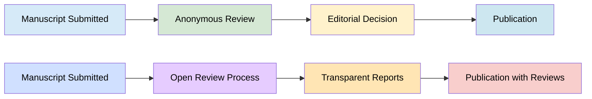
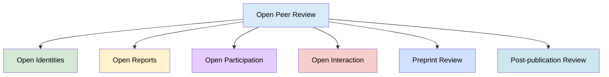

> The following resources informed the development of this guide:
>
> - [Nature Neuroscience (1999), Pros and cons of open peer review](https://www.nature.com/articles/nn0399_197)
> - [University of Reading](https://libguides.reading.ac.uk/open-research/open-peer-review)
> - [NIHR Open Research](https://openresearch.nihr.ac.uk/for-referees/guidelines)
> - [F1000 Research - Open Peer Review](https://think.f1000research.com/open-peer-review/)
> - [What is Open Science?(Open) Peer Review](https://openscience.intechopen.com/learn/open-peer-review/)
> - [University of Surrey](https://www.surrey.ac.uk/library/open-research/open-peer-review)
>

## Introduction

Peer review is a cornerstone of academic practice, providing a mechanism through which research is **evaluated, validated, and improved** by others in the field. Traditionally, this process has been conducted under conditions of anonymity, often through double-blind or single-blind models designed to reduce bias.
However, over recent decades, concerns have emerged regarding the limitations of such systems, including:

- lack of transparency
- potential for unconstructive critique
- limited accountability
- uneven recognition for reviewers

In response, open peer review (OPR) has developed as a more transparent and participatory alternative.

## What is Open Peer Review?

OPR  refers to a range of practices that aim to make the peer review process more transparent, accountable, and collaborative.
Rather than a single model, OPR encompasses a **spectrum of approaches** that vary in how openness is implemented.

OPR forms part of a broader movement towards open research, which emphasises:

- transparency
- reproducibility
- accessibility

It aligns closely with:

- open access publishing
- open data practices
- collaborative scholarship

> Open peer review is not a fixed method, but a set of principles centred on transparency and scholarly dialogue.

## Models of Open Peer Review

Open peer review can be implemented in different ways, often combining several elements.

Model | Description | Example Practice
-- | -- | --
Open identities | Authors and reviewers are known to one another | Named reviews
Open reports | Review comments are published alongside the article | Publisher platforms
Open participation | Wider community can contribute | Preprint commenting
Post-publication review | Review occurs after publication | F1000Research model

## Framework of OPR Elements
Research has identified multiple configurations based on combinations of core elements:

- Transparency of reviewer and/or author identities
- Publication of review reports
- Participation beyond invited reviewers
- Interaction between authors, reviewers, and editors
- Pre-publication review via preprints
- Post-publication commenting
- Immediate publication prior to formal review

### Benefits of Open Peer Review
Opening the peer review process introduces several potential advantages for research quality and scholarly culture.

Benefit | Explanation
-- | --
Accountability | Public reviews encourage constructive, balanced critique
Transparency | Readers can assess the review process and revisions
Collaboration | Dialogue between authors and reviewers is enhanced
Recognition | Reviewers receive visible credit for their work
Training value | Reviews can serve as learning resources

OPR can foster a more dialogic and reflexive research environment, in which critique is not concealed but becomes part of the scholarly record. This is particularly valuable for early-career researchers seeking to understand disciplinary standards and review practices.

### Challenges and Limitations
Despite these benefits, open peer review also presents challenges that must be carefully considered.

Issue | Potential Impact
-- | --
Reviewer reluctance | Some may decline to review openly
Reduced criticality | Feedback may be softened
Bias | Familiarity may influence reviews
Increased workload | More time required for public-facing reviews

Evidence suggests that a small proportion of reviewers may refuse participation when identities are disclosed (Nature Neuroscience, 1999). While this figure may appear modest, it highlights the importance of disciplinary culture and incentives in shaping adoption.

### Pros and Cons

Pros | Cons
-- | --
Conflicts of interest are visible | Reviews may be less critical
Improvement process is transparent | Early career researchers may feel vulnerable
Greater reviewer accountability | Some reviewers may decline participation
Bias can be identified publicly | Potential increase in workload
Reviews can support training | Risk of reputational concerns
Recognition via DOIs and ORCID | Uneven adoption across disciplines

