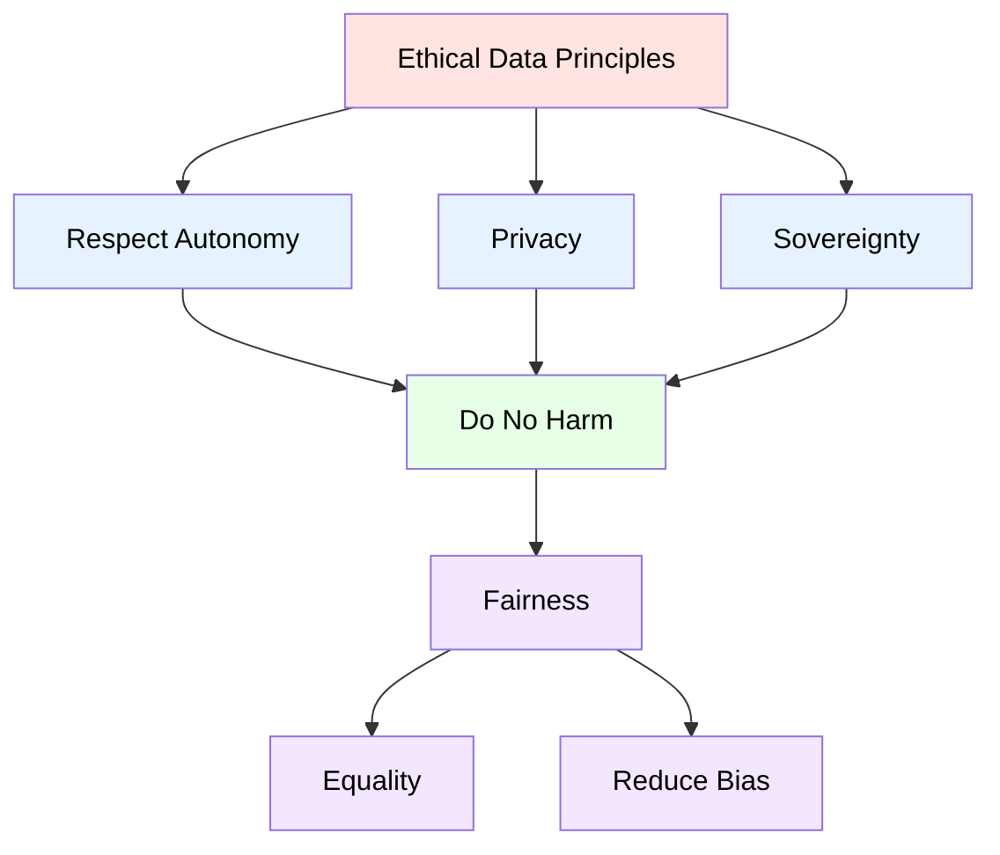
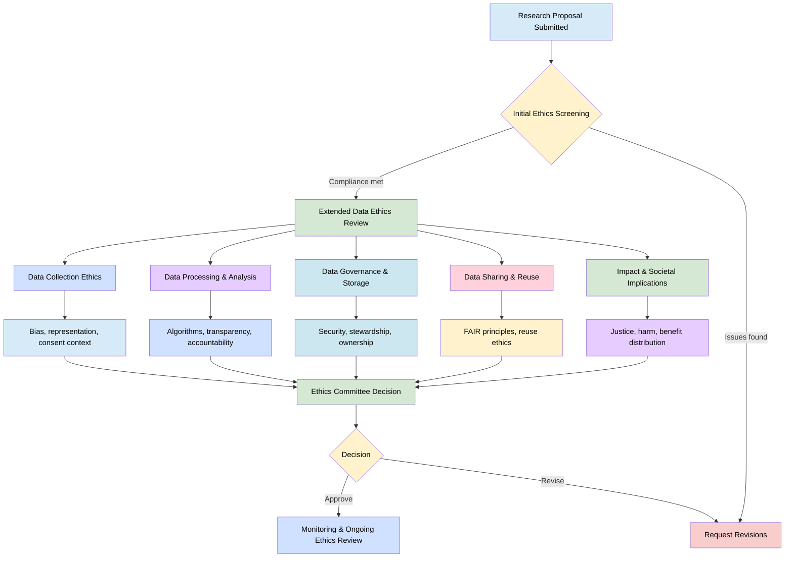

# Guidance for Ethics Committees: Data Ethics-Beyond Consent & Responsible Research Assessment
 
 > The following resources informed the development of this guide:
>
> - [European Commission (2025) – Research Assessment Reform and a Broader Set of Contributions and Metrics](https://research-and-innovation.ec.europa.eu/news/all-research-and-innovation-news/research-assessment-reform-broader-set-contributions-and-metrics-higher-quality-and-impact-2025-12-05_en)
> - [Kara & Pickering (2025) – Reforming Research Ethics Management](https://journals.sagepub.com/doi/10.1177/17470161251351389) ([PDF](https://journals.sagepub.com/doi/pdf/10.1177/17470161251351389))
> - [Arentoft, M., Berghmans, S., Borrell-Damian, L., Bottaro, S., Faure, J.-E., Gaillard, V., Glinos, K., Albacete, J. L., Morais, R., Morris, J., Schiltz, M., & Stroobants, K. (2022). *Agreement on Reforming Research Assessment*. Zenodo.](https://doi.org/10.5281/zenodo.13480728)
> - [UK Government – Data Ethics Framework](https://www.gov.uk/government/publications/data-ethics-framework/data-and-ai-ethics-framework)
> - [Data Ethics Principles](https://github.com/javieraatenas-pixel/data_literacy_AI/wiki/2.4-Principles-of-data-ethics)
> - [Atenas, J., Havemann, L., & Timmermann, C. (2023). *Reframing Data Ethics in Research Methods Education: A Pathway to Critical Data Literacy*. International Journal of Educational Technology in Higher Education, 20(1), 11.](https://doi.org/10.1186/s41239-023-00380-y) ([Full Text](https://link.springer.com/article/10.1186/s41239-023-00380-y)
> 

### Expanding the Role of Research Ethics Committees

Research Ethics Committees (RECs) are increasingly being asked to move beyond a narrow focus on **procedural compliance** and to engage with the broader ethical implications of how research is designed, conducted, managed, shared, and evaluated. While informed consent, data protection, and regulatory compliance remain essential components of ethics review, they are no longer sufficient on their own to address the complexities of contemporary research environments.

Today's research frequently involves **large-scale datasets, artificial intelligence, open science practices, interdisciplinary collaboration, data sharing, community partnerships, and complex digital infrastructures**. As a result, ethical review must consider not only whether research complies with existing regulations, but also whether it is conducted responsibly, fairly, transparently, and in ways that maximise public benefit while minimising harm.

This broader approach aligns with developments in research governance, Open Science, responsible research assessment, and emerging debates around data ethics and public trust.

**This Guidance Supports RECs to**:

- Evaluate ethical considerations throughout the entire research lifecycle rather than focusing solely on project approval.
- Consider how data are collected, used, managed, shared, preserved, and reused.
- Assess broader questions of fairness, inclusion, accountability, and social impact.
- Recognise diverse forms of research contribution and responsible research practice.
- Promote transparency, openness, and trustworthiness in research activities.
- Support reflective and context-sensitive ethical decision-making.
- Balance potential benefits, risks, and societal implications of research activities.

### Why Move Beyond Consent and Compliance?

Traditional ethics review has often emphasised a limited number of important but procedural concerns, including:

- Informed consent;
- Regulatory and legal compliance;
- Confidentiality and privacy;
- Risk identification and mitigation.

While these remain fundamental, contemporary research presents ethical questions that extend beyond procedural requirements. Researchers increasingly work with complex datasets, digital technologies, secondary data sources, artificial intelligence systems, and collaborative partnerships that create ethical challenges throughout the research lifecycle.

Ethics review therefore requires a broader and more reflexive approach that considers not only whether research can be conducted legally, but also whether it should be conducted in particular ways and for whose benefit.

### From Compliance to Ethical Stewardship

A more holistic approach to ethics review involves considering:

| Traditional Focus | Expanded Ethical Considerations |
|------------------|--------------------------------|
| Informed consent | Ongoing participant relationships and responsibilities |
| Regulatory compliance | Fairness, justice, and social responsibility |
| Managing individual risks | Understanding broader societal impacts |
| Data protection | Responsible data stewardship and governance |
| Project approval | Ethical reflection throughout the research lifecycle |
| Research participants | Communities, stakeholders, and affected groups |
| Risk mitigation | Trust, transparency, accountability, and public benefit |

### Ethics Across the Research Lifecycle

Ethical considerations do not begin or end with ethics approval. Rather, they arise throughout the research process and may evolve as projects develop.

| Research Stage | Ethical Considerations |
|---------------|-----------------------|
| **Design** | Research purpose, public value, inclusion, stakeholder involvement, potential harms and benefits |
| **Data Collection** | Consent, privacy, representation, participant expectations, data minimisation |
| **Analysis** | Bias, fairness, transparency, interpretation, methodological accountability |
| **Sharing and Reuse** | Data governance, confidentiality, licensing, access controls, future uses |
| **Dissemination** | Accessibility, transparency, communication of findings, responsible reporting |
| **Preservation** | Stewardship, long-term access, retention, future ethical implications |

### Key Areas for Contemporary Ethics Review: Justice, Fairness, and Inclusion

Research ethics increasingly requires consideration of who benefits from research, who may be excluded, and whether certain groups experience disproportionate risks or burdens.

RECs should consider:

- Whether participant groups are represented fairly;
- The inclusion of underrepresented perspectives;
- Potential biases within datasets, methods, or technologies;
- Accessibility and inclusivity of research processes;
- Equitable distribution of benefits and harms.

### Data Ethics and Governance

Ethics review should extend beyond privacy and confidentiality to consider how data are governed and used throughout their lifecycle.

Questions may include:

- Are data collection practices proportionate to the research objectives?
- Who has access to the data and under what conditions?
- How are decisions about sharing and reuse being made?
- Are governance arrangements transparent and accountable?
- What safeguards are in place to minimise unintended harms?

### Societal Impact and Public Trust

Ethical review increasingly involves consideration of wider societal consequences.

RECs may wish to explore:

- Potential positive and negative impacts of the research;
- Effects on communities, groups, and institutions;
- Long-term implications of data use and reuse;
- Public expectations regarding responsible research practices;
- Whether research contributes to broader social benefit.

#### A Values-Based Approach to Ethics Review

A modern ethics review process is not solely concerned with compliance, but with supporting responsible research.

Alongside legal and regulatory requirements, RECs may draw upon values such as:

- **Respect** for participants, communities, and stakeholders.
- **Integrity** in research design, conduct, and reporting.
- **Transparency** in methods, governance, and decision-making.
- **Justice** in participation, representation, and outcomes.
- **Accountability** for research decisions and impacts.
- **Care** for people, data, communities, and environments.

**Reflective Questions for Ethics Reviewers**

When reviewing a proposal, RECs may ask:

- Does this research demonstrate public or scholarly value?
- Who stands to benefit from the research and who may be affected?
- Are there issues of power, representation, or exclusion that require attention?
- How will ethical considerations be managed throughout the project lifecycle?
- Are data governance arrangements transparent and proportionate?
- How will researchers remain accountable for the social consequences of their work?
- Does the proposal demonstrate a commitment to responsible and trustworthy research practices?

By adopting a broader, lifecycle-based approach, Research Ethics Committees can help foster research cultures that value responsibility, openness, inclusion, and societal benefit alongside compliance and risk management.

**Core Principles for Data Ethics in Research Assessment**

| Theme                     | Key Principles / Considerations                                                                 |
|--------------------------|-----------------------------------------------------------------------------------------------|
| **Beyond Consent**       | Consent as continuous, revisable, and contextual                                              |
|                          | Recognition of collective and community data rights                                          |
|                          | Ethical handling of secondary data and AI training data                                      |
| **Data Justice and Fairness** | Who benefits from the data?                                                             |
|                          | Who is excluded or harmed?                                                                   |
|                          | Are marginalised groups represented and protected?                                           |
| **Transparency and Accountability** | Clear documentation of data collection                                            |
|                          | Clear documentation of processing methods                                                     |
|                          | Clear documentation of algorithmic decisions                                                  |
|                          | Auditability of data systems                                                                  |
| **Data Stewardship and Care** | Long-term responsibility for data storage                                                |
|                          | Responsibility for reuse                                                                      |
|                          | Responsibility for sharing                                                                    |
|                          | Ethical data infrastructures and governance                                                   |
| **Reflexivity and Context Awareness** | Researchers reflect on their positionality                                     |
|                          | Anticipate unintended consequences                                                            |
|                          | Adapt practices over time                                                                     |

### Alignment with Research Assessment Reform

Research Ethics Committees (RECs) increasingly operate within a broader research policy environment shaped by Research Assessment Reform (RAR), Open Science, and responsible research practices. International initiatives such as the Agreement on Reforming Research Assessment (CoARA) call for assessment systems that recognise a wider range of contributions to research and society, moving beyond narrow measures based solely on publications, citations, or journal prestige.

This shift has important implications for ethics review. Ethical and valuable research should not be judged solely in terms of its anticipated academic outputs, but also by the ways in which it promotes transparency, collaboration, openness, inclusivity, societal engagement, and responsible stewardship of data and knowledge.

For RECs, this means recognising that activities such as data sharing, software development, community engagement, public communication, policy influence, and infrastructure creation can be legitimate and important research contributions that deserve consideration within ethics review processes.

### Research Assessment Reform Encourages

- Recognition of diverse research outputs and contributions.
- Greater value being placed on Open Science practices.
- Assessment based on quality and integrity rather than prestige indicators.
- Recognition of collaborative and interdisciplinary research.
- Consideration of societal, cultural, educational, environmental, and policy impacts.
- Support for research practices that contribute to transparency, reproducibility, and public trust.

As research culture evolves, ethics review has an important role in supporting these developments while ensuring that openness and innovation remain aligned with ethical principles and participant protection.

### Evaluating Diverse Research Contributions

Traditional assessment systems have often prioritised journal publications as the primary indicator of research success. However, research increasingly generates a wide range of outputs that contribute to knowledge creation, public benefit, and research infrastructure.

RECs should recognise that valuable and ethically significant contributions can take many forms.

### Examples of Research Contributions

| Contribution Type | Examples |
|-------------------|----------|
| **Research Data** | FAIR datasets, curated collections, repositories, data resources, digital archives |
| **Software and Code** | Research software, analytical tools, algorithms, digital platforms, computational workflows |
| **Methods and Protocols** | Research methodologies, protocols, frameworks, workflows, standards, and guidance |
| **Policy and Practice Contributions** | Evidence informing policy, professional guidance, standards development, advisory work |
| **Public Engagement** | Citizen science, co-creation activities, outreach, public exhibitions, community partnerships |
| **Education and Capacity Building** | Training materials, open educational resources, workshops, mentoring, skills development |
| **Community Knowledge** | Co-produced knowledge, participatory research outputs, local and Indigenous knowledge contributions |

Recognising diverse outputs helps ensure that ethics review reflects the realities of contemporary research practice and supports a more inclusive understanding of research value.

### Ethical Considerations for Diverse Outputs

Different types of research outputs may raise different ethical questions. RECs should therefore consider how ethical obligations apply throughout the lifecycle of these outputs rather than focusing solely on publication.

### Questions for Ethics Review

When reviewing a project, RECs may ask:

| Area | Reflective Questions |
|--------|---------------------|
| **Openness and Transparency** | Does the project support transparency while respecting ethical, legal, and cultural constraints? |
| **Data Stewardship** | Will data be managed, documented, preserved, and shared responsibly? |
| **Reproducibility** | Are methods, workflows, and processes sufficiently documented to support understanding and verification? |
| **Stakeholder Engagement** | Are participants, communities, and stakeholders engaged appropriately and respectfully? |
| **Fairness and Inclusion** | Does the project consider representation, accessibility, and potential inequalities in participation or outcomes? |
| **Societal Impact** | What potential benefits, harms, or unintended consequences could arise from the research and its outputs? |
| **Knowledge Sharing** | How will outputs be communicated and made accessible to relevant audiences? |
| **Long-Term Value** | Will the outputs contribute to future research, learning, policy, or public understanding? |

### From Outputs to Contributions

Responsible research assessment encourages a shift in emphasis from counting outputs to evaluating meaningful contributions. Ethics review can support this transition by considering how projects generate value through responsible practices as well as through their final products.

For example, a research project may demonstrate ethical and societal value through:

- Creating reusable and well-documented datasets.
- Developing open-source software or analytical tools.
- Engaging communities in co-design and decision-making.
- Supporting evidence-informed policy development.
- Building research capacity through training and mentorship.
- Contributing to public understanding and knowledge exchange.
- Promoting transparency, reproducibility, and responsible research conduct.

These activities may be just as important as traditional publications in advancing knowledge and generating public benefit.

### Supporting Responsible Research Cultures

By recognising diverse contributions and considering broader definitions of research value, RECs can help foster research cultures that:

- Reward openness, transparency, and integrity.
- Encourage collaboration and knowledge sharing.
- Recognise a wider range of scholarly contributions.
- Support inclusive and participatory research practices.
- Promote responsible data stewardship.
- Strengthen trust between researchers and society.
- Align ethical review with emerging principles of Open Science and Research Assessment Reform.

In this context, ethics review becomes not only a mechanism for risk management, but also an important contributor to the development of more responsible, inclusive, and socially valuable research systems.

### Embedding Values-Based Ethics in Research Ethics Committees

As research becomes increasingly data-intensive, collaborative, and digitally mediated, Research Ethics Committees (RECs) are being encouraged to move beyond compliance-focused approaches towards models of ethical review that are grounded in shared values. While regulatory requirements, consent procedures, and risk management remain essential, they represent only part of contemporary ethical practice.

A values-based approach recognises that ethical decision-making is an ongoing, relational process that extends throughout the research lifecycle. It encourages RECs to consider not only whether research complies with rules and regulations, but also whether it is fair, trustworthy, inclusive, responsible, and socially beneficial. This approach is particularly important when reviewing research involving large datasets, artificial intelligence, open science practices, community partnerships, and complex forms of data sharing. Embedding values into ethics review helps committees to:

- Evaluate ethically complex and data-driven research environments.
- Address issues of power, representation, discrimination, and inequality.
- Support responsible data governance and stewardship.
- Promote transparency, accountability, and public trust.
- Encourage socially responsible and impactful research practices.
- Align ethical review with developments in Open Science and Research Assessment Reform.

**Core Values for Ethical Review**

| Value | What it Means in REC Practice | Practical Actions for Committees |
|---------|-----------------------------|----------------------------------|
| **Respect** | Recognising the autonomy, dignity, rights, and expectations of individuals, communities, and stakeholders. | Require appropriate consent processes, participant information, and meaningful engagement with affected communities. |
| **Justice** | Ensuring that the benefits and burdens of research are distributed fairly and that exclusion or disadvantage is not reinforced. | Assess representation, inclusion, accessibility, and the potential impacts of research on different groups. |
| **Care** | Recognising researchers' responsibilities towards participants, data subjects, communities, and future users of research outputs. | Evaluate long-term stewardship plans, risk mitigation strategies, and potential harms beyond the funded project period. |
| **Accountability** | Promoting transparency in decision-making and responsibility for research practices and outcomes. | Require clear documentation of data management, governance processes, roles, responsibilities, and audit trails. |
| **Fairness** | Identifying and mitigating bias, discrimination, and inequitable outcomes within research processes and technologies. | Review recruitment processes, sampling strategies, algorithmic systems, and bias mitigation measures. |
| **Diversity** | Recognising multiple perspectives, forms of knowledge, disciplines, and lived experiences. | Encourage interdisciplinary review, stakeholder participation, and the inclusion of community perspectives where appropriate. |
| **Honesty** | Supporting integrity in data collection, analysis, reporting, interpretation, and dissemination. | Require transparency regarding methods, limitations, uncertainties, and reproducibility considerations. |
| **Reflexivity** | Encouraging continual reflection on researcher assumptions, positionality, power relations, and ethical implications. | Include ethics reflection statements and encourage discussion of ethical challenges throughout the research lifecycle. |

### From Ethical Approval to Ethical Stewardship

A values-based approach encourages RECs to view ethics not as a one-off approval process, but as an ongoing commitment to responsible research practice.

This broader perspective recognises that ethical questions may emerge throughout a project and may evolve as research contexts, technologies, partnerships, or societal expectations change. Ethics review therefore becomes a process of supporting ethical stewardship rather than simply confirming procedural compliance.

**Embedding Values Throughout the Research Lifecycle**

| Research Stage | Values-Based Questions |
|---------------|-----------------------|
| **Planning** | Does the research address a legitimate need and demonstrate potential public or scholarly value? Have relevant stakeholders been identified and consulted? |
| **Data Collection** | Are participation, consent, inclusion, and representation being addressed appropriately? |
| **Analysis** | Have issues of bias, fairness, transparency, and accountability been considered? |
| **Sharing and Reuse** | Is openness balanced appropriately with privacy, confidentiality, and community expectations? |
| **Dissemination** | Are findings communicated responsibly and accessibly to relevant audiences? |
| **Preservation** | Are long-term stewardship, governance, and future ethical implications adequately considered? |

### Practical Mechanisms for Operationalising Values-Based Ethics

To embed these values into everyday review processes, RECs may consider implementing mechanisms such as:

- Ethics reflection statements within research applications.
- Integrated Data Management and Ethics Plans.
- Researcher statements on inclusivity, fairness, and stakeholder engagement.
- Explicit consideration of societal benefits and potential harms.
- Community or stakeholder consultation where appropriate.
- Structured assessment of openness and responsible data sharing.
- Review of AI, algorithmic, and automated decision-making systems where relevant.
- Follow-up review processes for projects involving emerging ethical risks.

### Supporting Continuous Professional Development

As research methods and technologies evolve, REC members require ongoing opportunities to develop their expertise and confidence in reviewing emerging ethical issues. Training and professional development may include:

| Area of Development | Why It Matters |
|--------------------|---------------|
| **Data Ethics** | Supports review of data-intensive and data-driven research projects. |
| **Artificial Intelligence and Algorithmic Bias** | Helps identify fairness, transparency, and accountability issues in AI-enabled research. |
| **Open Science Practices** | Supports evaluation of data sharing, openness, reproducibility, and responsible dissemination. |
| **Research Assessment Reform** | Encourages recognition of diverse research outputs and responsible research practices. |
| **Community Engagement and Participatory Research** | Strengthens understanding of co-production, inclusion, and shared decision-making approaches. |
| **Emerging Technologies** | Supports ethical oversight of rapidly evolving digital and computational research methods. |

### Towards Values-Led Ethical Review

By embedding values such as respect, justice, care, accountability, fairness, diversity, honesty, and reflexivity into review processes, RECs can contribute to a broader culture of responsible research. This approach enables ethics committees not only to protect participants and manage risk, but also to support research that is trustworthy, transparent, inclusive, socially responsive, and aligned with contemporary expectations for responsible research and innovation.

## Further reading 
>
- European Commission – The European Code of Conduct for Research Integrity: https://ec.europa.eu/info/funding-tenders/opportunities/docs/2021-2027/horizon/guidance/european-code-of-conduct-for-research-integrity_horizon_en.pdf
- UK Research Integrity Office (UKRIO) – Code of Practice for Research: https://ukrio.org/wp-content/uploads/UKRIO-Code-of-Practice-for-Research.pdf
- University of Derby – Research Ethics: https://www.derby.ac.uk/research/how-research-is-managed/ethics/
- DORA (Declaration on Research Assessment) – Practical Guide for Research Performing Organisations: https://sfdora.org/resource/practical-guide/
- University of Sunderland – Research Governance, Ethics and Integrity: https://www.sunderland.ac.uk/research/research-governance-ethics-integrity
- UK Research and Innovation (UKRI) – DORA Statement: https://www.ukri.org/wp-content/uploads/2020/10/UKRI-22102020-Final-DORA-statement-external.pdf

