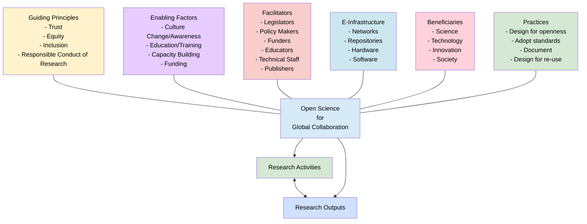
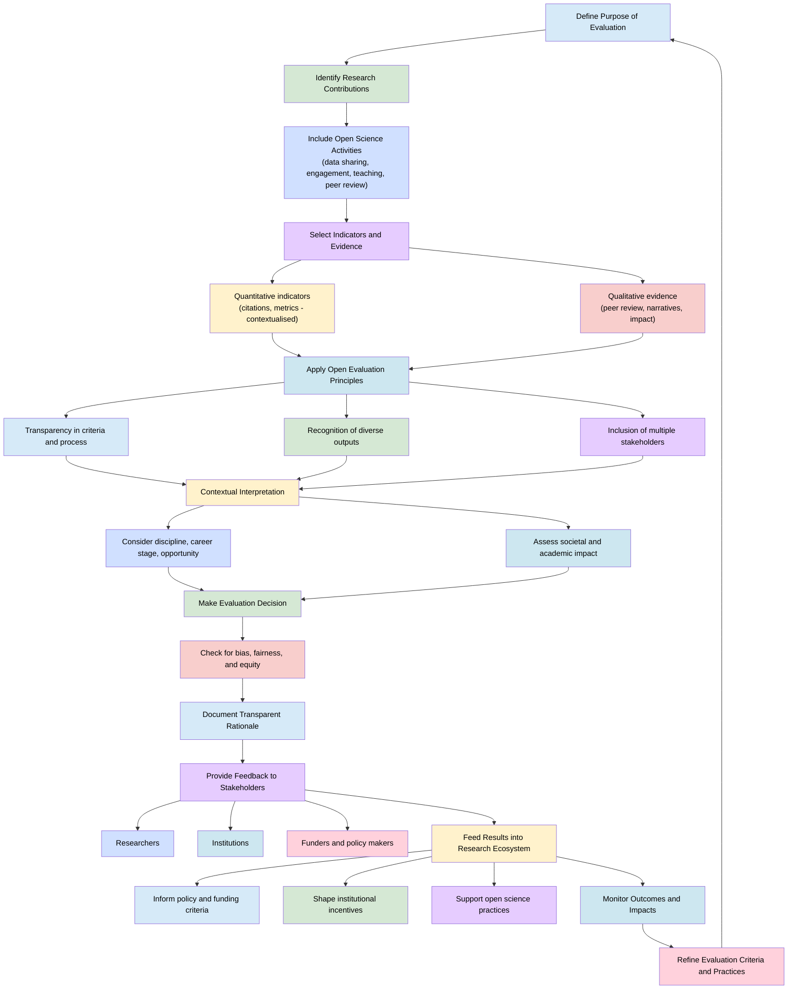

# Open Science for Research Evaluators

> The following resources informed the development of this guide:
>
> - [DORA (2024). *Guidance on the Responsible Use of Quantitative Indicators*](https://sfdora.org/wp-content/uploads/2024/05/DORA_indicators_guidance.pdf)
> - [InterAcademy Partnership / International Science Council (2023). *The Future of Research Evaluation*](https://council.science/publications/the-future-of-research-evaluation-a-synthesis-of-current-debates-and-developments/)
> - [Schmidt, R. (2022). *Research Assessment Systems Thinking*](https://sfdora.org/wp-content/uploads/2022/02/Schmidt_ResearchAssessmentSystemsThinking.pdf)
> - [Arqus Alliance – *Open Evaluation*](https://arqus-alliance.eu/research/arqus-ri/open-science/open-evaluation/)  
>

## Overview

Open science is **reshaping research evaluation** by shifting emphasis away from narrow quantitative indicators (such as journal impact factors or h-indices) towards a more holistic understanding of **research quality and impact**. Traditional metrics, while useful in some contexts, are inherently reductive proxies and require careful contextualisation when used in assessment. [[DORA]](https://sfdora.org/wp-content/uploads/2024/05/DORA_indicators_guidance.pdf)

This transformation aligns with global debates on research evaluation reform, which highlight the need for inclusive, qualitative, and context-aware approaches that better capture **collaboration, openness, and societal impact**. [[International Science Council]](https://council.science/publications/the-future-of-research-evaluation-a-synthesis-of-current-debates-and-developments/)

For research evaluators, this means adopting new frameworks that:

- recognise diverse contributions (e.g. data sharing, public engagement),
- integrate qualitative judgement with responsible use of indicators,
- support transparency, equity, and reproducibility,
- and acknowledge research as part of a broader ecosystem.

## The Research Ecosystem

Research functions as a complex, interconnected system rather than an isolated activity. Systems thinking highlights that outcomes emerge from interactions between multiple actors and incentives, not from individual outputs alone. [[DORA]](https://sfdora.org/wp-content/uploads/2022/02/Schmidt_ResearchAssessmentSystemsThinking.pdf)

| Actor | Role in the ecosystem | Evaluation implications |
|--------|----------------------|-------------------------|
| Researchers | Produce knowledge and outputs | Should be assessed on diverse contributions |
| Research managers | Support project delivery and compliance | Enable open science practices |
| Institutions | Provide infrastructure and policies | Shape incentives and culture |
| Funders | Allocate resources | Influence evaluation criteria |
| Policy makers | Use evidence for decisions | Require accessible, usable research |
| Communications specialists | Disseminate knowledge | Enable societal impact |

A thriving research ecosystem:

- supports collaboration and knowledge exchange,
- accelerates innovation,
- connects research to societal needs,
- strengthens trust and reproducibility.

Open science strengthens this ecosystem by reducing barriers and promoting transparency, inclusivity, and accessibility. [[Arqus Alliance]](https://arqus-alliance.eu/research/arqus-ri/open-science/)

## Principles of Responsible Research Assessment (DORA)
DORA promotes responsible use of quantitative indicators, emphasising that metrics should inform'not replace'expert judgement.

| Principle | Description | Implication for evaluators |
|-----------|-------------|----------------------------|
| Fit-for-purpose indicators | Metrics must match the evaluation goal | Avoid "one-size-fits-all" indicators |
| Transparency | Methods and criteria must be clear | Document decisions openly |
| Contextualisation | Indicators must be interpreted carefully | Consider discipline, career stage |
| Diversity of evidence | Use multiple types of evidence | Combine qualitative and quantitative |
| Equity and fairness | Avoid systemic bias | Recognise diverse outputs |

Indicators such as citations, h-index, and altmetrics should be understood as indirect measures of quality, not definitive judgements. [[DORA]](https://sfdora.org/wp-content/uploads/2024/05/DORA_indicators_guidance.pdf)

### Open Evaluation (Arqus Framework)

Open evaluation extends open science principles into research assessment.
Definition
> Open evaluation is a transparent, inclusive and qualitative assessment approach that recognises a wide range of research-related activities. [[Arqus Alliance]](https://arqus-alliance.eu/research/arqus-ri/open-science/open-evaluation/)

| Dimension | Examples |
|-----------|----------|
| Open outputs | Open access publications, datasets |
| Open processes | Open peer review, transparent methods |
| Societal engagement | Citizen science, policy input |
| Communication | Public engagement, science communication |
| Academic service | Teaching, peer review, governance |

### Benefits

- Greater trust in research quality
- Reduced publication pressure
- Recognition of broader contributions
- Improved inclusivity and collaboration 

### Systems Thinking in Research Assessment

A systems perspective highlights that:

current metrics (e.g. JIF) persist because they align with incentives,
changing assessment requires alignment across institutions, funders, and researchers,
interventions must address structures, behaviours, and cultural norms simultaneously. 

> Research assessment systems are stabilised by feedback loops (e.g. career advancement tied to publication metrics). Reform requires disrupting these loops through new incentives and shared practices.

A thriving research ecosystem offers many benefits, including supporting collaboration and knowledge sharing, which in turn can accelerate learning and innovation. By connecting scholars with other stakeholders'such as industry and wider society'research outcomes can be more readily translated into practical applications. These applications contribute to economic growth and provide potential solutions to societal challenges.

The development of a strong research ecosystem also helps to attract high-performing researchers, as well as investment that can sustain further growth and development. It shapes how knowledge is created, shared, and applied in the real world by:

- Supporting evidence-based decision-making  
- Encouraging collaboration and knowledge exchange by connecting organisations and individuals  
- Helping to develop talent by enabling future researchers to build their skills  

In addition, a strong research ecosystem can stimulate economic growth through the development of new products, services, or business ventures, and can contribute to addressing global challenges such as climate change and pandemics.

