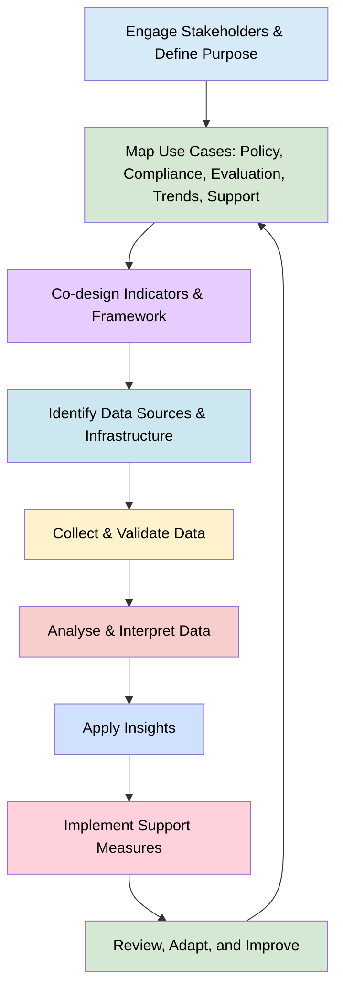

> The following resources informed the development of this guide:
>
> - [OpenAIRE – *The Principles of Open Science Monitoring: OpenAIRE Contributes to Shaping Global Guidance*](https://www.openaire.eu/the-principles-of-open-science-monitoring-openaire-contributes-to-shaping-global-guidance)
> - [Open Science Monitoring Initiative (OSMI)](https://open-science-monitoring.org/)
> - [OpenAIRE – *Are We Measuring Open Science the Right Way?*](https://www.openaire.eu/are-we-measuring-open-science-the-right-way)
> - [Coalition for Advancing Research Assessment (CoARA) – Working Group on Responsible Metrics and Indicators](https://www.coara.org/working-groups/wg-responsible-metrics-and-indicators/)
> - [Bleischwitz, R., Mart├¡, T. S., Ciarli, T., Ferr├®, M., Estradivari, Matt, M., Binot, A., Soler-Gallart, M., & Chavarro, D. (2025). *Transformative Research Assessment: Integrating Societal Impacts into Evaluation Frameworks*. CoARA.](https://doi.org/10.5281/zenodo.17722382)
> - [Science Europe – *Strategic Approaches and Research Assessment Open Science* (Survey Report, 2024)](https://www.scienceeurope.org/media/jcvjcnpe/202410-survey-report-strategic-approaches-and-research-assessment-open-science.pdf)
> - [EMBL – *Open Science Monitoring*](https://www.embl.org/about/info/open-science/open-science-monitoring/)
> - [UNESCO – *Step Towards Global Open Science Monitoring*](https://www.unesco.org/en/articles/step-towards-global-open-science-monitoring)
>

## Purpose of This Guide

This guide supports **research leaders, funders, and evaluators** in designing and implementing responsible, effective Open Science monitoring systems, aligned with:

- OpenAIRE Principles of Open Science Monitoring
- UNESCO Open Science Recommendation
- CoARA Responsible Metrics
- Science Europe evidence and monitoring practices
- Transformative Research Assessment frameworks

Open Science has become a strategic priority for research institutions, funders, governments, and international organisations. However, achieving meaningful change requires more than adopting policies or making commitments. Organisations need **reliable ways** to understand how Open Science practices are being implemented, where barriers exist, what support is needed, and whether interventions are having the desired effect.

Monitoring **enables organisations to track progress, identify gaps, evaluate the effectiveness of policies and investments, and support continuous improvement**. Increasingly, monitoring is also recognised as an important component of Research Assessment Reform, helping institutions move beyond traditional publication and citation metrics towards a broader understanding of research quality, openness, collaboration, and societal contribution.

This guide supports research leaders, funders, policymakers, librarians, research managers, and evaluators in developing responsible approaches to Open Science monitoring that are aligned with international principles and emerging best practice. Throughout this guide, **monitoring** refers to the systematic collection and analysis of information relating to Open Science practices, while **evaluation** refers to the interpretation of that evidence to understand effectiveness, impact, and cultural change

## Core Principles for Monitoring Open Science

| Principle | What it Means | Practical Implication |
|----------|--------------|----------------------|
| Relevance & Context | Indicators must reflect local needs and disciplinary diversity | Avoid one-size-fits-all metrics |
| Transparency & Reproducibility | Use open data, methods, and infrastructures | Ensure traceable indicators |
| Responsible Use | Avoid misuse (e.g., ranking individuals) | Embed qualitative context |
| Inclusivity | Engage stakeholders in design | Co-create indicators |
| Flexibility & Sustainability | Systems evolve over time | Allow iterative adaptation |

### Understanding Open Science Monitoring

Open Science monitoring is often misunderstood as simply counting outputs such as open access publications or datasets. In reality, responsible monitoring seeks to understand how research practices are changing, why those changes are occurring, and whether they contribute to broader goals such as transparency, reproducibility, collaboration, equity, and societal impact.

Effective monitoring therefore goes beyond measuring compliance and supports learning, reflection, and improvement.

Monitoring can help organisations answer questions such as:

- Are researchers adopting Open Science practices?
- Which practices are being adopted most successfully?
- What barriers are preventing wider adoption?
- Are policies and investments having the intended effect?
- How can support services be improved?
- Are research assessment systems recognising open practices appropriately?

Seen in this way, monitoring becomes a mechanism for organisational learning rather than simply a reporting exercise.

### Why Monitor? 

Monitoring is not an end in itself. Its value lies in enabling evidence-informed decision-making and supporting cultural change. Responsible monitoring helps organisations understand not only whether researchers are sharing outputs openly, but also whether institutional policies, incentives, infrastructure, and support systems are enabling sustainable adoption of Open Science practices.

The most effective monitoring systems support five interconnected functions.

| Function | Purpose | Typical Outcomes |
|-----------|----------|------------------|
| **Policy Development** | Inform institutional strategy and policy refinement | Better targeted and evidence-based policies |
| **Compliance Monitoring** | Support adherence to funder and institutional requirements | Improved uptake of Open Science practices |
| **Research Assessment Reform** | Recognise and reward open research practices | More responsible and inclusive evaluation systems |
| **Trend Analysis** | Understand patterns of change over time | Evidence of progress and emerging challenges |
| **Capacity Building** | Identify support needs and capability gaps | More effective training, infrastructure, and incentives |

Rather than operating independently, these functions reinforce one another. Monitoring generates evidence which informs policy, policy shapes practice, and monitoring then helps evaluate whether those changes are effective.

### Monitoring as Part of Research Assessment Reform

Increasingly, Open Science monitoring is becoming an important component of Research Assessment Reform.

Traditional assessment systems have tended to emphasise publications, citation counts, and journal prestige. However, these measures provide only a partial picture of research quality and often fail to recognise activities that contribute to transparency, reproducibility, collaboration, and public value.

Open Science monitoring can provide evidence that supports broader recognition of research contributions, including:

- FAIR data management.
- Data sharing and stewardship.
- Software and code development.
- Open methodologies and workflows.
- Public engagement and citizen science.
- Interdisciplinary collaboration.
- Contributions to research infrastructures.
- Research culture and mentoring activities.

In this context, monitoring is not simply a measurement exercise. It becomes a tool for enabling more responsible, inclusive, and meaningful approaches to research assessment.

| Function | What is Monitored? | How Monitoring Supports Organisations |
|-----------|-------------------|----------------------------------------|
| **Compliance** | Open access publishing, FAIR data management, open software, reproducibility practices, and funder or institutional requirements. | ÔÇó Track compliance across projects, departments, or institutions. ÔÇó Identify areas of non-compliance early. ÔÇó Provide targeted support, guidance, and training. ÔÇó Promote a supportive approach that helps researchers meet requirements rather than imposing punitive controls. |
| **Evaluation** | Open research practices, diverse research outputs, and contributions beyond publications. | ÔÇó Support Research Assessment Reform initiatives such as CoARA. ÔÇó Recognise datasets, software, engagement activities, and other non-traditional outputs. ÔÇó Integrate qualitative and contextual evidence into assessment processes. ÔÇó Promote more holistic, fair, and responsible approaches to evaluating research quality and impact. |
| **Trend Analysis** | Changes in Open Science adoption and research practices over time. | ÔÇó Track growth in open access publishing. ÔÇó Monitor FAIR data adoption and repository use. ÔÇó Assess participation in citizen science and engagement activities. ÔÇó Measure progress towards strategic objectives. ÔÇó Identify emerging practices, opportunities, and gaps. |
| **Capacity Building and Incentives** | Researcher capabilities, support needs, infrastructure use, and engagement with Open Science practices. | ÔÇó Identify training and development needs. ÔÇó Inform investment in infrastructure and support services. ÔÇó Develop incentives and recognition schemes for open practices. ÔÇó Provide tailored guidance to disciplines, departments, or career stages. ÔÇó Create a feedback loop that supports continuous improvement. |
| **Internal Learning and Improvement** | Institutional performance, policy implementation, and organisational change. | ÔÇó Support strategic planning and policy development. ÔÇó Inform institutional evaluation and decision-making. ÔÇó Monitor progress against organisational goals. ÔÇó Encourage continuous learning and evidence-informed improvement rather than external competition or benchmarking. |

In contrast, external uses'such as benchmarking, negotiations with publishers, or public reporting'are less common. 
This reflects a broader shift toward responsible use of metrics, where monitoring supports learning and improvement, rather than competition or simplistic comparisons.

# Open Science Monitoring Roadmap

### Open Science Monitoring Roadmap: Step-by-Step Overview

| Step | Action | Key Activities | Outcome |
|------|---------|---------------|---------|
| **1** | **Define Purpose** | Engage researchers, librarians, leadership, and evaluators. Clarify whether monitoring supports policy, compliance, assessment reform, trend analysis, or capacity building. | Shared understanding of purpose. |
| **2** | **Map Goals** | Translate objectives into practical questions and use cases. | Alignment between monitoring and strategy. |
| **3** | **Co-design Indicators** | Combine quantitative and qualitative measures, recognise diverse outputs, and ensure disciplinary relevance. | Meaningful and trusted indicators. |
| **4** | **Identify Data Sources** | Use repositories, CRIS systems, OpenAIRE/EOSC services, and surveys where appropriate. | Sustainable and transparent infrastructure. |
| **5** | **Collect and Validate** | Ensure data quality, consistency, and documented methods. | Reliable evidence base. |
| **6** | **Analyse Findings** | Assess progress, identify gaps, evaluate recognition of open practices, and understand support needs. | Actionable insights. |
| **7** | **Apply Insights** | Refine policies, improve support, inform assessment reform, and monitor progress. | Continuous improvement and culture change. |

### Monitoring Questions by Purpose

| Purpose | Key Question |
|----------|-------------|
| **Policy Development** | Where are the gaps and opportunities? |
| **Compliance Monitoring** | Are requirements being met? |
| **Research Assessment Reform** | Are open practices being recognised and rewarded? |
| **Trend Analysis** | Is Open Science adoption increasing over time? |
| **Capacity Building** | What support do researchers need? |

### Monitoring for Cultural Change

The ultimate purpose of Open Science monitoring is not to produce dashboards, indicators, or rankings. It is to support positive changes in research culture.

Effective monitoring systems encourage organisations to move beyond questions such as:

> "How many outputs are open?"

towards broader questions such as:

> "How are research practices changing?"  
> "What barriers are researchers facing?"  
> "Which interventions are effective?"  
> "How can openness, quality, integrity, and collaboration be supported?"

This shift reflects a growing consensus that Open Science should be assessed not only through outputs, but also through behaviours, practices, incentives, and institutional cultures.

Monitoring therefore functions as an evidence-based feedback mechanism that helps organisations learn, adapt, and continually improve their support for Open Science.

