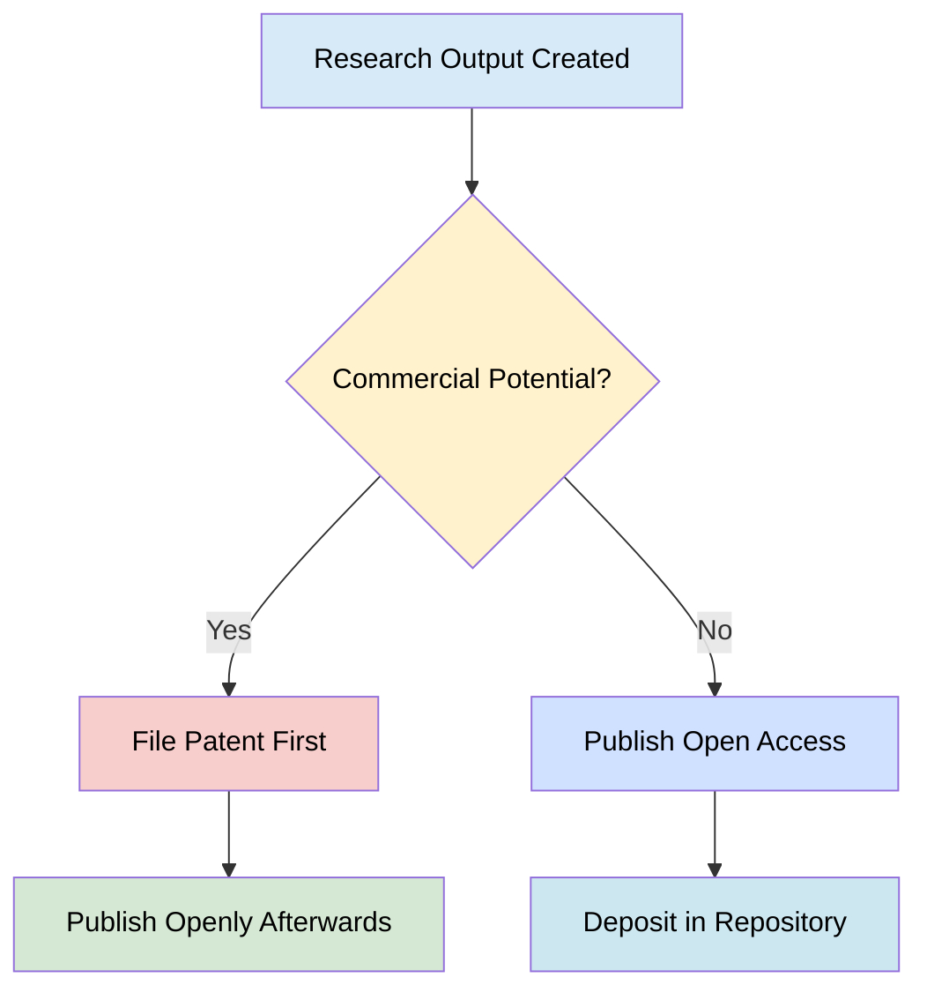
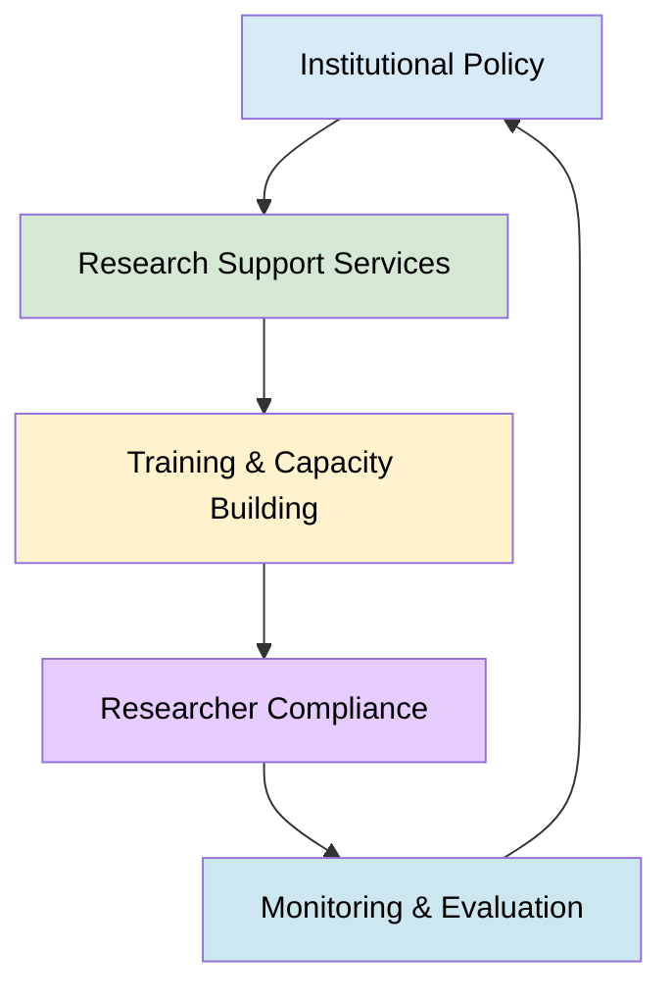

> The following resources informed the development of this guide:
>
> - [UNESCO ÔÇô Open Science](https://www.unesco.org/en/open-science/inclusive-science/integrating-open-science-all-research-funded-european-commission)
> - [European Commission ÔÇô Open Science](https://rea.ec.europa.eu/open-science_en)
> - [OpenAIRE ÔÇô Model Policy on Open Science for Research Funding Organisations](https://www.openaire.eu/model-policy-on-open-science-for-research-funding-organisations)
> - [Science Europe ÔÇô Response to UNESCO Principles on Open Science Monitoring](https://scienceeurope.org/media/nifbrfr0/202411_se_response_unesco_principles_os_monitoring.pdf)
> - [UK Research and Innovation (UKRI) ÔÇô Open Research](https://www.ukri.org/what-we-do/supporting-healthy-research-and-innovation-culture/open-research/)
> - [Coalition S / Plan S ÔÇô Coalition S Welcomes the Plan S-Aligned Open Access Policy from UKRI](https://www.coalition-s.org/coalition-s-welcomes-the-plan-s-aligned-open-access-policy-from-ukri/)
>

## Introduction
Open science represents a shift in how research is conducted, shared and evaluated. It promotes transparency, collaboration, and accessibility of knowledge across disciplines and sectors. Within Europe, open science is not merely encouraged; it is **embedded as a policy requirement** and, is in many cases, a legal obligation within publicly funded research.

Open science is, for example, the default approach in Horizon Europe programmes
- It operates on the principle: ÔÇ£as open as possible, as closed as necessaryÔÇØ
- It includes open access to publications, FAIR data, and participatory research practices

## Policy Context (European and International)

| Policy Area | Key Requirement | Implication for Researchers |
|-------------|----------------|-----------------------------|
| Horizon Europe | Mandatory open access to publications and data | Must publish openly or deposit in repositories |
| European Commission | Open science embedded in evaluation criteria | Influences funding success |
| OpenAIRE | Infrastructure and compliance support | Repository and monitoring tools |
| UKRI | Open research policies aligned with Plan S | Immediate OA and licensing |
| Coalition S | Plan S principles | Requires compliant publishing routes |

## Proposal Development and Evaluation
Requirements:

Demonstrate open science integration in methodology and include plans for: 

- Open access publications
- FAIR data
- Data Management Plan (DMP)
- Highlight prior open science experience
- Evaluation Criteria

Excellence: 
- Quality of open science practices
- Implementation: Capacity and expertise
- Impact: Engagement with stakeholders and citizens

## Publication and Repository Compliance & Intellectual Property Considerations

### Publication and Repository Compliance ÔÇö Requirements
- Deposit publications in trusted repositories  
- Use open licences (e.g., CC BY)  
- Provide machine-readable metadata  

### Recommended Repositories
- Institutional repositories  
- Disciplinary repositories  
- Zenodo (if no alternative available)  

### Intellectual Property and Exceptions
> **Principle:** *ÔÇ£As Open as Possible, As Closed as NecessaryÔÇØ*

Data and outputs may be restricted when:
- Commercial exploitation is intended  
- Personal data protection applies  
- Security or confidentiality is required  

## Institutional Integration Strategy, Monitoring and Compliance & Benefits of Open Science

### Institutional Integration Strategy

#### Key Actions for Institutions
- Develop open science policies aligned with funders  
- Provide training and support services  
- Invest in infrastructure (repositories, tools)  
- Align incentives and reward systems  

### Monitoring and Compliance

#### Indicators
- Percentage of open access publications  
- FAIR data compliance  
- Repository deposits  
- Citizen engagement activities  

#### Tools and Support
- OpenAIRE Monitor: https://www.openaire.eu/  
- Directory of Open Access Journals (DOAJ): https://www.doaj.org/  
- Journal Checker Tool: https://journalcheckertool.org/  

#### Benefits of Open Science
- Increased visibility and impact  
- Enhanced collaboration across sectors  
- Improved research efficiency and reproducibility  
- Greater trust and transparency in science  

## Governance Model

Embedding open science requires a coordinated approach across researchers, institutions and funders. By integrating open practices throughout the research lifecycle, institutions can ensure compliance, enhance research quality, and maximise societal impact.
The transition to open science is not merely administrativeÔÇöit represents a cultural transformation in how knowledge is produced and shared.

