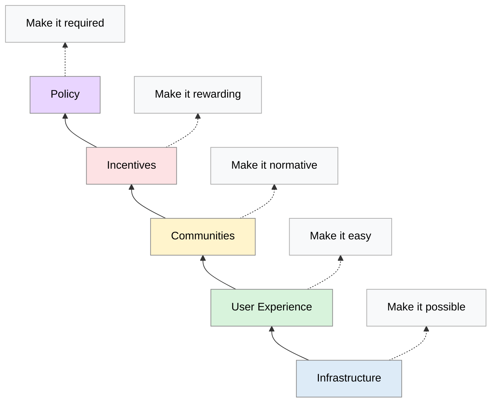
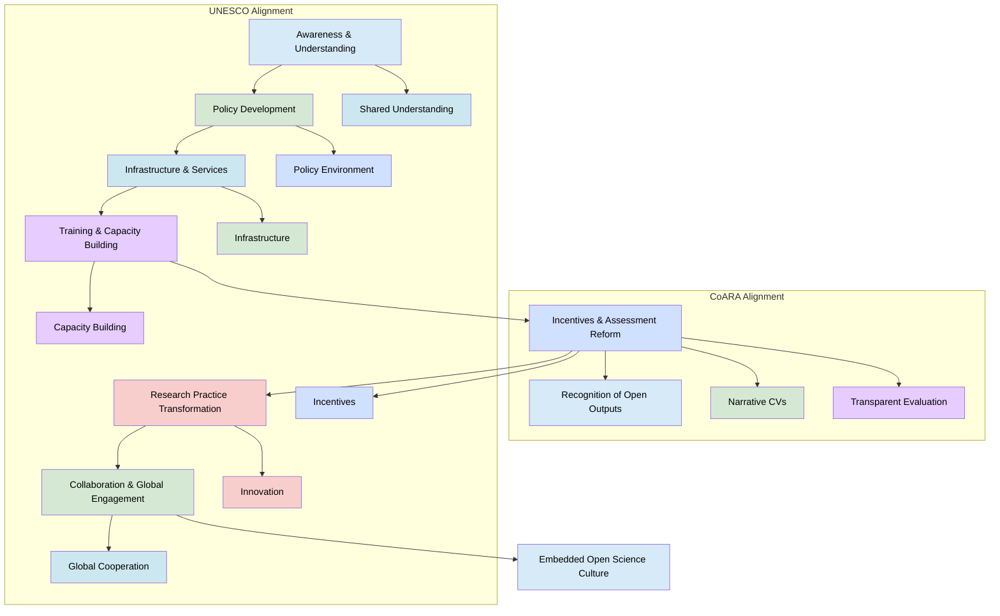

# Building an Open Science Culture: An Institutional Guide
 
> The following resources informed the development of this guide:
>
> - [The Culture of Open Science](https://ui.adsabs.harvard.edu/abs/2022EGUGA..2410800S/abstract)
> - [Science Europe – *Contributions of Open Science to Research Culture*](https://www.scienceeurope.org/media/souls0xt/202510-scoping-review-contributions-open-science-to-research-culture.pdf)
> - [Center for Open Science – *Strategy for Culture Change*](https://www.cos.io/blog/strategy-for-culture-change)
> - [National Academies Press – *Open Science by Design*](https://www.ncbi.nlm.nih.gov/books/NBK525418/)
> - [UK Research and Innovation (UKRI) – Ensuring Open Research](https://www.ukri.org/what-we-do/supporting-healthy-research-and-innovation-culture/open-research/)
> - [OpenAIRE – *Horizon Europe Open Science Requirements in Practice*](https://www.openaire.eu/horizon-europe-open-science-requirements-in-practice)
> - [Eleven Strategies for Reproducible Research](https://pmc.ncbi.nlm.nih.gov/articles/PMC10666927/)
>

## Introduction

Open Science represents a fundamental **transformation in the way research is conducted, shared, evaluated, and reused**. While often associated with practices such as open access publishing, data sharing, reproducibility, and open methodologies, it is more accurately understood as a cultural and systemic shift towards greater openness, transparency, collaboration, and public engagement across the research lifecycle.
At its heart, Open Science seeks to make research outputs, processes, and infrastructures **as open as possible and as closed as necessary**. By improving accessibility, transparency, accountability, and inclusivity, it aims to enhance research quality, strengthen public trust, accelerate knowledge creation, and maximise the societal value of research.

For research institutions, adopting Open Science **requires more than technical infrastructure or compliance with funder policies**. It involves **embedding openness** within institutional cultures, governance, research assessment, incentives, leadership, and professional development. This broader approach recognises openness, integrity, reproducibility, collaboration, and inclusion as core components of research excellence.

Open Science also promotes closer relationships between researchers and wider society by **encouraging participation, knowledge exchange, and collaboration across disciplinary, institutional, and societal boundaries**. Knowledge is therefore viewed as a shared resource that can generate social, cultural, environmental, and economic benefits when it is accessible and reusable.

**Adapted from:** Center for Open Science (COS)https://www.cos.io/blog/strategy-for-culture-change

## The Value Proposition of Open Science

Open Science enhances the quality, transparency, and impact of research by making knowledge, data, methods, and outputs more accessible and reusable. By enabling verification, collaboration, and reuse, it supports more reliable and efficient research while reducing duplication of effort.

It also fosters greater engagement between researchers, institutions, policymakers, and wider society, encouraging collaborative knowledge creation through practices such as open access publishing, FAIR data sharing, and transparent research methods.
For institutions, Open Science can improve research quality, strengthen reproducibility, increase public trust, and maximise the value of research investment. As a result, it is increasingly recognised as a cultural and organisational approach that supports more open, inclusive, and impactful research ecosystems.

### Benefits of Open Science

Open Science creates value for researchers, institutions, funders, policymakers, and society by improving the accessibility, transparency, and reuse of research outputs. By making knowledge, data, methods, and research tools more openly available, research can be shared more widely, reproduced more effectively, and built upon more rapidly.

| Benefit | Description | Example |
|----------|-------------|---------|
| **Reduced Duplication of Effort** | Open access to publications, data, methods, and software allows researchers to build on existing work rather than repeating activities unnecessarily. | Researchers reuse an existing dataset instead of collecting similar data again. |
| **Increased Visibility and Reach** | Openly available research is more discoverable and accessible to researchers, practitioners, policymakers, and the public. | Institutional repositories provide open access to publications, datasets, and other research outputs. |
| **Improved Reproducibility and Transparency** | Sharing methods, workflows, code, and data enables others to verify findings and understand how research was conducted. | Research teams publish code and computational workflows alongside articles. |
| **Enhanced Collaboration** | Open practices facilitate collaboration within and across disciplines, institutions, sectors, and countries. | Researchers from different disciplines use shared datasets to explore new research questions. |
| **Faster Knowledge Exchange** | Research findings can be disseminated and reused more quickly, accelerating scientific progress and innovation. | Preprints and open datasets enable rapid sharing of emerging research findings. |
| **Stronger Links with Policy and Practice** | Openly available evidence is more accessible to policymakers, practitioners, industry partners, and community organisations. | Policy teams access research outputs directly through Open Access repositories. |
| **Greater Societal Impact** | Openness increases opportunities for research to contribute to public understanding, education, innovation, and decision-making. | Citizen science projects involve communities directly in generating and using knowledge. |
| **More Efficient Use of Research Investment** | Sharing outputs maximises the value derived from publicly funded research by enabling reuse and reducing duplication. | Data created through one project are reused by multiple research teams and sectors. |

## Ethical Foundations of Open Science

Open Science is not simply about making research outputs freely available. It is rooted in a broader set of ethical principles that seek to make research more transparent, inclusive, accountable, and socially beneficial. At its core, Open Science aims to ensure that knowledge generated through research is accessible, trustworthy, and capable of contributing to the public good.

The ethical foundations of Open Science are grounded in values such as **equity, integrity, accountability, transparency, and care**. Together, these principles help ensure that openness strengthens research quality and societal benefit, rather than simply increasing access to information.

### Equity and Inclusion

Open Science seeks to reduce barriers to participation in research by making knowledge, data, and educational resources more widely accessible. However, openness alone does not guarantee equity. Institutions must also address structural inequalities that may limit participation for researchers, institutions, communities, or countries with fewer resources.

An equitable approach to Open Science involves:

- Promoting inclusive participation in research.
- Reducing financial, technical, and organisational barriers to access.
- Recognising diverse forms of knowledge and contribution.
- Supporting accessibility for different users and communities.
- Ensuring that the benefits of research are shared more broadly.

### Integrity and Transparency

Research integrity is strengthened when methods, data, workflows, and decisions are documented and shared openly where appropriate. Transparency allows research findings to be scrutinised, verified, reproduced, and improved by others.

Open Science supports integrity by encouraging:

- Transparent research methods and reporting.
- Reproducible workflows and analytical practices.
- Open sharing of data, software, and protocols where feasible.
- Clear documentation of limitations, assumptions, and uncertainties.
- Responsible communication of research findings.

### Accountability and Public Responsibility

Much research is publicly funded and conducted to generate social, scientific, cultural, environmental, or economic benefits. Open Science therefore reinforces the principle that researchers and institutions have responsibilities not only to their disciplines but also to society.

Accountability involves:

- Demonstrating how research resources are used.
- Making research outputs available for scrutiny and reuse.
- Supporting evidence-informed policy and practice.
- Engaging responsibly with stakeholders and communities.
- Contributing to public trust in research and research institutions.

### An Ethics of Care

Openness must be balanced with responsibility. Not all data, knowledge, or research outputs can or should be made fully open. Ethical considerations relating to privacy, confidentiality, cultural sensitivity, Indigenous knowledge, intellectual property, security, and participant wellbeing may require restrictions on access or sharing. An ethics of care recognises that responsible openness requires researchers and institutions to consider the interests and rights of participants, communities, and future users of research outputs.

This means ensuring that openness is implemented thoughtfully and proportionately, guided by the principle of being as open as possible, as closed as necessary.

### Supporting Ethical Open Science

Institutions can help embed ethical Open Science practices through:

| Area | Examples of Institutional Support |
|--------|----------------------------------|
| **Open Access** | Funding support for open access publishing and repository services. |
| **Data Governance** | Policies and frameworks for the ethical management, sharing, and preservation of research data. |
| **Ethics Review** | Integration of Open Science considerations into research ethics and governance processes. |
| **Sensitive Data Management** | Controlled access mechanisms and secure environments for confidential or restricted data. |
| **Training and Guidance** | Professional development in Open Science, research integrity, data stewardship, and responsible research practices. |
| **Community Engagement** | Support for participatory, co-created, and socially responsive research approaches. |

## Societal Value and Research Impact

Open Science broadens the understanding of research impact by emphasising the accessibility, reuse, and relevance of research beyond academia. By making publications, data, software, and other research outputs openly available, it enables knowledge to reach and benefit policymakers, practitioners, industry, educators, communities, and the wider public.

This approach strengthens connections between research and society, supporting knowledge exchange, collaboration, and the application of research across different contexts. Openly shared outputs can be reused, adapted, and built upon, extending their value and influence over time. As a result, Open Science promotes a more inclusive view of impact that recognises societal engagement, collaboration, and public benefit alongside traditional academic measures of success.

### Benefits for Institutions

Institutions that support Open Science can benefit through:

| Area | Potential Benefits |
|--------|------------------|
| **Public Engagement** | Greater opportunities for communities and stakeholders to access, understand, and engage with research. |
| **Policy Influence** | Improved accessibility of evidence to policymakers and public sector organisations. |
| **Innovation and Knowledge Exchange** | Increased opportunities for collaboration with industry, civil society, and other external partners. |
| **Research Visibility** | Greater discoverability and potential reuse of research outputs. |
| **Societal Value** | Increased potential for research to contribute to social, environmental, cultural, and economic outcomes. |
| **Trust and Accountability** | Stronger public confidence in research funded through public investment. |

### Examples of Open Science Impact

- Open health datasets informing public health policy and service delivery.
- Environmental data repositories supporting climate research and sustainability planning.
- Open educational resources being reused by educators and learners globally.
- Open software and analytical tools being adopted by industry and public sector organisations.
- Citizen science initiatives contributing data, expertise, and local knowledge to research projects.
- Open research outputs informing evidence-based decision-making and public debate.

## Transparency and Democracy in Science

Transparency is a core principle of Open Science, helping to build trust by making research processes, methods, data, software, and outputs more visible and accessible. Greater transparency enables scrutiny, verification, reproducibility, and accountability, thereby strengthening research integrity and confidence in research findings. By opening access to research practices and outputs, Open Science also promotes wider engagement with knowledge creation and use. This helps strengthen relationships between researchers, policymakers, practitioners, and the public, supporting more informed decision-making and evidence-based action.

More broadly, Open Science contributes to the democratisation of knowledge by treating research outputs as shared resources that can be accessed, evaluated, reused, and improved by diverse communities. In doing so, it encourages a more inclusive and participatory research ecosystem.

### How Open Science Promotes Transparency

| Practice | Contribution |
|-----------|-------------|
| **Pre-registration** | Makes research plans, hypotheses, and methodologies visible before data collection begins. |
| **Open Peer Review** | Increases transparency in the evaluation and review process. |
| **Open Data** | Enables verification, reuse, and secondary analysis of research findings. |
| **Open Methods** | Allows researchers to understand and reproduce research procedures. |
| **Open Software and Code** | Improves transparency in computational and data-driven research. |
| **Open Documentation** | Provides clear records of decisions, assumptions, workflows, and limitations. |

### Examples

- Publishing peer review reports alongside journal articles.
- Providing open access to datasets and analytical workflows.
- Sharing software and code repositories used in research projects.
- Making research funding decisions and evaluation criteria publicly available.
- Maintaining transparent records of methods, assumptions, and limitations.

## Citizen Participation and Co-Creation

A significant contribution of Open Science is its ability to expand participation in research beyond traditional academic communities. Increasingly, research is being conducted with society rather than simply about society. This shift encourages collaboration between researchers, communities, policymakers, practitioners, industry partners, and other stakeholders throughout the research process.

Participatory approaches recognise that valuable knowledge exists outside academia and that involving a wider range of perspectives can improve the quality, relevance, legitimacy, and impact of research. These approaches also support mutual learning, enabling researchers and participants to contribute complementary expertise and experiences.

### Forms of Participation

| Approach | Description |
|-----------|-------------|
| **Citizen Science** | Members of the public contribute to data collection, analysis, or interpretation. |
| **Participatory Research** | Researchers and participants work collaboratively throughout the research process. |
| **Co-design and Co-creation** | Stakeholders help shape research questions, methods, outputs, and dissemination activities. |
| **Community-Based Research** | Research is conducted in partnership with communities to address locally relevant challenges. |

### Examples

- Community-led environmental monitoring projects.
- Patient involvement in the design and governance of health research.
- Public participation in biodiversity and conservation initiatives.
- Collaborative urban planning and sustainability research.
- Open platforms that allow citizens to contribute to data analysis and interpretation.

## Justice in Open Science

Open Science has the potential to make research more equitable and inclusive, but openness alone does not automatically result in fairness. Without deliberate attention to issues of access, representation, power, and participation, Open Science initiatives may unintentionally reinforce existing inequalities within research systems.

A justice-oriented approach recognises that different individuals, institutions, disciplines, and regions have unequal access to resources, infrastructure, funding, and opportunities. Open Science therefore requires active efforts to address these structural disparities and ensure that the benefits of openness are shared more equitably. Justice in Open Science encompasses both access to research resources and recognition of diverse forms of knowledge and contribution.

### Dimensions of Justice in Open Science

| Dimension | Focus |
|------------|-------|
| **Distributive Justice** | Fair access to research resources, infrastructure, funding, and knowledge. |
| **Epistemic Justice** | Recognition and inclusion of diverse forms of knowledge, expertise, and experience. |
| **Participation** | Meaningful involvement of different communities in research processes and decision-making. |
| **Representation** | Ensuring that diverse perspectives and voices are visible within research systems. |

### Approaches to Promoting Justice

- Supporting equitable international research partnerships.
- Reducing financial barriers to participation and publishing.
- Promoting multilingual communication and dissemination.
- Recognising Indigenous, local, and community knowledge.
- Supporting inclusive and accessible research practices.
- Ensuring fair attribution and recognition of contributions.

### Examples

- Fair and transparent authorship practices.
- Inclusion of local and Indigenous knowledge in research design and interpretation.
- Open educational resources that support access to knowledge globally.
- Recognition of community partners and non-academic contributors.
- Collaborative projects that share leadership and decision-making responsibilities.

## Institutional Strategies for Culture Change

Embedding Open Science requires more than individual commitment. Sustainable change depends on coordinated institutional action that aligns policies, incentives, infrastructure, leadership, and professional development with the principles of openness, transparency, collaboration, and responsible research practice.

Research culture is shaped by the systems that reward and recognise researcher behaviour. Institutions therefore play a central role in creating environments in which Open Science is supported, encouraged, and valued. Successful implementation requires changes across multiple areas of institutional activity.

| Strategic Area | Institutional Actions |
|---------------|----------------------|
| **Leadership and Policy** | Develop Open Science strategies, establish clear expectations, and align institutional policies with international frameworks and best practice. |
| **Incentives and Recognition** | Reform recruitment, promotion, and assessment systems to recognise open research practices and diverse contributions. |
| **Skills and Training** | Provide Open Science training throughout the researcher career pathway and embed open research within doctoral education. |
| **Infrastructure and Support** | Invest in repositories, research data management services, open-source tools, and sustainable digital infrastructure. |
| **Communities and Networks** | Support communities of practice, peer-learning networks, and cross-disciplinary collaboration. |
| **Responsible Implementation** | Address ethical, legal, governance, and data protection considerations while promoting openness. |

### Supporting Sustainable Change

Institutions are most successful when Open Science becomes integrated into everyday research practice rather than being treated as an additional administrative requirement. This involves creating environments that:

- Reward openness alongside research quality.
- Recognise collaboration and team science.
- Support reproducibility and transparency.
- Value diverse outputs and contributions.
- Promote inclusion and responsible participation.
- Invest in long-term capability, infrastructure, and community development.

## Making Open Science the Norm

Embedding Open Science within an institution requires more than individual enthusiasm or isolated initiatives. To become sustainable, Open Science must be integrated into the structures, policies, incentives, and cultures that shape research practice. This means ensuring that openness is recognised not as an optional activity, but as a normal and valued aspect of high-quality research.

International frameworks such as the Coalition for Advancing Research Assessment (CoARA) and the UNESCO Recommendation on Open Science provide strategic guidance for organisations seeking to create research environments that reward transparency, collaboration, knowledge sharing, and societal engagement. Together, these frameworks highlight the need to align research practices, assessment systems, infrastructure, and institutional cultures in support of a more open and equitable research ecosystem. For institutions, the challenge is not simply to encourage researchers to adopt Open Science practices, but to create conditions in which those practices are recognised, supported, and rewarded throughout the research lifecycle.

## Aligning Open Science with CoARA and UNESCO

Making Open Science the norm requires institutions to align both research practices and assessment systems with internationally recognised frameworks. The Coalition for Advancing Research Assessment (CoARA) and the UNESCO Recommendation on Open Science provide complementary approaches to achieving this goal.

CoARA focuses on reforming how research and researchers are evaluated, ensuring that Open Science practices and diverse contributions are recognised and rewarded. UNESCO provides a broader framework for embedding openness within research culture, policy, infrastructure, skills development, and international collaboration.

| Framework | Principle / Priority | Institutional Actions |
|-----------|---------------------|----------------------|
| **CoARA** | Recognise Diverse Contributions | Value datasets, software, protocols, engagement activities, educational resources, mentoring, and research infrastructure alongside publications. |
| **CoARA** | Prioritise Quality Over Prestige | Assess research based on quality, rigour, transparency, and contribution rather than journal prestige or citation metrics. |
| **CoARA** | Support Qualitative Assessment | Use narrative CVs, contribution-based assessment, and expert judgement to capture a broader range of achievements. |
| **CoARA** | Reward Collaboration | Recognise interdisciplinary research, team science, mentoring, leadership, and collaborative contributions. |
| **CoARA** | Promote Transparency | Ensure assessment criteria, processes, and decision-making are clear, transparent, and fair. |
| **CoARA** | Align Incentives with Openness | Reward data sharing, reproducibility, Open Science practices, and responsible research conduct. |
| **UNESCO** | Promote a Shared Understanding of Open Science | Develop institutional strategies, guidance, and awareness of Open Science principles and practices. |
| **UNESCO** | Develop Enabling Policies | Create policies that support openness, transparency, integrity, and responsible knowledge sharing. |
| **UNESCO** | Invest in Infrastructure | Provide repositories, research data services, digital platforms, and technical support for Open Science. |
| **UNESCO** | Build Capacity and Skills | Offer training in Open Science, research data management, reproducibility, and responsible research practices. |
| **UNESCO** | Align Incentives and Culture | Ensure recruitment, promotion, funding, and recognition systems value open research contributions. |
| **UNESCO** | Support Innovation Across the Research Lifecycle | Encourage experimentation with new approaches to collaboration, participation, dissemination, and knowledge exchange. |
| **UNESCO** | Foster International Cooperation | Promote global partnerships, multilingual communication, equitable collaboration, and cross-border knowledge sharing. |

## Creating Sustainable Change

Making Open Science the norm requires alignment between institutional strategy, research assessment, infrastructure, professional development, and everyday research practice. Progress is most likely when organisations move beyond isolated interventions and adopt a coordinated approach that supports openness at multiple levels.

Successful institutions typically:

- Make Open Science visible in institutional strategies and policies.
- Embed openness into recruitment, promotion, and funding processes.
- Invest in infrastructure that enables sharing and collaboration.
- Support researchers through training, mentoring, and professional development.
- Recognise diverse forms of contribution and scholarship.
- Encourage collaboration across disciplines, sectors, and national boundaries.
- Create research cultures that value transparency, integrity, inclusion, and public engagement.

## Implementation Roadmap

Institutional change typically unfolds in stages, each building on the previous one. 

- Awareness: Developing shared understanding through dialogue and leadership support  
- Enablement: Providing tools, training, and pilot initiatives  
- Integration: Embedding Open Science in policies and incentives  
- Transformation: Establishing openness as a defining institutional norm  

For example, a university may begin with pilot projects in selected departments, evaluate their effectiveness, and scale successful practices across the institution. 

## Further Reading

- [Building open science culture](https://www.theexperimentalist.org/sci-comm/building-open-science-culture)  
- [Towards a National Open Research Culture](https://warwick.ac.uk/research/research-culture-at-warwick/ncrc/conversations/resources/ncrc_open_research.pdf)
- [The Culture of Open Science](https://ui.adsabs.harvard.edu/abs/2022EGUGA..2410800S/abstract)  
- [Contributions of Open Science to Research Culture](https://www.scienceeurope.org/media/souls0xt/202510-scoping-review-contributions-open-science-to-research-culture.pdf)
- [Strategy for Culture Change](https://www.cos.io/blog/strategy-for-culture-change)  
- [Building an Open Research Community](https://osc-international.com/osc-sheffield/how-to-build-an-open-research-community-inter-institutional-perspectives/)  
- [Open Science by Design](https://www.ncbi.nlm.nih.gov/books/NBK525418/)  
- [Open Science: the broader context](https://unibocconi.libguides.com/c.php?g=722521&p=5248976)  
- [Toward Open Science](https://www.csescienceeditor.org/article/toward-open-science-contributing-to-research-culture-change/)
- [Ensuring Open Research](https://www.ukri.org/what-we-do/supporting-healthy-research-and-innovation-culture/open-research/)
- [Horizon Europe Open Science Requirements](https://www.openaire.eu/horizon-europe-open-science-requirements-in-practice)
- [Eleven Strategies for Reproducible Research](https://pmc.ncbi.nlm.nih.gov/articles/PMC10666927/)  
- [Class, B., de Bruyne, M., Claivaz, J.-B., et al. (2021). Towards open science for the qualitative researcher: From a positivist to an open interpretation. *International Journal of Qualitative Methods, 20*.](https://doi.org/10.1177/16094069211034641)

