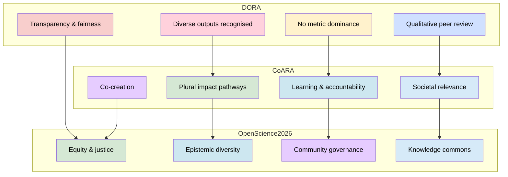
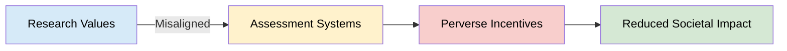
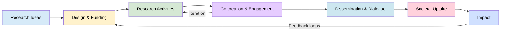
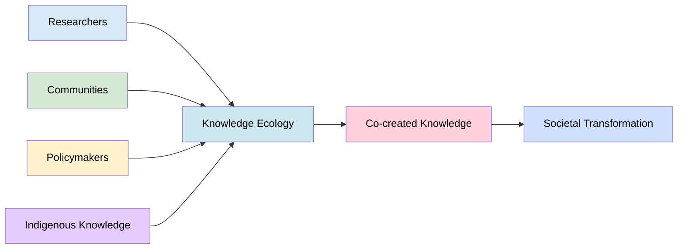
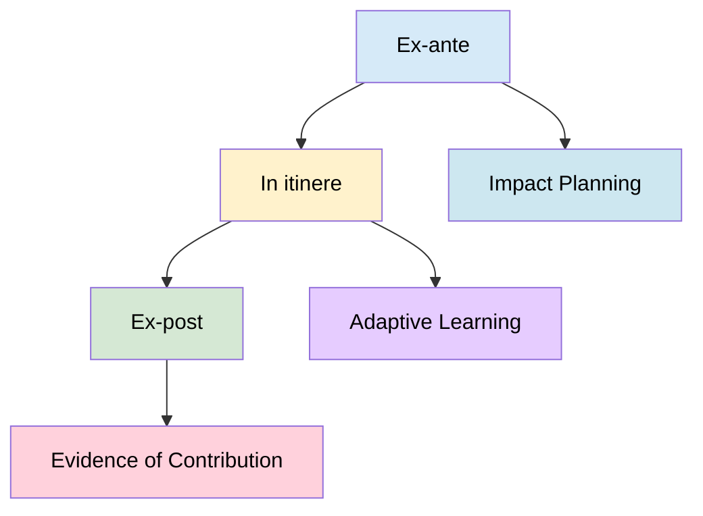
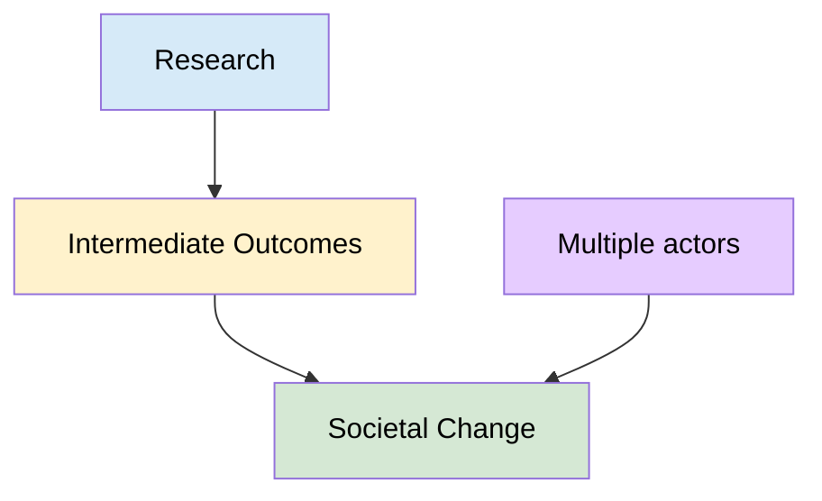
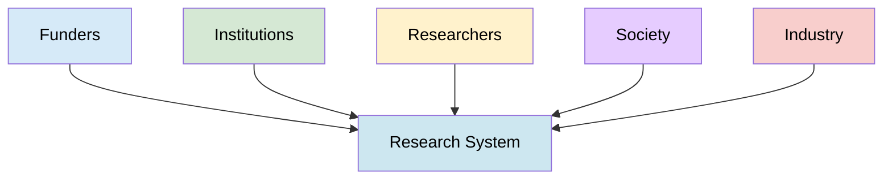
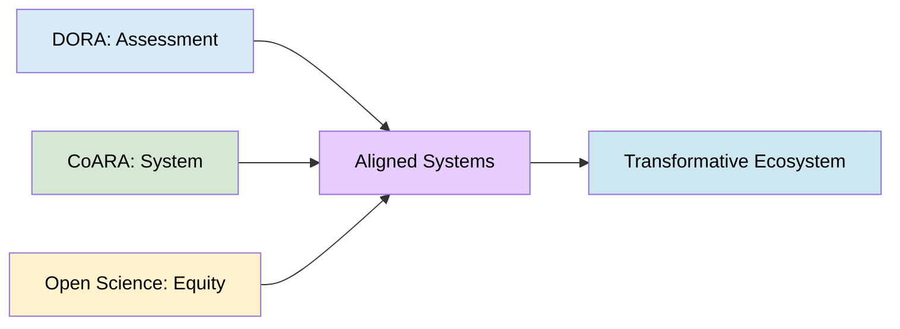

#  A CoARA-DORA Aligned Guide for Evaluating Societal Impact in Research
 
> The following resources informed the development of this guide:
>
> - [The Academic Impact of Open Science: A Scoping Review](https://royalsocietypublishing.org/rsos/article/12/3/241248/87747/The-academic-impact-of-Open-Science-a-scoping)
> - [Research Impact and Open Science: A Practical Guide](https://discoverresearch.cloud/blog/research-impact-open-science-guide)
> - [European Commission Open Science](https://research-and-innovation.ec.europa.eu/strategy/strategy-research-and-innovation/our-digital-future/open-science_en)
> - [Science *Open Science Is Delivering Benefits, but Evidence Is Still Emerging*](https://www.science.org/content/article/open-science-delivering-benefits-major-study-finds-proof-sparse)
> - [Open Economics Knowledge Base Measurable Effects of Open Science](https://openeconomics.zbw.eu/en/knowledgebase/measurable-effects-of-open-science/)
>

## Overview

This guide synthesises three converging reform agendas:

- **CoARA** systemic transformation of research assessment

- **DORA** responsible, fair, and non-metric-based evaluation

- **Reimagined Open Science** (2026) equitable, plural, and justice-oriented knowledge systems

Open Science and Research Assessment Reform are increasingly recognised as interconnected developments that seek to make research more collaborative, transparent, inclusive, and accountable. Together, they promote a vision of **research as a socially embedded activity** in which knowledge is co-created and applied through partnerships between researchers, communities, policymakers, practitioners, industry, and citizens.

Achieving this transformation requires more than simply adopting open practices. Open Science **must be supported by** institutional cultures, governance structures, incentives, funding mechanisms, and assessment systems that recognise and reward openness, collaboration, reproducibility, public engagement, and knowledge sharing. Without such alignment, researchers may face tensions between Open Science values and traditional measures of success.

Consequently, growing attention is being given to integrating Open Science with Research Assessment Reform, to create **more equitable and inclusive research systems by recognising diverse contributions, valuing different forms of knowledge, broadening participation, and promoting fairness and epistemic justice**. Strategic alignment across assessment, funding, and institutional priorities is essential to ensure that reforms reinforce one another and support the development of more responsible, inclusive, and socially responsive research cultures. See [Global Research Council](https://globalresearchcouncil.org/fileadmin//meetings/documents/2025_Regional_Meetings/2025_GRC_Regional_Meeting_Discussion_Paper_Open_Science.pdf)

### Reframing Research: From Outputs to Societal Value

Assessment systems shape researcher behaviour by signalling what institutions value and reward. As a result, changing assessment criteria is one of the most powerful mechanisms available for influencing research culture. When evaluation systems broaden their focus beyond publication metrics to include research quality, openness, collaboration, and societal contribution, they encourage practices that create long-term value for both research communities and society.

Research Assessment Reform seeks to shift attention from measuring productivity and prestige towards recognising meaningful contributions, responsible research practices, and broader forms of impact. This helps align institutional incentives with the goals of Open Science, research integrity, and public benefit.

| Traditional Assessment Approaches | Reformed Assessment Approaches |
|----------------------------------|--------------------------------|
| Emphasis on journal prestige and citation metrics | Emphasis on research quality, rigour, and contribution |
| Assessment based on publication venue | Assessment based on the content and value of the research itself |
| Focus on individual outputs | Recognition of collaboration, team science, and diverse contributions |
| Narrow measures of academic impact | Consideration of societal, cultural, policy, and educational impact |
| Rewarding quantity of outputs | Rewarding openness, transparency, integrity, and responsible research practices |
| Limited recognition of data, software, and engagement activities | Recognition of datasets, software, public engagement, leadership, and knowledge exchange |

International initiatives such as DORA and CoARA have been influential in driving this transition. DORA explicitly rejects the use of journal-based metrics, including the Journal Impact Factor, as a proxy for assessing the quality of research or researchers. CoARA further promotes assessment approaches that recognise diverse research contributions and place greater emphasis on qualitative judgement, openness, collaboration, and societal relevance.

Ultimately, reforming what is recognised and rewarded helps create research environments in which researchers are encouraged to pursue high-quality, transparent, and impactful work rather than optimising for narrow performance indicators.

## Research in Society

The long-term sustainability and legitimacy of research increasingly depends upon its ability to demonstrate value beyond academia. As societies face complex social, environmental, economic, and technological challenges, there is growing recognition that research should not only generate knowledge, but also contribute to public understanding, evidence-informed decision-making, innovation, and societal wellbeing.

Open Science and Research Assessment Reform both emphasise the importance of strengthening connections between research and society. This involves moving beyond models in which knowledge is primarily produced within academic institutions, and subsequently transferred to wider audiences. Instead, research is increasingly understood as a collaborative process that benefits from engagement with communities, policymakers, practitioners, industry, and civil society throughout the research lifecycle.

Embedding research within societal processes helps to:

- Strengthen public trust in research and research institutions.
- Improve the relevance and responsiveness of research agendas.
- Enhance the uptake and application of research evidence.
- Support innovation and problem-solving across sectors.
- Increase opportunities for knowledge exchange and mutual learning.
- Demonstrate the wider public value of research investment.

This approach aligns closely with emerging Research Assessment Reform frameworks, including CoARA, which encourage the recognition of activities that connect research with society and contribute to positive societal outcomes. These include:

- **Co-creation**, where researchers and stakeholders collaboratively shape research questions, methods, and outputs.
- **Societal engagement**, where communities, practitioners, policymakers, and citizens actively participate in research processes.
- **Knowledge exchange**, where expertise, evidence, and experience are shared across academic and non-academic communities.

### Diagnosing the Problem

Many of the challenges facing contemporary research systems are not the result of individual researcher behaviour, but of the incentives created by the systems used to evaluate and reward research. When assessment frameworks prioritise publication counts, journal prestige, and citation-based indicators, researchers may be encouraged to focus on activities that improve evaluation outcomes rather than those that maximise research quality, openness, collaboration, reproducibility, or societal benefit.

Over time, these incentives can create inefficiencies across the research ecosystem. Significant time, effort, and resources may be directed towards achieving narrow performance indicators, while activities that contribute to long-term research quality and public value receive less recognition. As a result, important contributions such as data sharing, software development, mentoring, interdisciplinary collaboration, public engagement, and knowledge exchange may be undervalued despite their importance to research and society.

Common challenges within traditional research assessment systems include:

- An over-reliance on quantitative indicators as proxies for quality.
- Narrow definitions of research excellence focused primarily on publications and citations.
- Limited recognition of diverse research outputs, practices, and contributions.
- Incentives that favour competition over collaboration.
- Insufficient recognition of openness, transparency, and reproducibility.
- Underrepresentation of societal, cultural, policy, and community impacts within evaluation processes.
- Assessment frameworks that disadvantage interdisciplinary, collaborative, or non-traditional forms of research.

These limitations can distort researcher behaviour, reinforce existing inequalities, and constrain the full potential of research to contribute to societal challenges and public benefit. [[opusproject.eu]](https://opusproject.eu/openscience-news/celebrating-12-years-of-dora-a-new-guide-to-responsible-research-assessment/)

Recognising non-linear pathways enables more realistic planning, funding, and evaluation. Linear models underestimate complexity and lead to unrealistic expectations, whereas pathway-based thinking supports adaptive and resilient systems.

### Knowledge Ecology Model

Acknowledging multiple knowledge systems broadens relevance and inclusivity. It also reduces systemic bias by recognising that valuable knowledge is produced across different contexts and communities. [[Global Research Council]](https://globalresearchcouncil.org/fileadmin//meetings/documents/2025_Regional_Meetings/2025_GRC_Regional_Meeting_Discussion_Paper_Open_Science.pdf)

## Evaluation Architecture

Contribution-based evaluation enables fairer assessment in complex systems where outcomes are co-produced. It supports collaboration and reduces the distortion caused by attempts to attribute impact to individual actors.

### Multi-Stage Evaluation

### Contribution-Based Evaluation

## Institutional Transformation

Transformation is cumulative. Incremental changes in evaluation practices can lead to broader cultural shifts, but only if supported by consistent incentives, governance, and capacity-building.

Structural change requires enabling conditions. Without infrastructure, training, and aligned incentives, reforms remain symbolic and fail to produce lasting change.

## Implementation Roadmap

Staged implementation reduces risk and allows learning. Sequencing reforms ensures that foundational changes (evaluation) support more complex transformations (societal impact and knowledge justice).

Phase 1: Reform Assessment

- Remove metric dominance
- Recognise diverse outputs

Phase 2: Embed Impact

- Integrate pathways
- Reform evaluation

Phase 3: Reimagine Open Science

- Embed equity
- Support diverse knowledge systems

