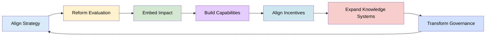

# A CoARA-DORA Aligned Institutional Maturity Guide for Societal Impact Evaluation
 
> The following resources informed the development of this guide:
>
> - [DORA (Declaration on Research Assessment)](https://sfdora.org/)
> - [CoARA (Coalition for Advancing Research Assessment)](https://www.coara.org/)
> - [CoARA Agreement on Reforming Research Assessment](https://www.coara.org/agreement/the-agreement-full-text/)
> - [UNESCO Recommendation on Open Science](https://www.unesco.org/en/open-science/about)
> - [UNESCO Recommendation on Open Science (Full Text)](https://unesdoc.unesco.org/ark:/48223/pf0000379949)
> - [Barcelona Declaration on Open Research Information](https://barcelona-declaration.org/)
>

## Introduction
This guide provides a structured maturity model for institutions seeking to align their research strategies, cultures, and assessment practices with internationally recognised frameworks for responsible research and innovation:

- **DORA** promoting research assessment based on quality, contribution, and impact rather than journal-based metrics.
- **CoARA** supporting systemic reform of research evaluation, recognition, reward, and incentive structures.
- **Open Science** advancing transparency, inclusivity, knowledge sharing, equity, and societal engagement throughout the research lifecycle.

Although these initiatives emerged from different policy contexts, they converge around a common message: **research excellence should be recognised through the quality of research practices, the diversity of contributions, and the value generated for research communities and society, rather than through narrow indicators of prestige or productivity alone.**

Across these frameworks, a consistent message emerges:
> *research quality cannot be reduced to publication metrics, and effective research systems must recognise diverse contributions, societal engagement, and equitable knowledge production. [[DORA]](https://sfdora.org/read/), [[Global Research Council]](https://globalresearchcouncil.org/fileadmin//meetings/documents/2025_Regional_Meetings/2025_GRC_Regional_Meeting_Discussion_Paper_Open_Science.pdf)

This maturity model is designed to help institutions understand where they are currently positioned in their journey towards more responsible, open, and inclusive research systems. It provides a practical framework for reviewing existing policies, practices, cultures, and incentives, while identifying opportunities for progressive and sustainable change.

The model can be used to:

- Diagnose current institutional approaches to research assessment, recognition, and reward.
- Identify strengths, gaps, and priority areas for development.
- Support strategic planning and staged organisational transformation.
- Align research culture, evaluation processes, incentives, and governance with institutional values.
- Embed Open Science, responsible research assessment, and societal engagement across research systems.
- Monitor progress towards cultural and organisational change over time.

## How to Use This Guide

The maturity model is intended as a reflective and developmental tool rather than a compliance checklist. Institutions may find themselves operating at different levels of maturity across different areas, and variation across faculties, departments, disciplines, or research units is both common and expected.

To use the model effectively:

- Read across each dimension to understand the characteristics associated with different levels of maturity.
- Identify which level most closely reflects current institutional practice.
- Consider where practices vary across departments, faculties, disciplines, or professional services.
- Use the descriptions to facilitate discussion among leaders, researchers, managers, and support staff.
- Identify priority areas for improvement and opportunities for action.
- Develop realistic plans for progression that are aligned with institutional strategy and capacity.
- Revisit the model periodically to monitor progress and support continuous improvement.

The goal is not to achieve a particular maturity level immediately, but to support a process of ongoing learning, reflection, and institutional development. By using the model strategically, institutions can build research environments that better recognise diverse contributions, support Open Science, strengthen research integrity, and create greater value for both research communities and society.

| **Capability Dimension** | **Level 1** Metric-Dominated | **Level 2** Emerging Awareness | **Level 3** Structured Reform | **Level 4** Integrated Impact System | **Level 5** Transformative Knowledge System |
|--------------------------|--------------------------------|----------------------------------|---------------------------------|----------------------------------------|-----------------------------------------------|
| **Assessment & Evaluation** | Evaluation dominated by journal metrics and publication counts | Pilots of narrative CVs or alternative indicators | Formal adoption of DORA principles; mixed qualitative and quantitative evaluation | Contribution-based evaluation systems embedded across processes | Context-sensitive, equity-aware evaluation recognising diverse knowledge forms |
| **Research Outputs Recognised** | Focus on journal articles | Recognition of broader outputs emerging | Diverse outputs formally recognised (data, software, policy, education) | Outputs aligned with societal pathways and impact | Includes multilingual, community-based, and non-academic knowledge |
| **Research Culture & Incentives** | Competition-driven; metric optimisation | Early recognition of collaboration and engagement | Incentives partially aligned with openness and impact | Collaboration, openness, and engagement consistently rewarded | Inclusive, equitable, and reflexive culture embedded |
| **Societal Engagement** | Minimal or ad hoc | Outreach and communication activities | Structured engagement strategies | Co-creation embedded in research design | Community-led and participatory research models institutionalised |
| **Open Science Practices** | Limited or compliance-based | Open access policies adopted | Broader open practices (data, methods) expanding | Open collaboration ecosystems established | Knowledge commons with shared governance |
| **Governance & Strategy** | Fragmented or absent | Strategic intent articulated | Formal commitments (e.g. DORA, CoARA) adopted | Alignment across policy, funding, and evaluation | Participatory governance with diverse stakeholders |
| **Equity & Inclusion in Knowledge Systems** | Limited consideration | Awareness of bias and inequities | Inclusion measures introduced | Equity integrated into evaluation and practice | Epistemic diversity and knowledge justice embedded |
| **Impact Planning & Pathways** | No formal pathways | Awareness of impact pathways | Impact planning integrated in proposals | Impact embedded across lifecycle and evaluation | Impact understood as systemic transformation |

## Interpreting Your Position
Typical Profiles

- Level 1 Early-stage institutions
- Level 3 Reforming institutions
- Level 4 Advanced, impact-oriented institutions
- Level 5 Transformative, globally leading systems

# A Roadmap for Advancing CoARA and DORA-Aligned Transformation

Transforming research assessment and research culture requires more than isolated policy changes or individual initiatives. Meaningful reform occurs when institutions align their systems of evaluation, recognition, governance, and support around a shared vision of research excellence that values quality, openness, collaboration, integrity, and societal contribution.

Frameworks such as DORA, CoARA, and the UNESCO Recommendation on Open Science all emphasise that sustainable change depends upon addressing the underlying structures, incentives, and behaviours that shape research practice. This means moving beyond metric-driven approaches towards research environments that recognise diverse contributions, support responsible research practices, and create value for both research communities and society.

Institutional transformation, therefore, requires coordinated action across multiple areas, including:

- **Research assessment and evaluation**, ensuring that quality, contribution, and impact are valued over prestige-based indicators.
- **Recognition and reward systems**, so that diverse outputs and contributions are visible and valued.
- **Research culture and leadership**, creating environments that support openness, collaboration, integrity, and inclusivity.
- **Open Science implementation**, enabling transparency, reproducibility, knowledge sharing, and public engagement.
- **Equity, diversity, and inclusion**, ensuring that different forms of scholarship, expertise, and career pathways are recognised.
- **Societal engagement and impact**, strengthening connections between research and the communities it serves.

The roadmap that follows is designed as a practical framework to help institutions move from fragmented or isolated activities towards coherent, organisation-wide change. It supports leaders in identifying priorities, building momentum, and embedding reform in ways that are sustainable, strategic, and aligned with institutional missions.

Rather than viewing assessment reform, Open Science, and research culture as separate agendas, the roadmap encourages institutions to treat them as interconnected elements of a broader transformation. By aligning evaluation systems, incentives, leadership practices, infrastructure, and organisational values, institutions can create research environments that better recognise the diverse ways in which excellent research is generated, shared, and applied.

The following guidance provides a sequenced and strategic set of actions designed to move institutions from fragmented efforts toward coherent, system-wide change.

| **Action Area** | **Key Actions** | **Why This Matters** |
|----------------|----------------|----------------------|
| **A. Move from Awareness to Alignment** | Translate strategy into operational criteria; ensure evaluation, hiring, and funding reflect stated priorities | Without alignment, strategies remain symbolic and fail to influence behaviour or outcomes |
| **B. Redesign Evaluation Systems First** | Remove inappropriate uses of metrics; introduce narrative CVs, qualitative peer review, and contribution-based assessment | Evaluation systems drive behaviour and are the most powerful lever for systemic change |
| **C. Embed Societal Impact Across the Lifecycle** | Require impact planning at design, funding, and evaluation stages; support impact pathways and stakeholder engagement | Impact cannot be retrofitted; it must be integrated from the beginning of research processes |
| **D. Invest in Capabilities** | Build capacity in impact literacy, evaluation literacy, and co-creation methods | Transformation requires skills and competencies; without them, reforms cannot scale or sustain |
| **E. Align Incentives with Desired Behaviours** | Reward collaboration, openness, engagement, and diverse outputs | Incentives shape priorities; misalignment undermines reform and reinforces old behaviours |
| **F. Expand the Concept of Knowledge** | Recognise Indigenous, local, and non-academic expertise; support multilingual outputs and community participation | Inclusive knowledge systems produce more relevant, legitimate, and equitable research outcomes |
| **G. Enable Governance Transformation** | Move toward participatory governance, shared decision-making, and community accountability | Sustainable reform requires changes in decision-making structures and power distribution |

### Early stages: Focus on DORA alignment

- Reform evaluation
- Remove metric dominance

### Middle stages: Focus on CoARA system transformation

- Embed impact
- Align incentives and behaviour

### Advanced stages: Focus on Open Science 

- Equity
- Knowledge diversity
- Governance reform

