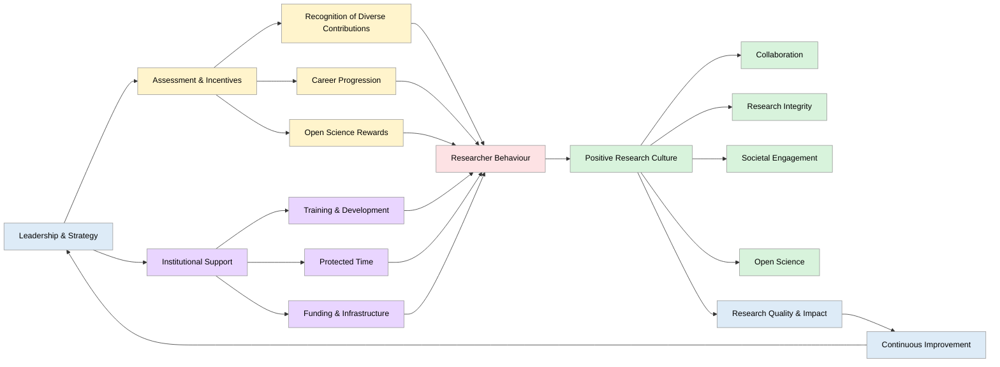
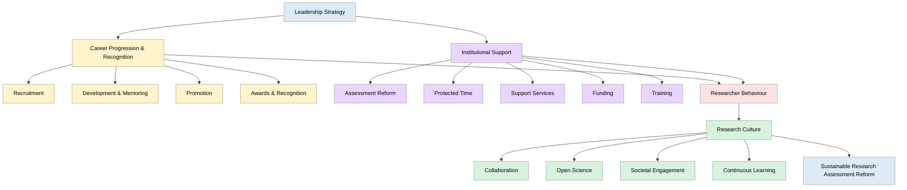

> The following resources informed the development of this guide:
>
> - [European Commission – Evaluation of Research Careers Fully Acknowledging Open Science Practices](https://op.europa.eu/en/publication-detail/-/publication/47a3a330-c9cb-11e7-8e69-01aa75ed71a1/)
> - [OPUS (Open and Universal Science) – Open Science Career Assessment Matrix (OSCAM2)](https://opusproject.eu/oscam/)
> - [Wellcome – Guidance for Research Organisations on Responsible and Fair Research Assessment](https://wellcome.org/research-funding/guidance/ending-a-grant/open-access-guidance/research-organisations-how-implement-responsible-and-fair-approaches-research)
> - [UNESCO – Committing to Global Reform in Research Assessment (DORA)](https://www.unesco.org/en/open-science/inclusive-science/committing-global-reform-research-assessment-dora)
> - [Social Sciences and Humanities Research Council (SSHRC) – Best Practices in Scholarly Research Assessment with DORA](https://sshrc-crsh.canada.ca/en/funding/how-applications-are-reviewed/dora.aspx)
>

## Introduction

**Research Assessment Reform (RAR)** requires more than changing evaluation criteria or introducing new metrics. It involves reshaping the **incentives** that influence researcher behaviour, institutional priorities, and research culture. Traditional assessment systems have often relied on **publication counts**, **citations**, and **journal prestige**, which can overlook valuable contributions to research quality, openness, integrity, collaboration, and societal impact.

There is growing international recognition that **research excellence** should be assessed more broadly. Contemporary frameworks encourage the recognition of diverse outputs and contributions, including **data sharing**, **software development**, **public engagement**, **mentoring**, **interdisciplinary collaboration**, **reproducibility**, and **societal impact** alongside traditional scholarly achievements.

Because researchers respond to what is rewarded, **assessment systems** play a powerful role in shaping research practices. When institutions recognise a wider range of contributions, these activities become more integrated into everyday research.

Effective reform requires alignment across:

- Recruitment and appointment processes.
- Promotion and career progression frameworks.
- Performance and development reviews.
- Funding and recognition schemes.
- Research assessment procedures.
- Institutional strategy and leadership expectations.

A responsible assessment approach should:

- Recognise diverse contributions, outputs, and career pathways.
- Prioritise qualitative judgement supported by appropriate indicators.
- Reward openness, integrity, collaboration, and research quality.
- Value societal engagement and public benefit.
- Promote inclusive and sustainable research cultures.

Incentive systems do more than reward performance'they define what institutions value. Aligning incentives with **responsible assessment principles** helps create research environments that are more open, inclusive, trustworthy, and impactful.

| Principle | Description |
|----------|-------------|
| **1.1 Societal relevance as a core criterion** | Research assessment must treat societal contribution as a dimension of excellence, not an optional add-on. |
| **1.2 Pluralism in contributions** | Different disciplines and career stages contribute in diverse ways, including policy engagement, community impact, infrastructure building, and teaching innovation. |
| **1.3 Early integration of impact** | Impact must be planned from the outset, rather than retrospectively added. |
| **1.4 Co-creation and collaboration** | Incentives must support partnerships with stakeholders, recognising relational and engagement work. |
| **1.5 Risk awareness and ethics** | Researchers should be rewarded for anticipating unintended consequences and reflecting on ethical implications. |
| **1.6 Learning-oriented evaluation** | Assessment should support continuous improvement and learning, rather than focusing solely on summative judgement. |

## Incentives Across Career Stages

Effective Research Assessment Reform depends on recognising that researchers contribute in different ways throughout their careers. A single model of evaluation or reward is unlikely to support the full diversity of activities, responsibilities, and contributions that characterise contemporary research. Instead, institutions need incentive systems that reflect changing career stages, evolving expertise, and the varied ways researchers create value for their disciplines, institutions, and society.

Historically, research careers have often been shaped by incentives that prioritise publication outputs, citation metrics, and individual achievement. While these indicators may influence career progression, they can inadvertently discourage activities that are essential for high-quality, open, collaborative, and impactful research. As a result, many researchers face tensions between activities that are formally rewarded and those that contribute to research integrity, capacity building, societal engagement, and positive research culture.

A more responsible approach recognises that incentives should evolve across the career lifecycle, supporting researchers as they develop from consumers of research culture into contributors, leaders, mentors, and stewards of research systems.

Across all career stages, effective incentive systems should:

- Recognise diverse forms of contribution and scholarship.
- Support Open Science, research integrity, and responsible research practices.
- Value both individual and collective achievement.
- Encourage collaboration, interdisciplinarity, and knowledge exchange.
- Promote inclusion, equity, and diverse career pathways.
- Align assessment and reward systems with institutional values and societal needs.

Importantly, different career stages often face different opportunities and challenges. Early career researchers may require protection from excessive metric-driven pressures and support in developing professional capabilities. Mid-career researchers often play a key role in driving innovation, building collaborations, and shaping local research cultures. Senior researchers and leaders influence institutional priorities, assessment systems, and organisational norms through the decisions they make and the behaviours they reward.

At the same time, contemporary research increasingly relies on contributions from individuals whose roles do not fit traditional academic career models. Research software engineers, data stewards, knowledge exchange specialists, technicians, research managers, public engagement professionals, and infrastructure specialists make essential contributions to research quality and impact. Institutions therefore need incentive and recognition systems that acknowledge these diverse forms of expertise alongside conventional academic achievements.

| Career Stage | Key Incentives | Rationale | Implementation Actions |
|-------------|--------------|-----------|------------------------|
| **Doctoral & Early Career Researchers (ECRs)** | Recognition of diverse outputs; impact literacy training; mentorship; reduced emphasis on journal prestige; seed funding; recognition of team science | ECRs are constrained by legacy publication-focused incentives which can discourage engagement and innovation | Embed impact criteria in doctoral and probation reviews; introduce narrative CVs; provide protected time for training and engagement |
| **Mid-Career Researchers** | Promotion criteria recognising engagement, interdisciplinarity and societal contributions; funding tied to impact pathways; recognition of leadership and brokerage roles; rewards for open science | Mid-career researchers are key actors in scaling innovation and shaping research culture | Introduce dual career pathways; provide internal funding for impact collaborations; recognise team-based contributions |
| **Senior Researchers / Professorial Staff** | Recognition of leadership in reform, mentoring, and collaboration; institutional citizenship; incentives for leading assessment reform | Senior researchers shape institutional norms and decision-making structures | Include impact leadership in promotion criteria; establish impact awards; link leadership roles to mentoring responsibilities |
| **Alternative & Hybrid Career Pathways** | Formal roles for knowledge brokers, research software engineers, impact officers, engagement specialists; recognition of non-traditional contributions | Impact-oriented systems require specialised roles beyond traditional academic pathways | Create formal career pathways; integrate roles into funding and evaluation systems |

> Incentives are most effective when they are developmental, staged, and systemic'supporting researchers not only to succeed individually, but to contribute meaningfully to institutional and societal transformation.

## Incentives Along Career Progression Pathways and Institutional Implementation

Effective reform of research assessment requires aligning career progression incentives with institutional mechanisms, ensuring that expectations placed on researchers are consistently supported by organisational structures, resources, and culture. Rather than treating recruitment, promotion, and rewards as discrete processes, senior leadership should adopt a whole-system approach, where incentives are embedded coherently across the academic lifecycle and reinforced through institutional capacity.

| Pathway Stage / Mechanism | Key Incentives and Practices | Strategic Purpose | Institutional Enablers |
|--------------------------|-----------------------------|-------------------|------------------------|
| **Recruitment** | Use narrative CVs; assess team contributions, engagement, and open science practices | Shift from metric-based selection to holistic evaluation of contributions | Reform job descriptions; train panels in qualitative assessment; adopt portfolio-based review |
| **Probation & Confirmation** | Evaluate development of impact pathways; assess collaboration and engagement; provide structured mentorship | Support early-career development and embed impact practices from the outset | Formal mentoring programmes; clear evaluation criteria; protected time for development |
| **Promotion** | Assess contributions and outcomes rather than outputs; include societal impact, collaborative leadership, and mentoring | Align career advancement with institutional mission and societal value | Revised promotion frameworks; recognition of team science; narrative and evidence-based assessment |
| **Recognition & Rewards** | Awards for societal impact, engagement, and collaboration; financial incentives linked to impact | Reinforce desired behaviours and signal institutional priorities | Impact award schemes; alignment with funding models (e.g. REF-type incentives) |
| **Hiring & Promotion System Reform** | Integration of impact criteria into all decision frameworks; portfolio-based assessment | Ensure consistency across evaluation processes | Institutional policy reform; governance oversight; leadership commitment |
| **Protected Time Allocation** | Workload recognition for engagement, co-creation, and impact planning | Enable meaningful participation in impact-oriented activities | Workload models; departmental planning; performance review alignment |
| **Dedicated Support Structures** | Establish impact offices, knowledge brokers, engagement units | Provide expertise and operational support for impact activities | Investment in professional roles; integration into research processes |
| **Funding & Resource Allocation** | Seed funding, partnership grants, post-project impact funding | Enable sustained engagement and longitudinal impact tracking | Internal funding schemes; alignment with external funders |
| **Training & Capacity Building** | Programmes in impact literacy, stakeholder engagement, evaluation methods | Build institutional capability and culture of impact | Doctoral training integration; professional development programmes |

> Reform succeeds when career progression incentives and institutional systems are mutually reinforcing: it is insufficient to change what is rewarded without also transforming the conditions that enable those behaviours.

This integrated approach ensures that:

- Researchers are evaluated fairly and holistically
- Institutions provide the means to achieve desired outcomes
- The system transitions from compliance-driven assessment to a culture of responsible, impactful research

# Monitoring, Evaluation, and Strategic Leadership for Incentive Reform

| Dimension | Key Practices | Strategic Purpose | Leadership Actions |
|----------|--------------|------------------|--------------------|
| **Mixed-Method Evaluation** | Combine quantitative indicators with narrative evidence, case studies, and qualitative insights | Capture the full range of research contributions, including complex and long-term impacts | Develop integrated evaluation frameworks; balance metrics with expert judgement; support case study development |
| **Contribution-Based Assessment** | Focus on contribution rather than attribution in complex systems | Reflect the collaborative and systemic nature of research impact | Adopt contribution-focused evaluation criteria; train evaluators in qualitative and systems-based assessment |
| **Iterative Learning Systems** | Use evaluation to support institutional learning and continuous improvement | Enable adaptive and responsive reform processes | Establish feedback loops; embed evaluation into governance cycles; promote organisational learning cultures |
| **Promotion Reform** | Incorporate societal impact, collaboration, and engagement into promotion criteria | Align career incentives with institutional mission and public value | Revise promotion frameworks; ensure consistency across departments; monitor outcomes |
| **Infrastructure Investment** | Invest in impact offices, knowledge brokers, and training systems | Provide operational capacity to support impact and engagement | Allocate sustained funding; integrate support roles into strategy; evaluate effectiveness of support structures |
| **Funding Alignment** | Align internal funding with impact-oriented goals | Reinforce desired behaviours through resource allocation | Introduce impact-linked funding schemes; support co-creation and long-term partnerships |
| **Protected Time** | Ensure workload models support engagement and co-creation | Enable meaningful participation in impact activities | Adjust workload allocation; monitor equity and access across disciplines |
| **Impact Literacy** | Embed training across all career stages | Build institutional capability for impact-oriented research | Integrate into doctoral and staff development programmes |
| **Narrative Evaluation Systems** | Adopt narrative CVs and portfolio-based approaches | Enable holistic evaluation of diverse contributions | Standardise narrative formats; train reviewers; ensure transparency and fairness |

Sustainable reform is most effective when it is viewed as a continuous cycle of learning, improvement, and adaptation rather than a one-off change programme. Lasting change emerges when incentives, evaluation processes, and institutional learning mechanisms are aligned and regularly reviewed to ensure they support the behaviours and outcomes that institutions wish to encourage.

In this model, assessment systems generate evidence about research practices and contributions; incentive structures reward and reinforce desired behaviours; and institutional learning uses this information to refine policies, processes, and support mechanisms. Together, these elements create a feedback loop that enables organisations to respond to changing research environments while maintaining alignment with their strategic goals and values.

A learning-oriented approach helps institutions ensure that:

- Incentives evolve in response to changing research practices, technologies, and societal expectations.
- Assessment processes recognise diverse, collaborative, interdisciplinary, and non-traditional forms of contribution.
- Open Science practices, research integrity, and societal engagement are consistently valued and rewarded.
- Researchers receive clear and coherent signals about what constitutes excellence.
- Organisational policies and reward systems remain aligned with institutional missions and priorities.
- Evidence gathered through monitoring and evaluation informs ongoing improvement.

