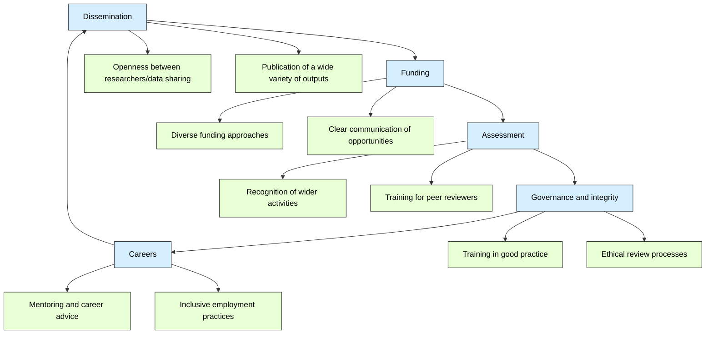

# Building a Positive Research Culture
 
> The following resources informed the development of this guide
>
> - [Nuffield Council on Bioethics N(2014) *The culture of scientific research: the findings of a series of engagement activities exploring the culture of scientific research in the UK*](https://www.nuffieldbioethics.org/publication/the-culture-of-scientific-research-the-findings-of-a-series-of-engagement-activities-exploring-the-culture-of-scientific-research-in-the-uk/)   
> - [Wellcome (2020) *What researchers think about the culture they work in*](https://cms.wellcome.org/sites/default/files/what-researchers-think-about-the-culture-they-work-in.pdf)  
> - [UNESCO (2021) *Recommendation on Open Science*](https://unesdoc.unesco.org)  
> - [CoARA (n.d.) *Coalition for Advancing Research Assessment*](https://coara.eu)  
> - [San Francisco Declaration on Research Assessment (DORA) (2012) *San Francisco Declaration on Research Assessment*](https://sfdora.org)  
> - [Vitae (2025) *The Vitae Research Culture Landscape Survey: What we learned and why it matters*](https://vitae.ac.uk/the-vitae-research-culture-landscape-survey-what-we-learned-and-why-it-matters/) and [UKRI *Explainer: how UKRI is supporting research culture*](https://www.ukri.org/publications/explainer-research-culture/)  

## **What is a positive research culture?**

Research culture is made up of many things including the **behaviours, expectations and norms within the research community**. These impact how research is conducted, shared and evaluated. Research culture also has a significant influence on researchers' career paths and the choices they make when developing and sharing their work. Evidence suggests that negative aspects of culture can create barriers to positive research and innovation by: 

- Creating competition for funding  
- Focusing on quantity of outputs rather than quality research  
- Encouraging heavy workloads through the pressure to publish  
- Limiting innovation by creating a narrow view of what counts as good research  

In these conditions, researchers feel under pressure to publish, especially where institutions **focus on quantity, sometimes over quality**. In the longer term this does not create a sustainable system and runs the risk of losing talent and the opportunity for real innovation.  

## Open Science and the research culture  

The adoption of open science practices is widely recognised as an effective approach to enhancing research cultures. This is advocated by a number of organisations:  

The **Declaration of Research Assessment (DORA)** advocates for responsible and fair research practice and emphasises the importance of using qualitative assessments which recognise diverse research and scholarly activity.[DORA](https://sfdora.org/)

The **Coalition for Advancing Research Assessment (CoARA)** is reforming research evaluation by also recognising the need for diverse research activities and promoting the early sharing of knowledge and data. [CoARA](https://www.coara.org/) 

**UNESCO** advocates for transparency, accessibility and collaboration through open access to publications, data, educational resources and software. It acknowledges the importance of open infrastructures such as digital platforms that allow effective dissemination of knowledge as well as engagement with stakeholders. [Open science | UNESCO](https://www.unesco.org/en/open-science/about) 

Scholarly publishing and Academic Resources Coalition (SPARC) advocates for openness across all aspects of education and aims to drive this by influencing policy to ensure access to and use of research and education resources Home - [SPARC Europe](https://sparceurope.org/) 

The underlying principles for all of these organisations are clear – research can and should be carried out in an environment that operates on the principles of accessibility, transparency, reproducibility, inclusivity and FAIR data.  

## Supporting Researchers  

It is common for researchers to feel obligated to publish regularly and to publish in particular journals. This not only puts individuals under pressure, but it can also lead to practice that is less than rigorous. See specific examples here [Research culture is broken](https://www.youtube.com/watch?v=c-bemNZ-IqA&t=8s)  

To create a positive and sustainable research culture, offering constructive support to researchers is essential. Researchers have a stake in creating a positive culture, alongside research leaders, funders and institutions. Studies gathering data on researchers' views show several factors considered to be important (Vitae 2025, Wellcome 2020):  

- Security – offering stable career options and the sense of belonging to a research community.  
- Fairness – equitable recognition and assessment showing that all research contributions are valued whether from those in research roles or in supporting roles (such as technicians and support staff)  
- Inclusivity – valuing diversity and all roles in the process.  
- Collaborative approaches that remove the need for excessive competition.  
- Encouraging risk-taking and innovation by recognising failure as a part of the research process.  
- Purpose driven research – focussed on quality, integrity and impact.  
- Wellness – recognition of researcher wellbeing and the need to be free from bullying or harassment.  

The importance of research culture is widely recognised and is summarised effectively in this resource from the [Royal Society Research Culture](https://royalsociety.org/news-resources/publications/2018/research-culture-embedding-inclusive-excellence/)  

## Leading Research  

Leading a positive research culture means creating an environment where people feel supported and motivated and if institutions are keen to improve the research cultures, some of the concerns highlighted need to be addressed through practical and visible change. The Nuffield Review suggests a simple framework to support good research (figure 1).  
 

A strong culture begins with shared principles and clear communication. This sets the scene for defining expectations around research quality and rigour, ethical practice, inclusivity and professionalism.  Other key considerations are:

- The promotion of psychological safety so that participants are encouraged to contribute ideas or express concerns.  

- Encouraging exploration through questions and debate and supporting innovation. 

- Avoiding a blame culture by accepting and normalising mistakes as a part of the process. 

- Encouraging collaboration rather than competition by actively supporting interdisciplinary research, joint publications and collaborative bids.  

- Recognising and celebrating contributions, small wins and reaching milestones. Implementing steps to manage pressure by setting realistic expectations/timelines, respecting boundaries in relation to work-life balance and encouraging flexible working where possible. 

A positive research culture is also supported by a clear ethical framework that: 

- Promotes honesty and transparency 

- Supports reproducibility  

- Provides ethics training and guidance 

- Makes it safe to raise ethical concerns 

- Addresses misconduct fairly and quickly  

Research culture is dynamic rather than static, so it is also important to evaluate and strive for improvements by gathering data from participants, making appropriate changes and communicating what has been changed and why.   

## Mentoring and Support 

Leaders of research have a crucial role to play in creating the research culture.  Transparency, fairness and leading by example go a long way towards enabling this, however, one or two people do not make a culture, and it is important to consider the support mechanism required for a sustainable approach.  

Support is required at all stages of a career and while this is often addressed for early career researchers (ECRs), it can be neglected for those with more experience, who may still need help with things like developing methodological approaches, using new software or accessing funding. Much of this can be providing through peer learning and collaboration, however, a more structured approach can be offered through a mentoring programme. There are many mentoring frameworks which could be employed (Clutterbuck 2014, Thompson, 2019) and which are more or less directive depending on the model adopted.  Whichever model is adopted, mentoring can be transformational in enhancing criticality through a focus on challenging assumptions and provides the support needed for intellectual risk taking.

## Further reading

> - [Royal Society (2018) *Research culture: embedding inclusive excellence*](https://royalsociety.org/news-resources/publications/2018/research-culture-embedding-inclusive-excellence/)  
> - Clutterbuck, D. (2014) *Everyone Needs a Mentor*. 5th edn. London: CIPD/Kogan Page  
> - Thompson, C. (2019) *The Magic of Mentoring: Developing Others and Yourself*. London: Routledge  
> - [Atenas, J., Nerantzi, C. and Bussu, A. (2023) *A Conceptual Approach to Transform and Enhance Academic Mentorship: Through Open Educational Practices*](https://openpraxis.org/articles/10.55982/openpraxis.15.4.595)  

