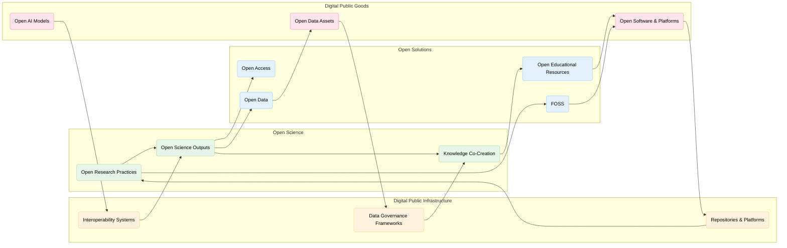
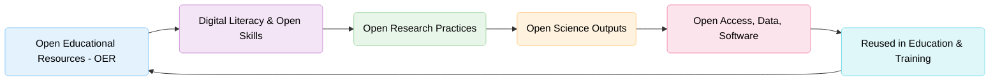

> The following resources informed the development of this guide:
>
> - [UNESCO ÔÇô Open Solutions](https://www.unesco.org/en/open-solutions)
> - [UNESCO Recommendation on Open Science (2021)](https://www.unesco.org/en/open-science/about)
> - [European Commission ÔÇô Open Science](https://rea.ec.europa.eu/open-science_en)
> - [UNESCO ÔÇô Open Solutions and the Digital Public Goods Alliance](https://www.unesco.org/en/articles/unescos-open-solutions-included-digital-public-goods-alliance-roadmap-advance-inclusive-knowledge)
> - [United Nations ÔÇô Digital Public Goods](https://www.un.org/digital-emerging-technologies/content/digital-public-goods)
> - [Digital Public Goods Alliance ÔÇô AI Systems as Digital Public Goods](https://www.digitalpublicgoods.net/blog/ai-systems-as-dpgs)
> - [UNESCO ÔÇô Dubai Declaration on Open Educational Resources (OER): Digital Public Goods and Emerging Technologies for Equitable and Inclusive Access to Knowledge](https://unesdoc.unesco.org/ark:/48223/pf0000392271.locale=en)
>

## A Living Ecosystem of Knowledge

Open Science is more than a collection of practices, policies, or technologies. It represents a fundamental transformation in how knowledge is created, shared, evaluated, and applied. At its core, Open Science promotes a shift from closed and fragmented systems towards more collaborative, transparent, inclusive, and interconnected approaches to knowledge production.

Within an Open Knowledge Ecosystem, knowledge is not viewed as a static product that moves in a single direction from researchers to users. Instead, it is understood as a dynamic and continuously evolving resource that is created, enriched, exchanged, and reused through interactions between researchers, educators, policymakers, practitioners, communities, industry, and citizens. Knowledge flows across disciplinary, institutional, geographic, and societal boundaries, creating opportunities for innovation, learning, and collective problem-solving.

At the heart of this vision lies a powerful principle:

> **Knowledge generated with public resources should function as a public good.**

This principle recognises that research creates the greatest value when it is accessible, reusable, and capable of contributing to scientific advancement, education, policy development, innovation, and societal wellbeing.

The Open Knowledge Ecosystem is enabled through a combination of **Open Solutions**, supported by **Digital Public Goods (DPGs)** and sustained through **Digital Public Infrastructure (DPI)**. Together, these elements create the socio-technical foundations that allow knowledge to move through a continuous cycle:

**Creation  Sharing  Access  Reuse  Impact  New Knowledge**

In this model, openness is not simply about access. It is about creating the conditions that enable knowledge to circulate, evolve, and generate value across society.

### Components of the Open Knowledge Ecosystem

| Component | Role in the Ecosystem |
|------------|----------------------|
| **Policies and Governance** | Establish the principles, rules, and frameworks that support openness, transparency, and responsible knowledge sharing. |
| **Technologies and Infrastructure** | Enable the creation, storage, discovery, preservation, and reuse of research outputs and data. |
| **Open Practices** | Support collaboration, reproducibility, knowledge exchange, and responsible research conduct. |
| **Communities and Networks** | Connect researchers, educators, institutions, policymakers, practitioners, and citizens as active participants in knowledge creation and use. |
| **Digital Public Goods and Infrastructure** | Provide shared, interoperable, and sustainable resources that enable equitable access to knowledge and research services. |

### The Role of Public Universities

Public universities occupy a unique position within this ecosystem. They are not only producers of knowledge, but also custodians of the public value that knowledge creates.

As anchor institutions within the knowledge ecosystem, universities contribute by:

- Generating and sharing research and scholarship.
- Supporting Open Science and research integrity.
- Developing and maintaining research infrastructure.
- Building skills, capacity, and research capability.
- Facilitating collaboration across sectors and communities.
- Promoting equitable access to knowledge and education.
- Contributing evidence to public policy and societal decision-making.

In this role, universities act as stewards of openness, inclusion, trust, and long-term public benefit.

### From Knowledge Production to Knowledge Ecosystems

Traditional views of research often focus on the production of outputs such as publications, reports, or patents. In contrast, the Open Knowledge Ecosystem emphasises relationships, connections, and flows of knowledge between people, organisations, and communities.

Success is therefore measured not only by what knowledge is produced, but also by:

- How accessible and reusable that knowledge becomes.
- Who can participate in its creation and use.
- How effectively it informs research, policy, education, and practice.
- Whether it contributes to social, cultural, environmental, and economic wellbeing.
- How it supports more equitable and inclusive participation in knowledge creation.

In this sense, Open Science moves beyond open access to information. It fosters a living ecosystem in which knowledge is continuously generated, shared, improved, and applied for the benefit of both research communities and society as a whole.

## Open Solutions: Building Blocks of Open Science

Open Solutions provide the practical foundations that enable knowledge to be created, shared, accessed, reused, and applied more effectively. They support the goals of Open Science by reducing barriers to access, strengthening collaboration, enhancing transparency, and increasing the societal value of research and education.

Together, these approaches help create a more equitable and interconnected knowledge ecosystem in which research outputs, educational resources, software, and data can be used to address global challenges, support innovation, and contribute to sustainable development.

UNESCO identifies four interconnected pillars of Open Solutions that underpin the transition towards more open and accessible knowledge systems.

| Open Solution | Purpose | Contribution to Open Science | Examples |
|--------------|----------|-----------------------------|----------|
| **Open Educational Resources (OER)** | Freely accessible teaching, learning, and training materials that can be reused and adapted. | Builds capacity, supports lifelong learning, promotes knowledge sharing, and maximises the value of educational investment. | Open textbooks, learning modules, online courses, teaching materials, and openly licensed educational content. |
| **Open Access (OA)** | Free and unrestricted access to scholarly publications and research outputs. | Increases visibility, accessibility, collaboration, and the global reach of research. | Open access journal articles, institutional repositories, preprints, and open monographs. |
| **Free and Open Source Software (FOSS)** | Software for which source code is openly available and can be inspected, modified, and shared. | Enhances transparency, reproducibility, innovation, and the development of shared digital infrastructure. | Research software, open-source analytical tools, data visualisation platforms, and collaborative development projects. |
| **Open Data** | Data that can be accessed, reused, and shared in accordance with ethical, legal, and governance requirements. | Supports reproducibility, scientific integrity, collaboration, innovation, and evidence-informed decision-making. | Research datasets, public sector data, environmental monitoring data, health data repositories, and FAIR data collections. |

### Working Together as an Ecosystem

These four pillars are mutually reinforcing. For example:

- Open Access publications may be supported by openly available datasets and software.
- Open Data can be reused within Open Educational Resources for teaching and training.
- Free and Open Source Software enables researchers to analyse and reproduce research findings.
- Open Educational Resources help build the skills required to participate in Open Science.

Together, these Open Solutions help create research and education systems that are more transparent, collaborative, inclusive, and responsive to societal needs.
Open Solutions are the core mechanisms through which Open Science becomes actionable by enabling

- Knowledge to be accessible beyond institutional and economic boundaries
- Research to be reproducible and transparent
- Education to be participatory and co-created
- Innovation to be distributed and collaborative

Rather than existing in isolation, these components reinforce one another, forming a feedback-rich system of continuous knowledge production and reuse.

## Digital Public Goods (DPGs)

Digital Public Goods (DPGs) are openly accessible digital resources that are designed to generate public value. They include open-source software, open data, open artificial intelligence models, open standards, and other digital assets that can be freely used, adapted, and shared. Their purpose is to support innovation, collaboration, and progress towards the United Nations Sustainable Development Goals (SDGs).

DPGs are built on principles of openness, transparency, privacy, security, inclusion, and equitable access. By reducing barriers to participation and reuse, they help ensure that the benefits of digital innovation can be shared more widely across countries, sectors, and communities.

Within Open Science, Digital Public Goods play a critical role by providing shared resources that enable research, education, and knowledge exchange at scale.

| Contribution of DPGs | Benefit for Open Science | Examples |
|---------------------|-------------------------|----------|
| **Open Access to Knowledge** | Expands access to research outputs, tools, and data for researchers and communities worldwide. | Open repositories, open datasets, open educational platforms. |
| **Shared Research Resources** | Reduces duplication of effort through reusable digital assets and common standards. | Shared software libraries, open-source analytical tools, community-maintained datasets. |
| **Global Collaboration** | Enables researchers and institutions to work across disciplines, sectors, and regions. | Collaborative research platforms and international data infrastructures. |
| **Innovation and Capacity Building** | Supports local adaptation, experimentation, and knowledge creation, particularly in resource-constrained settings. | Open-source research software and openly available AI models. |
| **Equity and Inclusion** | Reduces barriers to participation in research and access to knowledge. | Multilingual platforms, accessible digital resources, global open data initiatives. |

### Why DPGs Matter

By treating digital resources as shared public assets, DPGs help create research ecosystems that are more collaborative, transparent, and sustainable. Importantly, they enable institutions and researchers to build on existing knowledge and infrastructure rather than repeatedly creating similar solutions independently.

---

## Digital Public Infrastructure (DPI)

While Digital Public Goods provide the content, tools, and resources that support openness, Digital Public Infrastructure (DPI) provides the foundational systems that allow those resources to be accessed, exchanged, and used effectively.

Digital Public Infrastructure refers to the shared digital systems that support participation in modern societies. These infrastructures enable trusted interactions, information exchange, and access to services across sectors, including research and education.

For Open Science, DPI provides the underlying environment that allows knowledge to move efficiently between people, institutions, and technologies.

| Type of Infrastructure | Role in Open Science | Examples |
|-----------------------|---------------------|----------|
| **Identity Systems** | Enable secure and trusted access to research services and infrastructures. | Researcher identifiers such as ORCID and institutional authentication systems. |
| **Data Exchange Platforms** | Support the movement and sharing of data across systems and organisations. | Interoperable research data platforms and exchange services. |
| **Research Infrastructures** | Provide services for storing, preserving, discovering, and sharing research outputs. | Repositories, research data services, and scholarly communication platforms. |
| **Standards and Interoperability Frameworks** | Ensure that systems can communicate and exchange information effectively. | Metadata standards, persistent identifiers, and FAIR data frameworks. |
| **Knowledge Platforms** | Enable discovery, access, and reuse of research outputs. | Open repositories, digital libraries, and scholarly communication networks. |

### How DPI Supports Open Science

Digital Public Infrastructure strengthens Open Science by:

- Providing trusted and sustainable platforms for knowledge sharing.
- Enabling interoperability between research systems and institutions.
- Supporting the discovery, preservation, and reuse of research outputs.
- Facilitating collaboration across disciplines, organisations, and countries.
- Expanding equitable access to scientific knowledge and resources.
- Strengthening the long-term sustainability of open research ecosystems.

### DPGs and DPI: Working Together

Digital Public Goods and Digital Public Infrastructure are complementary components of the Open Knowledge Ecosystem.

- **Digital Public Goods** provide the knowledge, data, software, and tools.
- **Digital Public Infrastructure** provides the systems that enable those resources to be accessed, shared, and reused.

Together, they create the foundations for a more open, connected, and equitable research environment in which knowledge can move efficiently from creation to reuse, innovation, policy, education, and societal impact.

# From Policy to Practice: UNESCO Frameworks

UNESCO's 2021 Recommendation on Open Science provides a global roadmap for creating more accessible, inclusive, and collaborative knowledge systems. It highlights four interconnected priorities:

- Inclusivity and equity
- Shared infrastructures
- Capacity building
- Open engagement with society

Among these, **capacity building (Section IV)** is particularly important because it ensures that Open Science is not only available, but also usable, meaningful, and sustainable. Open Science can only thrive when researchers, educators, students, professional staff, and communities have the skills, knowledge, and opportunities needed to participate in the creation and sharing of knowledge.

### Capacity Building (Key Action Area IV-19D)

UNESCO emphasises that capacity building should be viewed as a continuous and regenerative process rather than a one-way transfer of skills. In this context, **Open Education and Open Science form a virtuous cycle**, with **Open Educational Resources (OER)** acting as a bridge between learning and research.

Open Education strengthens Open Science by:

- Training researchers and learners in open practices.
- Expanding access to scientific knowledge and learning opportunities.
- Encouraging collaborative, participatory, and lifelong learning.
- Building skills in responsible research and knowledge sharing.

At the same time, Open Science strengthens Open Education by:

- Producing openly accessible research outputs.
- Generating data, software, methods, and tools that can be reused as learning resources.
- Enabling learners to engage directly with current research.
- Creating opportunities for students and communities to become co-creators of knowledge.

As a result, education and research become interconnected rather than separate domains. Learning develops the capabilities needed for Open Science, while Open Science continuously generates new resources, knowledge, and opportunities for learning.

This creates a self-reinforcing ecosystem of capacity building in which knowledge flows through a continuous cycle:

**Learning  Research  Open Knowledge  Reuse  Learning**

## Sources

- UNESCO ÔÇô Open Solutions: https://www.unesco.org/en/open-solutions
- UNESCO Recommendation on Open Science (2021): https://www.unesco.org/en/open-science/about
- European Commission ÔÇô Open Science: https://rea.ec.europa.eu/open-science_en
- LERU ÔÇô Implementing Open Science: https://www.leru.org/files/Implementing-open-science.pdf
- Ada Lovelace Institute ÔÇô Open Science: https://www.adalovelacecentre.ac.uk/expertise/open-science/
- UNESCO ÔÇô Open Solutions and Digital Public Goods Alliance: https://www.unesco.org/en/articles/unescos-open-solutions-included-digital-public-goods-alliance-roadmap-advance-inclusive-knowledge
- United Nations ÔÇô Digital Public Goods: https://www.un.org/digital-emerging-technologies/content/digital-public-goods
- Digital Public Goods Alliance ÔÇô AI Systems as DPGs: https://www.digitalpublicgoods.net/blog/ai-systems-as-dpgs
- UNFCCC ÔÇô AI and Climate Action (AICA Forum Report):  https://unfccc.int/ttclear/misc_/StaticFiles/gnwoerk_static/aica_forum/2563f11e30d04fa8966f23d7ca5c6785/cd43be23c7f442c4a843e773e4ea4342.pdf
- UNESCO ÔÇô Dubai Declaration on Open Educational Resources (OER): Digital Public Goods and Emerging Technologies for Equitable and Inclusive Access to Knowledge : https://unesdoc.unesco.org/ark:/48223/pf0000392271.locale=en
